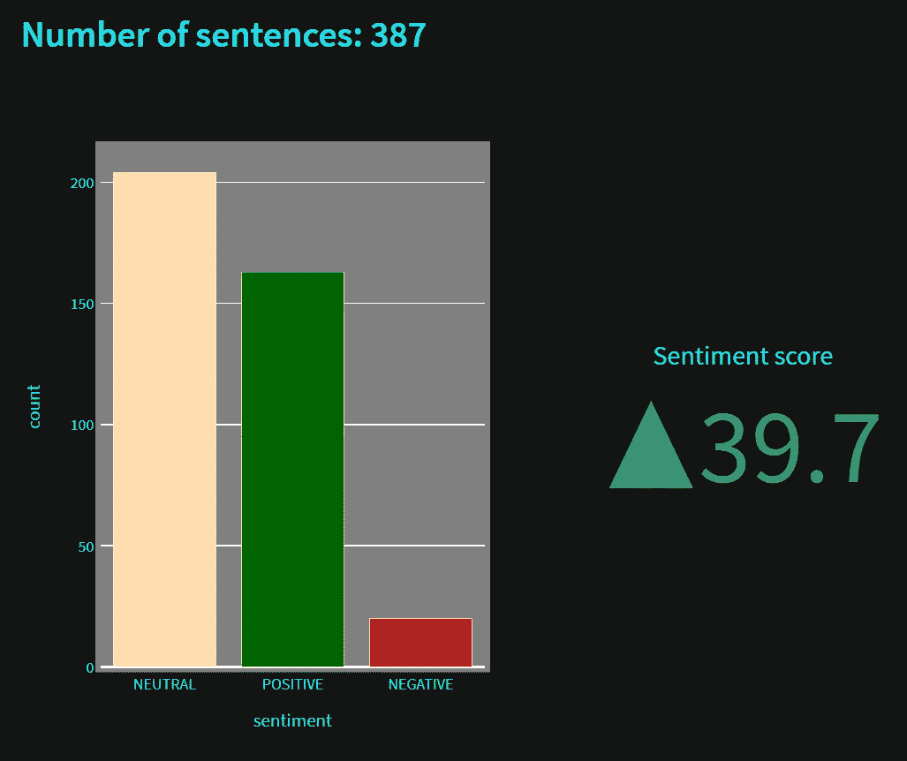

# 如何对公司财报电话会议进行情感分析

> 原文：<https://towardsdatascience.com/how-to-perform-sentiment-analysis-on-earnings-call-of-companies-122275f47e26>

## 利用 Python 和人工智能部署情感分析来分析公司的收益电话


杰里米·贝赞格在 [Unsplash](https://unsplash.com?utm_source=medium&utm_medium=referral) 上的照片

识别特定句子主体背后的情感情绪非常重要，尤其是当它涉及大型科技巨头时。情感分析是自然语言处理的一个重要组成部分，小型和大型科技公司和企业都需要并使用它来了解客户的观点。

公司的收益电话会议通常是一个电话会议或网络直播，在这里上市公司讨论其特定报告期的财务结果。在这种情况下，大部分的关键点被讨论，使用它我们可以有一个公司的关键成功的轮廓。因此，利用人工智能解决这样一个问题来分析情绪，可以为任何公司创造一个奇妙的轮廓。

在本文中，我们将借助 Python 脚本和 AssemblyAI 平台部署一个项目，对公司的收益电话进行情绪分析。如果观众不熟悉类似的 NLP 任务，我建议通过下面提供的链接查看我以前的一篇文章，这篇文章介绍了部署优化的语音到文本 web 应用程序的概念。

[](/how-to-deploy-your-own-optimized-speech-to-text-web-app-with-python-c956c7838ec8) [## 如何使用 Python 部署您自己优化的语音转文本 Web 应用程序

### 一个详细的指南，告诉你如何构建自己的语音到文本的网络应用程序，以最佳的方式将音频转换成…

towardsdatascience.com](/how-to-deploy-your-own-optimized-speech-to-text-web-app-with-python-c956c7838ec8) 

# 公司盈利预测情绪分析项目:

在这个项目中，我们将利用 Python 脚本、AssemblyAI 平台和 streamlit 框架来开发一个用于项目部署的网站。对于这个项目，我们将使用三个独立的文件。在第一个文件中，我们将存储从 AssemblyAI 网站获得的配置 API 密钥。我们将创建第二个文件，用于下载和保存特定的 YouTube 文件。最后，我们将在最终的 Python 文件中开发情感分析的主要网站和计算。

## API 密钥的配置:

为了开始这个项目，我建议检查一下 [AssemblyAI](https://www.assemblyai.com/) 平台。在这里，您可以获得一个 API 密钥，通过它我们可以对公司的收益电话执行情绪分析项目。如果您还没有帐户，可以遵循简单的注册流程。只要你登录，你就可以在你的 AssemblyAI 账户的右边访问你的免费 API 密匙。将它复制并放入 Python 文件 *configure.py.*

```
auth_key = "Enter Your API Key Here"
```

## 保存音频数据:

在下一个 Python 文件中，我们将保存从 YouTube 下载的音频数据。在这一节中，我们将导入 youtube_dl 库，如果您还没有这个库，可以用一个简单的 pip install 命令安装它。一旦库被导入，我们将创建一个包含所有基本参数的变量。我们将下载 mp3 格式的音频数据，并以最佳音频格式保存。如下面的代码块所示，可以完成这个操作。

```
import youtube_dlydl_opts = {
   'format': 'bestaudio/best',
   'postprocessors': [{
       'key': 'FFmpegExtractAudio',
       'preferredcodec': 'mp3',
       'preferredquality': '192',
   }],
   'ffmpeg-location': './',
   'outtmpl': "./%(id)s.%(ext)s",
}
```

一旦我们声明了必要的参数，我们就可以创建一个函数来帮助我们将所需的 YouTube 视频保存为最好的音频文件 mp3 格式。我们将获得这个想法，去掉任何空格，并传递 id 来提取信息。一旦视频文件被下载，它将被存储在当前的工作目录。你可以随心所欲地改变路径。下面的代码代表了下面的函数。

```
def save_audio(link):
  _id = link.strip() def get_vid(_id):
    with youtube_dl.YoutubeDL(ydl_opts) as ydl:
      return ydl.extract_info(_id) # download the audio of the YouTube video locally
  meta = get_vid(_id)
  save_location = meta['id'] + ".mp3" print('Saved mp3 to', save_location) return save_location
```

我们可以将这个文件保存为 *save_audio.py* ，并从下一节开始继续构建主应用程序。

## 导入基本库:

在创建了两个主要的 Python 文件之后，我们可以继续创建名为 app.py 的主文件，用于开发网站界面和相应地计算情感分析。我们将首先导入项目的所有必要需求，包括我们之前创建的两个 Python 文件。

```
import streamlit as st
from save_audio import save_audio
from configure import auth_key
import pandas as pd
from time import sleep
import urllib.request
import plotly.express as px
import plotly.graph_objects as go
from urllib.request import urlopen
from bs4 import BeautifulSoup
import json
import requests
```

每一个库都将被用来创建网站，提供统计图表，用于分析公司报告的各种参数。

## 设置所有必需的元素:

在这一节中，我们将设置所有必要的需求，这些需求对于查看用于情绪分析的各种图表是必要的，包括所需变量的初始化。首先，让我们创建端点并相应地初始化头部。转录端点包含 AssemblyAI 平台的位置，音频数据的转录在该位置可用。类似地，我们也有一个上传端点和带有 AssemblyAI 授权 API 密钥的头分配。

```
## AssemblyAI endpoints and headers
transcript_endpoint = "[https://api.assemblyai.com/v2/transcript](https://api.assemblyai.com/v2/transcript)"
upload_endpoint = '[https://api.assemblyai.com/v2/upload'](https://api.assemblyai.com/v2/upload')headers_auth_only = {'authorization': auth_key}
headers = {
   "authorization": auth_key,
   "content-type": "application/json"
}
```

一旦我们初始化了所需的参数，最好是设置一些与情感分析的目的相关的解释。我们可以利用 streamlit 库中可用的标题、说明和副标题来创建网站的一些主要元素。

```
## App explanation
st.title('Sentiment analysis of earning calls')
st.caption('With this app you can analyse the sentiment of earnings calls by providing a YouTube link to its recording.')
st.subheader('Submit a video link or choose one of the pre-determined ones to analyse.')st.subheader('Submit a video link or choose one of the pre-determined ones to analyse.')
```

在下一步中，我们将创建一个文本输入栏，用户可以在其中输入一个指向特定公司收益电话会议的特定链接。所提供链接的数据(通常是 YouTube 视频)将以最佳音频格式下载，并保存在本地工作目录中。一旦数据被下载，我们将把数据以块的形式上传到 AssemblyAI 网站，并获得上传的音频 URL。我们还指定了一个默认链接，允许我们访问 Amazon 的一个收益电话会议。

```
# Get link from user
video_url = st.text_input(label='Earnings call link', value="[https://www.youtube.com/watch?v=UA-ISgpgGsk](https://www.youtube.com/watch?v=UA-ISgpgGsk)")# Save audio locally
save_location = save_audio(video_url)## Upload audio to AssemblyAI
CHUNK_SIZE = 5242880def read_file(filename):
 with open(filename, 'rb') as _file:
  while True:
   data = _file.read(CHUNK_SIZE)
   if not data:
    break
   yield dataupload_response = requests.post(
 upload_endpoint,
 headers=headers_auth_only, data=read_file(save_location)
)audio_url = upload_response.json()['upload_url']
print('Uploaded to', audio_url)
```

现在我们已经完成了将音频数据上传到 AssemblyAI 网站，我们可以开始转录音频文件了。我们将提供上传的音频 URL，并将情感分析的条件指定为真。设置好这些参数后，我们就可以继续接收副本响应和副本 id 了。最后，设置用于执行转录的轮询端点。

```
## Start transcription job of audio file
data = {
 'audio_url': audio_url,
 'sentiment_analysis': 'True',
}transcript_response = requests.post(transcript_endpoint, json=data, headers=headers)
print(transcript_response)transcript_id = transcript_response.json()['id']
polling_endpoint = transcript_endpoint + "/" + transcript_idprint("Transcribing at", polling_endpoint)
```


作者图片

我们可以检查程序的完成状态，并在 While 循环的帮助下等待转录过程完成。一旦转录过程完成，我们可以获得我们可以显示给用户查看的抄本。但是对于这一步，我们将只存储收到的副本响应的文本。

```
## Waiting for transcription to be done
status = 'submitted'
while status != 'completed':
 print('not ready yet')
 sleep(1)
 polling_response = requests.get(polling_endpoint, headers=headers)
 transcript = polling_response.json()['text']
 status = polling_response.json()['status']
```

一旦我们完成了本节中提到的所有步骤，我们就可以进入下一节，可视化通过对上传的数据执行情感分析而获得的结果。

## 通过可视化分析众多组件:



作者图片

一旦从音频文件的转录中创建了转录，我们就获得了可以显示的文本数据。我们可以在网站的侧边栏展示它们。我们还将获得情感分析结果，并将它们转换成 pandas 数据框架，以便更容易对其进行分析。

```
# Display transcript
print('creating transcript')
st.sidebar.header('Transcript of the earnings call')
st.sidebar.markdown(transcript)print(json.dumps(polling_response.json(), indent=4, sort_keys=True))## Sentiment analysis response 
sar = polling_response.json()['sentiment_analysis_results']## Save to a dataframe for ease of visualization
sen_df = pd.DataFrame(sar)
print(sen_df.head())
```

我们可以借助美汤库获得视频的标题，并在网站上展示。我们还将打印句子的总数，并相应地显示信息。

```
## Get the title of this video
with urlopen(video_url) as url:
    s = url.read()
    soup = BeautifulSoup(s)
    title = soup.title.stringst.header(title)## Visualizations
st.markdown("### Number of sentences: " + str(sen_df.shape[0]))grouped = pd.DataFrame(sen_df['sentiment'].value_counts()).reset_index()
grouped.columns = ['sentiment','count']
print(grouped)col1, col2 = st.columns(2)
```

让我们创建第一个条形图，以了解收益电话数据的句子中涉及的积极、中性或消极情绪的数量。您可以使用下面代码块中指定的参数来绘制图形，也可以选择使用不同的配色方案和其他类似的功能。

```
# Display number of positive, negative and neutral sentiments
fig = px.bar(grouped, x='sentiment', y='count', color='sentiment', color_discrete_map={"NEGATIVE":"firebrick","NEUTRAL":"navajowhite","POSITIVE":"darkgreen"})fig.update_layout(
 showlegend=False,
    autosize=False,
    width=400,
    height=500,
    margin=dict(
        l=50,
        r=50,
        b=50,
        t=50,
        pad=4
    )
)col1.plotly_chart(fig)
```

条形图可能并不总是指示分析任何问题所需的真实感知。因此，我们将使用一个指标来表示我们是否有更多的积极或消极的回应。我们将计算情绪得分，如下面的代码块所示，并分析指标。向上的箭头表示肯定的指示，而否定的指示将通过向下的指示器表示。查看上图有更直观的理解。

```
## Display sentiment score
pos_perc = grouped[grouped['sentiment']=='POSITIVE']['count'].iloc[0]*100/sen_df.shape[0]
neg_perc = grouped[grouped['sentiment']=='NEGATIVE']['count'].iloc[0]*100/sen_df.shape[0]
neu_perc = grouped[grouped['sentiment']=='NEUTRAL']['count'].iloc[0]*100/sen_df.shape[0]sentiment_score = neu_perc+pos_perc-neg_percfig = go.Figure()fig.add_trace(go.Indicator(
    mode = "delta",
    value = sentiment_score,
    domain = {'row': 1, 'column': 1}))fig.update_layout(
 template = {'data' : {'indicator': [{
        'title': {'text': "Sentiment score"},
        'mode' : "number+delta+gauge",
        'delta' : {'reference': 50}}]
                         }},
    autosize=False,
    width=400,
    height=500,
    margin=dict(
        l=20,
        r=50,
        b=50,
        pad=4
    )
)col2.plotly_chart(fig)
```

最后，我们还将创建一个散点图，以便更好地可视化情感。如下面的代码片段所示，可以创建这种可视化。

```
## Display negative sentence locations
fig = px.scatter(sar, y='sentiment', color='sentiment', size='confidence', hover_data=['text'], color_discrete_map={"NEGATIVE":"firebrick","NEUTRAL":"navajowhite","POSITIVE":"darkgreen"})fig.update_layout(
 showlegend=False,
    autosize=False,
    width=800,
    height=300,
    margin=dict(
        l=50,
        r=50,
        b=50,
        t=50,
        pad=4
    )
)st.plotly_chart(fig)
```

完成所有这些可视化后，我们现在对一家公司的盈利预测背后的情绪有了一个简单的理解。我们可以预测他们对未来的乐观程度。

## 最终设置:


作者图片

请注意，以下项目的运行时间取决于许多因素。根据系统类型、上传速度和其他因素，每个用户获得结果的速度可能有所不同，通常需要几分钟。

对于最后的设置，我建议查看下面的 [GitHub 链接](https://github.com/AssemblyAI/youtube-tutorials/tree/main/Sentiment%20Analysis)，它涵盖了成功部署以下项目所需的全部代码和需求。我还建议查看下面的[视频教程](https://www.youtube.com/watch?v=kBoe56CfugY)，它以简洁的方式涵盖了以下主题，涵盖了与该项目相关的大多数复杂细节。

# 结论:


照片由[腾雅特](https://unsplash.com/@tengyart?utm_source=medium&utm_medium=referral)在 [Unsplash](https://unsplash.com?utm_source=medium&utm_medium=referral) 上拍摄

自然语言处理的很大一部分涉及大量原始数据的处理。人工智能最难完成的任务之一是分析情感的真实情绪，并理解语言的语义。AI 有时可能很难区分讽刺和其他条件语句。然而，现代 AI 正在迎头赶上，我们可以预测这些复杂的情感分析模式。

在本文中，我们探索了使用 Python 脚本和 AssemblyAI 平台生成高质量结果的实用性。我们在 YouTube 上下载了一段公司财报电话会议的视频，并开始对其进行情绪分析。我们能够从统计可视化中获得一份相当不错的报告，从而得出对未来公司销售的总体乐观和悲观反应。

如果你想在我的文章发表后第一时间得到通知，请点击下面的[链接](https://bharath-k1297.medium.com/subscribe)订阅邮件推荐。如果你希望支持其他作者和我，请订阅下面的链接。

[](https://bharath-k1297.medium.com/membership) [## 通过我的推荐链接加入媒体

### 作为一个媒体会员，你的会员费的一部分会给你阅读的作家，你可以完全接触到每一个故事…

bharath-k1297.medium.com](https://bharath-k1297.medium.com/membership) 

如果你对这篇文章中提到的各点有任何疑问，请在下面的评论中告诉我。我会尽快给你回复。

看看我的一些与本文主题相关的文章，你可能也会喜欢阅读！

[](/develop-your-weather-application-with-python-in-less-than-10-lines-6d092c6dcbc9) [## 用 Python 开发不到 10 行的天气应用程序

### 使用 Python 构建我们的天气电视广播应用程序，以接收所需位置的更新

towardsdatascience.com](/develop-your-weather-application-with-python-in-less-than-10-lines-6d092c6dcbc9) [](/develop-your-own-calendar-to-track-important-dates-with-python-c1af9e98ffc3) [## 使用 Python 开发您自己的日历来跟踪重要日期

### 开发一个日历 GUI 界面来管理您 2022 年及以后的计划

towardsdatascience.com](/develop-your-own-calendar-to-track-important-dates-with-python-c1af9e98ffc3) [](/complete-python-starter-guide-for-data-science-for-2022-c1f880fa249d) [## 2022 年数据科学完整 Python 入门指南

### 涵盖了用代码启动数据科学所需的所有 Python 基础和基本概念…

towardsdatascience.com](/complete-python-starter-guide-for-data-science-for-2022-c1f880fa249d) 

谢谢你们坚持到最后。我希望你们都喜欢这篇文章。祝大家有美好的一天！