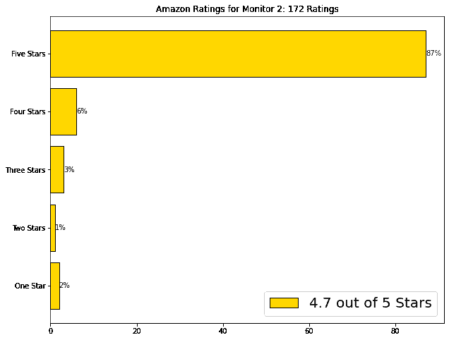
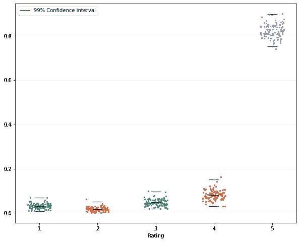
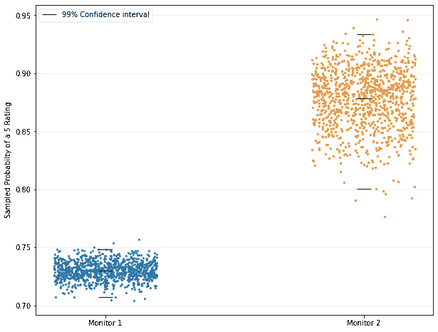

# 如何在亚马逊上挑选产品(使用贝叶斯统计帮助你决定)

> 原文：<https://towardsdatascience.com/how-to-pick-products-on-amazon-using-bayesian-statistics-to-help-you-decide-c67335c13a42>

## 贝叶斯推理用于决策的案例研究

图片由作者提供。

我们很多人在亚马逊购物时都会遇到的一个问题是:我如何比较两个评分？亚马逊评级为我们提供了两条重要的信息:评级的分布(多少是五星、四星、三星、二星或一星)以及每个产品收到了多少评论。比较分布非常简单:我们可以比较两个产品的平均评分，然后决定。然而，我们如何合并评论的数量呢？这重要吗？

比方说，我想买一台电脑显示器，正在亚马逊上搜索。我找到了两个我喜欢的显示器。Monitor 1 的平均评分为 4.5，有 3130 个评论者。

图片由作者提供。

Monitor 2 平均评分 4.7，但是 172 个评论者。

图片由作者提供。

我们如何在两者之间做出选择？凭直觉，我们知道评论越多的产品越受欢迎(这是证明产品质量的另一个信号)。我们中的一些人可能还意识到，更多的评论(3130 对 172)意味着你看到的平均评级更“可靠”。换句话说，更多的评级意味着，通过信息的众包，我们更接近该产品的“真实”平均水平。然而，我们如何理解评级数量对平均值可靠性的重要性呢？

回答这个问题的一个方法是使用贝叶斯推理来尝试推断我们产品的“真实”评级分布。这有什么帮助？贝叶斯推理将允许我们为评级分布创建一个初始模型，并用我们拥有的数据更新该模型。一旦我们根据所有可用的数据“训练”了我们的模型，我们就可以看到模型的方差是如何根据用于训练它的数据量而变化的。如果你想详细了解如何用 Python 进行贝叶斯推理，请看看我写的另一篇文章[这里](https://medium.com/towards-data-science/how-to-use-bayesian-inference-for-predictions-in-python-4de5d0bc84f3)。

# 想出一个模型

## 决策策略

对于我们的问题，什么是合适的模型？这就是数据科学家满足主观的，几乎是艺术的需求的地方:数据科学家必须从他们自己的经验和直觉中识别模式。

我们首先要回到我们的目标:能够做出更好的决策。在这个阶段，我们可能还会问“更好的决策”是什么意思。在博弈论中，有一些不同的互斥策略来最大化“回报”，在这种情况下，这是我们对产品的评级(应该与我们的满意度相关)。例如，我们有保守的“极小极大”策略。“最小最大”意味着最小化最大的伤害。换句话说，我们问自己:最坏的情况是什么，哪种策略会把我们带到最好的最坏情况？如果我们知道我们会失败，哪种选择会导致最小的伤害？在选择亚马逊产品的背景下，我们可以创建一个受 minimax 启发的策略，在这个策略中，我们避免选择风险最高的产品，我们给出的评级是 1。

相反，乐观主义者的策略是“最大化”。对于这一战略，我们寻求的是能让我们看到最佳可能情景的选项。受 Maximax 启发的一个乐观策略是，同时考虑两种产品，选择最有可能被我们评为 5 分的产品。

最后，我们可能会采取一种平衡的策略，我们中的许多人可能已经熟悉了:最高期望值。“最高期望值”策略相当于简单地选择平均评级最高的策略。如果我们有一个平均值为 4.5 的产品，另一个平均值为 4.7，那么如果我们用过去的分数来预测我们可能如何评价该产品，我们只需选择 4.7。诺贝尔奖得主、行为经济学之父丹尼尔·卡内曼提倡使用最高期望值策略。他认为，人类倾向于狭隘地框定决策，这导致我们根据自己的感受变得悲观或乐观。相反，如果我们努力宽泛地构建我们的决定，并相信统计数据，我们会意识到，最终我们的幸运和不幸会相互抵消，结果会回归均值。如果我们在一生中购买几种产品，过于乐观或过于悲观都会导致我们错过:期望值是我们最好的猜测。因此，通过这个镜头，预期值是最佳长期策略。

然而，在采取任何策略之前，我们总是必须考虑特定决策的细微差别。我认为，在亚马逊购物的情况下，你真正想要的是找到最适合你需求的产品，特别是因为你可以退货并换另一件产品。这意味着，在这种情况下，我们可能会严重低估得到我们真正不喜欢的产品的风险，因为我们可以把它退回去。因此，我们专注于寻找最有可能让我们完全满意的产品。

因此，让我们说，我们的策略是找到一种方法来最大限度地提高我们将产品评为 5/5 的概率。为此，我们将利用我们的数据，创建一个描述评级分布的模型。有了这个模型，我们就可以预测一个新的评级将获得五个可能级别中的每一个级别的概率。更重要的是，通过贝叶斯推理模型，我们还将通过了解我们模型参数的*分布*来更好地了解这些预测背后的不确定性。

假设我们的模型是一个包含五个元素的简单向量，对应于产品在每个可能评级中的百分比(或概率)。对于产品一，这将是[0.73，0.14，0.06，0.03，0.04]。更进一步，为了能够结合不确定性的概念以及它与评级的*数*的关系，我们不仅想知道参数现在看起来是什么，还想知道它们看起来是如何分布的。我们希望这些参数(五个百分比中的每一个)都像钟形曲线一样，这样我们就知道我们可以期望概率偏离均值多远。

幸运的是，有两种分布可以帮助我们实现这一点:多项式分布和狄利克雷分布。多项式分布采用“单纯形”向量，即元素介于 0 和 1 之间且相加为 1 的向量，以及多个事件。它输出一个相同大小的向量，其整数值与该输入向量相关。所以，如果我们这样做:

α~多项式(n = 50 个等级，概率= [0.73，0.14，0.06，0.03，0.04])

我们可以得到这样的结果:

[32, 10, 3, 1, 4].这就好像我们在模拟 50 个人给出评级，概率与我们的单纯形输入向量相关。

在 Python 中:

这非常类似于我们对亚马逊产品评级的用例。如果我们知道向量 p 看起来像什么，我们可以模拟，例如，100 个人会如何评价这个产品。注意，我们想要的是相反的东西:我们想要获取每个类别有多少人投票的信息，并得出五个百分比/概率向量的分布。这就是狄利克雷分布的用武之地。

狄利克雷分布接受向量并输出概率向量的样本，即具有与α相同数量的输入的单纯形向量。因此，如果我们将向量[32，10，3，1，4]输入到狄利克雷分布中，我们可能会对概率向量[0.73，0.14，0.06，0.03，0.04]进行采样。即:

p ~狄利克雷([32，10，3，1，4])

输出类似于[0.73，0.14，0.06，0.03，0.04]的值。

在 Python 中:

我们可以看到多项分布和狄利克雷分布看起来是多么的吻合。事实上，它们在统计学中有一个特殊的名字:它们被称为“共轭先验”。这是因为当我们使用狄利克雷分布作为先验，使用多项式作为贝叶斯推断的似然函数时，后验分布也将是狄利克雷分布。此外，后验概率可以根据我们的数据进行分析计算。维基百科有一个非常有用的现有共轭先验列表，以及我们如何基于共轭先验对计算后验概率。

# 贝叶斯推理

贝叶斯推理的第一步是定义先验分布、似然分布和后验分布。简单回顾一下，贝叶斯推理遵循贝叶斯定理:

P(B|A)=P(A|B)*P(B)P(A)

其中:

P(A|B) =可能性

P(B) =先验

P(A) =证据

P(B|A) =后验概率

对于这个模型，我们想要找出我们的概率向量 *p* 的后验分布。

我们的可能性将遵循多项式分布:请注意，可能性分布总是反映实际数据的分布，但它们并不相同。根据多项式分布，数据以某个参数 *p* 分布。然而，在给定一组不同的建议参数 *p* 的情况下，似然函数接收观察到的数据并输出其观察到的概率。因此，在似然函数中，我们计算每组参数 *p* 的概率，而不是观察特定数据的概率。请参考我的[旧文章](https://medium.com/towards-data-science/how-to-use-bayesian-inference-for-predictions-in-python-4de5d0bc84f3)进行更深入的探究。

我们的先验将遵循狄利克雷分布。基于我们现有的知识，我们创建一个对我们有意义的先验(或者，也许，我们通过保持它的一致性，通过使用参数，例如α =[1，1，1，1，1]来创建一个无信息的先验)。如果我们从这个无信息的先验中采样，我们将不会得到模型参数看起来的好结果(我们可能会得到类似于[0.12，0.2，0.35，0.18，0.15]的结果，我们知道这并不接近现实)。这就是为什么我们需要进行贝叶斯推理:根据可能性函数和我们看到的数据来修改这个先验，从而创建一个更接近现实的后验。

# 共轭先验技巧

正如我提到的，使用共轭先验的两大优势(事实上，幸运地发现我们的情况是共轭先验的自然发生)是:( a)后验将遵循与先验相同的分布;( b)后验易于分析计算。为了计算多项式/狄利克雷共轭先验的后验概率，我们需要做的就是将我们观察到的数据添加到我们的狄利克雷分布中的α向量的元素中。

让我们说，我们基于直觉创建的狄利克雷先验是:

p ~狄利克雷(α = [1，1，1，1，1])

对于后验概率，我们的新α计算如下:

New α = α+Xn，其中 Xn 是我们观察到的数据的向量(即我们的产品在每个类别中的投票数)。

因此，如果我们观察 Xn=[5000，300，100，50，3]，其中 5000 是五星评级的数量，以此类推，我们的 new 将简单地为[5001，301，101，51，4]。因此，我们的后路是:

p～狄利克雷(α = [5001，301，101，51，4])

# 使用我们的技巧

现在我们可以用我们的技巧来解决我们的问题了。首先，我们必须选择我们的先验。我们可能会倾向于，对于质量不错的亚马逊产品，即我们可能会考虑购买的产品，大多数评论通常是 5 分制，分数越来越小。我们可能还会注意到，愤怒的客户通常给出 1 的频率比给出 2 的频率更高，并且 1 的频率比 2 的频率更高。这些模式有助于引导我们形成先验(记住，这是我们在不看数据的情况下对产品评级分布的倾向)。

假设我们得出以下先验:[50，40，30，20，25]。太好了！如果我们愿意，我们甚至可以使用统计软件从这个先验中取样(我喜欢使用 python 中的 [scipy.stats](https://docs.scipy.org/doc/scipy/reference/stats.html) 库)。然而，我们希望比前任做得更好。因为我们使用共轭先验技巧，我们可以很容易地得出后验:我们只需将数据添加到我们的先验中！我们从上面来看一下 monitor 1 的评分数据:[2285，438，188，94，125](我用百分比乘以评分数)。按照上面我给出的公式，我们的后验概率就是两个向量的简单相加:

所以我们的后验是向量[2335，478，218，114，150]。我们的全部后路依次是:

p ~狄利克雷([2335，478，218，114，150])

# 从后面取样

现在我们有了后路，我们该怎么做？记住，后验概率是模型参数的分布。在这种情况下，后验概率描述了有多少产品评论属于这五个类别中的每一个类别。如果我们使用我们的模型得到一个样本，它看起来是这样的:

我们可以将此结果理解为 72%的评级预计为 5s，15%为 4s，6%为 3s，4%为 2s，4%为 1s。然而，贝叶斯方法的用途是对参数的多种可能性进行采样，并查看这些参数的分布。

让我们只关注 5 级类别。假设我们想从后验样本中抽取 1000 个样本，并观察其分布情况:

图片由作者提供。

这时我们开始看到使用贝叶斯推理的好处。我们不仅知道五的概率的平均值，即我们的最佳猜测，而且我们还知道我们对这一断言有多大的把握。请注意 95%的置信区间:它表明，对于我们测量的 95%的样本，我们期望我们的描述性统计(平均值)位于这些边界内。置信区间最终将由我们拥有的数据量决定:我们将看到，对于狄利克雷分布(以及大多数分布)，我们拥有的数据越多，置信区间就越小。

然而，在我们研究置信区间如何变化之前，我们可以先看看其余类别的分布。我写了一些代码来从后面取样，然后创建一个我称之为‘柱状图’的东西:

当我们想一次比较几个不同类别的分布时，柱形图很有用。另一个不错的选择是箱线图。对于柱状图，我们使用点和点的密度，而不是使用条和条的高度来表示密度。柱状图中的每个点代表一个采样数据。请看从我们的后部取样 100 个样本得到的柱状图:

图片由作者提供。

注意，我在这个推论中使用了一个无偏先验([1，1，1，1，1])。等级为 5 的紫色列显示大多数样本如何接近平均值(该列上的水平黑线)。随着我们越来越接近 99%的置信区间边界(水平绿线)，这些点变得越来越稀疏。对于其余的列，这一点不太明显，但仍然成立。

上面的这个图表是针对 monitor 1 的，这个 monitor 有 3130 个亚马逊评分(或者换句话说，我们用来填充贝叶斯模型的 3130 个数据点)。如果我们做同样的过程，并绘制后验样本，为一个产品少得多的评级？如果我们为 2 号监视器运行这个管道会怎么样？这是我们会看到的图表:

图片由作者提供。

看到置信区间比以前宽了吗？为什么这是如此不同？关键是，对于这个模型，由于我们只有 172 个评级，这就是我们的狄利克雷看起来的样子(假设一个[1，1，1，1，1]的无信息先验)。如果我们稍微偏置先验，比方说通过输入先验为[10，5，4，2，3]，我们改变了明显的平均值:

图片由作者提供。

在这种情况下，先验并没有帮助减少每个类别中的方差(方差已经相当小了)，所以我们可能希望使用无偏的先验。

假设这台显示器有 20 个评级，而不是 172 个评级(遵循我们在 172 个数据中看到的相同比率)，会怎么样？

在这种情况下，我们将获得更宽的置信区间:

图片由作者提供。

现在我们可以开始看到，均值的不确定性要大得多，置信区间也很大。这里有一点哲学上的题外话:我们的模型的目的是看起来像我们的数据，还是我们的模型的目的是了解现实？人们可能希望我们的模型看起来和我们的数据一模一样，这样就创建了一个“好”的模型。但当我们的数据微不足道时，我们不得不怀疑它。对于 monitor 2，在假设的 20 个评级的情况下，我们可能会因为我们的模型不能捕捉类别的平均值而感到不安，而是为我们的可能性创建这些大的区间。然而，我们也必须对数据本身持怀疑态度:数据根本就不够。我们用这些数据计算的任何方法都可能仅仅因为随机性而有偏差。我们应该相信我们对只有 20 个评论者的 5 星评价持怀疑态度的直觉:该产品根本没有经过足够多的人的测试，随着更多评论的出现，我们看到的每个类别的百分比可能会发生很大变化。

那么，我提出的下一个问题是:多少人是足够的人？什么时候我们可以说我们可以信任我们的模型？

# 研究收敛速度

向模型的“真实”参数收敛是每个机器学习模型的目标。假设这些参数在本质上保持相对恒定，那么一个好的模型，只要有合适的数据量，就能够接近这些值。类似地，我们可以想到，一个产品的“真实”平均值是如何通过相当多的投票/评级来估算的。

我们可以研究这种收敛性的一种方法是用不同数量的数据(或评论)模拟我们的模型。简而言之，我们可以跟踪我们的模型的标准偏差(或方差)如何随着评论数量的增加而变化。这正是我接下来做的，看看这个图表:

图片由作者提供。

同样，我计算的标准差是我们五个参数的后验样本的标准差(五个不同的平均值，每个评级类别一个)。这是使用来自监视器 1 的数据。随着评级数量从 0 增加到 30，我们可以看到标准差急剧下降。从那一点开始，斜率逐渐变小，我们的标准差下降得更慢。这表明，经过 30 次左右的评论后，我们的模型对评级的分布有了一个很好的想法，随着评论的增加，应该没有什么变化。这也意味着，我们不需要大量的评论就能很好地把握这两种产品中哪一种更值得购买。

# 做出购买决定

现在我们已经拥有了所有的统计工具，我们应该选择最初的两个监视器中的哪一个呢？让我们在同一张图中看看我们的模型的 5 个类别评级的分布情况:

作者图片

关于这个图表的第一个注意事项:我绘制了两个“柱状图”。一个用于左边的监视器 1 的 5s 百分比的后验分布，同样的事情用于右边的监视器 2。您可能注意到的第一件事是，monitor 2 的方差要高得多。平均值也是如此:监测 2 的平均抽样概率为 5，约为预期的 0.87，而监测 1 为 0.73。

让我们回到我们的决策策略:我主张采用 maximax 启发的策略。这个策略意味着试图最大化我们最好情况的机会:购买一个产品，并得出结论，这是一个 5 星级产品。因此，我们只能关注“5”评级栏。如果我们比较这两个显示器的模型结果，其中一个肯定是更好的选择:显示器二，尽管它的总体方差和不确定性更高，但似乎具有持续更高的 5 评级概率。我们还可以通过提出以下问题对此进行量化:对于我们对每个总体进行抽样的每个平均值，监测 2 的样本比监测 1 的样本大的频率是多少？在上面的例子中，答案是 100%。对于较大的样本，我们可能会看到异常值，使这个数字下降到 99%或更低，但结论是相当简单的:几乎总是显示器 2 是更好的购买。

验证监视器 2 更好的另一个简单方法是简单地注意监视器 2 的 99%置信区间的下限(大约 0.8)高于监视器 1 的 99%置信区间的上限(大约 0.75)。

# 偏见和障碍

通常，在您将模型投入生产后，您最终会意识到存在影响结果的偏差，并且随着时间的推移，您的模型的准确性似乎会降低。这可能与直觉相反:随着时间和数据的增加，你会期望模型变得更好。然而，只有当我们的人口，即我们正在分析的数据保持不变时，准确性的提高才有望实现。在亚马逊评级的情况下，我们可能有一个“有偏见的”人群:

*   我要指出的第一个偏差是，对于产品的早期采用者来说，可能存在抽样偏差。购买评分很少或没有评分的产品的人可能始终比后期采用者更宽容，他们持怀疑态度，等待别人先尝试。
*   第二个偏见是评论者的偏见:在亚马逊上发布评论的是谁？我们能期望评论者群体准确代表购买产品的人群吗？我要说的是，情况可能并非如此。对产品有强烈感觉的人可能会有偏见:喜欢产品的人肯定会称赞它，讨厌它的人肯定会表达他们的感受。对一个产品不冷不热的人可能不会费心去回顾它。

对于购买决策，我上面提出的第二种偏见可能不是障碍(这种偏见对于亚马逊上的所有产品应该是一致的)，但第一种偏见应该是。对于第一个偏见，我们正在寻找一个不同的原因来解释为什么评论数量少可能是一个问题:早期采用者可能倾向于宽容(或者他们可能是额外的怀疑)。对这一问题的深入探究将包括对这些类型的偏见以及应对这些偏见的工具/策略的分析。

# 结论

我写这篇文章的目的是展示我们如何在决策中考虑样本的数量，以及这个数量所隐含的信心。我展示了我们如何使用贝叶斯推理来构建亚马逊评级系统的模型，以及我们如何绘制我们的信心如何随着评级数量的增加而变化。有了这些信息，我们就可以做出更明智的决策。

感谢您的阅读，如果您对本文有任何想法、批评或问题，请留言或直接联系我。