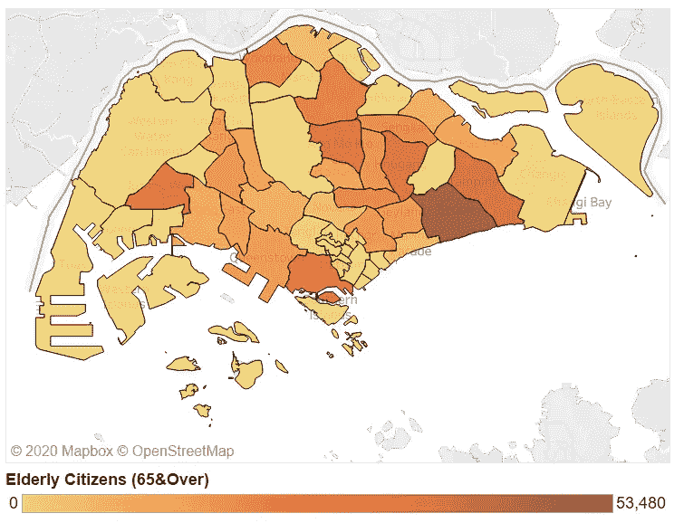
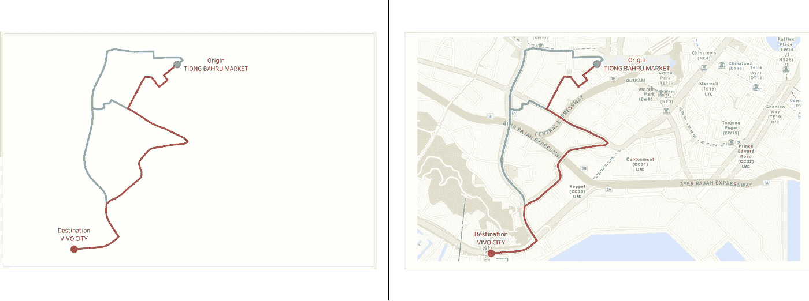

# 如何在 Tableau 仪表板上绘制自定义地图图像，仅需 3 个简单步骤，无需计算

> 原文：<https://towardsdatascience.com/how-to-plot-a-custom-map-image-on-tableau-dashboard-in-just-3-easy-steps-no-calculations-required-8db0d41680c4>

## 提示:查看一个专门为所有 Tableau 用户创建的[网络应用](https://tableau-data-utility.glitch.me/)

作为一个仪表板工具，ableau 为用户提供了广泛的图表选项。Tableau 中最令人印象深刻的功能之一无疑是其用于渲染地理空间数据集的内置底图服务:

作者截图|使用 Tableau 的内置底图服务显示新加坡老年人口的地图

但是，例如，当 Tableau 的内置地图服务都无法显示您的仪表板试图捕捉的细节(例如，街道名称、建筑足迹、某些地形和水体)时，则有必要转向其他方式来呈现这些要素。

因此，与其依赖任何其他与 Tableau 兼容的底图服务文件进行导入，还不如绘制自定义背景地图图像:

作者插图|根据特定的相应地理坐标绘制背景图像地图

## 一个开源实用工具— [链接到 Web 应用](https://tableau-data-utility.glitch.me/)

对于我遇到的过去几个地理空间用例，作为一种处理仪表板的默认地图服务无法呈现所需地理特征的情况的方法，我转而寻求一种解决方法，即通过部署 web 功能来导出任何自定义地图图像以及输入 Tableau 的背景图像导入功能所需的相应坐标值。执行此解决方法的 3 个步骤将在下一节中说明。

## 步骤总结—总共 3 个步骤

**第一步。**在 [(1)小故障](https://tableau-data-utility.glitch.me/)或 [(2)渲染](https://tableau-data-utility.onrender.com/)的备份链接处导航至网络应用。选择标签 **[🌐Spatial⇢CSV]** 在上面的导航栏中，滚动到底部，将显示以下内容或类似内容:

作者截图|部署到 tableau 实用程序应用程序上的自定义地图图像功能

**第二步。**根据，随意更改输入字段中的自定义底图 url(注意:自定义底图 URL 必须遵循 slippy 地图切片格式— {z}/{x}/{y}。png)切换到您选择的底图:

作者插图|底图 url 从左侧(openstreetmap)切换到右侧(onemap)

**第三步。**最后，在缩放和平移到您想要的地图视图后，继续选择绿色按钮— **【导出地图图像】**和(非常重要！)请注意导出地图图像时的坐标:

作者插图|在左侧，图像导出时要注意的坐标值位于 web 应用程序的底部。|在右边，这些坐标然后被直接输入到 Tableau 的背景图像导入功能中。

继续选择您保存的图像，并基于本文开头显示的背景地图图像，在指定正确的坐标后，最终结果应该类似于下图:

作者插图|请注意，上一个屏幕截图中的相同背景图像被用作背景，用于在仪表板上呈现行驶路线的地理坐标

现在你知道了！祝贺成功绘制地图图像！❤希望你觉得这篇文章有用，如果你想了解更多地理信息系统(GIS)、数据分析& Web 应用相关的内容，请随时[关注我的媒体](https://medium.com/@geek-cc)。会非常感激—😀

— 🌮请给我买一份玉米卷🎀˶❛◡❛)

<https://geek-cc.medium.com/membership>  

要了解更多 Tableau 技巧和变通方法，请随意查看下面的文章列表:

</how-to-render-mixed-geometry-types-in-tableau-in-2-simple-steps-27b56a2153c4>  </leverage-on-d3-js-v4-to-build-a-network-graph-for-tableau-with-ease-cc274cba69ce>  </selective-formatting-of-numbers-in-tableau-f5035cc64b68>  </5-lesser-known-tableau-tips-tricks-hacks-with-use-case-demo-463f98fbdc7e>  </superscript-and-subscript-in-tableau-why-and-how-you-can-implement-it-764caf0cc932>  </underrated-combined-functionalities-of-tableau-point-linestring-polygon-mapping-b4c0568a4de2> 