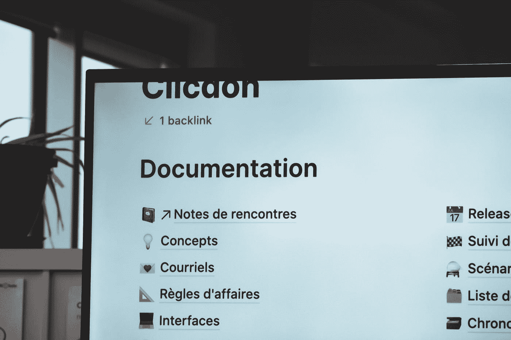

# 如何作为一名有抱负的数据科学家实践文档

> 原文：<https://towardsdatascience.com/how-to-practice-documentation-as-an-aspiring-data-scientist-1de9c4f2f843>

想想你参与的最后一个项目。你还记得你在那个项目中采取的每一步吗？从每一个数据操作步骤到你所结合的机器学习技术？现在试着回忆一下之前项目的步骤。你记得那里所有的步骤吗？那之前的项目怎么样？还是几个月前的那个？

如果你不能记住每一步，那也没关系(如果你能记住，那就令人印象深刻了)！随着你做的项目越来越多，你开始只记得最近的项目。但是，这些先前的项目有一些有用的步骤，可以纳入未来的项目。以前的一些项目现在可能不再适用，你需要做一个替代版本。但是如何记住哪些步骤是有用的呢？您如何知道不要从您以前的版本中重复过时的步骤？这就是文档发挥作用的地方。

在本文中，您将了解到:

1.  什么是文档。
2.  作为一名有抱负的数据科学家，您可以开始创建什么类型的文档。

照片由[西格蒙德](https://unsplash.com/@sigmund?utm_source=medium&utm_medium=referral)在 [Unsplash](https://unsplash.com?utm_source=medium&utm_medium=referral) 上拍摄

# 什么是文档？

文档是为跟踪项目中包含的步骤和规则而创建的一组文档。这包括分析和软件产品。以下是一些你可以开始写的即时文档类型:

1.  处理数据的步骤。
2.  特征工程步骤
3.  数据字典

这些只是文档的几个用例。但它们都是为了记录和将来参考。不仅是同事的未来参考，也是未来的你。将来在相关项目或其新版本中引用这些文档的人。

# 那么如何开始练习文档呢？

照片由[布拉登·科拉姆](https://unsplash.com/@bradencollum?utm_source=medium&utm_medium=referral)在 [Unsplash](https://unsplash.com?utm_source=medium&utm_medium=referral) 拍摄

## 第一步

从你做过的任何项目开始。这可能是你的第一个项目，你最近的项目，或者介于两者之间的任何项目。如果本地有此项目，请在项目文件夹中创建一个单独的文件夹，并将其标记为“Documentation”。您的文件夹结构应该如下所示:

图片来自作者

如果你的代码只在 Github 上，你可以创建一个专用的“文档文件夹”，然后使用项目名称作为标签在里面创建文件夹。

## 第二步

为文档的第一页创建一个 Word 文档。根据代码的类型，您可以从以下内容开始:

## 处理数据的步骤

厄尔·威尔考克斯在 [Unsplash](https://unsplash.com?utm_source=medium&utm_medium=referral) 上的照片

作为一名有抱负的数据科学家，这将是你最常做的事情。列出这些步骤有助于跟踪如何为项目中的数据管道处理数据，或者如何处理数据以进行分析。这些步骤可以以段落的形式列出，或者更好的是以列表的形式列出。这也是您可以列出任何必要的数据集和合并的地方。

例如，假设你正在分析 2020 年以后的股票。假设您正在处理的数据包括 2020 年之前的数据，那么您必须过滤掉这些数据。写下“分析是针对从 2020 年开始的数据集 A 中的股票”或“过滤数据集 A 中大于或等于 2020 年的数据”是你可以在描述这个过滤步骤的文档中写的句子。

## 特征工程步骤

照片由[Isis frana](https://unsplash.com/@isisfra?utm_source=medium&utm_medium=referral)在 [Unsplash](https://unsplash.com?utm_source=medium&utm_medium=referral) 拍摄

与数据操作步骤类似，特征工程步骤是您应该创建的另一个文档。您将在此包括的一些项目有:

1.  数据转换步骤，如标准化或规范化。还包括你将在流程的哪个阶段执行这些步骤
2.  正在创建要素的数据以及这些步骤。
3.  根据分类特征创建的虚拟列。
4.  流程结束时创建的所有新功能。

记住，机器学习模型经不起时间的考验，即使你具备所有的特征。但是有时模型会因为功能问题而无法站立。功能可能会发生巨大变化，甚至变得几乎不可用。在考虑如何实现潜在的功能替代方案时，回顾功能工程文档应该是首先要参考的项目之一。

## 数据字典

[刘易斯·基冈](https://unsplash.com/@skillscouter?utm_source=medium&utm_medium=referral)在 [Unsplash](https://unsplash.com?utm_source=medium&utm_medium=referral) 上拍摄的照片

这是一个解释数据集中每个变量是什么的列表。这对于用于分析的数据集或创建的新数据集非常有用。这可以被构造成表格。表格结构是优选的，因为它更有组织性。数据字典至少应该列出列名和该列中数据的描述。但是您也可以添加其他详细信息，例如数据类型，如果数据是有限的和离散的，则可以取值(即“1”、“2”、“3”或二进制)，以及关于数据的规则的任何链接。

以下是加州教育部网站上的几个基本数据字典示例:

*   [旷工数据](https://www.cde.ca.gov/ds/ad/fsabr.asp)
*   [五年一贯制毕业数据](https://www.cde.ca.gov/ds/ad/fsfycgr.asp)

## 最后的想法

感谢阅读！这些是有抱负的数据科学家可以开始为他/她的数据科学项目创建文档的直接方法。在我目前的职位上，还有其他文件，如:

1.  至少每年发生一次的数据请求的**规则。这类似于操作数据的步骤，但是包括请求的目的、可能不止一个数据集的使用、数据请求的期望格式以及将数据请求传递给谁。你可以把这些写成段落和列表的混合体。**
2.  **一个项目概述页面。这是项目经理会制作的页面。作为一名有抱负的数据科学家，这对于组织项目任务和计划任务非常有用。该页面将包括项目的概述、项目的利益相关者和用户，以及项目的时间表。时间表对你练习创建完成特定任务的时间表特别有用。例如，如果您正在创建一个机器学习模型，列出您将何时完成诸如特征工程和模型评估之类的任务将被包括在时间表中。**

你还在等什么？去找一个你做过的项目，写一些文档！

格伦·卡斯滕斯-彼得斯在 [Unsplash](https://unsplash.com?utm_source=medium&utm_medium=referral) 上拍摄的照片

如果你喜欢在媒体上阅读，并愿意进一步支持我，你可以使用我的[推荐链接](https://medium.com/@j.dejesus22/membership)注册一个媒体会员。这样做可以用你的会费的一部分在经济上支持我，我将不胜感激。

如果你有任何问题，请随时在 Linkedin 和 Twitter 上发表评论或联系我们。对 Twitter 上的 DM 开放。如果你喜欢这篇文章，也可以看看我下面的其他相关文章:

</written-communication-the-other-data-science-skill-you-need-f89b2063923c>  </11-tips-for-you-from-my-data-science-journey-df884faa9f3>  </7-reasons-you-should-blog-during-your-data-science-journey-4f542b05dab1>  

直到下一次，

约翰·德杰苏斯