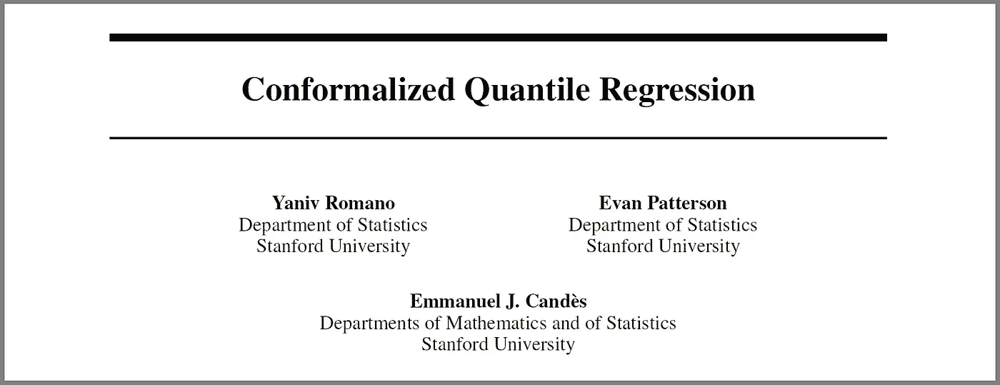
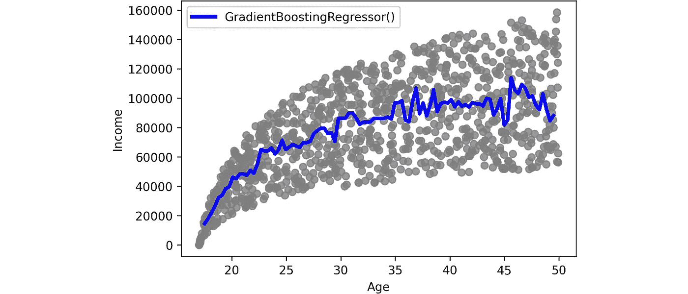
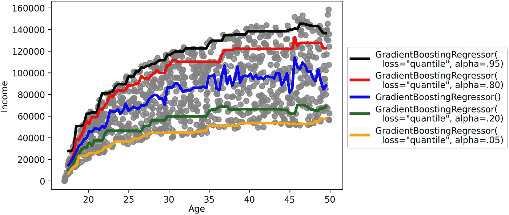
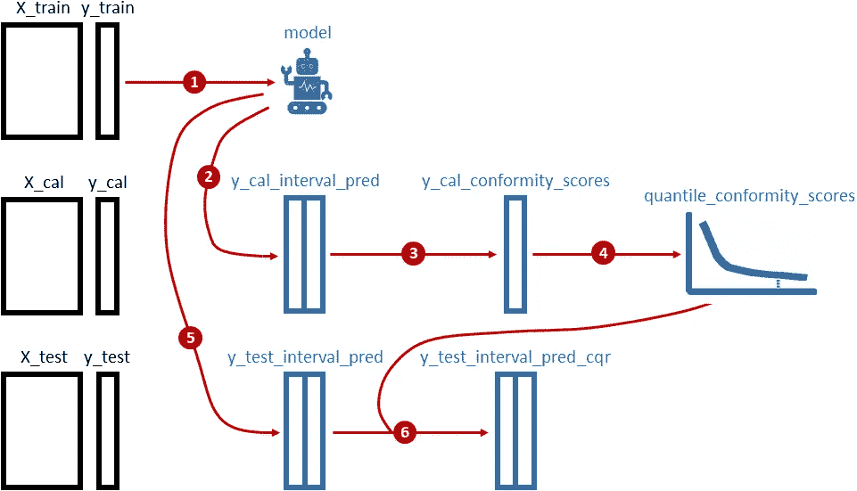
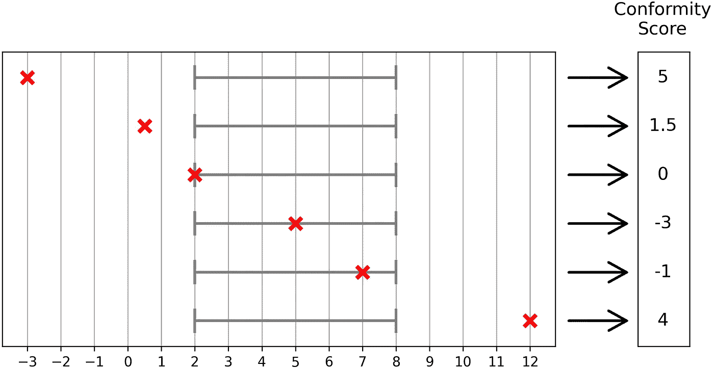

# 如何用共形分位数回归预测风险比例区间

> 原文：<https://towardsdatascience.com/how-to-predict-risk-proportional-intervals-with-conformal-quantile-regression-175775840dc4>

# 如何用共形分位数回归预测风险比例区间

## 这种算法-由斯坦福大学学者于 2019 年发表-结合了分位数回归和保形预测。下面是如何用 Python 实现的。


[图片由作者提供]

我们公司要求你建立一个模型来预测拍卖物品的销售价格。该公司的目标是私下购买这些物品，并以更高的价格出售(根据您的模型预测)。

现在，假设你有两件东西:西班牙艺术家胡安·米罗的一幅画和一栋位于三藩市的房子。您的模型做出以下预测:


预测模型做出的点预测。[图片由作者提供]

你的公司可以用 75 万美元买下这幅画，也可以用 75 万美元买下这处房产。他们应该买哪一个？你的预测不足以回答这个问题。

例如，假设米罗艺术品的价格最近波动很大，而旧金山的房地产市场却相当稳定。因此，如果您可以预测可能的销售价格的区间，而不是单个值，您将获得如下结果:


区间预测(95%置信度)。红十字是预测点。[图片由作者提供]

在同样的置信度(95%)下，与米罗画作相关的区间**更宽**，这意味着与三藩市的财产相比，这个物体本来就有**更大的风险**。因此，根据你公司的风险厌恶程度，你可能更愿意买房子，即使它与较低的预期利润相关。

这种输出，即**预测区间，其长度实际上与和预测**相关的风险成比例，可以通过一种叫做**共形分位数回归**(CQR)的算法获得。

在本文中，我将解释 CQR 是如何工作的，以及如何用 Python 实现它。

# 什么是 CQR

**共形分位数回归**是由**斯坦福**学者团队在 **2019** 中提出的算法，在一篇自题论文中([链接](https://arxiv.org/pdf/1905.03222.pdf))。



来自 ArXiv 的纸头截图。[ [链接](https://arxiv.org/pdf/1905.03222.pdf)

顾名思义，**共形分位数回归是共形预测和分位数回归的并集**。这是一种尝试，从两种方法中取长补短。

如果你读了我以前的一篇关于 Python 的 MAPIE 库的文章，你已经知道了关于保形预测的主要批评:预测的区间有恒定的(或者只是稍微变化的)宽度。

另一方面，分位数回归模型(如随机森林)在新数据的错误预测百分比方面可能不太精确。


共形预测和分位数回归的利弊。[图片由作者提供]

但是在深入研究 CQR 之前，让我们先回顾一下什么是分位数回归。

# 我们所说的分位数回归是什么意思？

为了形象化起见，我将使用单变量模型——这意味着只有一个特征——但请记住，相同的推理适用于任何数量的特征。假设我们有一项任务，根据个人的年龄来预测他们的收入。我将使用 Python 中生成的一些假数据:


假数据点。[图片由作者提供]

当您在**默认模式下使用来自 Scikit-learn、XGBoost、LightGBM、CatBoost 或 Keras 等流行 Python 库的预测模型时，您是在隐式预测目标变量的平均值，给定观察到的特性**。例如:

```
from sklearn.ensemble import GradientBoostingRegressorGradientBoostingRegressor().fit(X_train, y_train).predict(X_test)
```

这将是结果:



梯度推进回归器(默认模式)对虚假数据进行的预测。[图片由作者提供]

然而，所有的库也都配备了**来预测目标值**的特定分位数。这是通过改变损失类型实现的。例如，对于 Scikit-learn 的 GradientBoostingRegressor，这可以通过设置`loss="quantile"`和`alpha=quantile`来实现，其中`quantile`是一个介于 0 和 1 之间的数字，它是您想要预测的分位数。例如:

```
from sklearn.ensemble import GradientBoostingRegressorGradientBoostingRegressor(loss="quantile", alpha=.95).fit(X_train, y_train).predict(X_test)
```

对不同的分位数重复这一过程会产生以下预测:



通过梯度推进回归器(设置不同的分位数)对虚假数据进行预测。[图片由作者提供]

现在的问题是，这些分位数预测在新数据上往往不准确。为了弥补这一点，CQR 对分位数回归预测的区间应用了一个修正因子。

# CQR 在实践中是如何工作的？

共形分位数回归是一种旨在**校正您的分位数回归模型提供的区间的方法，以使新数据上观察到的错误数量非常接近您设置的容差**。容差——通常称为`alpha`——是你愿意接受的错误百分比(即超出预测区间的观察值)。

CQR 需要三组数据:

*   **训练数据**:分位数回归模型学习的数据。
*   **校准数据**:CQR 校准间隔的数据。
*   **测试数据**:评估区间优劣的数据。

该算法包括 6 个步骤。



共形分位数回归算法。[图片由作者提供]

具体来说，这些步骤是:

1.  对训练数据拟合分位数回归模型。
2.  使用上一步获得的模型预测校准数据的间隔。
3.  根据上一步获得的校准数据和间隔计算**一致性分数**。
4.  从上一点获得的一致性分数分布中获得 1- `alpha`分位数。
5.  使用步骤 1 中获得的模型对测试数据进行预测。
6.  通过将第 4 步获得的分位数减去(加上)第 5 点获得的预测值，计算区间的左(右)端。

如果有些步骤一开始看起来有点晦涩，不要担心。整个算法只用几行 Python 代码就能翻译出来。

> 注意:作为分位数回归模型，我将使用来自`skgarden`的`RandomForestQuantileRegressor`，但是您可以使用分位数损失用任何回归模型替换它。

```
import numpy as np
from skgarden import RandomForestQuantileRegressoralpha = .05**# 1\. Fit quantile regression model on training data** model = RandomForestQuantileRegressor().fit(X_train, y_train)**# 2\. Make prediction on calibration data**
y_cal_interval_pred = np.column_stack([
    model.predict(X_cal, quantile=(alpha/2)*100), 
    model.predict(X_cal, quantile=(1-alpha/2)*100)])**# 3\. Compute conformity scores on calibration data** y_cal_conformity_scores = np.maximum(
    y_cal_interval_pred[:,0] - y_cal, 
    y_cal - y_cal_interval_pred[:,1])**# 4\. Get 1-alpha quantile from the distribution of conformity scores
#    Note: this is a single number**
quantile_conformity_scores = np.quantile(
    y_cal_conformity_scores, 1-alpha)**# 5\. Make prediction on test data** y_test_interval_pred = np.column_stack([
    model.predict(X_test, quantile=(alpha/2)*100), 
    model.predict(X_test, quantile=(1-alpha/2)*100)])**# 6\. Compute left (right) end of the interval by
#    subtracting (adding) the quantile to the predictions**
y_test_interval_pred_cqr = np.column_stack([
    y_test_interval_pred[:,0] - quantile_conformity_scores,
    y_test_interval_pred[:,1] + quantile_conformity_scores])
```

如您所见，该算法围绕校准数据计算的一致性分数(步骤 3)。但是**符合性分数的意义是什么？**

一致性分数表示每个观察值和最近的区间极值之间的**(带符号)距离。符号由点的位置给出，无论它落在区间内还是区间外。**当点位于区间内时，一致性分数的符号为负，当点位于区间外时，符号为正**。因此，只有当该点恰好位于一个区间极值上时，得分为零。**

例如，让我们取一个介于 2 和 8 之间的预测区间。对于目标变量的一些不同值，这些将是各自的一致性分数:



不同观察值在 2 到 8 之间的一致性分数。红叉是[作者图片]

但是**计算一致性分数的分位数并把它加在区间两边有什么意义呢？**

我给你举两个例子。

假设一致性分数的分位数是 1000 美元，给定`alpha` =5%。这意味着 95%的观测值距离相应的间隔不超过 1000 美元。因此，通过将两边的所有间隔扩大 1000 美元，我们期望实现 95%的观测值将落在它们的间隔内的目标。

如果一致性分数的分位数是负的，这也是有效的。例如，给定一个-500 美元的分位数，这意味着区间太宽。事实上，通过将两边的所有间隔“削减”500 美元，我们将再次获得期望的错误数量。

# 真实数据上的 CQR

不幸的是，我不知道有哪个 Python 包能够像 Scikit-learn 那样方便用户地执行一致化分位数回归。然而， [MAPIE](https://github.com/scikit-learn-contrib/MAPIE) 的作者最近表示，他们正在他们的库中实现它，当这种情况发生时，我将更新这一段。

无论如何，好消息是实现 CQR 非常容易，因为它只需要几行代码。

作为一个例子，我将使用“钻石”数据集，它可以从 [Seaborn](https://github.com/mwaskom/seaborn) 包中下载，使用 [BSD 许可证](https://github.com/mwaskom/seaborn/blob/master/LICENSE)。目标是预测每颗钻石的售价(从 326 美元到 18，823 美元不等)，特征是钻石的一些特征，如克拉、颜色、长度、宽度、深度等。例如，这些是数据集的前 5 颗钻石:


钻石数据集的前 5 个观察值。[图片由作者提供]

对于这个实验，我将把`alpha`设置为 5%。

比较 CQR、分位数回归和简单保形预测的性能很有意思。我们可以使用上面看到的代码来获得分位数回归预测(`y_test_interval_pred`)和 CQR 预测(`y_test_interval_pred_cqr`)。此外，让我们使用 MAPIE 来获得简单的保形间隔:

```
from sklearn.ensemble import RandomForestRegressor
from mapie import MapieRegressorestimator = RandomForestRegressor().fit(X_train, y_train)mapie = MapieRegressor(estimator=estimator, cv="prefit").fit(X_cal, y_cal)y_test_interval_pred_mapie = mapie.predict(X_test, alpha=.05)[1].reshape(-1,2)
```

我们将使用的性能指标非常简单:

*   **误覆盖率**，即超出预测区间的测试观测值的百分比。希望该数值尽可能接近用户设定的容差，在这种情况下为 5%。
*   **平均区间长度**，区间宽度的平均值。希望间隔的长度尽可能小，因此越小越好。

这些是结果:


比较 MAPIE(简单保形预测)、RandomForestQuantileRegressor(分位数回归)和 CQR。[图片由作者提供]

MAPIE 有许多错误(4.99%)，非常接近我们设置的容差(5%)，但是间隔的平均长度相当高(2，327.28 美元)。

相反，随机森林分位数回归器产生了紧密的区间(平均为 1，173.41 美元)，但这是无用的，因为误差百分比(17.71%)远远高于容差。

CQR 是三个中最好的。事实上，它的误报率(4.98%)非常接近容差(5%)，并且与 MAPIE 相比间隔更小(1，763.41 美元对 2，327.28 美元)。

此外，我们已经看到 MAPIE(“prefit”模式)产生等长的间隔，所以在这种情况下，所有预测的间隔正好是 2，327.28 $宽。CQR 怎么样？让我们看看 CQR 得出的区间长度的一些分位数:


CQR 预测的区间长度的一些百分位数。[图片由作者提供]

正如我们所希望的，有一个广泛的可变性，反映了这样一个事实，即时间间隔实际上与每个钻石价格相关的风险成比例。

关于很多数据集的更多例子，可以参考上面提到的斯坦福学者的论文。但是，总的来说，我们展示的结果是**一个经验证据，表明 CQR 实际上将最佳的共形预测和最佳的分位数回归结合在一起**。

> *感谢您的阅读！我希望你喜欢这篇文章。如果你愿意，* [*在 Linkedin 上加我*](https://www.linkedin.com/in/samuelemazzanti/) *！*