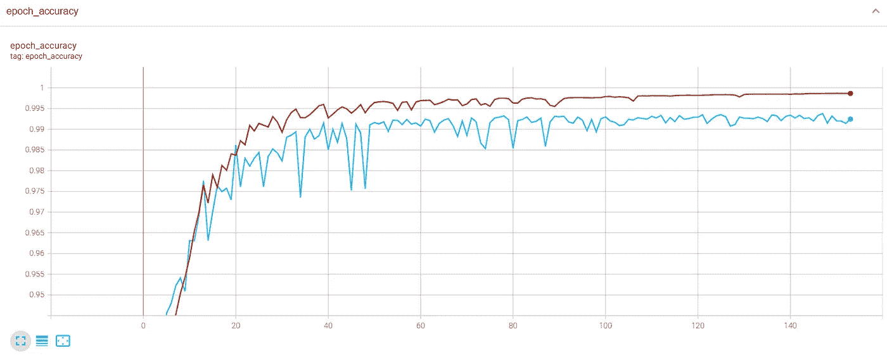
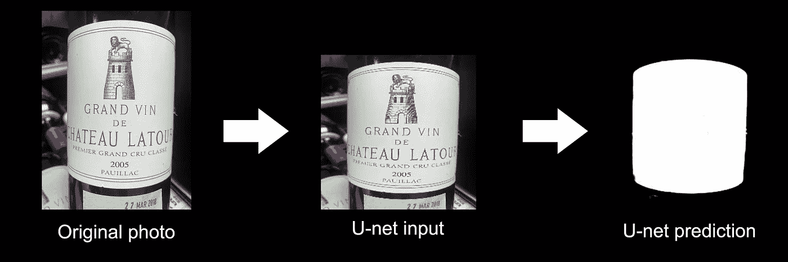
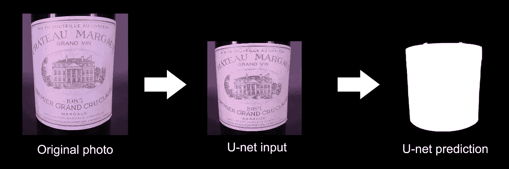
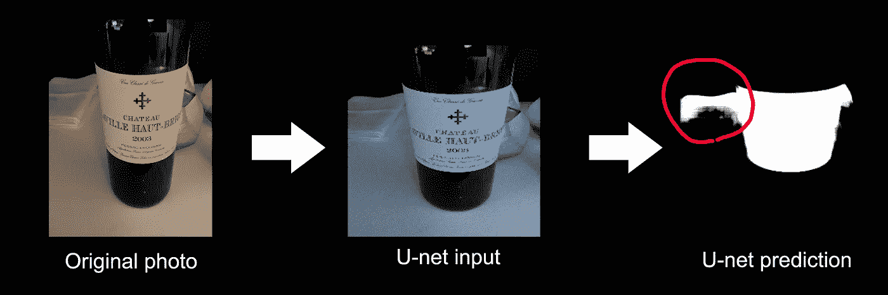

# 如何使用计算机视觉读取酒瓶上的标签？(第二部分)

> 原文：<https://towardsdatascience.com/how-to-read-a-label-on-a-wine-bottle-using-computer-vision-part-2-8bd047d2a945>

欢迎阅读本系列文章，在这里我将解释我构建第一个计算机视觉项目的历程。这里的目标是让计算机从一张简单的照片上读出一瓶酒的标签。在我们的[上一篇文章](https://medium.com/@leroyantonin.pro/how-to-read-a-label-on-a-wine-bottle-using-computer-vision-part-1-25447f97a761)中，我们尝试了一种非常直接的方法，用 python 和 OpenCV 图像处理技术来检测我们的葡萄酒标签，我们发现在一组不同的照片上检测葡萄酒标签还不够好。

对于这个项目的第二部分，我们将尝试其他方法来解决这个问题，我们将尝试建立一个神经网络，它可以基于监督方法来识别标签的位置。

# 第 2 部分—检测标签，神经网络方法(U-net)

在我第一次尝试第一种方法失败后，我开始怀疑我是否能找到一种只使用 OpenCV 的方法，当我偶然发现一个[论坛帖子](https://forum.opencv.org/t/label-detection-advise-needed/5719)时，有人正试图做几乎和我一样的事情，除了邮件上的标签。这个问题的一个回答引起了我的注意:

> 一个只有 5 个标记样本的 U-Net 将很容易检测到它。你只需屏蔽标签区域，通过一些良好的增强，如随机旋转/翻转/扭曲，你将获得可靠的结果，你可以稍后使用`findContours`或`boundingRect`预测屏蔽。

然后我开始研究 U-net 以及如何实现它。基本上，我必须为训练集中的每个标签形状图像(X)手动创建一个相应的黑白遮罩(U-net 的目标),如下所示:

有趣的部分开始了，我总共花了 2/3 个小时的 photoshop 来制作 163 张照片的标签蒙版！完成后，我找到了这个网络架构的 tensorflow 实现。以下是来自维基百科的网络架构描述:

> 这个网络由一条收缩路径和一条扩张路径组成，这使它具有 u 形结构。收缩路径是一个典型的卷积网络，它由重复应用的[卷积](https://en.wikipedia.org/wiki/Convolutions)组成，每个卷积之后是一个[整流线性单元](https://en.wikipedia.org/wiki/Rectified_linear_unit) (ReLU)和一个[最大汇集](https://en.wikipedia.org/wiki/Max_pooling)操作。在收缩期间，空间信息减少，而特征信息增加。扩展路径通过一系列上卷积和连接将特征和空间信息与来自收缩路径的高分辨率特征相结合。

这是 tensorflow 实现的样子(忽略配置文件，它是我为自己的包设置的):

我在我自己的 NVIDIA GeForce RTX 3060 上训练网络。大约 10 分钟后，验证准确度开始收敛到 99%左右。

张量板训练可视化

让我们在一些样本照片上测试我们的模型，看看我们的网络在真实条件下表现如何。

样本外预测示例

正如您在这里看到的，一切都按预期工作，网络的输入必须经过一点点预处理，才能成为方形，并且是 BGR 彩色格式。一旦获得预测掩码，我们只需要调整它的大小，以获得标签的像素坐标(白色像素)。

样本外预测示例

在这里，除了被误认为是标签一部分的小光点之外，网络也工作得相当好。

样本外预测示例

在这个例子中，瓶子旁边有一本书，我们看到网络变得混乱，并将它的一部分包含到标签的形状中。即使这是一个非常健壮的方法，仍然有一些改进的空间。对于这个项目，我将使用这种方法来检测标签，并尽可能避免这样的错误，我会给出摄影指南(中心标签/无旋转/良好的照明/良好的背景对比度)，以尽量减少网络的错误。

这就是第 2 部分的全部内容。如果你想了解更多关于 U-net 是如何设置的，并探索代码，你可以查看位于 https://github.com/AntoninLeroy/wine_label_reader_toolkit**的 GitHub 项目资源库**

**在下一篇文章中，我们将尝试找到一种方法来使我们的标签圆柱体变平，以便能够用 OCR 库读取它，敬请关注！**

**我们的实时应用程序仍然可以在:[https://plural.run/wineReader](https://plural.run/wineReader)**

**【更新】第三部出来了！[点击这里](/how-to-read-a-label-on-a-wine-bottle-using-computer-vision-part-3-e4729e5a8140)。**

***所有图片均由作者提供***