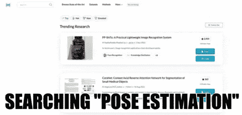
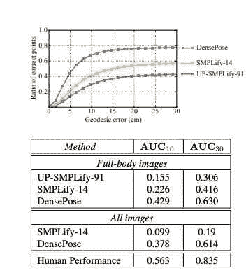
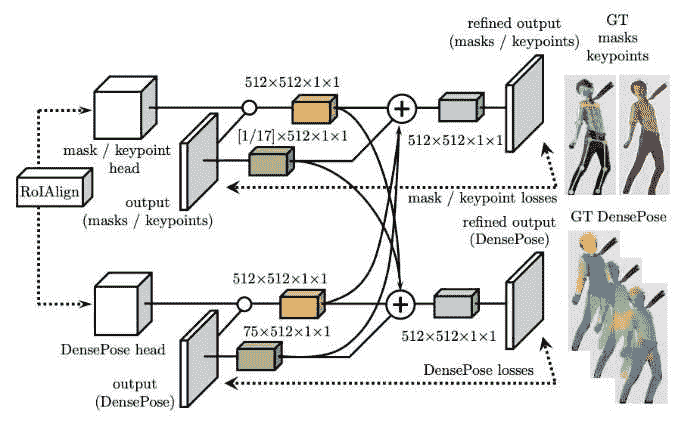

# 如何阅读研究论文:面向 ML 从业者的实用方法

> 原文：<https://towardsdatascience.com/how-to-read-research-papers-a-pragmatic-approach-for-ml-practitioners-299935624326>

## 如何理解人工智能/人工智能研究出版物

[斯科特·格雷厄姆](https://unsplash.com/@homajob?utm_source=unsplash&utm_medium=referral&utm_content=creditCopyText)在 [Unsplash](https://unsplash.com/s/photos/research-paper?utm_source=unsplash&utm_medium=referral&utm_content=creditCopyText) 上拍照

*数据科学家或机器学习专家有必要阅读研究论文吗？*

简单的回答是肯定的。如果你缺乏正式的学术背景或只获得了机器学习领域的本科学位，也不用担心。

对于没有广泛教育背景的人来说，阅读学术研究论文可能会令人生畏。然而，缺乏学术阅读经验不应阻止数据科学家利用宝贵的信息和知识来源进行[机器学习](https://www.nvidia.com/en-us/glossary/data-science/machine-learning/)和[人工智能开发](https://www.nvidia.com/en-us/glossary/data-science/artificial-intelligence/)。

本文为任何技能水平的数据科学家提供了阅读学术期刊上发表的研究论文的实践指南，如 [NeurIPS](https://nips.cc/) 、 [JMLR](https://www.jmlr.org/) 、 [ICML、](https://icml.cc/)等。

在全心投入阅读研究论文之前，学习如何阅读研究论文的第一阶段包括选择相关主题和研究论文。

# 第一步:确定主题

机器学习和数据科学领域是许多学科领域的家园。但这并不一定意味着处理机器学习中的每个主题都是最佳选择。

虽然建议入门级从业者一般化，但我猜测，当涉及长期机器学习时，职业前景、从业者和行业兴趣通常会转移到专业化。

确定一个合适的主题可能很难，但是很好。不过，一个经验法则是选择一个你有兴趣获得专业职位或者已经有经验的 ML 领域。

[深度学习](https://www.nvidia.com/en-us/glossary/data-science/deep-learning/)是我的兴趣之一，我是一名计算机视觉工程师，在应用程序中使用深度学习模型来专业解决[计算机视觉](https://www.nvidia.com/en-us/glossary/data-science/computer-vision/)问题。因此，我对姿势估计、动作分类和手势识别等主题感兴趣。

基于角色，以下是 ML/DS 职业和相关主题的例子。

*图 1:机器学习和数据科学的角色和相关主题。作者创建的图像*

对于这篇文章，我将选择姿势估计这个主题进行探索，并选择相关的研究论文进行研究。

# 第二步:寻找研究论文

在查看机器学习相关的研究论文、数据集、代码和其他相关材料时，最优秀的工具之一是代码为的 [PapersWithCode](https://paperswithcode.com/) 。

我们使用 PapersWithCode 网站上的搜索引擎来获取我们所选主题“姿态估计”的相关研究论文和内容下图向您展示了这是如何做到的。

*图 2:作者创建的图片:GIF 搜索姿势估计*

搜索结果页面包含对搜索主题的简短说明，随后是相关数据集、模型、论文和代码的表格。不涉及太多的细节，这个用例感兴趣的领域是“有代码的最伟大的论文”。这部分包含与任务或主题相关的论文。对于本文，我将选择[密集姿势:野外密集人体姿势估计](https://paperswithcode.com/paper/densepose-dense-human-pose-estimation-in-the)。

# 第三步:第一遍(获得背景和理解)

*照片由*[*absolute vision*](https://unsplash.com/@freegraphictoday?utm_source=unsplash&utm_medium=referral&utm_content=creditCopyText)*上*[*Unsplash*](https://unsplash.com/s/photos/idea?utm_source=unsplash&utm_medium=referral&utm_content=creditCopyText)

此时，我们已经选择了一篇研究论文进行研究，并准备从其内容中提取任何有价值的知识和发现。

很自然，你的第一个冲动是开始写笔记并从头到尾阅读文档，也许在中间休息一下。然而，有一个研究论文内容的背景是一个更实用的阅读方法。标题、摘要和结论是理解任何研究论文的三个关键部分。

你所选论文的第一遍的目标是达到以下目标:

*   确保论文是相关的。
*   通过学习文章的内容、方法和发现，获得对文章内容的理解。
*   认可作者的目标、方法和成就。

## **标题**

标题是作者和读者分享信息的第一点。因此，研究论文的标题是直接的，以一种不留任何歧义的方式构成。

研究论文的标题是最能说明问题的方面，因为它表明了这项研究与你的工作的相关性。标题的重要性在于简要介绍论文的内容。

在这种情况下，标题是“密集姿势:野外密集人体姿势估计”这给出了工作的广泛概述，并意味着它将着眼于如何在高活动水平和现实情况的环境中适当地提供姿态估计。

## 摘要

摘要部分给出了论文的摘要版本。这是一个很短的部分，包含 300-500 个单词，简单地告诉你论文的内容。摘要是一个简短的文本，概述了文章的内容，研究人员的目标，方法和技术。

当阅读机器学习研究论文的摘要时，你通常会遇到数据集、方法、算法和其他术语的提及。与文章内容相关的关键词提供了上下文。做笔记并跟踪所有关键词可能会有所帮助。

对于这篇文章:“*Dense Pose:Dense person Pose Estimation In The Wild*”，我在摘要中确定了以下关键词:姿势估计、COCO 数据集、CNN、基于区域的模型、实时。

## 结论

当你第一次从头到尾阅读论文时，疲劳是很常见的，特别是对于没有高级学术经验的数据科学家和从业者。虽然在长时间的学习后，从论文的后面部分提取信息可能会显得乏味，但结论部分通常很短。因此，建议在第一遍阅读结论部分。

结论部分简要概述了作品的作者或作者和/或贡献和成就，以及对未来发展和局限性的承诺。

在阅读研究论文的主要内容之前，先阅读结论部分，看看研究人员的贡献、问题领域和成果是否符合你的需求。

遵循这一特定的简短的第一步，可以充分理解和概述研究论文的范围和目标，以及其内容的背景。如果你全神贯注地再看一遍，就能从内容中获得更详细的信息。

# 第四步:第二遍(内容熟悉)

熟悉内容是一个与初始步骤相关的过程。熟悉过程是一个步骤，涉及研究论文中的引言部分和图表。

如前所述，不需要直接进入研究论文的核心，因为知识适应在以后的过程中提供了更详细和更全面的研究检查。

## 介绍

研究论文的介绍部分是为了提供研究工作目标的概述。这个目标提到并解释了问题领域、研究范围、先前的研究成果和方法。

使用相似或不同的方法，在这一领域找到与过去研究工作的相似之处是很正常的。其他论文的引用提供了问题领域的范围和广度，为读者拓宽了探索区域。在这一点上，也许合并步骤 3 中概述的过程就足够了。

引言部分提供的好处的另一个方面是介绍处理和理解研究论文内容所需的必要知识。

## 图表、图解和数字

研究论文中的说明性材料确保读者能够理解支持问题定义的因素或所提出方法的解释。通常，研究论文中使用表格来提供新技术与类似方法相比的定量性能信息。

[显示 DensePose 与其他单人姿势估计解决方案比较的图像。](https://arxiv.org/pdf/1802.00434v1.pdf)

一般来说，数据和性能的可视化表示使得能够对论文的上下文有直观的理解。在前面提到的密集姿态论文中，插图描述了作者的姿态估计方法的性能。

在深度学习领域，经常可以找到描述人工神经网络结构的拓扑插图。这又增加了对任何读者的直观理解。通过插图和数字，读者可以自己解释信息并获得更全面的视角，而不会对结果有任何先入为主的概念。

[图片显示了 DensePose 的交叉级联架构。](https://arxiv.org/pdf/1802.00434v1.pdf)

# 第五步:第三遍(深度阅读)

论文的第三遍与第二遍相似，尽管它覆盖了更重要的部分。关于这一关最重要的事情是你避免任何复杂的算术或技术公式，这可能对你来说是困难的。在此过程中，你也可以跳过任何你不理解或不熟悉的单词和定义。这些不熟悉的术语、算法或技术应该注意，以便稍后返回。

*照片由*[*Markus Winkler*](https://unsplash.com/@markuswinkler?utm_source=unsplash&utm_medium=referral&utm_content=creditCopyText)*上的*[*Unsplash*](https://unsplash.com/s/photos/magnifying-glass?utm_source=unsplash&utm_medium=referral&utm_content=creditCopyText)*。*

在这一阶段，你的主要目标是对论文内容有一个大致的了解。接近论文，再次从摘要开始到结论，但是一定要在各部分之间有中间休息。此外，建议准备一个记事本，在上面记录所有重要的见解和要点，以及不熟悉的术语和概念。

番茄工作法是管理深度阅读或学习时间的有效方法。据解释，番茄工作法包括将一天分成几个工作块，然后是短暂的休息。

对我有用的是 50/15 的分配，即 50 分钟学习，15 分钟休息。我倾向于在休息 30 分钟之前连续做两次这种分割。如果你不熟悉这种时间管理技巧，可以采用相对简单的划分方法，比如 25/5，并根据你的关注点和时间容量来调整时间划分。

# 第六步:第四遍(最后一遍)

最后一关通常涉及到运用你的思维和学习能力，因为它涉及到浏览前一关中提到的不熟悉的术语、术语、概念和算法。这一关着重于使用外部材料来理解论文中记录的不熟悉的方面。

对不熟悉的主题进行深入研究没有特定的时间长度，有时努力会持续几天甚至几周。成功完成最后一次勘探的关键因素是找到合适的勘探源。

不幸的是，互联网上没有一个来源能提供你所需要的大量信息。尽管如此，有多种来源，当统一和适当地使用时，可以填补知识空白。下面是其中的一些资源。

*   [机器学习子编辑](https://www.reddit.com/r/MachineLearning/)
*   [深度学习子编辑](https://www.reddit.com/r/deeplearning/)
*   [纸张代码](https://paperswithcode.com/)
*   顶级会议如 [NIPS](https://papers.nips.cc/) ， [ICML](https://icml.cc/) ， [ICLR](https://iclr.cc/)
*   [研究门](https://www.researchgate.net/)
*   [机器学习苹果](https://machinelearning.apple.com/)

研究论文的参考部分提到了技术和算法。因此，目前的论文要么是从参考文献中获得灵感，要么是建立在参考文献的基础上，这就是为什么参考文献是你在深度阅读课程中使用的一个有价值的来源。

# 第 7 步:总结(可选)

在近十年的与技术相关的学科和角色的学术和专业工作中，最有效的方法是通过重述探索的主题来确保任何新学到的信息保留在我的长期记忆中。通过用我自己的话重写新的信息，无论是书面的还是打字的，我能够以可理解的方式和令人难忘的方式来强化已提出的观点。

*照片由*[*neon brand*](https://unsplash.com/@neonbrand?utm_source=unsplash&utm_medium=referral&utm_content=creditCopyText)*上*[*Unsplash*](https://unsplash.com/s/photos/blogging?utm_source=unsplash&utm_medium=referral&utm_content=creditCopyText)

更进一步说，可以通过利用博客平台和社交媒体来宣传学习成果和笔记。假设读者不习惯这个话题或主题，试图向广大读者解释这个新探索的概念，需要理解话题内在的细节。

# 结论

毫无疑问，对于新手数据科学家和 ML 从业者来说，阅读研究论文可能会令人生畏，具有挑战性；即使是经验丰富的从业者也很难一次成功消化研究论文的内容。

数据科学职业的本质是非常实际和复杂的。这意味着，它的从业者需要采用学术思维，尤其是数据科学领域与人工智能密切相关，而人工智能仍是一个发展中的领域。

**总而言之，下面是你阅读研究论文应该遵循的所有步骤**

*   确定一个主题。
*   查找相关研究论文
*   阅读标题、摘要和结论，对研究的目标和成果有一个模糊的理解。
*   通过深入研究介绍来熟悉内容，包括研究论文中的数字和图表。
*   当你从上到下阅读文章时，使用深度阅读来消化文章的主要内容。
*   利用外部资源探索不熟悉的术语、术语、概念和方法。
*   用你自己的话总结基本要点、定义和算法。

*感谢阅读。*

**本文最初发表于** [**Nvidia 开发者博客**](https://developer.nvidia.com/blog/how-to-read-research-papers-a-pragmatic-approach-for-ml-practitioners/)

## 我希望这篇文章对你有所帮助。

要联系我或找到更多类似本文的内容，请执行以下操作:

1.  [**成为推荐媒介会员，支持我的写作**](https://richmondalake.medium.com/membership)
2.  订阅我的 [**电子邮件列表**](https://richmond-alake.ck.page/c8e63294ee) 获取我的简讯
3.  通过 [**LinkedIn**](https://www.linkedin.com/in/richmondalake/) 联系我
4.  在 [**Twitter**](https://twitter.com/richmondalake) 上获取我的实时更新