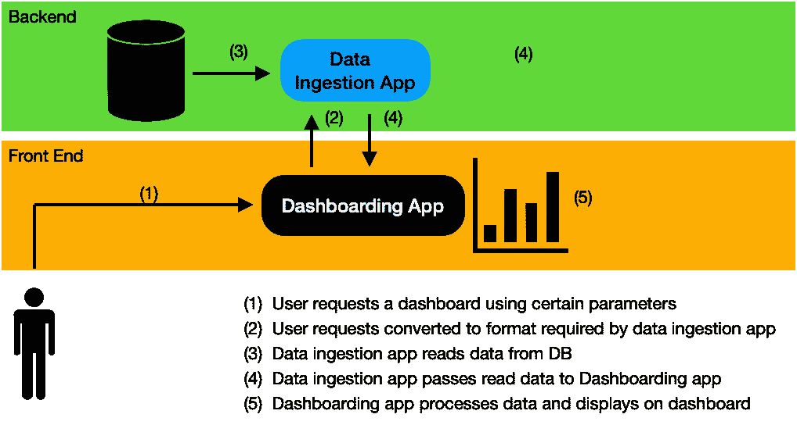
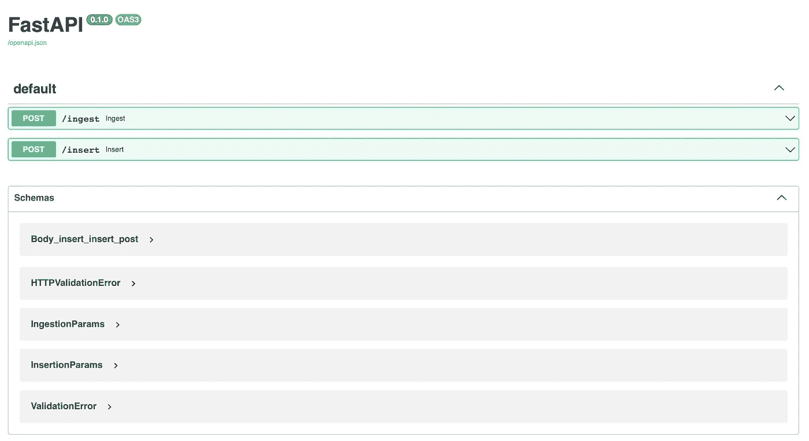

# 如何使用 FastAPI 通过 HTTP 从/向 SQL 读取/写入数据帧

> 原文：<https://towardsdatascience.com/how-to-read-write-dataframes-from-to-sql-over-http-with-fastapi-e48ab91e6a83>

## 不到 10 分钟


照片感谢来自 [Unsplash](https://unsplash.com/photos/GSiEeoHcNTQ) 的 [growtika](https://unsplash.com/@growtika) 。

在工业中处理数据是一件痛苦的事情。这是因为数据可以分散在多个项目中，以不同的格式存储，并以不同的程度维护。通常，这导致不同的团队开发不同的内部工具来处理他们的数据。由于没有标准的读写数据的方法，整个事情变得一团糟。

一个解决方案是开发数据摄取微服务。本质上，这些应用程序支持通过 HTTP 或 RPC 调用进行数据传输。他们试图提供一种统一的格式来读取和写入不同的数据源(例如 Google BigQuery、Postgres 等)。这个想法是，其他应用程序(比如仪表板)将使用数据摄取应用程序来加载数据。下图描述了一个简单的用例:



在本教程中，我将描述开发一个简单的数据摄取应用程序的过程，该应用程序使用 FastAPI 读取和写入任何 Postgres 数据库。

# 应用端点

## 摄取数据

接收端点将用于读取数据。为此，我们需要连接到数据库的参数。这些将是 **db_user** 、 **db_password** 、 **db_port** 、 **db_name** 和 **db_host** 。我们还需要一种查询数据库的方法，在这种情况下，它可以只是一个字符串 **sql_query** 。

我们使用`fastapi`定义我们的应用程序，并开始构建端点:

```
from fastapi import FastAPI
from pydantic import BaseModel

# initialise app
app = FastAPI()
# pydantic class for collecting our parameters into a json object
class IngestionParams(BaseModel):
  sql_query: str
  username: str
  password: str
  port: int
  host: str
  database_name: str
# define POST endpoint "ingest"
@app.post("/ingest")
def ingest(
  ingestion_params: IngestionParams
):
  # retrieve ingestion params as dictionary
  ingestion_params = ingestion_params.dict()
  db_user = ingestion_params['username']
  db_password = ingestion_params['password']
  db_host = ingestion_params['host']
  db_port = ingestion_params['port']
  db_name = ingestion_params['database_name']
  sql_query = ingestion_params['sql_query']
```

> **重要提示:**根据 REST API 设计模式，在 **get** 和 **post** 请求之间应该有所区别。通常， **get** 用于读取数据， **post** 用于发送数据。然而，在这种情况下，最好使用 **post** 来获取，因为:1)浏览器日志通常包含 URL 历史记录(这意味着敏感参数(如 DB 凭证)会被暴露)，2)URL 长度有限制[ [1](https://stackoverflow.com/questions/19637459/rest-api-using-post-instead-of-get) ]

现在，我们需要连接到我们的客户机并执行查询。为此，我们可以使用`sqlalchemy`:

```
import sqlalchemy as db
import pandas as pd

# connect to db
db_uri = f'postgresql+psycopg2://{db_user}:{db_password}@{db_host}:{db_port}/{db_name}'
engine = db.create_engine(db_uri)
con = engine.connect()
# query db
query_result = con.execute(sql_query)
data = query_result.fetchall()
# convert to dataframe
columns = query_result.keys()
df = pd.DataFrame(data, columns=columns)
```

剩下的最后一件事是我们如何通过 HTTP 请求发送回数据帧。有多种方法可以做到这一点，但是为了保留 dtype，我们将 DataFrame 转换为一个 Parquet 文件，并使用内容类型`application/octer-stream`将其作为二进制文件发送。

```
# added import
from fastapi import Response
def ingest(
  response: Response, # add response parameter
  ingestion_params: IngestionParams
)

...
# return parquet file in Response object
return Response(df.to_parquet(engine='pyarrow', index=False), media_type='application/octet-stream')
```

## 插入数据

为了插入数据，我们需要和以前一样的参数来连接数据库。然而，我们还需要 **table_name** 、 **dataset_name** 和**conflict _ resolution _ strategy**。

我们还需要一个**文件**参数来发送数据。这样，我们开始设计插入端点:

```
from fastapi import File, UploadFile
from pydantic import Json
# pydantic class for collecting our parameters into a json object
class InsertionParams(BaseModel):
  username: str
  password: str
  port: int = 5432
  host: str
  database_name: str
  table_name: str
  conflict_resolution_strategy: str = 'replace'  # default value

# define POST endpoint "insert" using async
@app.post("/insert")
async def insert(
  response: Response, # for returning the dataframe that we insert
  insertion_params: Json[InsertionParams],
  file: UploadFile = File(...)
):
  # retrieve insertion params as dictionary
  insertion_params = insertion_params.dict()
  db_user = insertion_params['username']
  db_password = insertion_params['password']
  db_host = insertion_params['host']
  db_port = insertion_params['port']
  db_name = insertion_params['database_name']
  table_name = insertion_params['table_name']
  conflict_resolution_strategy = insertion_params['conflict_resolution_strategy']
  dataset_name = insertion_params.get('dataset_name', None)
  content = await file.read()
```

现在，我们想要设计我们的 API 来支持不同的文件类型作为输入。我们可以使用 file 对象的 content_type 属性来确定文件类型，然后适当地读取它。

```
import io
with io.BytesIO(content) as data:
    if 'csv' in file.content_type:
        df = pd.read_csv(data)
    if file.content_type == 'text/tab-separated-values':
        df = pd.read_csv(data, delimiter='\t')
    if file.content_type == 'application/octet-stream': # TODO can you have other 'octet-stream'?
        df = pd.read_parquet(data, engine='pyarrow')
```

与之前类似，我们通过初始化客户端连接到数据库，然后使用来自`pandas`的`.to_sql`方法写入 postgres。但是，我们必须确保在使用该方法时传递数据类型，否则您的表将会被不正确地填充。因此:

```
# import types
from sqlalchemy import INTEGER, FLOAT, TIMESTAMP, VARCHAR, BOOLEAN
from pandas.api.types import is_datetime64tz_dtype
# connect to database
... 
DTYPE_MAP = {
        'int64': INTEGER,
        'float64': FLOAT,
        'datetime64[ns]': TIMESTAMP,
        'datetime64[ns, UTC]': TIMESTAMP(timezone=True),
        'bool': BOOLEAN,
        'object': VARCHAR
    }
def _get_pg_datatypes(df):
    dtypes = {}
    for col, dtype in df.dtypes.items():
        if is_datetime64tz_dtype(dtype):
            dtypes[col] = DTYPE_MAP['datetime64[ns, UTC]']
        else:
            dtypes[col] = DTYPE_MAP[str(dtype)]
    return dtypes
dtypes = _get_pg_datatypes(df)
df.to_sql(table_name, con, schema=dataset_name, if_exists=conflict_resolution_strategy, index=False, method='multi', dtype=dtypes)
response.status_code = 201
return "Created table"
```

# 运行应用程序

总的来说，代码应该如下所示:

```
from fastapi import FastAPI, Response, File, UploadFile
from pydantic import BaseModel, Json
import sqlalchemy as db
import pandas as pd
import io
from sqlalchemy import INTEGER, FLOAT, TIMESTAMP, VARCHAR, BOOLEAN
from pandas.api.types import is_datetime64tz_dtype
# initialise app
app = FastAPI()
# pydantic class for collecting our parameters into a json object
class IngestionParams(BaseModel):
  sql_query: str
  username: str
  password: str
  port: int
  host: str
  database_name: str
class InsertionParams(BaseModel):
  username: str
  password: str
  port: int = 5432
  host: str
  database_name: str
  table_name: str
  conflict_resolution_strategy: str = 'replace'  # default value
def _connect_to_db(user, password, host, port, name):
    db_uri = f'postgresql+psycopg2://{user}:{password}@{host}:{port}/{name}'
    engine = db.create_engine(db_uri)
    con = engine.connect()
    return con
# define POST endpoint "ingest"
@app.post("/ingest")
def ingest(
  response: Response,
  ingestion_params: IngestionParams
):
  # retrieve ingestion params as dictionary
  ingestion_params = ingestion_params.dict()
  db_user = ingestion_params['username']
  db_password = ingestion_params['password']
  db_host = ingestion_params['host']
  db_port = ingestion_params['port']
  db_name = ingestion_params['database_name']
  sql_query = ingestion_params['sql_query']
  # connect to db
  con = _connect_to_db(db_user, db_password, db_host, db_port, db_name)
  # query db
  query_result = con.execute(sql_query)
  data = query_result.fetchall()
  # convert to dataframe
  columns = query_result.keys()
  df = pd.DataFrame(data, columns=columns)
  # return parquet file in Response object
  return Response(df.to_parquet(engine='pyarrow', index=False), media_type='application/octet-stream')

# define POST endpoint "insert" using async
@app.post("/insert")
async def insert(
  response: Response, # for returning the dataframe that we insert
  insertion_params: Json[InsertionParams],
  file: UploadFile = File(...)
):
  # retrieve insertion params as dictionary
  insertion_params = insertion_params.dict()
  db_user = insertion_params['username']
  db_password = insertion_params['password']
  db_host = insertion_params['host']
  db_port = insertion_params['port']
  db_name = insertion_params['database_name']
  table_name = insertion_params['table_name']
  conflict_resolution_strategy = insertion_params['conflict_resolution_strategy']
  dataset_name = insertion_params.get('dataset_name', None)
  content = await file.read()

  with io.BytesIO(content) as data:
      if 'csv' in file.content_type:
          df = pd.read_csv(data)
      if file.content_type == 'text/tab-separated-values':
          df = pd.read_csv(data, delimiter='\t')
      if file.content_type == 'application/octet-stream':  # TODO can you have other 'octet-stream'?
          df = pd.read_parquet(data, engine='pyarrow')
  DTYPE_MAP = {
        'int64': INTEGER,
        'float64': FLOAT,
        'datetime64[ns]': TIMESTAMP,
        'datetime64[ns, UTC]': TIMESTAMP(timezone=True),
        'bool': BOOLEAN,
        'object': VARCHAR
    }
  def _get_pg_datatypes(df):
    dtypes = {}
    for col, dtype in df.dtypes.items():
        if is_datetime64tz_dtype(dtype):
            dtypes[col] = DTYPE_MAP['datetime64[ns, UTC]']
        else:
            dtypes[col] = DTYPE_MAP[str(dtype)]
    return dtypes
  dtypes = _get_pg_datatypes(df)
  # connect to db
  con = _connect_to_db(db_user, db_password, db_host, db_port, db_name)
  df.to_sql(table_name, con, schema=dataset_name, if_exists=conflict_resolution_strategy, index=False, method='multi', dtype=dtypes)
  response.status_code = 201
  return "Created table"
```

> 请注意，我们已经清理了一些东西！

我们可以将其保存到一个名为`main.py`的文件中，然后在终端中运行以下命令:

```
uvicorn main:app --reload
```

现在，您应该可以通过访问以下 url 在浏览器中看到该应用程序:

> `localhost:8000/docs`



这是您应该在 localhost:8000/docs 上看到的内容

## 设置

为了测试我们的应用程序是否正常工作，我们需要一个 postgres 实例来测试。出于本文的目的，我们将使用 Docker Postgres 实例(尽管您可以随意使用)。

为此，您需要安装 docker。然后，您可以在终端中运行以下命令:

```
docker run -p 5432:5432 -e POSTGRES_PASSWORD=postgres -d postgres
```

您现在应该有一个本地运行的 postgres 实例，并在 5432 端口上有一个连接。您可以使用数据库查看软件来查看。在我的例子中，我使用 DBeaver [ [2](https://dbeaver.io/) ]。

数据库的连接参数是:

*   **用户名:** postgres
*   **主机:**本地主机
*   港口: 5432
*   **密码:** postgres
*   **数据库名称:** postgres

## 使用请求读取文件

使用 UI 来读/写数据是相对直观的。当您想从 Python 内部调用端点时，这就不那么重要了。为此，我们使用`requests`模块。

```
import io
import pandas as pd
import requests
BASE_URL = 'http://localhost:8000' # url for app comprised of host and port
# headers for request
headers = {
        'Content-Type': 'application/json',
        'Accept': 'application/octet-stream'
}
# function for validating successful request
def _is_status_code_valid(status_code):
    if str(status_code).startswith('2'):
        return True
def read_data(
        ingestion_param,
):
    #
    url = f'{BASE_URL}/ingest'

    resp = requests.post(url, json=ingestion_param, headers=headers)
    status_code = resp.status_code
    if _is_status_code_valid(status_code):
        df = pd.read_parquet(io.BytesIO(resp.content), engine='pyarrow')
        return df, status_code
```

上面的关键方面是，我们以字节为单位读取响应，但我们需要数据作为数据帧。因此，在将响应内容作为 parquet 读取之前，我们将它转换为 BytesIO 对象。我们保存 dtype，因为 parquet 文件包含表 dtype 信息。

## 使用请求发送文件

发送文件比阅读文件稍微复杂一些。这是因为 post 请求的请求参数并不简单，我们必须想办法将数据帧转换成可接受的格式。

```
import io
import json
import requests

BASE_URL = 'http://localhost:8000' # url for app comprised of host and port
def write_data(
        database_name,
        table_name,
        database_type='pg',
        df=pd.DataFrame(),
        content_type='csv',
        conflict_resolution_strategy='fail',
        username='postgres',
        password='postgres',
        port=5432,
        host='localhost',
   ):
    url = f'{BASE_URL}/insert'

    # in principle, it is possible to add converters for any content_type
    if content_type == 'parquet':
        memory_buffer = io.BytesIO()
        df.to_parquet(
            memory_buffer,
            engine='pyarrow'
        )
        memory_buffer.seek(0)
    # need to encode parameters as json string
    data = {
        'insertion_params': json.dumps(dict(
        username=username,
        password=password,
        port=port,
        database_name=database_name,
        table_name=table_name,
        conflict_resolution_strategy=conflict_resolution_strategy,
        host=host
    ))
    }
    # need to send files separately
    files = {
        'file': ('Test', memory_buffer, 'application/octet-stream')
    }
    resp = requests.post(url, data=data, files=files)
    return resp.text, resp.status_code
```

# 结束语

在本文中，我们使用 FastAPI for Postgres 设计了一个数据摄取应用程序。以下是关键要点的快速总结:

*   数据摄取应用程序比在单独的项目中构建摄取功能更可取，因为它是标准化的，更易于维护，并能适应变化
*   将数据帧转换成 Parquet 对于通过 HTTP 发送它们很有用，因为我们保留了数据类型信息
*   目前的应用程序可以很容易地扩展到支持其他数据源，如 BigQuery，Google Drive 等…

## 限制

*   仅支持 postgres
*   目前，使用`.to_sql`的方法不支持上插功能

本文使用的全部代码可以在下面的存储库中找到:[https://github.com/namiyousef/in-n-out](https://github.com/namiyousef/in-n-out)。

# 引用表

[1][https://stack overflow . com/questions/19637459/rest-API-using-post-inst-of-get](https://stackoverflow.com/questions/19637459/rest-api-using-post-instead-of-get)

[2][https://dbeaver.io/](https://dbeaver.io/)

*以上所有图片和代码均为作者所有，除非另有说明*