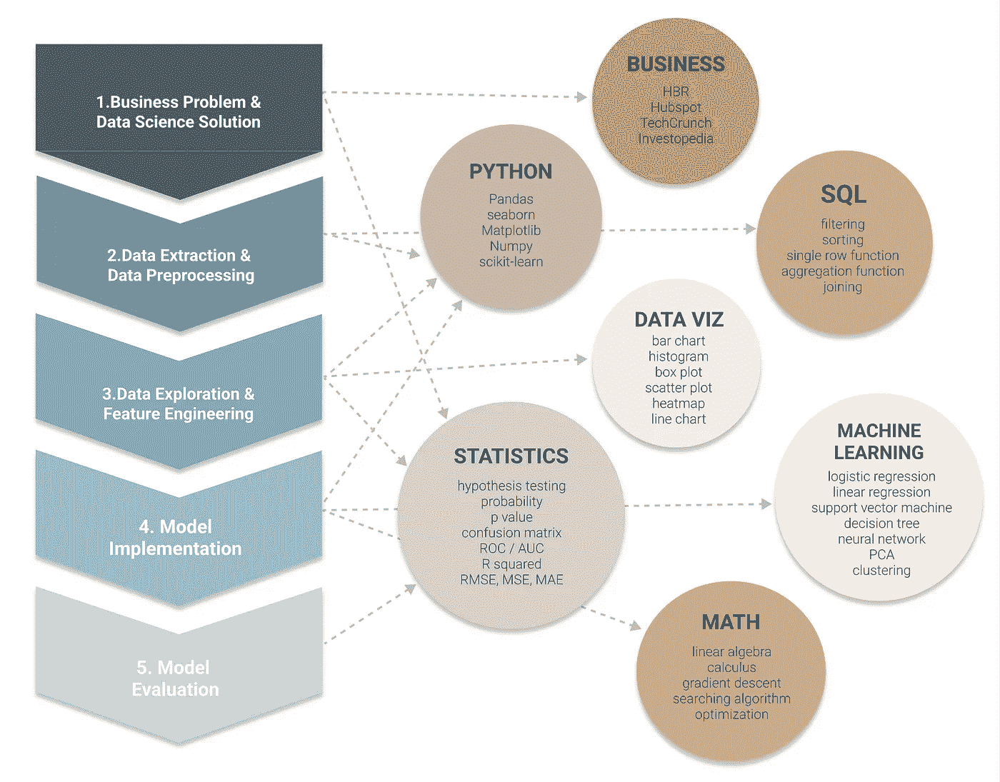
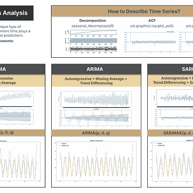

# 如何自学数据科学

> 原文：<https://towardsdatascience.com/how-to-self-learn-data-science-in-2022-a537a76d138e>

## 基于项目的数据科学入门方法

数据科学学习备忘单(原始图片来自我的[网站](https://www.visual-design.net/)

作为一个没有数据科学学位的人，我对这个领域充满热情，并决定尝试建立自己的课程，在业余时间学习数据科学。想分享一下自己的经历，希望能给想同路的你带来一些感悟。

基于项目的学习是一个很好的起点，适合已经有一些技术背景，但还想更深入地研究数据科学的构建模块的人。典型的数据科学/机器学习项目包含生命周期——从**定义目标、数据预处理、探索性数据分析、特征工程、模型实现到模型评估。**每个阶段需要不同的技能组合，包括**统计、编程、SQL、数据可视化、数学和商业知识。**

我强烈推荐 [Kaggle](https://www.kaggle.com/) 作为试验您的数据科学项目的平台，以及 Medium 作为从专业人士那里获得数据科学知识的平台。有了大量有趣的数据集和基于云的编程环境，你可以很容易地从 Kaggle 免费获得数据源、代码和笔记本。而来自 [Medium](https://destingong.medium.com/membership) 的几个流行的数据科学出版物(例如[forward Data Science](https://towardsdatascience.com/)、 [Analytics Vidhya](https://medium.com/analytics-vidhya) )允许您在同一个地方学习他人的工作并分享您自己的项目。如果你想阅读更多来自 Medium 的文章并支持我的工作，我真的很感谢你注册使用这个附属[链接](https://destingong.medium.com/membership)。

# 为什么选择基于项目的方法？

1.  这是实际的，给我们一种成就感，我们正在做一些真实的事情！
2.  它强调了学习每一部分内容的基本原理。面向目标的方法提供了一个鸟瞰图，展示了每个小部分是如何结合在一起形成大图的。
3.  它允许我们在学习时主动检索信息。[主动回忆](https://aliabdaal.com/activerecallstudytechnique/)与只需要被动消耗知识的传统学习机制相比，被证明能显著增强信息保持。

让我们将数据科学生命周期分解为以下 5 个步骤，我们将了解每个步骤如何与各种知识领域相联系。

# 1.业务问题和数据科学解决方案

数据科学项目的第一步是确定业务问题，并定义实验设计或模型部署的目标。

## 技能组合——商业知识

在这个阶段，还不需要技术技能，但需要业务理解来识别问题和定义目标。首先理解数据集中出现的领域特定术语，然后将业务需求转化为技术解决方案。积累知识需要多年的实地经验。这里我只能推荐一些增加你对某些商业领域曝光率的网站，比如[哈佛商业评论](https://hbr.org/)、 [Hubspot](https://blog.hubspot.com/) 、 [Investopedia](https://www.investopedia.com/) 、 [TechCrunch](https://techcrunch.com/) 。

## 技能集—统计学(实验设计)

在定义了问题之后，接下来就是把它框架成一个数据科学的解决方案。这从实验设计中的知识开始，例如:

*   [*假设检验*](/an-interactive-guide-to-hypothesis-testing-in-python-979f4d62d85)
*   [*力量分析*](/statistical-power-in-hypothesis-testing-visually-explained-1576968b587e)
*   *采样*
*   *偏差/方差*
*   *不同类型的错误*
*   *过拟合/欠拟合*。

查看我关于假设检验的文章:

</an-interactive-guide-to-hypothesis-testing-in-python-979f4d62d85>  </statistical-power-in-hypothesis-testing-visually-explained-1576968b587e>  

有各种类型的假设检验可供探讨——***T 检验、方差分析、*** ***卡方检验……***。机器学习基本上被认为是一个假设测试过程，我们需要在假设空间中搜索最适合我们观察到的数据的模型，并允许我们对未观察到的数据进行预测。

**有用资源:**

*   [可汗学院:研究设计](https://www.khanacademy.org/math/statistics-probability/designing-studies)
*   [统计假设检验简介](https://machinelearningmastery.com/statistical-hypothesis-tests/)

# 2.数据提取和数据预处理

第二步是从各种来源收集数据，并将原始数据转换成可理解的格式。

## 技能集— SQL

SQL 是一种功能强大的语言，用于与结构化数据库通信并从中提取数据。学习 SQL 还有助于构建一个心智模型，帮助你通过数据查询技术获得洞察力，例如 ***分组、过滤、排序和连接*** 。你也会发现类似的逻辑出现在其他语言中，比如熊猫和 SAS。

**有用资源:**

*   [“SQL 连接入门”](/get-started-with-sql-joins-87835422644b)
*   [数据营:SQL 基础知识](https://www.datacamp.com/tracks/sql-fundamentals)
*   [Dataquest: SQL 基础知识](https://www.dataquest.io/blog/sql-basics/)

## 技能组合—蟒蛇(熊猫)

学习数据科学时，熟悉编程语言是非常重要的。简单的语法使 Python 成为一种相对容易开始的语言。如果你是 Python 新手，这里有一个很棒的视频教程: [Python 初学者——1 小时学会 Python](https://www.youtube.com/watch?v=kqtD5dpn9C8)。

有了基本的了解之后，花点时间学习*熊猫*库还是值得的。*熊猫*如果使用 python 进行数据提取，几乎是不可避免的。它将数据库转换成数据帧——一种我们最熟悉的类似表格的格式。 *Pandas* 在数据预处理中也起着重要的作用，当需要检查和处理以下数据质量问题时。

*   解决缺失数据
*   转换不一致的数据类型
*   删除重复的值

**有用资源:**

*   [Python 熊猫教程:初学者完全入门](https://www.learndatasci.com/tutorials/python-pandas-tutorial-complete-introduction-for-beginners/)
*   [W3schools:熊猫教程](https://www.w3schools.com/python/pandas/default.asp)

# 3.数据探索和特征工程

第三步是数据探索，也称为 EDA(探索性数据分析)，揭示数据集中隐藏的特征和模式。它通常通过数据可视化来实现，然后通过特征工程根据数据探索的结果来转换数据。

## 技能集—统计(描述性统计)

数据探索使用描述性统计来总结数据集的特征:

*   平均值、中间值、众数
*   范围、方差、标准差
*   相关性、协方差
*   偏斜度，分布

在对数据集特征有了坚实的理解之后，我们需要相应地应用最合适的特征工程技术。例如，对右偏数据使用对数变换，并使用裁剪方法来处理异常值。这里我列出了一些常见的特征工程技术:

*   分类编码
*   缩放比例
*   对数变换
*   归罪
*   特征选择

**有用资源:**

*   [3 种常见的数据转换技术](/data-transformation-and-feature-engineering-e3c7dfbb4899)
*   [机器学习的特征工程基础技术](https://medium.com/towards-data-science/feature-engineering-for-machine-learning-3a5e293a5114)
*   [机器学习中的特征选择和 EDA](https://medium.com/me/stats/post/c6c4eb1058a3?source=main_stats_page)

## 技能集—数据可视化

将统计和数据可视化结合起来，可以让我们通过适当的可视化表示来理解数据。您是否喜欢使用可视化包，如 Python 中的 *seaborn* 或 *matplotlib* 和 R 中的*gg plot 2*；或者像 Tableau 和 PowerBI 这样的可视化工具，区分常见图表类型的用例是很重要的:

*   条形图
*   柱状图
*   箱形图
*   热图
*   散点图
*   折线图

如果感兴趣，请查看我关于 EDA 和数据可视化的文章:

</semi-automated-exploratory-data-analysis-eda-in-python-7f96042c9809>  </which-chart-to-choose-4b21929539eb>  <https://medium.com/analytics-vidhya/3-ux-design-principles-for-better-data-visualization-70548630ff28>  

# 4.模型实现

在迄今为止的所有准备工作之后，终于到了深入研究机器学习算法的时候了。

## 技能集——机器学习

[scikit-learn](https://scikit-learn.org/stable/) 是一个强大的 Python 库，可以让初学者轻松入门机器学习。它提供了大量的内置包，我们可以使用几行代码轻松实现一个模型。虽然它已经为我们做了艰苦的工作，但理解算法如何在幕后运行并能够区分每种算法的最佳用例仍然至关重要。通常，机器学习算法分为监督学习和非监督学习。

**监督学习**可以进一步分为分类和回归算法，查看我关于一些流行算法的文章。

</top-machine-learning-algorithms-for-regression-c67258a2c0ac>  </top-machine-learning-algorithms-for-classification-2197870ff501>  

下面是常用算法的快速总结:

**监督学习:**

*   [线性回归](https://destingong.medium.com/a-practical-guide-to-linear-regression-3b1cb9e501a6)
*   [逻辑回归](https://destingong.medium.com/simple-logistic-regression-using-python-scikit-learn-86bf984f61f1)
*   神经网络
*   [决策树](https://ai.plainenglish.io/simplified-machine-learning-f5ca4e177bac)
*   支持向量机

**无监督学习:**

*   [聚类](https://destingong.medium.com/clustering-algorithm-for-customer-segmentation-e2d79e28cbc3)
*   主成分分析
*   降维

我为一些机器学习算法创建了实用指南。如果你有兴趣，请查看我的列表。

[德斯坦贡](https://destingong.medium.com/?source=post_page-----a537a76d138e--------------------------------)

## 机器学习实用指南

[View list](https://destingong.medium.com/list/practical-guides-to-machine-learning-a877c2a39884?source=post_page-----a537a76d138e--------------------------------)10 stories

**有用资源:**

*   [scikit-learn 网站](https://scikit-learn.org/stable/)
*   [我策划的机器学习笔记本](https://www.visual-design.net/notes)
*   [Coursera:用 Python 进行机器学习](https://www.coursera.org/learn/machine-learning-with-python#syllabus)

## 技能组合—数学

包括我在内的许多初学者可能会问，为什么我们需要在数据科学中学习数学。

作为初学者，数学知识主要帮助理解算法背后的基本理论。展望未来，当我们不再依赖内置的机器学习模型库时，它允许我们开发和优化定制的算法。此外，超参数调整还需要高级数学知识来搜索最小化成本函数的最佳模型。

这是更复杂的数学问题出现的时候:

*   结石
*   线性代数
*   优化问题
*   梯度下降
*   搜索算法

**有用资源:**

*   [3Blue1Brown:线性代数的本质](https://youtube.com/playlist?list=PLZHQObOWTQDPD3MizzM2xVFitgF8hE_ab)
*   [3Blue1Brown:微积分的精髓](https://youtube.com/playlist?list=PLZHQObOWTQDMsr9K-rj53DwVRMYO3t5Yr)
*   [3 蓝色 1 棕色:渐变下降](https://www.youtube.com/watch?v=IHZwWFHWa-w&t=40s)

# 5.模型评估

## 技能集—统计学(推理统计学)

在进行模型预测和评估模型性能时，推断统计特别有用。与描述性统计相反，推断性统计侧重于将样本数据中观察到的模式推广到更广泛的人群。它提供了哪些特征在做出推断时具有高度重要性的证据。此外，它还根据评估指标确定模型性能。

例如，对于输出为离散类别的分类问题，一些常见的度量是:

*   混淆矩阵
*   第一类错误/第二类错误
*   准确(性)
*   ROC / AUC

然而，对于输出为连续数字的回归问题，一些常见的度量标准是:

*   r 的平方
*   均方根误差(RMSE)、平均绝对误差(MAE)、均方误差(MSE)

**有用资源**

*   [可汗学院:统计与概率](https://www.khanacademy.org/math/statistics-probability)
*   [评估你的机器学习算法的指标](/metrics-to-evaluate-your-machine-learning-algorithm-f10ba6e38234)

# 带回家的信息

这是一个通用指南，记录了我的学习历程，所以我希望这可以帮助一些对数据科学充满热情并愿意利用业余时间探索这一领域的初学者。我在文章中提到的大多数主题都是表层的，允许你根据自己的喜好选择一个领域进行深入研究。如果你觉得这很有帮助，并且想阅读更多类似的文章，请注册[中级会员以示支持。](https://destingong.medium.com/membership)

## 更多这样的文章

[德斯坦贡](https://destingong.medium.com/?source=post_page-----a537a76d138e--------------------------------)

## 开始学习数据科学

[View list](https://destingong.medium.com/list/get-started-in-data-science-8006bb4ba3ad?source=post_page-----a537a76d138e--------------------------------)8 stories

[德斯坦贡](https://destingong.medium.com/?source=post_page-----a537a76d138e--------------------------------)

## EDA 和特征工程技术

[View list](https://destingong.medium.com/list/eda-and-feature-engineering-techniques-e0696974ed54?source=post_page-----a537a76d138e--------------------------------)9 stories</a-practical-guide-to-linear-regression-3b1cb9e501a6>  </semi-automated-exploratory-data-analysis-eda-in-python-7f96042c9809>  

*原载于 2022 年 1 月 30 日*[*【https://www.visual-design.net】*](https://www.visual-design.net/post/3-ux-design-principles-for-better-data-visualization)*。*