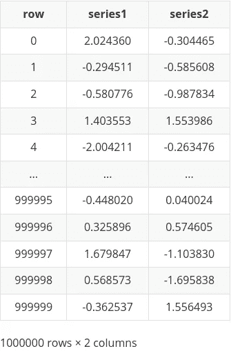

# 如何用 Numpy 矢量化加速数据处理

> 原文：<https://towardsdatascience.com/how-to-speedup-data-processing-with-numpy-vectorization-12acac71cfca>

## 数据准备

## 比标准函数快 8000 倍


由 [Djim Loic](https://unsplash.com/@loic?utm_source=unsplash&utm_medium=referral&utm_content=creditCopyText) 在 [Unsplash](https://unsplash.com/s/photos/fast?utm_source=unsplash&utm_medium=referral&utm_content=creditCopyText) 上拍摄的照片

**在处理较小的数据集时，很容易认为普通的 Python 方法足以快速处理数据。然而，随着产生的数据量的增加，以及通常可用于分析的数据量的增加，尽可能快地优化代码变得比以往更加重要。**

**因此，我们将探讨如何使用矢量化和 numpy 库来帮助您加速数字数据处理。**

# python 为什么慢？

Python 是众所周知的用于数据处理和探索的优秀语言。主要的吸引力在于它是一种高级语言，因此理解和学习起来简单直观，编写和迭代也很快。如果您的重点是数据分析/处理，而不是编写堆积如山的代码，您会想要的所有功能。

然而，这种易用性也有不好的一面。与 c 等低级语言相比，它处理计算的速度要慢得多。


Wolfgang Hasselmann 在 [Unsplash](https://unsplash.com/s/photos/snail?utm_source=unsplash&utm_medium=referral&utm_content=creditCopyText) 上拍摄的照片

幸运的是，由于 python 是数据分析和数据科学社区(以及许多其他社区)选择的语言之一，因此有大量的库和工具可用来缓解 python 在处理大量数据时固有的“缓慢”。

# 到底什么是矢量化？

当谈到用 numpy 加速计算时，您会经常看到“矢量化”这个术语。Numpy 甚至有一个叫做“矢量化”的方法，我们将在后面看到。

一般的谷歌搜索会产生大量关于矢量化实际是什么的混乱和矛盾的信息，或者只是泛泛而谈，不能告诉你太多:

> NumPy 上的**矢量化运算**的概念允许在 NumPy 数组对象和数据序列上使用更优化的预编译函数和数学运算。与简单的非矢量化操作相比，输出和操作将会加快。
> 
> -[GeekForGeeks.org](https://www.geeksforgeeks.org/vectorized-operations-in-numpy/)-搜索时的第一个谷歌结果——什么是 numpy 矢量化？

它只是没有说更多:*由于优化*它会变得更快。

## 什么优化？

问题是 numpy 是一个非常强大的优化工具。当实现类似矢量化的东西时，numpy 中的实现除了简单的传统矢量化之外，还包括许多经过深思熟虑的优化。我认为这是很多困惑的来源，分解正在发生的事情(至少在某种程度上)将有助于让事情变得更清楚。

# 在 numpy 中分解矢量化

接下来的部分将分解 numpy 库中使用的一般“向量化”保护伞下通常包含的内容。

了解它们各自的功能，以及它们如何提高 numpy“向量化”操作的速度，应该有助于解决任何困惑。

## 实际矢量化

矢量化是一个在 numpy 之外使用的术语，用最基本的术语来说就是计算的并行化。

如果你有一个 1D 数组(或称为**向量**):

```
[1, 2, 3, 4]
```

…将向量中的每个元素乘以标量值 2，最终得到:

```
[2, 4, 6, 8]
```

在普通 python 中，这将使用类似 for 循环的东西一个元素一个元素地完成，因此一个接一个地进行四次计算。如果每次计算需要 1 秒钟，那么完成计算并发布结果需要 4 秒钟。

然而，numpy 实际上将两个向量相乘`[2,2,2,2]`和`[2,4,6,8]` (numpy 使用一种叫做 broadcasting 的东西将标量值 2“拉伸”成一个向量，请参阅下一节了解更多信息)。四个独立计算中的每一个都是同时并行完成的。所以从时间上来说，计算是 1 秒完成的(每次计算需要 1 秒，但都是同时完成的)。

仅仅通过计算的“矢量化”(或者，如果你喜欢，一种并行处理的形式)，速度就提高了四倍。请记住，我给出的例子非常简单，但它确实有助于说明基本情况。

您可以看到，如果您正在处理包含数千个(如果不是数百万个)元素的数据集，这相当于一个非常大的差异。

请注意，并行化不是无限的，在某种程度上依赖于硬件。Numpy 不能同时并行处理 1 亿次计算，但它可以显著减少串行计算量，尤其是在处理大量数据时。

如果你想要更详细的解释，那么我推荐[这篇](https://stackoverflow.com/questions/35091979/why-is-vectorization-faster-in-general-than-loops) stackoverflow 帖子，它在更详细的解释方面做得很好。如果你想要更多的细节，那么[的这篇](/decoding-the-performance-secret-of-worlds-most-popular-data-science-library-numpy-7a7da54b7d72)文章和[的这篇](https://pythonspeed.com/articles/vectorization-python/)文章都很棒。

## 广播

广播是 numpy 的一个特性，它允许在不同大小的数组之间执行数学运算。实际上，我们在上一节中已经这样做了。

标量值 2 被“拉伸”成一个充满 2 的数组。这就是广播，也是 numpy **为更高效的计算准备**数据的方式之一。然而，说“它只是创建了一个 2 的数组”是一种过于简单化的说法，但是不值得在这里详细讨论。

Numpy 自己的文档实际上非常清楚:

> 术语广播描述了 NumPy 在算术运算中如何处理不同形状的数组。在某些约束条件下，较小的阵列在较大的阵列中“广播”,以便它们具有兼容的形状。广播提供了一种向量化数组操作的方法，因此循环在 C 而不是 Python 中发生。
> 
> -[numpy.org](https://numpy.org/doc/stable/user/basics.broadcasting.html)

## 更快的语言


[尤利安·巴尔加斯](https://unsplash.com/@vargasuillian?utm_source=unsplash&utm_medium=referral&utm_content=creditCopyText)在 [Unsplash](https://unsplash.com/s/photos/fast?utm_source=unsplash&utm_medium=referral&utm_content=creditCopyText) 上拍摄的照片

正如前面引用的 numpy 自己的文档中所详述的，numpy 使用预编译和优化的 C 函数来执行计算。

由于 C 是一种低级语言，因此有更多的空间来优化计算。这不是你需要考虑的事情，因为 numpy 库已经为你做了，但是你会从中受益。

## 同类数据类型

在 python 中，你可以灵活地混合使用不同的数据类型(字符串、整型、浮点型等)来指定列表。).在 numpy 中处理数据时，数据是同构的(即都是同一类型)。这有助于加快计算速度，因为数据类型不需要像在 python 列表中那样即时计算出来。

这当然也可以看作是一种限制，因为它使得处理混合数据类型更加困难。

## 把所有的放在一起

如前所述，当谈到 numpy 中的矢量化时，将上述所有内容(以及更多内容)组合在一起是很常见的。然而，由于矢量化也在其他上下文中用于描述更具体的操作，这可能会非常混乱。

希望大家对我们正在处理的事情有一点点的了解，现在我们可以开始实际的工作了。

numpy 的矢量化实现真的有多大作用？

# 实际例子

为了演示 numpy 中矢量化的有效性，我们将使用 [pandas](https://pandas.pydata.org/) 库比较几种不同的常用方法来应用数学函数和逻辑。

> **pandas** 是一个快速、强大、灵活且易于使用的开源数据分析和操作工具，构建在 [Python](https://www.python.org/) 编程语言之上。
> 
> -[pydata.org](https://pandas.pydata.org/)

Pandas 在处理表格数据时被广泛使用，它也是建立在 numpy 之上的，所以我认为它是展示矢量化有效性的一个很好的媒介。

**随后的所有计算都可以在 colab 笔记本上找到**

[](https://colab.research.google.com/github/thetestspecimen/notebooks/blob/main/numpy_vectorize.ipynb)

## 数据

数据将是一个有两列的简单数据帧。这两列都将由取自正态分布的 100 万行随机数组成。

```
df = pd.DataFrame({‘series1’:np.random.randn(1000000), ‘series2’:np.random.randn(1000000)})
```

这导致:



## 操控

然后，上面的数据帧将由两个不同的函数操作，以创建第三列**‘series 3’**。这是熊猫非常常见的操作，例如，在为机器或深度学习创建新功能时:

**功能 1 —简单求和**

```
def sum_nums(a, b):
    return a + b
```

**功能 2 —逻辑和算术**

```
def categorise(a, b):
    if a < 0:
        return a * 2 + b
    elif b < 0:
        return a + 2 * b
    else:
        return None
```

将使用不同的方法(有些是矢量化的，有些不是)应用上述每个函数，以查看哪种方法在一百万行上执行计算最快。

## 方法和结果

下面的处理方法按速度顺序排列。最慢的先来。

每种方法都使用 [timeit 库](https://docs.python.org/3/library/timeit.html#module-timeit)运行了多次，并且使用了上一节中提到的两个函数。对于较慢的方法是一次，对于较快的方法是 1000 次。这确保了计算不会运行太长时间，并且我们得到足够的迭代来平均每次迭代的运行时间。

***熊猫敷法***

熊猫敷法非常简单直观。然而，这也是在大型数据集上应用计算的最慢方式之一。

没有优化计算。它基本上是执行一个简单的 for 循环。除非功能要求排除了所有其他方法，否则应该避免使用这种方法。

```
# Function 1
series3 = df.apply(lambda df: sum_nums(df['series1'],df['series2']),axis=1)# Function 2
series3 = df.apply(lambda df: categorise(df['series1'],df['series2']),axis=1)
```


*在一些简单的实现中，Itertuples 甚至比 apply 方法更慢，但是在这种情况下，它与列表理解一起使用，因此在速度上比 apply 方法提高了近 20 倍。*

*Itertuples 消除了处理 pandas 系列的开销，而是使用命名元组进行迭代。如前所述，这个特定的实现还受益于 list comprehension 提供的加速，因为它消除了追加到列表的开销。*

**注意:还有一个名为 iterrows 的函数，但是它总是比较慢，因此为了简洁起见而被忽略。**

```
*# Function 1
series3 = [sum_nums(a, b) for a, b in df.itertuples(index=False)]# Function 2
series3 = [categorise(a, b) for a, b in df.itertuples(index=False)]*
```

**

****列表理解****

*前面的 itertuples 示例也使用了列表理解，但是这个使用“zip”而不是 itertuples 的特殊解决方案似乎快了两倍。*

*其主要原因是 itertuples 方法引入的额外开销。Itertuples 实际上在内部使用 zip，因此任何到达应用 zip 的地方的额外代码都只是不必要的开销。*

*在这篇文章中可以找到对此的一个很好的调查。顺便说一下，这也解释了为什么 iterrows 比 itertuples 慢。*

```
*# Function 1
series3 = [sum_nums(a, b) for a, b in zip(df['series1'],df['series2'])]# Function 2
series3 = [categorise(a, b) for a, b in zip(df['series1'],df['series2'])]*
```

**

****Numpy 矢量化方法****

*这有点奇怪。该方法本身被称为“矢量化”，但事实是，它远没有我们将在下面的方法中看到的全面优化的矢量化快。甚至 numpy 自己的文档也指出:*

> *[矢量化](https://numpy.org/doc/stable/reference/generated/numpy.vectorize.html)功能主要是为了方便，而不是为了提高性能。该实现本质上是一个 for 循环。*
> 
> *- [numpy .或](https://numpy.org/doc/stable/reference/generated/numpy.vectorize.html) g*

*然而，用于实现该功能的语法确实非常简单明了。最重要的是，该方法实际上在加速计算方面做得很好，比我们迄今为止尝试过的任何方法都好。*

*它也比后面的方法更灵活，因此在许多情况下更容易实现，不会有任何混乱。因此，Numpy 矢量化是一种很好的方法，强烈推荐使用。*

*值得记住的是，虽然这种方法很快，但它甚至无法达到我们将要看到的完全优化的方法所能达到的效果，因此它不应该只是所有情况下的首选方法。*

```
*# Function 1
series3 = np.vectorize(sum_nums)(df['series1'],df['series2'])# Function 2
series3 = np.vectorize(categorise)(df['series1'],df['series2'])*
```

**

****熊猫矢量化****

*现在，我们全面了解优化的矢量化。*

*与以前的任何方法相比，速度上的差别是天壤之别，也是本文前面讨论的所有优化协同工作的一个主要例子。*

*pandas 的实现仍然是 numpy 的实现，但是语法非常非常简单。如果你能以这种方式表达你想要的计算，你就不能在速度方面做得更好，而不提出一个明显更复杂的实现。*

*大约比 apply 方法快 7000 倍，比 numpy 矢量化方法快 130 倍！*

*缺点是，这种简单的语法不允许处理复杂的逻辑语句。*

```
*# Function 1
series3 = df['series1'] + df['series2']# Function 2
# N/A as a simple operation is not possible due to the included logic in the function.*
```

**

***Numpy 矢量化 ***

*最终的实现是我们能够实现的最接近原始 numpy 的实现，同时仍然有来自 pandas 数据帧的输入。*

*尽管如此，通过在计算中去掉任何 pandas 开销，与 pandas 实现相比，处理时间减少了 15%。*

*这比 apply 方法快 8000 倍。*

```
*# Function 1
series3 = np.add(df['series1'].to_numpy(),df['series2'].to_numpy())# Function 2
# N/A as a simple operation is not possible due to the included logic in the function.*
```

**

# *结论*

*我希望这篇文章有助于澄清一些特别是与矢量化相关的术语，从而让您更好地理解哪种方法最适合您的特定情况。*

*根据经验，如果您正在处理大型数值数据集，pandas 和 numpy 中的矢量化方法是您的好朋友:*

1.  *如果计算允许，尝试使用 numpy 内置的数学函数*
2.  *熊猫的数学运算也是不错的选择*
3.  *如果你需要更复杂的逻辑，使用 numpy 的 vectorize⁴方法*
4.  *如果以上所有方法都失败了，那么就需要决定你到底需要什么功能，并选择一个合适的较慢的方法(列表理解、互耦、应用)*

*如果你发现自己处在一个既需要速度又需要灵活性的情况下，那么你就处在一个特殊的位置。您可能需要开始考虑实现您自己的并行化，或者编写您自己的定制数字 functions⁵.所有这些都是可能的。*

*如果你觉得这篇文章有趣或有用，记得关注我，或者[注册我的简讯](https://medium.com/@maclayton/subscribe)获取更多类似的内容。*

*如果你还没有，你也可以考虑[订阅媒体](https://medium.com/@maclayton/membership)。你的会员费不仅直接支持我，也支持你所阅读的其他作家。你还可以完全不受限制地访问媒体上的每个故事。*

*使用我的推荐链接注册会给我一点回扣，对你的会员资格没有影响，所以如果你选择这样做，谢谢你。*

*<https://medium.com/@maclayton/membership>  

# 参考

1 https://pandas.pydata.org/docs/reference/api/pandas.[DataFrame.itertuples.html](https://pandas.pydata.org/docs/reference/api/pandas.DataFrame.itertuples.html)

2 [Mazdak](https://stackoverflow.com/users/2867928/mazdak) ，[为什么列表理解比追加列表快那么多？](https://stackoverflow.com/questions/30245397/why-is-a-list-comprehension-so-much-faster-than-appending-to-a-list) (2015)，[stackoverflow.com](https://stackoverflow.com/)

3[https://numpy.org/doc/stable/reference/routines.math.html](https://numpy.org/doc/stable/reference/routines.math.html)

4[https://numpy . org/doc/stable/reference/generated/numpy . vectorize . html](https://numpy.org/doc/stable/reference/generated/numpy.vectorize.html)

5[https://numpy . org/doc/stable/user/c-info . uf unc-tutorial . html](https://numpy.org/doc/stable/user/c-info.ufunc-tutorial.html)*