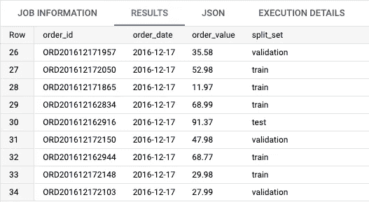

# 如何使用 SQL 在 BigQuery 中对数据集进行分割和采样

> 原文：<https://towardsdatascience.com/how-to-split-and-sample-a-dataset-in-bigquery-using-sql-a94fc05fdc71>

## 轻松地将数据划分为训练集、验证集和测试集

扎克·波特在 Unsplash[上的照片](https://unsplash.com?utm_source=medium&utm_medium=referral)

# 为什么要分割我们的数据集？

拆分数据意味着我们将把它分成子集。对于数据科学模型，数据集通常被划分为**两个**或**三个子集**:训练、验证和测试。

> 从创建模型到确保其性能，每个数据子集都有其用途。

不同细分市场的快速定义:

*   **训练**:本质上是我们用来训练模型的数据子集。
*   **验证**:当创建模型时，这用于改变或适应学习过程。它还有助于防止过拟合和微调输入参数。
*   **测试:**最后**，**我们确实需要一个数据子集来评估模型性能和结果。

## 分割尺寸和比例

为了决定每个子集的大小，我们经常会看到标准的规则和比率。您可能会遇到使用 **80 -20** **规则** (80%用于培训分割，20%用于测试分割)，或 **70-20-10 规则** (70%培训，20%验证，10%测试)等分割的情况

关于什么是最佳分割已经有过一些讨论，但总的来说，我建议记住，没有足够的数据，无论是训练集还是验证集，都将导致模型难以学习/训练，或者您将难以确定该模型实际上是否表现良好。

值得注意的是，不一定非要做三段。在 BigQuery 中，您通常只能生成训练和测试子集，因为可以在使用`DATA_SPLIT`选项创建模型时处理验证。

<https://cloud.google.com/bigquery-ml/docs/reference/standard-sql/bigqueryml-syntax-create-glm#data_split_method>  

## 陷阱和注意事项

在分割数据集之前，您应该了解一些常见的陷阱:

*   **低质量数据**:如果用来创建你的模型的输入数据是嘈杂的或者不可信的，那么模型的输出很可能反映了这一点。
*   **过度拟合**:当输入数据不足时，模型可能会学习训练数据，以至于任何噪声或波动都被认为会导致不可靠的预测。
*   **不平衡数据集:**假设您想要训练一个预测客户购买的模型，但是您有 50 万个非购买者和 300 个购买者，您将首先需要创建一个更加平等的数据集(使用**重采样**技术)。探索性数据分析( **EDA** )将有助于发现不平衡的数据。
*   **数据泄漏:**它描述了在创建训练数据集之前或甚至在拆分期间(例如，当同一天的事件可能相关时，按日期拆分数据)输入数据已被操纵(缩放、转换)的事实，导致模型不能反映现实。

# 使用 SQL 拆分数据集

对于我们的实验，我们有下面的数据集，由 **11k 行**和三个字段组成，一个订单 ID、一个日期和一个关联的订单值。

我们将把这个表分成训练和测试子集。(图片由作者提供)

## 选择要拆分的右列

为了进行适当的拆分，使用一列来单独区分你的基表的每一行。如果不是这样，就很难创建一个均匀分布的分割，并且可能会使分割的随机性产生偏差。

为了实现独特性，我们有几个选项，您将在我们即将推出的实践示例中看到:

*   我们可以创建一个具有唯一值的新字段(例如一个随机数生成器函数，如`RAND()`或`UUID()`
*   我们可以创建单个已经唯一的字段的散列，或者创建一个唯一的行标识符的字段组合的散列。

对于第二个选项，你最常听说的散列函数是`FARM_FINGERPRINT()`。

但是，**为什么是这个**而不是其他的比如`MD5()`或者`SHA()`？

这是由于**的两个特点**。首先，对于相同的输入，它总是给出相同的结果，其次，它返回一个`INT64`值(本质上是一个数字，而不是数字和字符的组合)，我们可以用其他数学函数(如`MOD()`来控制它，以产生我们的分割比。

## 创建唯一的行标识符

要创建唯一的行标识符，可以使用`FARM_FINGERPRINT()`函数。为了详细说明这个过程，下面是一行中的单个列和所有列的组合的每个转换步骤:

最后，我们将在数据集中继续拆分的是最后一列(我们称之为`hash_abs_mod`的列)。下表从左到右简单说明了哈希过程的每个步骤。

哈希和模函数对我们的基表的影响。(图片由[作者](https://romaingranger.medium.com/))

在我们的基表中，我们已经为每一行准备了一个惟一的值标识符，这就是我们的`order_id`字段。在这种情况下，我们可以散列它，然后使用`ABS(MOD(x,10))`函数将每一行分类到从 0 到 9 的桶中。

要创建整行(即所有列)的散列，最好的方法是首先标记您的表(我们称之为`bt`)，然后使用`TO_JSON_STRING(bt)`将其转换为 JSON 对象。然后可以对此进行哈希运算。这个方法的唯一目标是帮助您避免出现重复的行，这些行将总是以相同的分割结束，并偏向随机方面。

## 创建不可重复的拆分

要随机分割一个数据集，我们可以使用`RAND()`函数。这将为每一行返回一个伪随机十进制数，区间为[0–1]，包括 0，不包括 1。

该函数确实为**提供了均匀分布，**这意味着我们可以**过滤所有小于 0.8 的值，例如**，而**将代表我们数据**的 80%** 。**

但是请记住，每次运行查询时，该函数将返回不同的数字，因此您的训练集和测试集将会不同。如果您想让结果持久化，您可以通过将查询结果存储为一个表来制作快照。

让我们随机划分 80%的培训和 20%的测试:

您可以在结果中看到，我们确实有一个由我们的`RAND()`函数生成的具有许多小数的数字，以及由我们的`IF()`语句给出的标签(train/test)。

但是，请记住，如果不按原样存储结果，您将无法复制完全相同的分割。

使用 RAND()分为训练和测试。(图片由[作者](https://romaingranger.medium.com/)提供)

## 创建可重复的拆分

为了创建一个可以重用的**分割，最好是使用`MOD()`和`FARM_FINGERPRINT()`功能的**组合**，因为对于相同的输入，输出将保持不变。**

让我们使用我们的唯一键(`order_id`字段)。我们可以使用具有以下范围的 CASE WHEN 语句进行 80/10/10 可重复拆分:

分成 3 个子集(培训、验证和测试)

结果将与我们之前的不可重复分割相同，除了这个查询将**总是产生相同的分割**(train、validation 和 test 的分配将总是进入相同的行)。

使用 MOD()和 FARM_FINGERPRINT()分为训练、验证和测试。(图片由[作者](https://romaingranger.medium.com/)

## 结论和补充说明

你现在知道如何将你的数据集分割成子集，以可重用或不可重用的方式。因此，我们没有涵盖时间方面，例如，当在**日期字段**上拆分时。

这在为时序预测或回归模型定型时很常见，这意味着您可能希望保留日期的顺序。这也意味着您必须验证哪个**时间范围覆盖了您基础数据的 80%** (在 80/20 分割的情况下)。

此外，具有相同日期的行往往是相关的(某一天发生的事件可能会影响同一天的事件)，这就是为什么这些行应该保留在同一个拆分中。您还需要小心丢失的数据和数据质量，并且排除一些由于异常或季节性的数据。