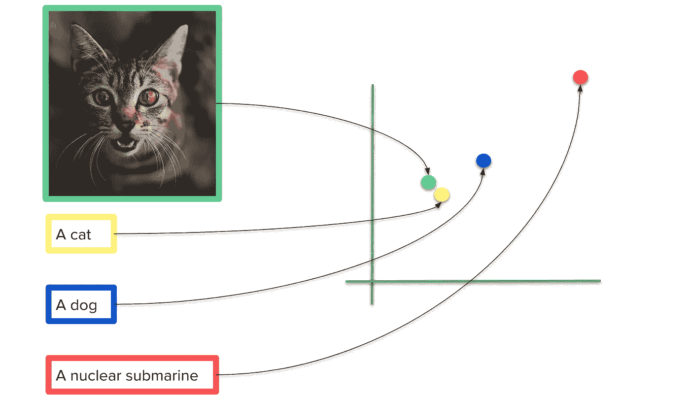
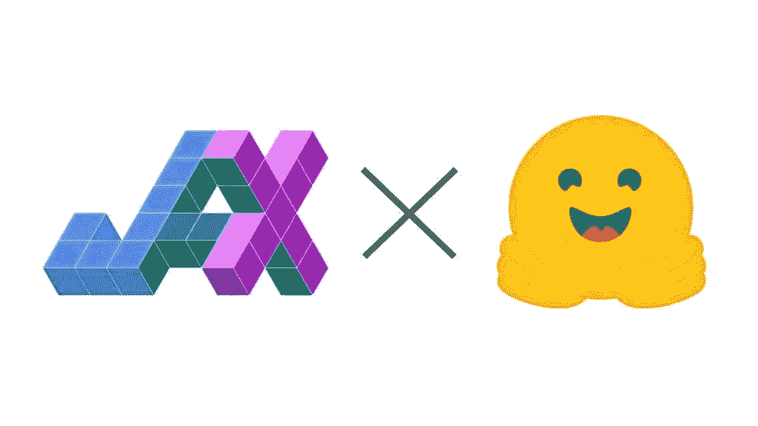
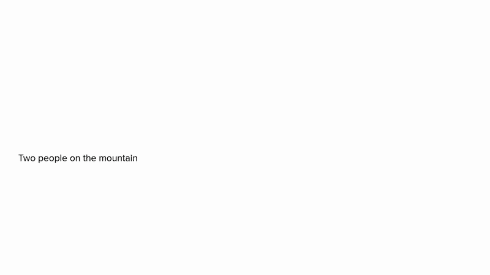
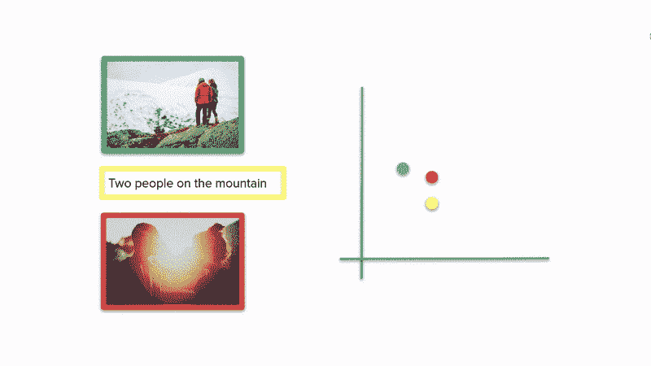
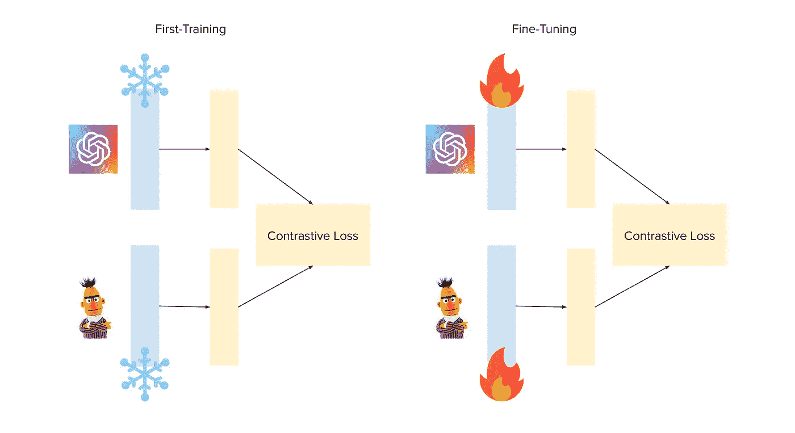
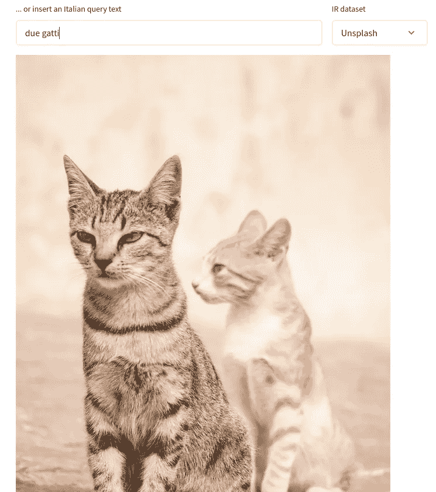
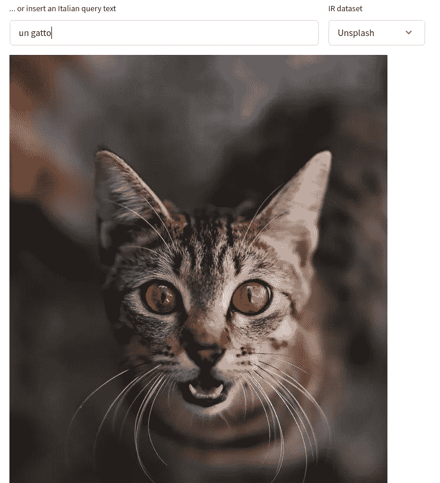

# 如何训练你的剪辑

> 原文：<https://towardsdatascience.com/how-to-train-your-clip-45a451dcd303>

## 介绍 CLIP 以及我们如何针对意大利语对其进行微调

CLIP 在向量空间中嵌入图像和文本。作者提供的图片(图片来自免费的 Unsplash 数据集)。

在 7 月份，HuggingFace 和谷歌组织了一次联合社区周，感兴趣的人可以利用谷歌 TPUs 来试验他们喜欢的项目(也可以使用 JAX 图书馆)。

jax-亚麻拥抱脸社区周标志。

我将要描述的项目始于这个[线程](https://discuss.huggingface.co/t/clip-like-contrastive-vision-language-models-for-italian-with-pre-trained-text-and-vision-models/7268)，是一个关于多模态(图像和文本)表征学习的简单实验。然而，事实证明，就结果而言，该项目的影响比我们预期的要有趣得多。

> 我说“我们”是因为如果没有我出色的队友们，这个项目就不可能完成:[拉斐尔](https://www.rpisoni.dev/)[西尔维亚](https://silviatti.github.io/)[加布里埃尔](https://gsarti.com/)[斯里](https://sites.google.com/view/srilakshmi/home)和达里奥。

我们从剪辑模型开始，这是一个非常强大的模型，可以联合学习文本和图像的表示。剪辑是有用的许多任务，如图像检索和零镜头图像分类。对于后者，CLIP 能够匹配并击败许多监督图像分类模型，而无需查看原始训练集的一个示例。

显然，如果没有 HuggingFace 和 Google 提供的资源和帮助，这是不可能的。

一些快速链接:

*   [我们的 GitHub 资源库](https://github.com/clip-italian/clip-italian/)，在这里你可以找到我们的培训脚本
*   [我们的型号](https://huggingface.co/clip-italian/clip-italian)在 HuggingFace hub 上
*   [我们的论文](https://arxiv.org/pdf/2108.08688.pdf)
*   你可以玩我们的演示来评估意大利的能力

## 今天的计划

在本文中，我将首先对 CLIP 的工作原理进行概述(第 1 节)。我将努力保持高层次的抽象，但同时，我将努力分享理解这个模型如何工作所需的所有信息。之后，我将更详细地描述我们如何训练它来覆盖意大利语(第 2 节)。

如果你喜欢视频格式，我九月份在 LightOn AI 做了一个演讲，你可以在这里找到视频:

# **第 1 部分—剪辑准备工作**

[对比语言-图像预训练](https://openai.com/blog/clip/) (CLIP)是 OpenAI 最近提出的一种模型，用于联合学习图像和文本的表示。在纯粹的自我监督形式中，CLIP 只需要输入图像-文本对，它将学习将两者放在同一个向量空间中。剪辑需要训练图像和这些图像的标题。

## 编码

CLIP 背后的假设非常简单:您需要一个图像编码器和一个文本编码器。其中的每一个都将生成一个向量(一个用于图像，一个用于文本)。

图像编码器可以使用视觉转换器或 CNN 构建，使用什么并不重要(是的，选择会影响性能，但想法是一样的)。

图片作者。使用免费的 Unsplash 数据集。我们使用图像编码器从图像中生成矢量表示。

要嵌入文本数据，您可以使用转换器(例如，预训练的 BERT 模型)或您喜欢的任何其他类型的文本编码方法。

图片作者。使用免费的 Unsplash 数据集。我们使用文本编码器从一个句子中生成一个向量表示。

## 训练剪辑模型

关于 CLIP 最重要的事情是，它将图像和字幕的编码表示(即我们上面看到的向量)放在同一个向量空间中，并将“匹配”的字幕-图像对放在空间中。例如，像这样(我使用 2D 表示，但这也适用于 N 维):

图片作者。使用免费的 Unsplash 数据集。剪辑目的是使图像-文本对在空间上接近。

CLIP 训练背后的直觉可以用下面的 GIF 简单总结一下。在训练期间，图像和描述它们的标题被放在向量空间中，而不匹配的图像(或标题)被推开。

图片作者。使用免费的 Unsplash 数据集。训练过程旨在将匹配的图像-文本对放在一起，并远离其他一切。

现在我们可以把所有东西放在一起。在下面的 GIF 中，你可以看到训练是如何完成的，我们有两张图片和两个标题，我们知道每张图片的“正确”标题。我们可以为两个图像和两个标题创建嵌入，并计算各自的相似性。我们希望匹配的图像-标题对之间的相似度(点积)上升，而不匹配的图像-标题对之间的相似度下降。

图片作者。使用免费的 Unsplash 数据集。GIF 更详细地展示了训练过程。我们从成批的图像和文本对开始，并且我们最大化匹配的图像-文本对之间的相似性(并且最小化不匹配的图像-文本对)。

使用这个过程，我们学会了在匹配图像-文本对的向量空间中放得很近，而将其他所有东西移得很远。

## 为什么 CLIP 很酷？

CLIP 非常有趣，因为在没有任何实际监督的情况下(如果我们忽略图像和标题之间的匹配)，将图像和文本放在同一个空间会带来有趣的可能性。最有趣的一个可能是零镜头分类:如果您可以访问一幅图像和一组标签(任何种类的标签)，您可以看到哪个标签与您作为模型输入的图像最相似。

看了下面的动画，大概的思路应该更清晰了:

图片作者。使用免费的 Unsplash 数据集。当投影到空间中时，猫的图像和标签“猫”将是接近的(考虑空间中的一些距离度量)。

CLIP 在没有看到一个训练样本的情况下，在 ImageNet 等数据集上显示出令人难以置信的零拍摄性能。你可以在[原文](https://arxiv.org/abs/2103.00020)中读到更多这方面的内容。

# 第 2 部分—剪辑—意大利语

通过我们的项目，我们试图为意大利 NLP 和 CV 社区提供另一种资源。我们的模型是第一个为意大利语制作的剪辑模型。

为了用意大利语训练剪辑，我们需要一样东西:数据。特别是，我们需要带有说明文字的图片。虽然我们有英语资源，但意大利语就没那么幸运了。

## 数据集

我们考虑了三个主要的数据来源:

*   [WIT](https://github.com/google-research-datasets/wit) 是从维基百科收集的图片说明数据集(参见， [Srinivasan 等人，2021](https://arxiv.org/pdf/2103.01913.pdf) )。我们重点关注论文中描述的*参考描述*标题，因为它们是质量最高的。尽管如此，许多这些标题描述本体论的知识和百科全书的事实(例如，罗伯托·巴乔在 1994 年)。
*   [MSCOCO-IT](https://github.com/crux82/mscoco-it) 。这个图像字幕数据集来自于 [Scaiella 等人的工作，2019](http://www.ai-lc.it/IJCoL/v5n2/IJCOL_5_2_3___scaiella_et_al.pdf) 。字幕来自原始的 MSCOCO 数据集，已经用 Microsoft Translator 进行了翻译。2017 版的 MSCOCO 训练集包含超过 100K 幅图像，每幅图像都有多个字幕。
*   [概念说明](https://ai.google.com/research/ConceptualCaptions/)。这个图像字幕数据集来自于 [Sharma 等人的工作，2018](https://aclanthology.org/P18-1238.pdf) 。在这个数据集中有超过 3 百万个图像-标题对，这些都是从网上收集的。我们用数据集提供的 URL 下载了图像，但我们无法全部检索到它们。最终，我们不得不将字幕翻译成意大利语。我们已经能够收集具有 70 万翻译字幕的数据集。

虽然翻译后的标题在某种程度上是一种限制，但它们看起来质量很好(我们运行了一个小型的手工评估管道来检查质量，注释者之间达成了良好的一致)。

## 培训/建筑

你可以在我们的 [GitHub 库](https://github.com/clip-italian/clip-italian/)上找到更多关于我们如何训练意大利语剪辑的细节。感谢 HuggingFace 脚本，这很容易做到，我们基本上只需要改变一些超级参数。

我们考虑的架构使用来自 CLIP 的原始图像编码器，而不是作为文本编码器，我们使用意大利 BERT 模型(因为我们需要创建意大利嵌入)。OpenAI 使用的视觉转换器已经在 4 亿张图像上进行了训练，它可能是我们架构中需要训练最少的元素。

然而，由于我们不是从原始分量开始(BERT 是新增加的)，投影不再对齐(即，BERT 编码投影到向量空间的完全不同的区域)。这需要在训练中小心，不要弄乱预训练组件的重量。

为了允许随机初始化的重投影层预热，而不干扰主干的调整权重，我们决定在我们架构的主干完全冻结的情况下进行第一次训练。只有在这些层融合后，我们才解冻模型的其余部分，以微调所有组件。这种技术允许我们达到更好的验证损失。

蓝色层是编码层，我们有一个额外的层用于 512 维的投影，那是我们为训练热身的层。图片由作者提供。

只要你有数据和一些计算资源，训练 CLIP 并不是不可能完成的任务。运行提供的训练脚本就足够了。最近，HuggingFace 开发了一个易于使用的管道来玩 [VisionTextEncoders](https://huggingface.co/docs/transformers/model_doc/visionencoderdecoder) ，如果你对这一领域的研究感兴趣，你可能会想考虑一下。

你可以在我们的 [GitHub 库](https://github.com/clip-italian/clip-italian/)上找到一些关于我们如何评估这个模型的细节。长话短说，对于两个不同的任务(图像检索和零镜头图像分类)来说，使用特定于语言的模型比使用多语言剪辑要好(尽管多语言剪辑由于其他原因非常酷)。

## 例子

在这里，我将展示一些来自我们在线[演示](https://huggingface.co/spaces/clip-italian/clip-italian-demo/)的例子。

《山上的两个人》。来自 Unspash free 数据集的图像。

关于“数猫”的几个例子

“两只猫”和“一只猫”。来自 Unspash free 数据集的图像。

有趣的是，这个模型似乎能够计数。这显然来自训练数据，显示了其中的一些模式，但值得注意的是，该模型可以学习识别图片中的多个对象(然而，请注意，这并不能很好地扩展:对于像“四只猫”和“五只猫”这样的数字，结果就不太清楚了)。

## 如何使用剪辑-意大利语

你想自己玩这个吗？我们为你做好了准备，这是朱塞佩为你准备的笔记本，在 PyTorch。[打开可乐杯](https://colab.research.google.com/drive/1SSddpjohAqRS_XxJvwz5HN1YFPevVJmy?usp=sharing)。

为了向您展示使用它是多么容易，我将在这里分享一些代码行，您可以使用它们来加载模型和生成嵌入。

我们现在可以很容易地使用它，你可以看到一个如何嵌入文本的例子，但正如我所说的，你可以在 colab 笔记本上找到一切:

你可以对图片做同样的事情，计算图片和文本之间的相似度。

## 结论

剪辑-意大利一直是一个惊人的冒险。发现和学习了许多乐趣和新事物。一个惊人的项目和一个惊人的机会，为此我们必须感谢谷歌和 HuggingFace 为实现这个项目所做的努力。