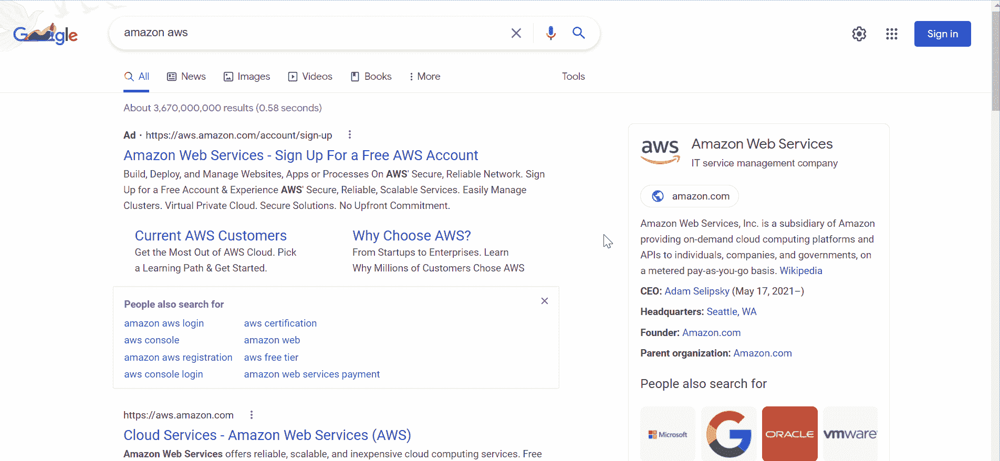
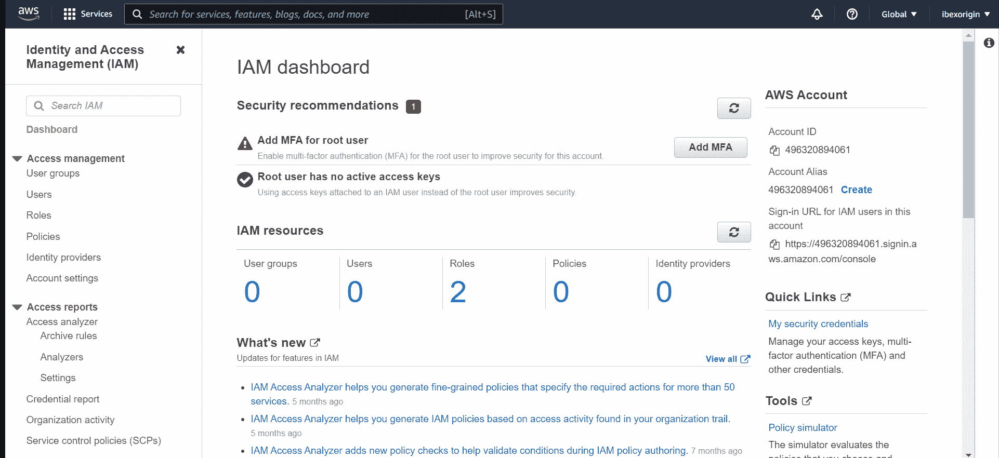
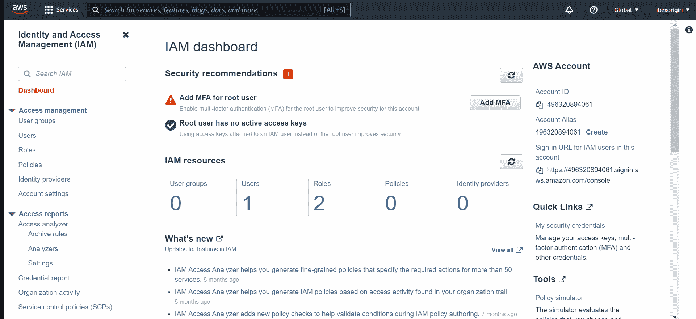
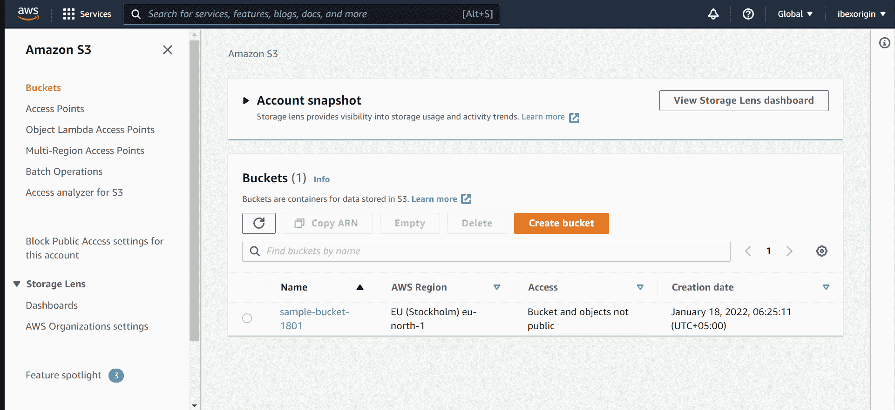
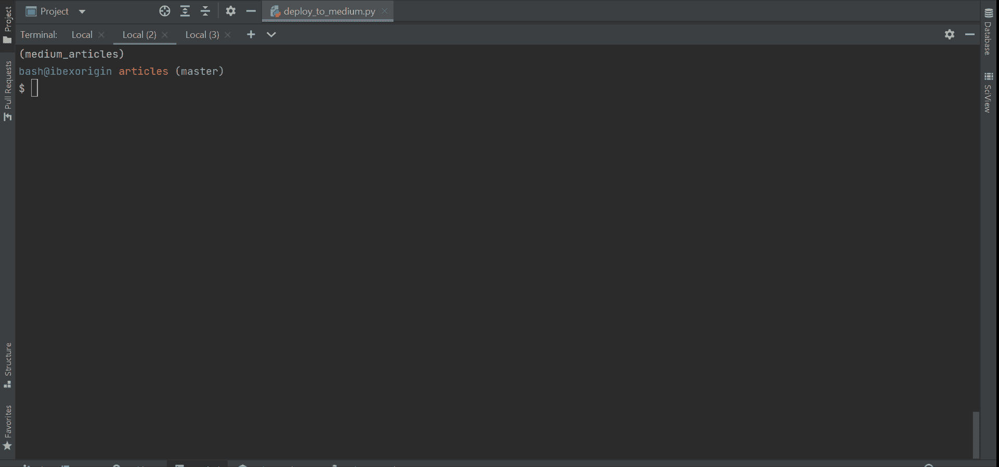
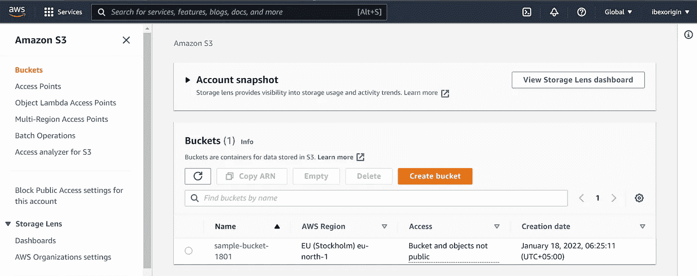
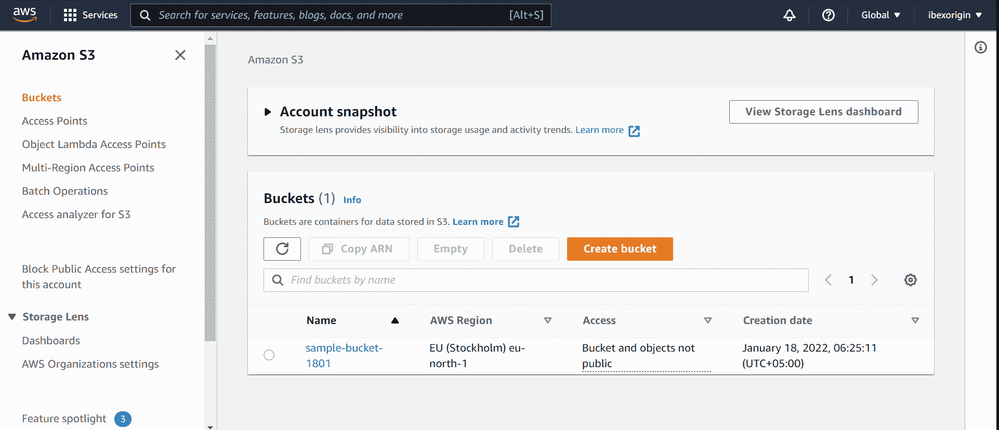
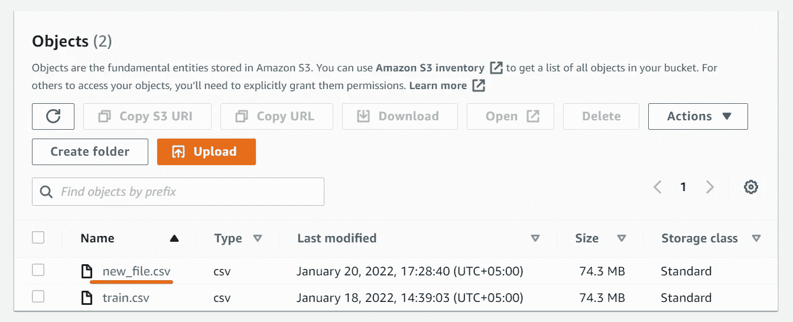

# 如何使用 Python (2022)从 S3 自动气象站上传和下载文件

> 原文：<https://towardsdatascience.com/how-to-upload-and-download-files-from-aws-s3-using-python-2022-4c9b787b15f2>

## 了解如何在 Python 脚本中使用云资源

**照片由** [**拉杰史蒂文**](https://www.pexels.com/@rjstvn?utm_content=attributionCopyText&utm_medium=referral&utm_source=pexels) **发自** [**像素**](https://www.pexels.com/photo/silhouette-of-people-on-beach-during-sunset-5293740/?utm_content=attributionCopyText&utm_medium=referral&utm_source=pexels)

我写这篇文章完全是出于沮丧。

我读过的每个关于这个话题的帖子都假设我已经在 AWS 有了一个账户，一个 S3 桶，和一堆存储的数据。他们只是展示代码，但善意地掩盖了最重要的部分——让代码通过你的 AWS 账户工作。

嗯，我应该很容易就能猜出密码，非常感谢。我不得不筛选许多 SO 线程和 AWS 文档，以消除一路上的每一个令人讨厌的认证错误。

为了让您不会有同样的感觉并做艰苦的工作，我将分享以编程方式管理 S3 存储桶的所有技术细节，从创建帐户到向本地机器添加访问 AWS 资源的权限。

<https://ibexorigin.medium.com/membership>  

获得由强大的 AI-Alpha 信号选择和总结的最佳和最新的 ML 和 AI 论文:

<https://alphasignal.ai/?referrer=Bex>  

## 步骤 1:设置帐户

好的，如果你还没有 AWS 账户，让我们从创建账户开始。没什么特别的，只要按照这个[链接](https://aws.amazon.com/free/?trk=ps_a131L0000085EJvQAM&trkCampaign=acq_paid_search_brand&sc_channel=ps&sc_campaign=acquisition_US&sc_publisher=google&sc_category=core-main&sc_country=US&sc_geo=NAMER&sc_outcome=acq&sc_detail=aws&sc_content=Brand_Core_aws_e&sc_segment=432339156150&sc_medium=ACQ-P%7CPS-GO%7CBrand%7CDesktop%7CSU%7CCore-Main%7CCore%7CUS%7CEN%7CText&s_kwcid=AL!4422!3!432339156150!e!!g!!aws&ef_id=EAIaIQobChMIxa2ogpvA9QIVxP7jBx2iAwgNEAAYASAAEgJGR_D_BwE:G:s&s_kwcid=AL!4422!3!432339156150!e!!g!!aws&all-free-tier.sort-by=item.additionalFields.SortRank&all-free-tier.sort-order=asc&awsf.Free%20Tier%20Types=*all&awsf.Free%20Tier%20Categories=*all)中的步骤操作就可以了:

作者 GIF

然后，我们将前往 [AWS IAM(身份和访问管理)控制台](https://console.aws.amazon.com/)，在那里我们将完成大部分工作。

作者 GIF

您可以轻松地在不同的 AWS 服务器之间切换，创建用户，添加策略，并允许从控制台访问您的用户帐户。我们将一个接一个地做。

## 步骤 2:创建用户

对于一个 AWS 帐户，您可以创建多个用户，每个用户都可以对您的帐户资源拥有不同级别的访问权限。让我们为本教程创建一个示例用户:

作者 GIF

在 [IAM 控制台](https://console.aws.amazon.com/)中:

1.  转到用户选项卡。
2.  点击添加用户。
3.  在字段中输入用户名。
4.  勾选“访问键—编程访问字段”(必要)。
5.  单击“下一步”和“直接附加现有策略”
6.  勾选“管理员访问”策略。
7.  单击“下一步”,直到看到“创建用户”按钮
8.  最后，下载您的用户凭证的给定 CSV 文件。

它应该是这样的:

作者:me🥱

请将它保存在安全的地方，因为我们稍后会使用这些凭据。

## 步骤 3:创建一个存储桶

现在，让我们创建一个 S3 存储桶来存储数据。

作者 GIF

在 [IAM 控制台](https://console.aws.amazon.com/)中:

1.  单击左上角的服务。
2.  向下滚动到“storage ”,并从右侧列表中选择“S3”。
3.  单击“创建存储桶”并给它命名。

你可以选择任何你想要的地区。保留其余设置，再次单击“创建存储桶”。

## 步骤 4:创建一个策略并将其添加到您的用户

在 AWS 中，通过策略来管理访问。策略可以是一组设置或附加到 AWS 对象(用户、资源、组、角色)的 JSON 文件，它控制您可以使用对象的哪些方面。

下面，我们将创建一个策略，使我们能够以编程方式与我们的存储桶进行交互，即通过 CLI 或在脚本中进行交互。

作者 GIF

在 [IAM 控制台](https://console.aws.amazon.com/)中:

1.  转到“策略”选项卡，然后单击“创建策略”
2.  单击“JSON”选项卡并插入下面的代码:

用你自己的桶名替换你的桶名。如果您注意的话，在 JSON 的 Action 字段中，我们将`s3:*`放在我们的 bucket 中以允许任何交互。这非常宽泛，因此您可能只允许特定的操作。在这种情况下，查看 AWS 文档的[这一页](https://docs.aws.amazon.com/IAM/latest/UserGuide/reference_policies_examples_s3_rw-bucket-console.html)来学习限制访问。

这个策略只附加到 bucket，我们还应该将它连接到用户，这样您的 API 凭证才能正常工作。以下是说明:

作者 GIF

在 [IAM 控制台](https://console.aws.amazon.com/)中:

1.  转到 Users 选项卡，单击我们在上一节中创建的用户。
2.  单击“添加权限”按钮。
3.  单击“附加现有策略”选项卡。
4.  根据我们刚刚创建的策略对它们进行筛选。
5.  勾选策略，检查并最后一次点击“添加”。

## 步骤 5:下载 AWS CLI 并配置您的用户

我们下载 AWS 命令行工具，因为它使认证变得非常容易。请转到[此页面](https://aws.amazon.com/cli/)并下载适用于您平台的可执行文件:

作者 GIF

运行可执行文件并重新打开任何活动的终端会话，以使更改生效。然后，键入`aws configure`:

作者 GIF

插入您的 AWS 密钥 ID 和秘密访问密钥，以及您创建 bucket 的区域(使用 CSV 文件)。您可以在控制台的 S3 页面上找到您的存储桶的区域名称:

被我。

当您到达配置中的默认输出格式字段时，只需单击“Enter”即可。不会有任何输出。

## 第六步:上传你的文件

我们快到了。

现在，我们将一个样本数据集上传到我们的 bucket，以便以后可以在脚本中下载它:

作者 GIF

一旦你进入 S3 页面，打开你的水桶，这应该很容易。

## 步骤 7:检查身份验证是否有效

最后，pip 安装 [Boto3 包](https://boto3.amazonaws.com/v1/documentation/api/latest/index.html)并运行以下代码片段:

如果输出包含您的 bucket 名称，那么恭喜您——您现在可以通过`boto3`完全访问许多 AWS 服务，而不仅仅是 S3。

## 使用 Python Boto3 从 S3 桶下载文件

有了 Boto3 包，您可以通过编程访问许多 AWS 服务，如 SQS、EC2、SES 和 IAM 控制台的许多方面。

然而，作为一名普通的数据科学家，您通常需要从 S3 存储桶上传和下载数据，因此我们将只讨论这些操作。

让我们从下载开始。导入包后，使用`client`函数创建一个 S3 类:

要从 S3 存储桶下载文件并立即保存，我们可以使用`download_file`功能:

如果下载成功，将不会有任何输出。您应该把要下载的文件的确切路径传递给`Key`参数。`Filename`应该包含您想要保存文件的路径。

上传也非常简单:

该功能为`upload_file`，您只需更改下载功能中参数的顺序。

## 结论

我建议阅读 [Boto3 文档](https://boto3.amazonaws.com/v1/documentation/api/latest/index.html)以获得更多管理 AWS 资源的高级示例。它涵盖了除 S3 之外的服务，并包含了每种服务最常见任务的代码配方。

感谢阅读！

**您可以使用下面的链接成为高级媒体会员，并访问我的所有故事和数以千计的其他故事:**

<https://ibexorigin.medium.com/membership>  

**或者直接订阅我的邮件列表:**

<https://ibexorigin.medium.com/subscribe>  

## 你可以通过 LinkedIn 或 T2 Twitter 与我进行友好的交流。或者你可以读我的另一个故事。这些怎么样:

</8-booming-data-science-libraries-you-must-watch-out-in-2022-cec2dbb42437>  </how-to-get-started-on-kaggle-in-2022-even-if-you-are-terrified-8e073853ac46>  </7-cool-python-packages-kagglers-are-using-without-telling-you-e83298781cf4>  </22-2-built-in-python-libraries-you-didnt-know-existed-p-guarantee-8-275685dbdb99>  </good-bye-pandas-meet-terality-its-evil-twin-with-identical-syntax-455b42f33a6d>  </6-pandas-mistakes-that-silently-tell-you-are-a-rookie-b566a252e60d>  </8-booming-data-science-libraries-you-must-watch-out-in-2022-cec2dbb42437> 