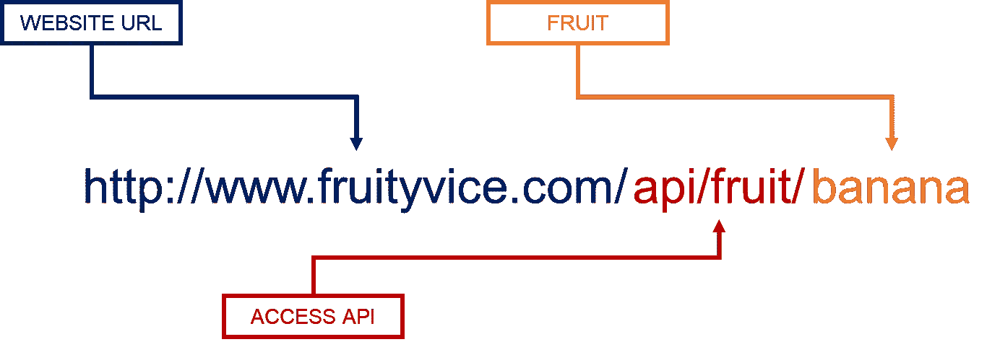
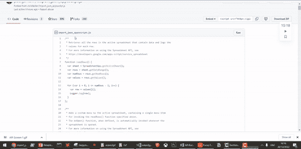

# 如何在不编码的情况下使用 API

> 原文：<https://towardsdatascience.com/how-to-use-an-api-without-coding-44a324a7c560>

## 对于没有任何编码经验的用户，这是一个使用 Google Sheets 连接到任何 API 的无代码方法


约纳斯·勒普在 [Unsplash](https://unsplash.com?utm_source=medium&utm_medium=referral) 上拍摄的照片

在计算机科学中，应用编程接口(API)是几个程序相互通信的一种方式。

如果你的编码经验有限，可能你自己都没用过。然而，你可以确定你的智能手机或电脑上的应用程序正在使用 API。

即使你是一个人，你也可以找到许多有趣的 API，它们可以提高你的生产力，带来一些乐趣或者只是解决你的一些日常问题。

在本文中，我将分享两种方法来连接并自动从 API 获取数据，而无需使用 Google Sheets 编写代码。

💌新文章免费直入你的收件箱:[时事通讯](https://www.samirsaci.com/#/portal/signup)

如果你喜欢观看，可以看看这个教程的视频版本

# 如何不用编码连接一个 API？

## 最终解决方案

最终的解决方案将看起来像下面的动画 GIF。通过电子表格软件(Google Sheets 或 Excel)中的一个简单公式，你可以从任何 API 中提取数据。


演示—(图片由作者提供)

## 例子

在本文中，我将使用一个非常酷的 API FruityVice 来提供关于水果的信息。

查看[文档](https://www.fruityvice.com/)了解更多信息。


(图片由作者提供)

在第一栏中，您可以找到我们想要了解的水果清单。我们调用 API 来获取:

*   第一列中的姓氏
*   第二栏是脂肪含量
*   第三列中的糖量

然后，我们只需要放一个公式来调用单元格 B2 中的 API，并沿着列拖动它以获得完整的范围。

# 履行

## 调用 API，获得响应并过滤

为了调用 API，您需要按照下面的语法向 API 发送 get 请求。



API 调用—(图片由作者提供)

它不需要任何 API 键，因此我以它为例:

*   蓝色部分是网站的地址:你可以去那里查看文档
*   红色部分将让您访问 API
*   橙色部分是您需要唯一输入参数的地方:英文水果名称

它将以 JSON 格式返回一个响应，

```
{
 “genus”: “Musa”,
 “name”: “Banana”,
 “id”: 1,
 “family”: “Musaceae”,
 “order”: “Zingiberales”,
 “nutritions”: {
 “carbohydrates”: 22,
 “protein”: 1,
 “fat”: 0.2,
 “calories”: 96,
 “sugar”: 17.2
 }
 }
```

我们需要理解 API 响应的构造方式来提取我们想要的信息，


API JSON 响应—(图片由作者提供)

我们感兴趣的是，

*   【家庭】:水果
*   “营养/脂肪”:脂肪量
*   “营养/糖”:糖的数量

## 添加一个函数来读取 JSON: importJSON

为了执行查询和解析 JSON，我们将在 [GitHub 库](https://gist.github.com/paulgambill/cacd19da95a1421d3164?ref=hackernoon.com)中导入一个由 **paulgambil** 共享的函数。*(请为这个非常有用的功能:D 给他一颗星)*



按照步骤操作—(图片由作者提供)

*   从 GitHub 库中获取代码并复制它
*   转到谷歌表单的扩展菜单
*   创建一个新脚本，并将其命名为 importJSON.gs

现在你的函数 *importJSON* 可用了。

## 解析 API JSON 响应

**编写查询** 现在可以开始编写单元格中的公式 B2、

```
=importJSON("https://www.fruityvice.com/api/fruit/"&A2;"/family,/nutritions/fat,/nutritions/sugar"; "noHeaders,Truncate")
```

```
- We take the fruit name in the cell A2
/family, nutritions/fat, nutritions/sugar: specify the three information we want to get from the API response
```

**拖动公式** ，拖动到列尾后，函数 importJSON 会自动粘贴右边单元格中的值。


整个过程—(图片由作者提供)

你可以在我的 Youtube 频道上找到更多的生产力技巧和 google sheets 教程

[](https://youtube.com/@productivedata) [## 生产数据

### 在这个频道，我分享了如何使用数据分析、python 或任何其他编程语言来自动化无聊的技巧…

youtube.com](https://youtube.com/@productivedata) 

# 后续步骤

关注我的媒体，获取更多与数据分析和供应链管理相关的文章

## 从 URL 导入表

在这个简短的教程中，我分享了另一种从 URL 中提取数据的方法。

## 为什么不 Excel？

Excel 有自己的函数来执行名为 WEBSERVICE 的 API 查询。但是没有内置函数解析 JSON 响应，所以你得想办法只用 Excel 公式来做(我个人不会)。

因此，我更愿意使用 Google Sheets。

## 用例

既然您可以使用 Google sheets 查询任何 API，那么您可以:

*   使用距离矩阵或地理编码 API 计算位置之间的距离
*   使用谷歌翻译 API 翻译任何单词
*   从像 pixabay 这样的股票服务中获取任何带有图片的图像

# 关于我

让我们在 [Linkedin](https://www.linkedin.com/in/samir-saci/) 和 [Twitter](https://twitter.com/Samir_Saci_) 上连线，我是一名[供应链工程师](https://www.samirsaci.com/about/)，正在使用数据分析来改善物流运营并降低成本。

如果你对数据分析和供应链感兴趣，可以看看我的网站

[](https://samirsaci.com) [## Samir Saci |数据科学与生产力

### 专注于数据科学、个人生产力、自动化、运筹学和可持续发展的技术博客

samirsaci.com](https://samirsaci.com)