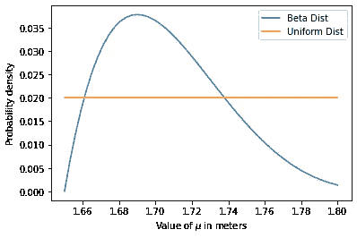
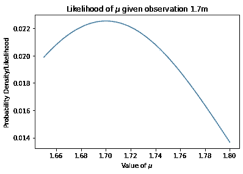
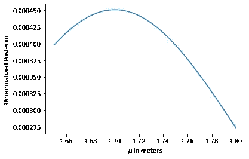
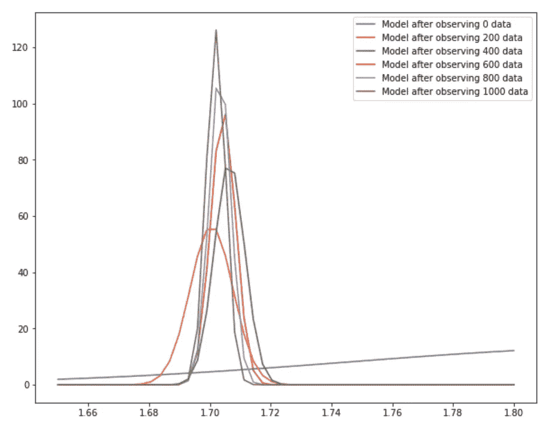
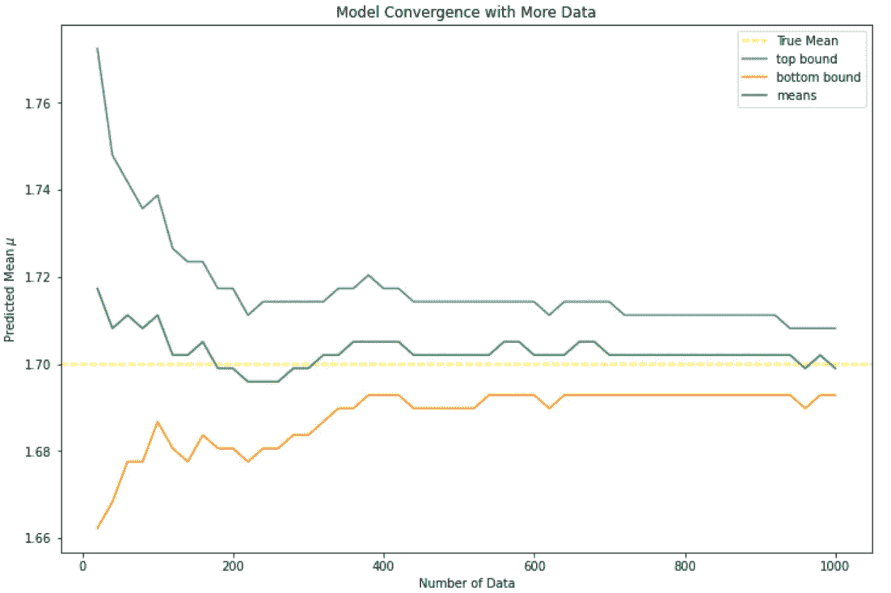
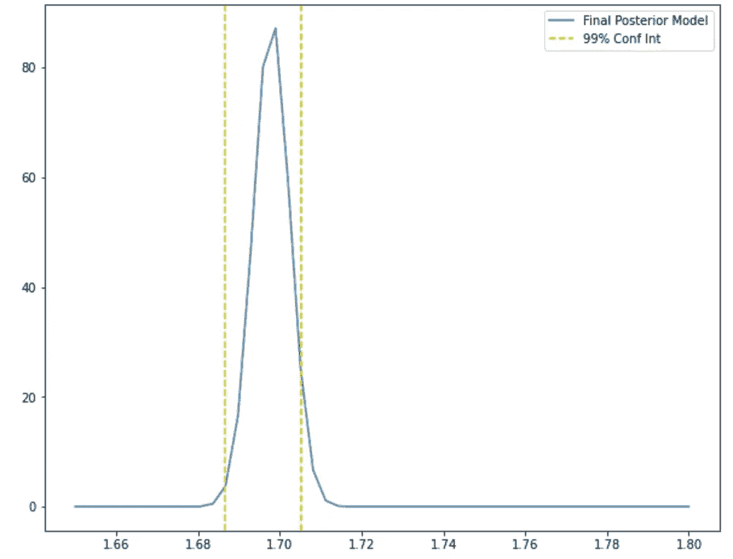

# 如何在 Python 中使用贝叶斯推理进行预测

> 原文：<https://towardsdatascience.com/how-to-use-bayesian-inference-for-predictions-in-python-4de5d0bc84f3>

图片由作者提供。

贝叶斯统计的美妙之处同时也是它最令人讨厌的特征之一:我们经常得到“嗯，这个数字介于……之间”的答案

一方面，这可能会让寻求直截了当的指导的商业战略家或决策者感到沮丧，但这也是一个了解你可能会犯多大错误的极好方法。

从一个简单的例子开始，假设我们的任务是找出高中教室里学生的身高分布。可能这个学校要求穿校服，校服公司希望对每个尺码的校服生产多少有所了解，了解身高分布可以让我们知道要做什么尺码。

# 贝叶斯推理基础

假设我们有一个变量， *h* ，表示这些学生的身高。如果我们想知道 *h* 是如何分布的呢？也就是说，我们可能已经有了一个分布的概念(身高通常是正态分布)，但是这个分布的参数是什么呢？我们为什么要在乎？我们关心这个是因为知道一个变量是如何分布的有助于我们预测新数据会是什么样子。例如，如果我们知道身高是正态分布的，我们就知道一个新的数据点很可能接近平均值(如果平均值是 1.75 米，那么我们希望新加入班级的学生的身高接近该平均值)。知道分布的参数也允许我们从中取样(因此我们可以创建一个“假”学生的样本，从而知道我们可能期望的每个身高的学生有多少)。因此，找到一个变量的分布有助于我们解决预测问题。

贝叶斯推理是一种计算变量分布的方法(比如身高分布 *h* )。贝叶斯推断的有趣特征是，由统计学家(或数据科学家)使用他们的先验知识作为一种手段来改进我们对分布情况的猜测。

贝叶斯推理依赖于贝叶斯统计的主要公式:贝叶斯定理。贝叶斯定理接受我们关于分布如何的假设，一个新的数据，并输出一个更新的分布。对于数据科学，贝叶斯定理通常是这样表述的:

统计学家还给这个定理的每个组成部分起了名字:

让我们复习一下，以便更好地理解它们。

# 院长

从贝叶斯定理可以看出，先验是一个概率:P(θ)。首先，我们来深入探讨一下‘θ’是什么意思。θ通常表示为我们对模型的假设，该模型最好地描述了我们试图研究的变量。让我们回到高度的例子。我们根据背景知识和常识推断，身高在一个班级中呈正态分布。形式上:

h∞N(μ，σ)

其中 N 表示正态分布，μ表示平均值，σ表示标准差。

现在，我们的先验并不完全是上面的表达式。相反，这是我们对参数μ和σ如何分布的假设。请注意，这是贝叶斯统计的定义特征出现的地方:我们如何找到这些参数的分布？嗯，有趣的是，我们基于我们先前的知识“编造”它们。如果我们有很少的先验知识，我们可以选择一个非常不提供信息的先验知识，这样就不会对整个过程产生偏见。例如，我们可以定义μ(平均高度)在 1.65 米和 1.8 米之间。如果我们想获得一个无信息的先验，我们可以说μ沿该区间均匀分布。相反，如果我们认为平均高度稍微偏向于更接近 1.65 米而不是 1.8 米的值，我们可以定义μ分布为β分布，由“超”参数α和β定义。我们可以看看下面这些选项:

图片由作者提供。

请注意 y 轴是如何给出“概率密度”的，即我们认为 x 轴上的μ是真实值的可能性有多大。此外，请注意，β分布和均匀分布会导致我们对μ值的不同看法。如果我们选择均匀分布，我们说我们没有倾向于μ是否接近我们范围内的任何值，我们只是认为它在那里的某个地方。如果我们选择β分布，我们相当确定μ的“真实”值在 1.68m 和 1.72m 之间，如蓝线的峰值所示。

注意，我们讨论的是μ的先验，但我们的模型实际上有两个参数:N(μ，σ)。一般来说，我们也可以定义σ上的先验。然而，如果我们对σ的猜测感到幸运，或者为了举例而想简化过程，我们可以将σ设置为固定值，比如 0.1m。

# 可能性

似然性表示为 P(Data|θ)。这种情况下的“数据”是高度的观测值。假设我们要测量一个随机挑选的学生，他们的身高是 1.7 米。考虑到这个数据，我们现在可以对θ的每个选项有多好有一个感觉。我们通过提问做到这一点:如果θ的一个特定选项，称之为θ1，是正确的，我们观察到 1.7 米高度的“可能性”有多大？θ2 怎么样:如果θ2 是“正确的”模型，观察到 1.7 米高度的可能性有多大？

事实上，我们在这一阶段需要的是一个函数，该函数将系统地查看模型θ的每一种可能性，并找到该模型“产生”或“预测”观察值的概率。请记住，在这种情况下，我们的模型θ定义为 N(μ，σ)，即具有均值μ和标准差σ的正态分布。我们还保持σ不变，以简化过程。因此，我们的函数将μ的可能值作为我们的“独立”变量，我们的观察数据点为 1.7m，它将输出每个模型是正确模型的概率作为我们的“因变量”。请注意，我们在这里遇到了一个小问题:一个特定模型是正确的“概率”在技术上是零，因为从理论上讲，θ的可能性是无限的。为此，我将θ的可能性离散化，使θ在 1.65 米和 1.8 米之间有 50 个选项。然后，我们使用每个建议模型的概率密度函数来评估特定模型的观测数据的概率密度。概率密度并不等同于概率，它只是给我们一个相对的度量，在给定每个模型选项的情况下，该点被观察到的可能性有多大。为了得到真实的概率，我们必须“标准化”概率密度，使得所有的值相加得到 1。

然而，这并没有什么大不了的，因为我们仍然可以比较每个模型的可能性。这就好像我们在问:将可能性限制在这个离散的模型集合中，这个集合在某种程度上全面地涵盖了似乎合理的可能性，哪个模型是最好的？然而，我们也要将概率密度标准化，正如你将在下面看到的。

这个函数被称为“可能性”函数，我们通常通过我们提出的模型的概率“密度”函数(PDF)来定义它，在新的数据点进行评估。因此，我们需要数据点 1.7m 的分布 N(μ，0.1m)的“PDF”

注意，对于以前用过 pdf 的人来说，这似乎有点落后。对于 pdf，我们通常有一个固定的模型，例如 N(1.8，0.1)，我们使用它来评估变量 *h* 的不同值的概率。这意味着我们会在 x 轴上有变量 *h* ，在 y 轴上有概率密度。

然而，出于我们当前的目的，我们正在改变发行版/模型本身。这意味着我们的 x 轴实际上会有变量μ的不同可能性，我们的 y 轴会有这些可能性的概率密度。看看下面的代码，它代表了我们的可能性函数及其可视化:

图片由作者提供。

看看我们的函数如何简单地告诉我们μ的哪些值最有可能？看看这如何让我们对概率有一个相对的理解，统计学家更喜欢称之为每个可能μ的“可能性”?通过对可能性的评估，我们可以先发制人地判断μ的“最佳”值可能是多少。然而，我们随后必须将它与先验结合起来，以获得关于μ的最佳值的最终“猜测”。

# 证据

一些统计学家称 P( *数据*)为“证据”。这个变量的含义非常简单:它是产生值*数据*的概率。然而，这很难直接计算。谢天谢地，我们有锦囊妙计。

考虑下面的表达式:

你能明白为什么有意义吗？直觉上，我们要说的是，如果我们要对每个假设θ的概率评估求和，我们会用尽所有的假设概率，我们应该只剩下 P(数据)。请注意，P(θ)是一个概率分布，如果我们将每个θ的所有输出相加，则 P(θ)等于 1。请注意,∫P(Data |θ)∫P(θ)dθ相当于求图的曲线下面积，其中 P(Data |θ)∫P(θ)在 y 轴上，θ在 x 轴上，下一步我们将完全这样做。

# 后面的

贝叶斯定理的右边 P(θ|数据)称为“后验”。这是我们对数据如何分布的事后理解，假设我们目睹了数据，并且我们有一个关于它的先验。

我们怎么找到后路？回到等式:

因此，第一步是将似然性(P(Data|θ))和先验(P(θ))相乘:

图片由作者提供。

我们可以看到，如果我们对非标准化后验概率密度求和，我们会得到一个不同于 1 的值:

请注意，我们仍然有“P(数据)”要处理，因此我称之为“非标准化后验数据”。

请记住上面的内容:

我们可以简单地计算这个积分，然后做最后的除法，我们得到后验概率。也就是说，多想想我们为什么要除以 P(数据)是件好事。请注意，计算 P(数据)等同于在上面的图表中找到未标准化的后验概率和 x 轴之间的面积。同样，因为后验概率分布是一个概率分布，所以后验概率密度函数所包围的面积总和必定是 1。为了确保这一点，我们必须找出曲线下的当前面积，然后将每个数据点除以该数字。这给了我们规范化的版本！

此外，请注意，解析计算积分非常具有挑战性。相反，我们可以依靠使用 scipy 和“梯形”方法的近似值，只需要 x 轴和 y 轴的值来估计面积。这是我在下面使用的实现:

图片由作者提供。

我们能验证这个新图形代表一个有效的 PDF 吗？请记住，在这种情况下，图表下的面积总和必须为 1。我们可以快速计算要检查值:

# 改进模型

注意，到目前为止，我们的贝叶斯推断经历了以下步骤:

1.  定义我们的先验
2.  定义我们的可能性函数
3.  观察一个数据
4.  使用贝叶斯定理来寻找后验分布(并使用梯形规则来归一化后验分布)。

在实践中，我们不会就此止步:观察一个数据可能不足以让我们对我们的模型有高度的信心！贝叶斯推理背后的思想是，它是迭代的，每个新的观察使我们更好地了解我们感兴趣的变量的“真实”分布。

那么，我们如何前进呢？接下来的步骤是:

1.  观察新的数据点。
2.  采用我们刚刚找到的后验概率，并将其作为我们的新先验概率！
3.  使用相同的旧的似然函数，在给定这个新观察到的数据点的情况下，评估我们不同假设的似然性。
4.  将我们新的先验值和似然值相乘，得到非标准化后验值。使用“梯形”规则来标准化后部。

然后，无论我们有多少数据点，我们都重复步骤 1 到 4！为了展示这一过程，让我首先生成 1000 个新数据点:

图片由作者提供。

看看随着我们获得越来越多的数据，我们的模型是如何越来越接近“真相”的？换句话说，我们模型的均值收敛到μ的真值，μ的真值是 1.7m，关于我们猜测的不确定性(即我们分布的标准差)缩小了！这意味着更多的数据=更准确和精确的猜测。

下面，我们可以看到数据数量的增加如何导致预测的平均值μ越来越接近μ的“真实”值 1.7m

图片由作者提供。

从代码中可以注意到，我使用了一个累积梯形函数来计算我们的后验概率输出的分布的平均值。我将让读者重新创建代码，并研究为什么以及如何有意义！

在这个阶段，我们剩下要做的就是获得我们模型的最终预测平均值(拥有最多数据的那个),并将其作为我们的“真实”模型。在观察了 1000 名学生的数据后，我们取最终平均值，并将其作为我们模型的平均值。此外，我们还可以得到 99%的置信区间，这有助于我们理解我们预测的均值有多“错误”。

图片由作者提供。

# 使用完成的模型

现在我们有了改进的模型，我们可以用它来做预测了！基于我们得到的最终模型，我们的模型被指定为:

*   N(μ，σ)
*   μ= 1.699 米
*   σ=0.1m

我们现在可以使用这个模型来回答潜在的有趣的业务相关问题！例如:

## 在一个 100 人的班级里，我们能指望有多少学生身高超过 1.75 米？

利用我们的分布，我们可以用两种方法来回答这个问题:第一种是分析方法。我们可以使用正态分布的累积密度函数来找出 1.75 米以下的密度，然后从 1 中减去该值以获得 1.75 米以上的密度:

这表明一个学生有大约 30%的可能性会高于 1.75 米。在一个 100 人的班级中，这意味着我们预计有 30 个学生会高于 1.75 米。我们可以通过模拟来回答这个问题。我们可以使用我们的模型对 100 名学生进行抽样，并计算有多少人身高超过 1.75 米:

然而，真正的贝叶斯统计学家很少只模拟一次。我们希望能够捕捉我们的不确定性和变化。因此，我们可以执行上述模拟一百次，并绘制分布图:

图片由作者提供。

在给定模拟的情况下，我们还可以找到我们的断言的 99%置信区间，这是该方法的一个重要优势:

图片由作者提供。

利用我们的模拟平均值和界限，我们现在可以很好地了解我们预计有多少学生身高超过 1.75 米。例如，如果我们需要了解这些信息以便生产校服进行销售，我们可以采取保守的方法生产 40 套大号校服，我们预计在 99%的情况下我们将有足够的校服进行销售。这有助于我们知道我们想要多少冗余。尽管生产 30 套大型制服可能不会有出错的余地，但一个更有趣的问题是:我们应该留多少出错的余地？在贝叶斯统计和贝叶斯推理的帮助下，我们可以找到该类型问题的非常令人信服的答案！