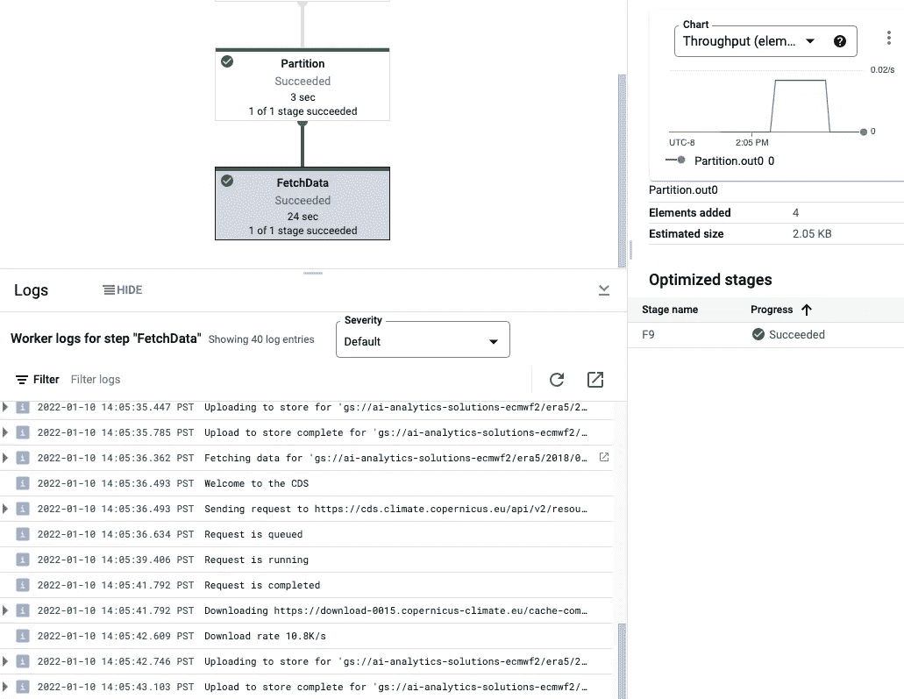
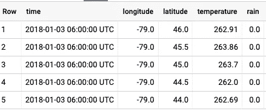
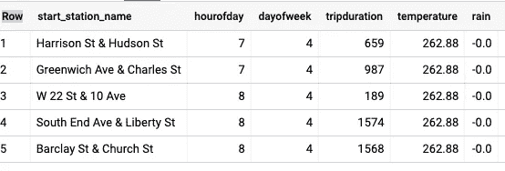

# 如何在机器学习模型中使用 ECMWF 天气预报

> 原文：<https://towardsdatascience.com/how-to-use-ecmwf-weather-forecasts-in-machine-learning-models-92fc3730c5cf>

## 加载数据、查询历史天气、训练 ML 模型

欧洲中期天气预报中心(ECMWF)提供全球天气预报。如果您有一个需要将天气作为输入要素的 ML 问题(例如，您试图预测雨伞或冰淇淋的需求)，您可以使用 ECMWF 数据根据历史数据训练您的 ML 模型，并在预测时使用 ECMWF 的实时预测。

最近，谷歌[开源了一组 Apache Beam pipeline](https://github.com/google/weather-tools)，使天气数据更容易纳入数据分析和机器学习项目。让我们兜一圈。

## 示例 ML 问题

我想使用天气数据作为一个模型的输入，预测纽约人将会保留他们租用的自行车多长时间。我的假设是，如果天气太热或下雨，人们会将自行车存放的时间缩短。所以，让我们把天气作为输入特征之一。

纽约自行车租赁数据在 BigQuery 中作为公共数据集提供。尝试在 [BigQuery](https://console.cloud.google.com/bigquery) 中查询:

```
SELECT 
  start_station_name,
  EXTRACT(hour from starttime) AS hourofday,
  EXTRACT(dayofweek from starttime) AS dayofweek,
  tripduration,
FROM `bigquery-public-data.new_york_citibike.citibike_trips`
LIMIT 5
```

我们可以训练一个 XGBoost 模型，根据其他因素(如起点站名称、一天中的时间和一周中的日期)来预测自行车租赁的持续时间:

```
CREATE OR REPLACE MODEL weather.rental_duration_nowx
OPTIONS(**model_type='boosted_tree_regressor',** 
        input_label_cols=['tripduration']) AS
SELECT 
  **start_station_name,** EXTRACT(hour from starttime) AS **hourofday,** EXTRACT(dayofweek from starttime) AS **dayofweek,
  tripduration**
FROM `bigquery-public-data.new_york_citibike.citibike_trips`
WHERE EXTRACT(year from starttime) = 2018
```

所得模型在保留数据上的中值绝对误差= 265 秒。让我们看看能否利用天气信息改进这个基本模型。

## 环境设置

1.  去[谷歌云控制台](https://console.cloud.google.com/vertex-ai/workbench/)启动一个顶点工作台笔记本。我选择了一台相对最小的机器——没有 GPU 和 n1-standard-2 的最新 TensorFlow 版本——因为我们不会在笔记本上做太多工作。
2.  从控制台中的链接打开 JupyterLab 并启动终端。
3.  为了从 ECMWF 获取数据，您必须向 ECMWF 注册，并在登录时获取您的 API 密钥。

*   气候数据(哥白尼):[注册](https://cds.climate.copernicus.eu/user/register?destination=%2F%23!%2Fhome)和[获得你的 API 密匙](https://cds.climate.copernicus.eu/api-how-to#install-the-cds-api-key)。将 url、key 放在主目录中一个名为 **~/的文件中。cdsapirc** 如页面所示。这些数据是免费的，但是您需要注册并获得 API 密钥。
*   天气预报(火星):[注册](https://apps.ecmwf.int/registration/)，[获取你的 API 密匙](https://api.ecmwf.int/v1/key/)。在 **~/中输入网址、电子邮件和密钥。ecmwfapirc** 如页面所示。这些数据不是免费的(详见本博客最后一节)。

为了跟随我，为哥白尼注册并设置了密钥。MARS 提要是可选的。

3.安装天气工具包:

```
pip install google-weather-tools
```

3.创建将向其中加载查询数据的 BigQuery 数据集:

```
bq mk weather
```

4.创建一个存储桶来临时存储下载的文件:

```
PROJECT=$(gcloud config get-value project)
BUCKET=${PROJECT}-ecmwf
gsutil mb gs://$BUCKET
```

记下已经创建的存储桶的名称。您将在下一步中需要它。

## 下载历史观察

先来验证一下天气对自行车租赁是否有影响。在我们开始使用天气预报之前，我们可以尝试使用天气观测。ERA5 是我们想要的数据集。

5.下载示例配置 [era5_example_config.cfg](https://github.com/google/weather-tools/blob/main/configs/era5_example_config.cfg) :

```
wget [https://raw.githubusercontent.com/google/weather-tools/main/configs/era5_example_config.cfg](https://raw.githubusercontent.com/google/weather-tools/main/configs/era5_example_config.cfg)
```

6.更改示例以反映我们想要的数据(确保从~/编辑 BUCKET 和 KEY。此文件中的 cdsapirc):

*   数据集、变量:我们想要的(关于选项，请查看数据集的[列表](https://cds.climate.copernicus.eu/cdsapp#!/dataset/reanalysis-era5-single-levels)和[数据集文档](https://cds.climate.copernicus.eu/cdsapp#!/dataset/reanalysis-era5-single-levels?tab=form))。我挑选了温度和降雨量的每小时数据。
*   target_path:确保将我的示例中的 bucket 名称改为您在步骤 4 中的 bucket 名称。
*   api_key:确保设置您的。cdsapirc 值。
*   区域:包括纽约市在内的经度范围(纬度=41，经度=-74)

6.下载数据:

```
weather-dl era5_example_config.cfg \
   --project $PROJECT --region us-west1 \
   --runner DataflowRunner --temp_location=gs://${BUCKET}/temp
```

这将启动一个数据流作业，您可以在[https://console.cloud.google.com/dataflow](https://console.cloud.google.com/dataflow)进行监控


获取数据的数据流管道[图片由作者提供]

等待作业完成(大约 6 分钟)。请注意，我们一月份只有几天时间。

7.检查 FetchData 步骤的日志以验证正在下载哪些文件:



如何看待数据流日志[图片由作者提供]

8.验证数据是否已下载:

```
gsutil ls -l gs://$BUCKET/era5/2018/01/01.nc
```

## [可选]下载一年的历史数据

下载一年的历史数据将需要**1-10 个小时**才能完成，这取决于你是否拥有付费的 ECMWF 许可证。所以，你可以跳过这一步。要了解事情是如何工作的，您在上一步中下载的少量数据就足够了。

*注意:如果在配置中使用多个许可证，您可以获得更快的下载速度。参数 subsections docs(*[*https://github . com/Google/weather-tools/blob/main/configuration . MD # subsections*](https://github.com/google/weather-tools/blob/main/Configuration.md#subsections)*)描述了如何做到这一点。因此，拥有 CDS 许可证的团队可以一起更快地获取数据。*

9.通过指定日期范围，将纪元配置扩展到所有月份和所有日期，而不是单独列出具体的月份/日期等。(和以前一样，记得更改下面清单中的 BUCKET 和 KEY)。

重新运行作业。已经下载的数据将被跳过。同样:这需要**几个小时**才能完成。所以，如果你只是想看看事情是如何运作的，可以跳过这一步。

## 将数据加载到 BigQuery

您已经下载了 ERA5 数据，但是它是 netcdf 格式的，不太有利于将其合并到 ML 模型中。让我们将它加载到 BigQuery 中，使数据更加可用。

10.将数据加载到 BigQuery

```
weather-mv --uris "gs://$BUCKET/era5/**.nc" \
           --output_table $PROJECT.weather.newyork \
           --temp_location gs://$BUCKET/temp \
           --direct_num_workers 2
```

我在“本地”运行它，但是您也可以通过指定 DataflowRunner 在数据流中运行它，就像使用 weather-dl 工具一样:

```
weather-mv --uris "gs://$BUCKET/era5/**.nc" \
           --output_table $PROJECT.weather.newyork \
           --project $PROJECT --region us-west1 \
           --runner DataflowRunner \
           --temp_location=gs://${BUCKET}/temp
```

11.检查我们刚刚得到的数据:

```
SELECT 
  time, longitude, latitude,
  ROUND(t2m, 2) as temperature, 
  ROUND(tp, 2) AS rain
FROM weather.newyork
LIMIT 5
```

结果应该是这样的:



## 使用天气数据训练 ML 模型

12.将天气数据与自行车数据结合起来，这样我们就可以知道每次租赁的地点/时间的天气:

```
SELECT 
  start_station_name,
  EXTRACT(hour from starttime) AS hourofday,
  EXTRACT(dayofweek from starttime) AS dayofweek,
  tripduration,
  **ROUND(t2m, 2) as temperature, 
  ROUND(tp, 2) AS rain**
**FROM weather.newyork**
JOIN `bigquery-public-data`.new_york_citibike.citibike_trips **ON ABS(DATETIME_DIFF(EXTRACT(DATETIME FROM time), starttime, HOUR)) < 3
   AND ABS(start_station_latitude - latitude) < 0.5
   AND ABS(start_station_longitude - longitude) < 0.5**
LIMIT 5
```



13.让我们在上面的查询中编写一个更有效的连接，方法是更改自行车表中的时间和位置字段以匹配天气数据的时间/空间分辨率，并保存连接的数据以用于 ML 元数据跟踪和重新训练:

```
CREATE OR REPLACE TABLE weather.citibike_trips AS
WITH citibike_trips AS (
    SELECT 
    start_station_name,
    EXTRACT(hour from starttime) AS hourofday,
    EXTRACT(dayofweek from starttime) AS dayofweek,
    tripduration,
    TIMESTAMP_ADD(TIMESTAMP_TRUNC(CAST(starttime AS TIMESTAMP), HOUR), 
                  INTERVAL CAST(ROUND(EXTRACT(hour from starttime)/6) AS INT64) HOUR) AS time,
    ROUND(start_station_latitude*2)/2 AS latitude,
    ROUND(start_station_longitude*2)/2 AS longitude
    FROM `bigquery-public-data`.new_york_citibike.citibike_trips
    WHERE EXTRACT(YEAR FROM starttime) = 2018
)
SELECT 
    trips.*, 
    ROUND(t2m, 2) as temperature, 
    ROUND(tp, 2) AS rain
**FROM citibike_trips trips
JOIN weather.newyork**
**USING (time, latitude, longitude)**
```

14.天气有多重要？用天气训练 XGBoost 模型:

```
CREATE OR REPLACE MODEL weather.rental_duration_wx
OPTIONS(model_type='boosted_tree_regressor', 
        input_label_cols=['tripduration']) ASSELECT 
  start_station_name,
  hourofday,
  dayofweek,
  **temperature, 
  rain,**
  tripduration
FROM weather.citibike_trips
```

15.比较评估误差:

不考虑天气因素:中值绝对误差= 265 秒

天气:中值绝对误差= 245 秒。

成功！当我们知道天气时，我们能够更好地预测自行车租赁的持续时间…

## [可选]下载您想要的天气预报数据

在我的工作流程中(如上)，我使用了事后几天创建的*再分析*数据。所以，你实际上不能用它来进行实时机器学习。对于实时 ML，你需要近乎实时产生和传播的天气*预报*数据。**这不是免费的，您需要从 ECMWF 获得商业许可才能下载预测数据。**

16.下载示例配置[configs/mars _ example _ config . CFG](https://github.com/google/weather-tools/blob/main/configs/mars_example_config.cfg):

```
wget [https://raw.githubusercontent.com/google/weather-tools/main/configs/mars_example_config.cfg](https://raw.githubusercontent.com/google/weather-tools/main/configs/mars_example_config.cfg)
```

17.您必须对 param 行进行的关键更改是:

```
target_path=gs://**BUCKET**/newyork/
param=max2t6/min2t6/maxtpr6
step=6/12/18/24
time=0500
date=2018-01-01/to/2018-12-31
```

*   param:我们想要的天气变量是地表以上 2m 处的 6 小时最高和最低温度(大约是人面部高度的温度)和 6 小时最大降水率。你可以在这里找到所有天气参数的[描述。](https://www.ecmwf.int/en/forecasts/datasets/set-i)
*   步骤、时间、日期:获取 0500 UTC(纽约市午夜)做出的提前 6 小时、12 小时、18 小时、24 小时的预测，并获取 2018 年做出的所有预测。

现在，使用 weather-dl 下载数据，并使用 weather-mv 将其添加到 BigQuery 中。工作流程的其余部分保持不变！

尽情享受吧！