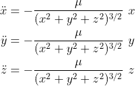
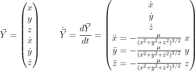
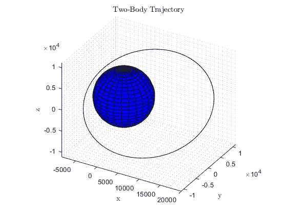

# 如何用 MATLAB 创建两体轨道

> 原文：<https://towardsdatascience.com/how-to-use-matlab-to-create-two-body-orbits-7a1c2591a252>

## 一步一步的演练使用 MATLAB 来确定航天器如何在较大物体的重力影响下移动


双体轨道动画[作者创作]

轨道力学(或天体动力学)涉及将牛顿运动定律和万有引力定律应用于航天器(如火箭和卫星)。任务规划者用它来预测宇宙飞船在重力、推力和其他力的影响下的运动。本文的题目是两体问题。这是天体动力学的一个子类，涉及一个航天器在一个单独的大质量物体的影响下，没有考虑其他的力。与更大的质量相比，航天器的质量也被认为是可以忽略的。这意味着大质量物体会影响航天器的运动，但航天器不会影响大质量物体的运动。实际上，感兴趣的物体不一定是航天器；可能是小行星，彗星，宇航员等等。

## 如何解决两体问题

为了在两体系统中生成轨迹，必须推导航天器(相关质量)的运动方程。有大量的资源显示这个推导和最终的运动方程，所以你不必亲自动手。我在下面的文章中演示了这个过程。我鼓励你理解这些方程以及它们是如何得到的。然而，如果你不想这样做，只是想创建一个轨道，我提供了一个图表和所需的运动方程如下，供您参考。

[](https://medium.com/illumination/astrodynamics-two-body-problem-ec2c5e148184)  

两体问题图[作者创建]



在这些运动方程中， *μ* 是主质量(行星、月球、恒星等)的引力参数。). *x* 、 *y* 和 *z* 是定义航天器在惯性空间中位置的笛卡尔坐标。点代表时间导数，所以一个点代表速度，两个点代表加速度。我们将在本文的编码部分利用这些。

作为题外话，两体问题是轨道力学复杂领域的一个非常简化的版本。事实上，在设计任务时，人们必须考虑诸如大气阻力、[太阳辐射压力](https://medium.com/illumination/deriving-the-effect-of-solar-radiation-pressure-on-orbits-150792f64d0b)、其他重力以及非球形物体的影响等干扰力。虽然不是最精确的方法，但两体问题可以用于航天器的初始任务规划，特别是如果它靠近一个单独的物体运行。当轨道远离大质量物体时，其他力将在航天器的运动中发挥更大的作用。这里不讨论额外的干扰力，但是记住它们是有好处的。

为了模拟轨道，我们将需要利用[数值积分](/numerical-integration-in-matlab-f41d187c1c15)。如果你不知道这是什么，你仍然可以使用代码来创建你自己的轨道。为了对航天器的运动方程进行数值积分或求解，我们将使用 MATLAB 中的`ode113`函数。这是一个内置函数，将一组要积分的导数(用户定义的函数)、感兴趣的时间间隔、初始条件和可选的数值积分容差作为输入。这组导数将是我们的状态向量 *Y* 的时间导数，它包括向量形式的航天器的位置和速度分量。状态向量及其时间导数如下所示。



这是对两体问题运动方程的数值积分过程的简要概述。让我们开始编写模拟地球轨道卫星轨迹的代码吧！

## 用户定义的 ODE 函数

如前所述，为了创建我们的轨迹，我们需要对两体问题的运动方程进行数值积分。我们将使用`ode113`来完成这项工作。这个 MATLAB 函数要求我们创建自己的函数，这个函数将被调用来进行数值积分。我们将定义这个函数，`ODE2BP`。该函数使用地球引力参数`mu`和之前的状态向量`Y`来创建时间导数状态向量`dYdt`。该函数返回这个新向量，它将被`ode113`用来进行数值积分。注意:在 MATLAB 中，用户定义的函数必须放在脚本的末尾。

```
% User-Defined ODE Function
function dYdt = ODE2BP(t, Y)
    mu = 3.986*10^5; % Earth's gravitational parameter [km^3/s^2]
    x = Y(1); % [km]
    y = Y(2); % [km]
    z = Y(3); % [km]
    vx = Y(4); % [km/s]
    vy = Y(5); % [km/s]
    vz = Y(6); % [km/s]
    xddot = -mu/(x^2+y^2+z^2)^(3/2)*x; % [km/s^2]
    yddot = -mu/(x^2+y^2+z^2)^(3/2)*y; % [km/s^2]
    zddot = -mu/(x^2+y^2+z^2)^(3/2)*z; % [km/s^2] dYdt = [vx;vy;vz;xddot;yddot;zddot]; % Y'
end
```

## 数值积分

接下来，我们完成定义`ode113`的输入。这些输入之一是航天器的初始条件。这是本文开头的状态向量形式。注意位置和速度的分量按惯例以*公里*和*公里/秒*为单位。接下来，我们有一个以秒为单位的感兴趣的时间间隔。最后，有许多可选参数可以传递给`ode113`。由于轨道力学要求精度，我在数值积分的时候一般会通过一个很小的相对公差。然后，我们将这些输入和上一节定义的函数一起传递给 ODE 求解器。该函数输出变量`t`和`Y`，它们是数值积分时间步长和每个时间步长的状态向量。然后，我们可以从输出中提取位置坐标`x`、`y`和`z`的时间历史。

```
% Creating Inputs for Numerical Integration
Y0 = [20000; 0; 0; 0; 2.9; 1.8]; % [x; y; z; vx; vy; vz] [km, km/s]
tspan = [0 24*60*60]; % One day [s]
options = odeset('RelTol', 1e-13); % Setting a tolerance% Numerical Integration
[t, Y] = ode113(@ODE2BP, tspan, Y0, options);% Pulling Position Data from Output
x = Y(:, 1); % [km]
y = Y(:, 2); % [km]
z = Y(:, 3); % [km]
```

## 绘制轨迹

最后，我们可以使用`x`、`y`和`z`变量来创建我们的航天器的轨迹。我们首先用标签、网格和一组相等的轴初始化图形(给出物理空间中轨道的真实表示)。接下来，我们可以使用 MATLAB 中的`sphere`函数在我们的绘图原点创建一个地球的表示。最重要的是，可以使用`plot3`功能绘制轨迹。

```
% Creating Figure
figure; hold on
title('Two-Body Trajectory', 'Interpreter', 'Latex')
xlabel('x', 'Interpreter', 'Latex')
ylabel('y', 'Interpreter', 'Latex')
zlabel('z', 'Interpreter', 'Latex')
axis equal
grid minor
view(30, 30)% Creating/Plotting Spherical Earth
rm = 6378.14; % Radius of Earth [km]
[xEarth, yEarth, zEarth] = sphere(25);
surf(rm*xEarth,rm*yEarth,rm*zEarth, 'FaceColor', [0 0 1]);% Plotting Trajectory
plot3(x, y, z, 'k')
hold off
```

上面的代码产生了以下图形:



二体轨道[作者创作]

用 MATLAB 创建两体轨道或轨迹的过程到此结束。玩具周围的初始条件和时间间隔，以创造自己独特的轨道！记住，这是对大多数天体动力学问题的过度简化。如果你想要一个更好的物理表述，你将需要包括扰动力。这可能是一个相当大的挑战，所以这就是为什么最好从简单的两体问题中学习，并从那里开始构建。如果你决定走得更远，祝你旅途顺利！

如果你想制作一个类似于文章开头的视觉效果的动画，可以看看下面的文章。感谢您抽出时间阅读。如果你觉得这有用，请给我一个关注！谢谢！

[](/how-to-animate-plots-in-matlab-fa42cf994f3e) 