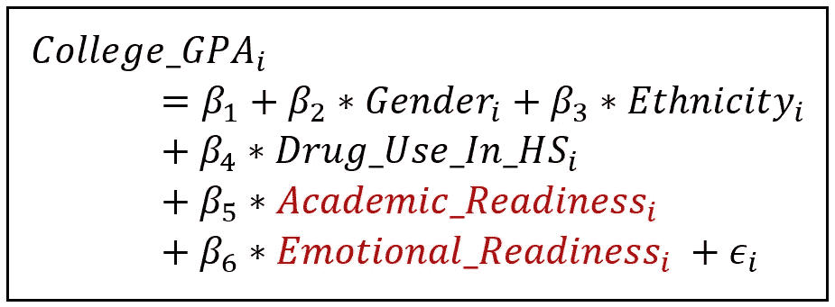
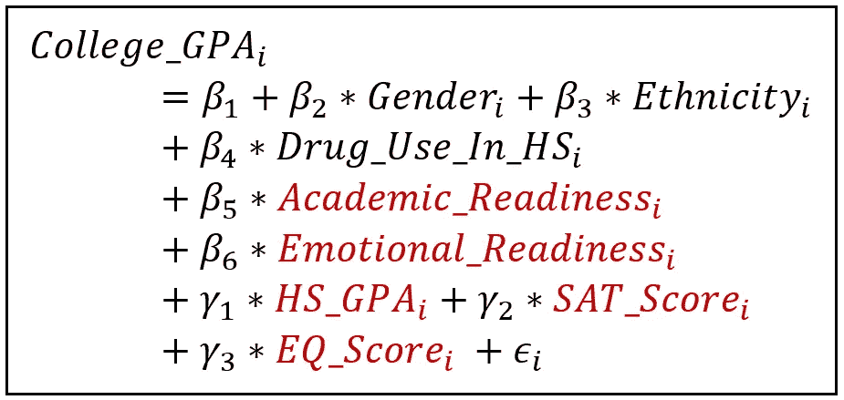
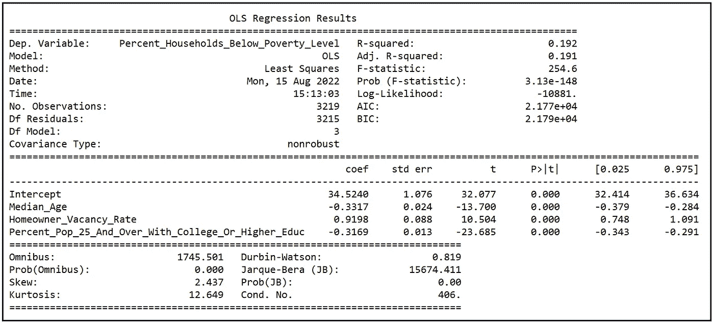

# 如何在回归模型中使用代理变量

> 原文：<https://towardsdatascience.com/how-to-use-proxy-variables-in-a-regression-model-539f723ab587>


梅西耶 87 核心超大质量黑洞的直接图像(来源:[维基百科](https://en.wikipedia.org/wiki/Black_hole#/media/File:Black_hole_-_Messier_87_crop_max_res.jpg)下 [CC BY 4.0](https://creativecommons.org/licenses/by/4.0)

## 如何使用代理来代替不可观察的变量

有时，回归模型中的一个或多个解释变量无法观察或测量。在本文中，我们将看看如何使用**代理变量**来代替这些不可测量的变量。我们将解释什么是好的和坏的代理。我们将研究包含代理和不包含代理之间的权衡。

考虑以下回归模型，在给定几个因素(如学业准备程度、情感准备程度、高中时期的药物使用情况、性别和种族)的情况下，估算学生的大学 GPA:



估算大学 GPA 的线性模型(图片由作者提供)

在上面的模型中，下标 *i* 是指进入大学的第*个*个学生。 *ϵ_i* 是第 I 次观测的误差。

学术准备取决于几个因素，如掌握和吸收新的和复杂的信息的能力，对大学专业的了解，掌握复杂的大学课程的能力和许多其他事情。情感上的准备程度包括性格特征、家庭背景和大学前的经历。人们可能会猜测,*学术准备度*和*情感准备度*本质上是不可测量的变量。

由于我们模型中的两个主要变量无法直接观察到，我们处于一个棘手的局面。在这一点上，我们基本上有三种选择:

1.  我们可以从模型中去掉*学术准备状态*和*情感准备状态*，并接受由于忽略它们而导致的估计系数中的[偏差](/what-happens-when-you-omit-important-variables-from-your-regression-model-966830590d53)，或者
2.  我们可以找到合适的**替代变量**，它们在某种程度上可以替代*学术准备状态*和*情感准备状态*或
3.  我们可以使用一种叫做**工具变量**的技术来解释我们无法在模型中使用*学术准备*和*情感准备*的原因。

在下一篇文章中，我们将研究工具变量的使用。在本文中，我们将看看如何使用代理变量。

# 代理变量

考虑学业准备情况。我们不能直接测量它，但是我们使用**高中 GPA** 和 **SAT 分数**作为两个变量，作为学业准备程度的**代理**怎么样？假设我们用学生的**情商(情商)分数**作为情感准备程度的**代表**？

如果我们使用这些代理，我们将估计以下模型:


估计大学 GPA 的线性模型，使用学术准备和情感准备的代理变量(图片由作者提供)

如果我们能够假设(或建立)以下关于它们的情况，我们也许能够使用这些代理:

## 代理应与主要变量相关联

代理变量应该与它们代理的变量相关联。这似乎是一件显而易见的事情，但在选择代理时，人们仍然应该对这一要求进行全面检查。不幸的是，由于主变量不能被直接观察到，人们只能内省并使用自己的判断来决定代理是否满足这一要求。

在我们的例子中，学生的高中 GPA 和 SAT 分数需要与他们的学业准备情况相关联。表达这种相关性的一种方式是通过以下线性模型:


回归高中 GPA 和 SAT 成绩的学业准备状态(图片由作者提供)

上述模型是不可估计的，因为学术准备是一个不可观察的变量。因此，我们只能假设该模型符合真实数据，并且系数 *δ_1* 和 *δ_2* 被发现是共同显著的(通过用于回归分析 的 [**F 检验)，那么学术准备性的代表将与学术准备性共同相关。与所有基于代理的研究一样，在缺乏实际数据的情况下，我们必须推测这很可能是我们选择的两个代理的真实情况。**](/fisher-test-for-regression-analysis-1e1687867259)

## 代理人不应该是内生的

在下面显示的模型中，回归其两个代理的学术准备程度，这两个代理不应是[](/what-are-exogenous-and-endogenous-regression-variables-c0ea1ba03ce8)****:****

****

**回归高中 GPA 和 SAT 成绩的学业准备状态(图片由作者提供)**

**即 *HS_GPA_i* 和 *SAT_Score_i* 不应该与模型的误差项 *ϵ_i* 相关联。**

**一个更严重的情况出现在下面的场景中:假设在一个包括代理变量*而不是主要变量*的模型中，代理变量被证明是内生的。在我们的示例中，它将是以下模型:**

****

**估计大学 GPA 的线性模型，使用学术准备和情感准备的代理变量(图片由作者提供)**

**对于可通过最小二乘法估计的上述模型，R.H.S .上的所有变量都应该是外生的，即与误差 *ϵ_i.* 不相关**

***性别 _i* 、*种族 _i* 和*吸毒 _In_HS_i* 根据定义是外源性的。**

**如果代理 *HS_GPA_i* 、 *SAT_Score_i* 和 *EQ_Score_i* 中的一个或多个是内生的，则上述模型不再能够被正确估计。**

**此外，内生性的存在意味着有一个或多个因素隐藏在模型的误差项 *ϵ_i* 中，通过内生代理影响响应变量 *College_GPA_i* 。看待这种情况的一种方式是，内生代理是另一个变量的代理，而另一个变量可能是主要变量的真实代理，从而使我们对代理的选择是错误的，或者至少是次优的。**

**为了测试上述模型中的代理是否是内生的，人们通常会运行几个可用的内生性测试之一。**

## **代理不应该向模型中注入额外的信息**

**假设我们能够测量学术准备程度。如果一个模型已经包含学术准备作为一个变量，添加高中 GPA 和 SAT 分数到这个模型不应该馈入额外的信息到响应大学 GPA。换句话说，代理不应该能够解释响应变量中任何超出他们所代理的变量所能解释的额外变化。**

**从数学上来说，如果将以下理论模型拟合到(理论)数据，那么 *High_School_GPA_i* 、 *SAT_Score_i* 和 *EQ_Score_i* 的估计系数在统计上应该是不显著的(即，就总体而言，为零)。**

****

**估算大学 GPA 的超指定模型(图片由作者提供)**

**如果它们不为零，会发生什么？**

**让我们想象一下γ_1、γ_2 和γ_3 中的一个或多个不为零的情况。这意味着相应的代理变量是相关的。在忽略相关代理变量的模型中，这些被忽略的变量将通过误差项施加影响，导致模型中所有变量的系数偏离其真实值。这是经典的 [**省略变量偏差**](/what-happens-when-you-omit-important-variables-from-your-regression-model-966830590d53) 的情况。**

**但是事情变得更糟了。由于被省略的变量也是代理变量，它们被定义为与主要变量*学术准备状态*和*情感准备状态*相关。由于省略的代理正在通过误差项施加它们的影响，我们现在处于误差项与模型的主要变量相关的情况，从而使主要变量 [**内生**](/what-are-exogenous-and-endogenous-regression-variables-c0ea1ba03ce8) 。这违反了线性模型的基本要求(和假设)。**

# **何时使用代理，何时不使用代理**

**在上面的讨论中，我们考察了包含一个选择不当或次优代理的一些影响。假设没有统计测试来验证一个“好的”代理的大部分品质，我们可能还想检验省略掉可能被证明是有用的代理的影响。**

**在大多数情况下，所选择的代理可能无法完全满足所有需求。例如，一个代理可能是内生的，但内生的程度可能是温和的。人们也可能会怀疑代理人向模型中注入了额外的信息，这些信息超出了它代替主模型所需的信息。但是我们也可能怀疑这种额外的影响是微小的，实际上是不重要的。**

**另一方面，我们的常识可能表明，在不可观察的主要变量及其可观察的替代变量之间存在明显和显著的相关性。在这种情况下，简单地忽略代理将使我们无法解释一个不可观察但重要的解释变量的影响。这种没有主要解释变量或其替代变量的拟合模型将导致比包含替代变量时更高的残差和更低的[拟合优度](/the-complete-guide-to-r-squared-adjusted-r-squared-and-pseudo-r-squared-4136650fc06c)。此外，如果被忽略的主要变量碰巧与模型中的任何解释变量相关，它将使所有估计的系数偏离它们的真实值。**

**总之，除非有充分的理由忽略一个代理，总的来说，在模型的估计系数中包含它并容忍[可能的精度损失比完全忽略代理要好。](/what-happens-when-you-include-irrelevant-variables-in-your-regression-model-77ab614f7073)**

# **例子**

**让我们通过一个真实的例子来说明代理变量的使用。**

**假设我们想估计一个社区的贫困发生率。我们的估计单位将是美国的一个县。我们将该县的贫困发生率定义为该县低于联邦贫困线的家庭的百分比。**

**让我们假设这个百分比与以下因素相关:**

1.  **该县居民的平均年龄。**
2.  **县城的住房(尤其是置业)需求有多旺盛。我们将根据房主空置率来衡量这一因素，这是一项联邦政府公布的统计数据，用于衡量该县未售出的待售房屋的百分比。**
3.  **平均而言，该县人口的受教育程度。**

**毫无疑问，还有许多其他因素与这个国家的贫困程度相关。但是现在，我们将考虑上述三个因素。**

**将上述三个因素与该县的贫困发生率联系起来的线性模型如下所示:**

****

**估计平均贫困水平的线性模型(图片由作者提供)**

**在上面的模型中，下标 *i* 表示数据是指数据集中的县 *i* 。**

**该县的年龄中位数是可以直接测量的，房主空置率也是如此。**

**衡量一个国家中“受过良好教育”的人口比例的百分比是无法直接观察到的。虽然人们可能普遍认为受过良好教育是实现财务独立的重要一步，但受过良好教育对不同的人来说意味着不同的事情。**

**此外，教育作为一种*实现的质量*可以说是各种可观察和不可观察的数量的综合效应，例如正规学校教育的年数、参加各种培训和学徒活动——正式和非正式的、关于个人所选职业的一般知识、关于相关主题的横向知识，以及个人为解决手头问题而带来的“软”技能。**

**这些因素使得教育成为人们想要用代理人来衡量的变量。在我们的模型中，我们将使用变量*县内受过大学教育或更高教育的人的百分比*作为变量*受过良好教育的人的百分比的代理。***

**这样做会产生以下模型:**

****

**使用代理变量估算县级贫困的线性模型(图片由作者提供)**

**让我们看看我们选择的代理是否满足“好”代理的要求。**

## **代理与主要变量相关吗？**

**如果我们对受过良好教育的定义包括(除其他外)拥有至少一个大学学位，那么(只有到那时)拥有至少一个大学学位的县居民的百分比越高，该县的民众受教育程度就越高，反之亦然。**

## **代理是内生的吗？**

**如果代理是内生的，它与模型的误差项相关。在下面的模型中，我们必须测试代理人*Percent _ With _ College _ Or _ Higher _ Educ _ I*是否是内生的。**

****

**使用代理变量估算县级贫困的线性模型(图片由作者提供)**

**这不是一个简单的测试，它值得自己的文章。我们将在下一篇文章中展示如何执行这个测试。**

## **代理是否向模型中注入了额外的信息？**

**要回答这个问题，我们需要构建一个包含主要变量和代理变量的模型，并检查它的拟合优度是否大于只包含主要变量的模型。由于主要变量*受过良好教育的人的百分比*本来就不可测量，这就变成了一个不可能的实验。相反，我们呼吁我们的观点是什么造就了一个受过良好教育的人。我们假设，虽然一个人没有大学学位也有可能受到良好的教育，但通常情况下，这样的人会有大学学位。如果有可能收集到正确的数据，这些数据很可能证明我们在这个概念上是错误的。但是如果我们是对的，那么添加变量*受过大学或更高教育的人的百分比*将不会给已经包含主要变量*受过良好教育的人的百分比*的模型带来额外的信息。**

**内省完成后，让我们转向构建回归模型的任务。**

## **构建和训练模型**

**为了符合模型，我们将使用来自美国人口普查局的数据集。**

**具体来说，我们将使用由人口普查局收集并在县一级汇总的几个社会经济指标的数据。该数据是美国人口普查局进行的 2015-2019 年美国社区调查(ACS) 5 年估计值的子集。下表包含我们将使用的数据(点击或单击图像进行缩放):**

****

**根据[使用条款](https://www.census.gov/data/developers/about/terms-of-service.html)从[美国人口普查局](https://www.census.gov/data/developers.html)提取的美国社区调查数据集的子集**

**本例中使用的数据集可以从这里 下载 [**。完整的 ACS 数据集可以使用**](https://gist.github.com/sachinsdate/0b8ebc2b26afb67a1e83e752c69e1a25)**[公开可用的](https://www.census.gov/data/developers/about/terms-of-service.html)[API](https://www.census.gov/data/developers.html)从美国人口普查局的网站获取，或者直接从人口普查局的 [**社区资源管理器**](https://experience.arcgis.com/experience/13a111e06ad242fba0fb62f25199c7dd/page/Page-1/) 网站获取。****

**总的来说，我们希望将以下模型用于此数据集:**

****

**使用代理变量估算县级贫困的线性模型(图片由作者提供)**

**在数据集中，我们对代理变量的名称*Percent _ With _ College _ Or _ Higher _ Educ _ I*做了一点修改，以反映美国人口普查局对该变量使用的名称，即*Percent _ Pop _ 25 _ And _ Over _ With _ College _ Or _ Higher _ Educ*。**

**我们将使用 Python 和 [Pandas](https://pandas.pydata.org/) 将数据文件加载到内存中，并且我们将使用基于 Python 的 [statsmodels](https://www.statsmodels.org/stable/gettingstarted.html) 包来构建和拟合线性模型。**

**让我们从导入所需的包并将数据文件加载到 Pandas `DataFrame`开始:**

```
**import** pandas **as** pd
**import** statsmodels.formula.api **as** smf ***#Load the US Census Bureau data into a Dataframe*** df = pd.**read_csv**(**'us_census_bureau_acs_2015_2019_subset.csv'**, **header**=0)
```

**用 [Patsy](https://patsy.readthedocs.io/en/latest/quickstart.html) 语法构建模型的方程。Statsmodels 会自动将回归的截距添加到模型中，因此我们不必在模型的方程中明确指定它:**

```
reg_expr = **'Percent_Households_Below_Poverty_Level ~ Median_Age + Homeowner_Vacancy_Rate + Percent_Pop_25_And_Over_With_College_Or_Higher_Educ'**
```

**建立和训练模型并打印训练摘要:**

```
olsr_model = **smf**.**ols**(**formula**=reg_expr, **data**=df)
olsr_model_results = olsr_model.**fit**()
**print**(olsr_model_results.**summary**())
```

**我们看到以下总结:**

****

**线性模型的训练总结(图片由作者提供)**

**我们将忽略 R 平方的值(或[调整后的 R 平方](/the-complete-guide-to-r-squared-adjusted-r-squared-and-pseudo-r-squared-4136650fc06c))，因为我们的兴趣在于估计观察到的解释变量[](/understanding-partial-effects-main-effects-and-interaction-effects-in-a-regression-model-54e8a127c62d')**对响应变量(即该县的贫困水平)的主要影响。****

****另外，我们发现所有解释变量的系数在 p < .001 时都是显著的。****

****我们的模型估计了每个变量的[主要影响](/understanding-partial-effects-main-effects-and-interaction-effects-in-a-regression-model-54e8a127c62d)如下:****

## ****中值年龄****

*****中位数 _ 年龄*的系数为-0.3317，表明一个县的中位数年龄(岁)每增加一个单位，该县的贫困线以下家庭的百分比就会下降 0.33% *。*****

## ****房主 _ 空置率****

*****房主空置率*的系数为 0.9198，表明空置率每增加一个百分点，该县贫困线以下家庭的空置率就增加一个百分点，反之亦然。这是一个显著的尺寸效应。****

## ****受过大学或高等教育的百分比****

****该代理变量的效果具有类似于 *Median_Age* 的大小和方向。系数为-0.3169，这意味着该县拥有大学或更高学位的人数每增加 3 个百分点，贫困线以下的家庭数量就减少 1 个百分点。****

## ****相关性而不一定是因果关系****

****请注意，我们已经小心翼翼地用相关性来表述我们所有的结果。没有因果分析的好处，根本不清楚所谓的“解释性”变量是否影响一个县贫困线以下家庭的百分比，或者影响箭头是否指向其他方向。****

****更高水平的教育很可能导致贫困的减少。人们还可以说，富裕家庭和一般高于贫困线的家庭比贫困线以下的家庭更容易负担大学教育。中位年龄和住房需求对贫困水平的影响甚至更加模糊。****

# ****总结和要点****

*   ****当回归模型中的一个或多个解释变量无法观察或测量时，我们可能希望使用**代理变量**来代替这些不可测量的变量。****
*   ****理想情况下，代理变量必须满足三个要求:1)它应该与主要变量相关(最好是强相关), 2)它不应该是内生的，3)除了作为主要变量的替代变量之外，它不应该给模型带来额外的信息。****
*   ****由于主要变量无法观察到，所以构成一个好的代理的大部分要求本质上是不可测试的。因此，我们必须使用我们的判断来确定所选择的代理变量是否以及在何种程度上满足或违反这些要求。****
*   ****面对不可观察的解释变量，总的来说，最好是包括代理，并处理模型系数中的精度损失，而不是忽略代理，并承受模型拟合不良和可能有偏差的系数估计的后果。****

****下面是本文中使用的源代码:****

****这里是数据集的链接:[美国社区调查](https://gist.github.com/sachinsdate/0b8ebc2b26afb67a1e83e752c69e1a25)。****

# ****参考文献、引文和版权****

## ****数据集****

****根据[使用条款](https://www.census.gov/data/developers/about/terms-of-service.html)，从[美国人口普查局](https://www.census.gov/data/developers.html)提取的美国社区调查数据集。****

## ****形象****

****本文中的所有图片的版权归 [CC-BY-NC-SA](https://creativecommons.org/licenses/by-nc-sa/4.0/) 所有，除非图片下方提到了不同的来源和版权。****

*****如果您喜欢这篇文章，请关注我的*[***Sachin Date***](https://timeseriesreasoning.medium.com)*以获得关于回归、时间序列分析和预测主题的提示、操作方法和编程建议。*****