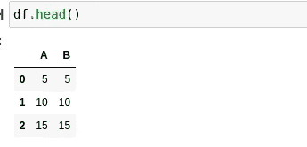
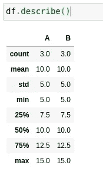
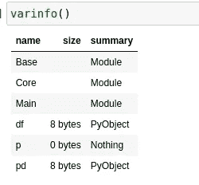

# 如何在 Julia 中使用 PyCall.jl: Python 库

> 原文：<https://towardsdatascience.com/how-to-use-pycall-jl-python-libraries-in-julia-7f0e7a47ba70>

## Julia 的 PyCall 包的概述，以及更多关于它的有用性和可用性的内容


这么多书，简直就像两个图书馆的总和！(图片由[像素](http://pixabay.com)上的[像素](https://pixabay.com/images/id-1281581/)提供)

# 介绍

在我们今天生活的计算世界中，引入一种新的编程语言的最大问题之一将是它的生态系统。它类似于操作系统和计算机现在普遍面临的一些问题。许多技术是建立在工具之上的，这些工具要么已经过时，要么我们知道用我们新发现的知识可以写得更好。尽管这可能会有问题，但在某些情况下，当涉及到软件时，抱着“如果它没有坏，就不要修复它”的心态是有意义的，除非我们想用余生来重写为 90 年代的系统编写的代码。

我的观点是，从零开始创建一个全新的生态系统是非常困难的，特别是对于一种从无到有并试图在没有生态系统的情况下建立自己的语言。在大多数情况下，除非这种好处真的值得，否则我怀疑大多数人甚至会采用一种新语言。有很多新的东西需要学习，从语法到错误输出和调试，到如何处理包，甚至安装一种编程语言都可能令人困惑，正如我在 Fedora 系统上安装标准元语言时很好地展示的那样。这还没有触及学习如何对抗一个全新的工具生态系统的挑战。

幸运的是，对于那些用渴望的眼光看着 Julia 的人来说，你真的不需要学习 Julia 生态系统来尝试从 Python 开始。这可以通过 PyCall.jl 包来完成，正如人们所预料的那样，这个包用于调用 Python 包。Julia 处理这个问题的另一种方式是多重调度通常如何使整个生态系统更加一致，这一点我不会在本文中讨论，但肯定值得注意。我最近写了另一篇文章，详细介绍了如何在自己的代码中使用这种技术，以及它对 Julian 软件包的影响。事不宜迟，让我们来看看 PyCall.jl。

# 设置

我必须承认，我已经很久没有使用 PyCall.jl 包了。坦白地说，自从我上次接触这个软件包以来，Julia 的生态系统已经有了显著的增长，这种语言的用户群也是如此。为了证明这一点，我想让你们注意一下这张由[洛根·基尔帕特里克](https://medium.com/u/2c8aac9051d3?source=post_page-----7f0e7a47ba70--------------------------------)提供的图片，他是一位 Julia 语言的开发者和社区倡导者(Julia info 的优秀用户)。):

我想说的是，随着 Julia 的广泛应用，PyCall.jl 包就变得不那么需要了，因为很多时候已经用 Julia 编写了某种功能的模块实现。虽然有时文档和这些东西可能有点参差不齐，但一般来说，大多数 Julia 包都相当一致且易于使用。也就是说，PyCall.jl 仍然是 Python 开发人员进入 Julia 的一个途径，而不需要学习一个全新的工具生态系统，这就是我希望这篇文章针对的目标。考虑到这种语言在过去几年中的发展，数据科学领域的人可能至少应该以某种方式熟悉这种语言。也就是说，用 PyCall 来尝试它是体验 Julia 的一种真正安全的方式，不会产生信息过载。此外，对于使用像 Tensorflow over Flux.jl 这样的软件也有一些争论，例如，在工业中仅仅是为了成熟——此外还有 Google——出错的能力。

今天我们将看看如何使用 Pandas 来管理 Julian 数据，尽管 DataFrames.jl、Julia 的内置线性代数以及 Julia 中的其他解决方案非常强大，但是叫 Pandas 有点傻，很难学习一个全新的软件包和一门全新的语言，所以让我们开始吧！

使用 PyCall.jl 其实真的很简单，第一步就是安装。我们可以通过 Julia 中的包 Pkg 的方法或者我倾向于使用的 Pkg 命令 REPL 来使用 Pkg。在朱莉娅·REPL 中按下]就可以进入 REPL，这非常方便。

```
using Pkg; Pkg.add("PyCall")julia> ]pkg> add PyCall
```

如果你不像我一样使用 Linux，你也需要在你的机器上安装 Python 的标准版本。当然，您将在 Linux 上需要它，但是您可能已经有了它。如果一切正常，您现在应该能够使用 PyCall 了。

```
using PyCall
```

如果您想指定使用特定版本的 PYTHON，您需要定义一个环境变量 Python，然后使用 Pkg 构建 PyCall.jl。

```
# ENV["PYTHON"] = "/usr/bin/python3.7"
bash> juliajulia> ]
pkg> build PyCall
```

# 使用 PyCall.jl

现在我们已经在机器上安装了 PyCall，让我们实际开始使用这个包。对于接下来的部分，我将在一个小示例笔记本上工作。这里有一个 Github 上的笔记本链接，如果你想自己尝试这段代码的话:

<https://github.com/emmettgb/Emmetts-DS-NoteBooks/blob/master/Julia/pycall%20basic%20examples.ipynb>  

## 执行 Python

我们实际上可以使用字符串在当前的 Julia 环境下执行整个 Python 环境。为了使一个字符串成为 Python 代码，我们只需在多行字符串前添加 py，如下例所示，我创建了一个 add20 函数:

```
py"""
def add20(x):
    return x + 20
"""
```

我们可以使用相同的语法，在某种程度上，通过提供 Julia 中的参数来插入它，以获得 Julia 中的返回:

```
py"add20"(20)40
```

这被视为常规返回，此外，类型保存得非常好，这令人印象深刻。

## 导入 Python

虽然像我们刚才做的那样交替使用 Python 和 Julia 非常令人兴奋，但这可能也不是人们试图从 Julia 中使用 Python 的原因。这个包最流行的用法可能是从 Python 生态系统中导入包。正如我之前所说的，我们将在 Julia 中制作一个熊猫数据框，这实际上非常简单。第一步是使用 pyimport()方法导入我们的包:

```
pd = pyimport("pandas")PyObject <module 'pandas' from '/usr/lib64/python3.9/site-packages/pandas/__init__.py'>
```

这给了我们一个 PyObject 类型的返回——这很好。该模块能够拥有 Python 生态系统中的许多相同的行为和语法，这一切都是通过这一行代码完成的——这简直是荒谬的声明性。我们还可以按照您的预期创建数据框:

```
df = pd.DataFrame(Dict(:A => [5, 10, 15], :B => [5, 10, 15]))
```

此外，作为新构造对象的子对象的函数可以按照您预期的方式调用:

```
df.head()
```



(图片由作者提供)

```
df.describe()
```



(图片由作者提供)

# 表演

人们转向 Julia 的一个重要原因是因为性能，正如这篇著名的博客文章所详述的，Julia 最初是被创造出来的。也就是说，在从 Python 切换到 Julia 的过程中，也许没有一个 Julia 包可以做你需要做的事情，一个很好的问题是，我们是否会获得任何额外的性能优势或障碍，因为我们从 Julia 调用 Python，而不仅仅是编写 Python。我想说的第一件事是内存使用。

## 记忆

我在使用 PyCall 时遇到的一个大问题是，当涉及到内存使用时，PyCall 真的会给你留下很多想象空间，尤其是在某种专业设置或开发环境中。也就是说，当 Julia 使用 Python 时，确实没有很好的方法来检查内存使用情况。了解这一点会很好，因为现在我们所得到的基本上是一个指向 Julia 中定义的 PyObject 的指针。这是有问题的，因为它们总是占用相同数量的内存。我觉得奇怪的是，varinfo()甚至不包含 PyCall 模块，还定义了一个不占用内存定义为 nothing 的 p。

```
varinfo()
```



(解释或更正刚说过的话)我是说..很难表达将 Python 这样的大模块加载到 8 * 8 位中是多么的不可能。对于那些不了解位和字节的人来说，给定文本文件中的每个字符就是一个字节的数据。此外，我们的 DataFrame 肯定不能是八个字节，因为它包含六个整数和两个标签，每个都是一个字节，再加上对象内部的方法，这些方法远不止一个字节。所以数据本身可能是八个字节，但对象作为一个整体肯定不是。确实有一些可以导入和使用的分析模块，但是所有这些都不会给我们任何关于 PyCall 使用了多少内存的信息，这正是我真正想要的。所以不幸的是，没有很好的方法来分析内存使用情况——这可能也是切换到 Julia 包的一个很好的原因，但是计算时间呢，这可能是 Python 的最大障碍。

## 口译时报

如你所料，我们将使用不同的笔记本来比较 Python 和 Julia。记住，这些将是每个计算的内核化版本，这肯定会影响时间——然而，根据我的经验，IJulia 通常能够以与 REPL 相同的速度运行，有时会落后几毫秒，所以我不确定这是一个大问题。我将使用标准的库模块 timeit 来为 Python 计算计时，并且我将为 Julia 使用@time 宏。进口也将包括在测试中。

```
[@time](http://twitter.com/time) begin 
    df = pd.DataFrame(Dict("A" => r.randn(1000000), "B" => r.randn(1000000)))
endr = pyimport("numpy.random")
```

重要的一点是，我重启了内核。Julia 有很多 JIT 缓存和预编译的魔法，所以当涉及到这类事情时，这绝对是我会做的事情，以获得准确的基准。这是我们的 Julia 结果:


> 左边是 Julia，右边是 Python，只是澄清一下。

在这种情况下，Julia 确实稍微落后于 Python。然而，在我看来，这其实是非常令人印象深刻的！Julia 在使用另一种语言的包时仍能这么快，这一事实令人印象深刻。我还剩下大约 1g 的内存(我讨厌这里)，所以让我们滥用我的计算机，把那台改成 3，这样我们就可以看到 Julia 是否开始用更多的值出错。


随着我们增加值的数量，我们看到 Julia 慢慢开始赶上 Python。PyCall 显然有一些开销，而且我们使用的是 Python。老实说，这是意料之中的，老实说，我真的认为 Python 的 Julia 接口会导致比现在更多的开销。这确实说明了这个模块是多么令人印象深刻。

> 有人给我的电脑带来了一个除颤器。

# 结束语

PyCall.jl 已经存在一段时间了，我们可以看到 Julia 代码可以变得多么健壮和快速。尽管我们在这个实例中使用了 Python，但 Julia 代码运行解释后的代码的速度仍然比纯 Python 代码快几毫秒。令人印象深刻！当然，这里真正重要的可能是 FORTRAN 或 C 代码，但无论哪种方式，我们通过两层语言调用代码并从中获得如此大的收益仍然是非常激进的。

所有这些都证明了 Julia 是一门很棒的语言，而且 PyCall.jl 是入门 Julia 的好方法。在学习 Julia 生态系统时，基本上不需要做任何工作，人们可以使用他们一直使用的相同的软件包，并在 Julia 中获得一定程度的经验。我认为使用 PyCall.jl 慢慢接近 Julia 是一个非常好的主意，PyCall 的性能不会对任何试图这样做的人造成很大的阻碍。对于我的 Pythonista 读者，我希望这篇文章能让你想到在 Julia 中入门是多么容易。正如我前面提到的，这种语言正在迅速发展。老实说，我也不认为现在是学习它的最好时机，因为社区和生态系统现在都在爆炸。

最后一点，我是一名数据科学家，因此我对数据科学感兴趣，我真的不介意关于数据科学或一般技术相关主题的直接消息、回复和类似的东西(不是垃圾邮件或奇怪的提议)。如果您对让 Julia 使用您的机器感兴趣，并且不知道从哪里开始，或者只是对共享一些信息感兴趣，请随时联系我！谢谢你读这篇文章，它对我来说意味着整个世界，我真的很感激！