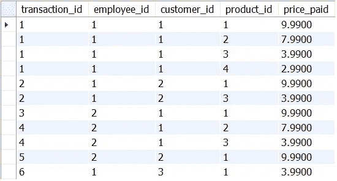
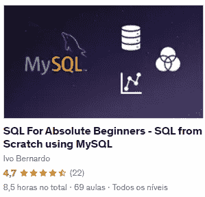

# 如何在 SQL 中使用子查询

> 原文：<https://towardsdatascience.com/how-to-use-subqueries-in-sql-da660694b8e3>

## 了解如何使用子查询使您的 SQL 查询更加灵活，并减少代码混乱


照片由[casparrubin](https://unsplash.com/@casparrubin)@ unsplash . com 拍摄

*【免责声明:此帖子包含一些我的 Udemy 课程的附属链接】*

子查询是一个很酷的概念，我们可以在用结构化查询语言(SQL)编程时使用。从问题开始:有时我们希望访问查询上下文之外的数据，以过滤行或基于聚合度量执行一些特殊的过滤。当我们想要这样做时，我们可能会陷入创建太多检查点的陷阱，这些检查点用几个临时表相互依赖。这些临时对象不仅会占用我们服务器的宝贵空间，还会使代码更难调试，更令人困惑。

子查询是一个简单的 SQL 概念，它将帮助我们将几个查询语句压缩成一个语句。有三种主要的用例(至少我个人经常使用，但还有更多)依赖于子查询:

*   用子查询访问聚合。
*   用另一个表的上下文过滤表中的行。
*   执行双层聚合，如平均值或总和的平均值。

在本帖中，我们将研究一些如何在 SQL 中使用子查询的例子，以及它们如何为您的数据管道带来灵活性！

如果你想提高你的 SQL 游戏，使用子查询可能会有很大的不同。通过将它们添加到您的工具带上，您将编写更加有组织的查询，这些查询不依赖于大量的连续步骤，从而更容易减少您编写的代码量。不利的一面是，它们可能比它们的 join 替代品慢一点——所以，接下来让我们来研究一下它们！

# 创建数据

对于这个例子，我们将使用来自两个假设商店的数据。假设我们有两个表，一个用于`store_a`，另一个用于`store_b`。每个表都记录了客户的购买情况，其构建方式类似于典型的事实表，这意味着每次购买都与以下内容相关联:

*   记录它的雇员 id。
*   在交易中购买商品的客户标识。
*   对于购买的每个产品，每个购买行都要相乘。
*   每种产品都有特定的价格。

让我们为两家商店创建并填充虚拟数据:

```
create table sandbox.store_a (
 transaction_id int,
    employee_id int not null,
    customer_id int not null,
    product_id int not null,
    price_paid numeric(19,4)
    );create table sandbox.store_b (
 transaction_id int,
    employee_id int not null,
    customer_id int not null,
    product_id int not null,
    price_paid numeric(19,4)
    );insert into sandbox.store_a (
 transaction_id, employee_id, customer_id, product_id, price_paid
    ) values 
    (1, 1, 1, 1, 9.99),
    (1, 1, 1, 2, 7.99),
    (1, 1, 1, 3, 3.99),
    (1, 1, 1, 4, 2.99),
    (2, 1, 2, 1, 9.99),
    (2, 1, 2, 3, 3.99),
    (3, 2, 1, 1, 9.99),
    (4, 2, 1, 2, 7.99),
    (4, 2, 1, 3, 3.99),
    (5, 2, 2, 1, 9.99),
    (6, 1, 3, 1, 3.99);

insert into sandbox.store_b (
 transaction_id, employee_id, customer_id, product_id, price_paid
    ) values 
    (1, 5, 10, 1, 9.99),
    (1, 5, 10, 3, 3.99),
    (1, 5, 10, 4, 2.99),
    (2, 1, 11, 1, 9.99),
    (3, 1, 11, 3, 3.99),
    (4, 6, 11, 1, 9.99),
    (4, 6, 11, 2, 7.99),
    (5, 7, 10, 3, 3.99);
```

我们的表格如下所示:



商店 A-交易表-按作者分类的图像


商店 B —交易表—按作者分类的图像

每个商店都有不同顾客购买的不同商品。为了了解这种情况下的子查询，我们将使用两个用例:

*   如何筛选在`store_b`买过至少三次的产品？
*   我们如何计算`store_a`中交易的平均值？
*   在`store_a`上，我们如何过滤价值高于平均值的交易？

# 使用子查询作为过滤器

让我们从我们的第一个例子开始——我们如何过滤在`store_b`中至少购买过三次的产品的行？

如果我们必须画出一个如何做到这一点的心理计划:

*   统计每件商品在`store_b`购买的次数；
*   存储大于或等于 3 的`product_ids`；
*   过滤那些来自`store_b`的产品；

在“正常”的流水线方式中，可以使用一个临时表分两步完成。例如:

```
create temporary table sandbox.top_products as (
 select product_id
    from sandbox.store_b
    group by product_id 
    having count(product_id) >= 3
);select a.* from
sandbox.store_b as a
inner join 
sandbox.top_products as b
on a.product_id = b.product_id;
```

创建我们的`top_products`临时表，并使用其域通过内部连接来限制`store_b`行是可能的。作为替代，我们可以在 where 子句中传递带有子查询的`top_products`:

```
select * from 
sandbox.store_b
where product_id IN (
 select product_id from sandbox.top_products
);
```

注意，我们可以通过向查询的`where`子句传递 select 语句，将`product_ids`嵌入其中。但是，如果我们可以直接将查询传递给`where`子句，我们现在就可以放弃临时表了！让我们看看:

```
select * from 
sandbox.store_b
where product_id IN (
    select product_id
    from sandbox.store_b
    group by product_id 
    having count(product_id) >= 3
);
```

搞定了。我们已经使用第一个子查询示例将所有内容压缩到同一个查询中。提示:始终使用缩进来引导读者理解查询的行为。对于子查询，将它放在缩进的块中会更容易阅读和理解。

最后，以上所有查询的结果都是相同的——我们从`store_b`输出`product_ids` 1 和 3:


子查询结果 1 —按作者分类的图像

# 多层聚合

在这种情况下，我们有一个[非规范化表](https://www.geeksforgeeks.org/denormalization-in-databases/)，我们可能想要对数据执行一些多级聚合。例如，如果我们想要计算所有事务的平均值，我们不能直接应用平均值，因为我们的表是面向`product_ids`而不是`transaction_ids`的。

同样，如果我们应用“正常”的数据管道规则，我们可能会将其分为两个查询:

```
create temporary table sandbox.average_price as (
  select transaction_id, sum(price_paid) as total_value
  from sandbox.store_a
  group by transaction_id
);select avg(total_value) from sandbox.average_price;
```

通过最后一条`select`语句，我们知道`store_a`的平均交易量大约为 12.48 €。同样，这是子查询的另一个优秀用例！您能自己构建子查询语法吗？

让我们看看:

```
select avg(average_price.total_value) as average_transaction from (
   select transaction_id, sum(price_paid) as total_value
   from sandbox.store_a
   group by transaction_id
   ) as average_price
;
```

这一次，我们的子查询进入了`from`子句！子查询非常灵活，使我们能够在最著名的 SQL `clauses`中使用它们。

上面查询的结果与两表方法完全相同:


子查询结果(多层聚合)-按作者分类的图像

# 基于聚合筛选表

另一个适合子查询的用例是在某些场景中使用 SQL 变量。例如，假设我们想要过滤值高于平均值的事务(输出必须保留原始的面向产品的行)，我们能在几个查询中完成吗？

首先，让我们采用多表方法:

*   我们从计算每笔交易的总额开始。
*   我们将所有交易的平均值插入到一个变量中。
*   我们过滤总值高于所有交易平均值的交易组。

如果不使用子查询，这可以通过以下方式实现:

```
create temporary table sandbox.average_price as (
  select transaction_id, sum(price_paid) as total_value
  from sandbox.store_a
  group by transaction_id
);select [@avg_transaction](http://twitter.com/avg_transaction):= avg(total_value)
from sandbox.average_price;create temporary table sandbox.transaction_over_avg as (
 select distinct transaction_id
    from sandbox.average_price
    where total_value > [@avg_transaction](http://twitter.com/avg_transaction)
    );

select a.*
from sandbox.store_a as a
inner join
sandbox.transaction_over_avg as b
on a.transaction_id = b.transaction_id;
```

最后的`select`将产生关于交易 1 和交易 2 的信息，这是唯一价值高于平均值的购买:


子查询结果(使用变量筛选)-按作者排序的图像

如果我们想使用某种版本的子查询来实现这一点，我们可以将它们与变量结合起来:

```
select [@avg_transaction](http://twitter.com/avg_transaction):= avg(agg_table.total_value)
from (
 select transaction_id, sum(price_paid) as total_value
 from sandbox.store_a
 group by transaction_id
) as agg_table;select * 
from sandbox.store_a
where transaction_id in (
 select transaction_id
 from sandbox.store_a
 group by transaction_id
    having sum(price_paid) > [@avg_transaction](http://twitter.com/avg_transaction)
)
```

如您所见，这减少了一点代码，我们在创建变量`@avg_transaction`和过滤原始表时都使用了子查询。有人可能会说，三级子查询是可能的，但可能会使代码阅读起来有点复杂，所以这里没有灵丹妙药，这就是为什么两个查询的解决方案是合适的。

有时，子查询甚至可能不是解决问题的最清晰的方式！理想情况下，我们希望在复杂代码和长代码之间取得平衡——一般来说，代码越短越好，但是您可能会使用太多的子查询层，这使得调试和理解变得困难(也使得您的查询变得更慢)。

在我们离开之前，反对子查询的两个论点是:

*   当您希望保存数据状态以用于调试目的时，临时表也非常有用——对于子查询，您失去了可能需要的那层额外验证。
*   子查询通常比连接选项**慢**，特别是在 MySQL 中。尽管可读性更强，但在某些任务上，它们可能存在一些性能问题。

感谢你花时间阅读这篇文章！希望您喜欢学习子查询，并且能够在日常工作中应用它们。对于数据科学家来说，掌握 SQL 是一项非常重要的技能，正如我在上一篇文章中详述的那样，使用它来构建更高效的数据管道已经成为一项必备技能。

子查询是一项经常被忽视的技能——如果您已经掌握了一些 SQL 的基础知识，子查询非常容易理解，并且可以在几分钟内改变查询方式。然而，要注意的是，它们通常比连接替代项慢，所以要小心使用它们！

***我在***[***Udemy***](https://www.udemy.com/course/sql-for-absolute-beginners/?couponCode=MEDIUMOCTOBER)***上开设了一门关于从零开始学习 SQL 的课程，我在其中深入探讨了这些概念以及更多内容——这门课程适合绝对的初学者，我希望您能在我身边！***



[SQL 绝对初学者教程](http://Udemy) —图片由作者提供

[](https://medium.com/membership/@ivopbernardo) [## 通过我的推荐链接加入 Medium-Ivo Bernardo

### 阅读我在 Medium 上的所有故事，了解更多关于数据科学和分析的信息。加入中级会员，您将…

medium.com](https://medium.com/membership/@ivopbernardo)