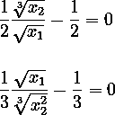
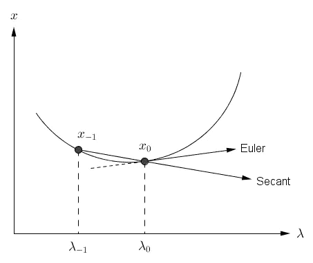
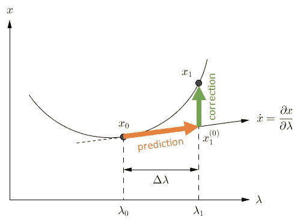
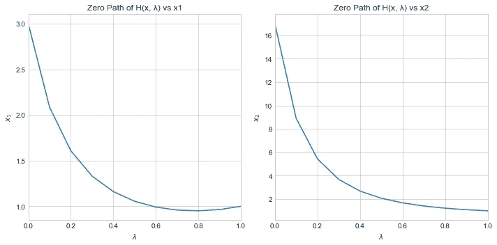
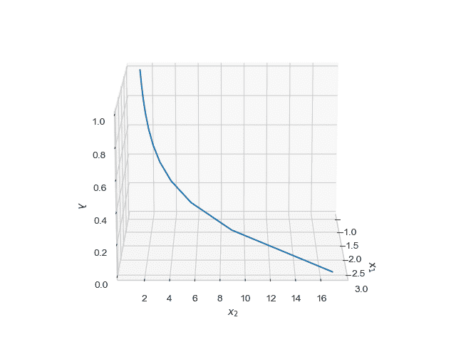

# 同伦方法:如何使用拓扑作为你的机器学习模型的优化器

> 原文：<https://towardsdatascience.com/how-to-use-topology-to-solve-systems-of-nonlinear-equations-7d6185beb73e>

## 实践教程

# 同伦方法:如何使用拓扑作为你的机器学习模型的优化器

## 是的，这是“杯子是甜甜圈”的拓扑结构！


[橘蝾螈](https://unsplash.com/@tangerinenewt?utm_source=medium&utm_medium=referral)在 [Unsplash](https://unsplash.com?utm_source=medium&utm_medium=referral) 上的照片

```
**Table of Contents**· [Another Problem Arise](#2d84)
· [Homotopy Method](#5b93)
  ∘ [Prediction](#4afb)
  ∘ [Correction](#42b5)
· [Implementation](#62b3)
  ∘ [Scenario 1: x₀ = [3, 17]](#287a)
  ∘ [Scenario 2: x₀ = [40, 3]](#64de)
· [Conclusion](#66b8)
```

# 另一个问题出现了

在之前的[故事](/an-efficient-hybrid-algorithm-to-solve-nonlinear-least-squares-problems-262801bcfe25)中，我们已经实现了一种高效的技术，它优化了模型的参数，以恰当地适应数据集。我们使用了一个称为*残差平方和*的损失函数，这与许多机器学习模型的工作方式类似。现在让我们提出另一种问题。在这个故事中，我们将使用优化方法来解决一个非线性方程组。首先，导入一些库。

具体来说，下面是*x*=【*x₁，x₂* 】需要求解的方程:



显然，它们是非线性的。

在继续之前，让我们用好的替换法来解方程。根据第一个等式，我们有


从第二个，我们获得


因此，


仅满足 *x₂ = 0* 或 *x₂ = 1* 。既然从第二个等式我们不能得到 *x₂ = 0* ，那么 *x₂* 一定是 *1* 。反过来，我们也得到了 *x₁* 是 *1* 。所以，我们要的解是 *x** = [ *1，1* ]。

</an-efficient-hybrid-algorithm-to-solve-nonlinear-least-squares-problems-262801bcfe25>  

# 同伦方法


与球体同形的有斑点的动物。GIF 由 [Keenan Crane](http://www.cs.cmu.edu/~kmcrane/Projects/ModelRepository/) 制作。

现在我们采用一种更通用的方法来解决这个问题，使用所谓的同伦。

> 同伦，在数学中，是通过研究在区域中可以画出的不同类型的路径来对几何区域进行分类的一种方法。具有公共端点的两条路径称为同伦，如果一条路径可以连续变形为另一条路径，而端点保持不变并保持在其定义的区域内。

从一个拓扑空间到另一个拓扑空间的两个连续函数称为*同伦*如果一个可以“连续变形”到另一个。如果你想深入同伦，有一整个数学分支叫做*拓扑*。


两条虚线[路径](https://en.wikipedia.org/wiki/Path_(topology))相对于它们的端点是同伦的。动画展示了一个可能的同伦。图片由 Jim.belk，[公共领域](https://commons.wikimedia.org/w/index.php?curid=15513576#/media/File:Homotopy.gif)。

用*f*:*ℝⁿ*→*ℝⁿ*表示一个非线性方程组，我们的任务是找到满足*f*(*x **)=*0*的解 *x* ∈ *ℝⁿ* 。参考我们的问题，这个系统可以这样写。

为了解决这个问题，我们通过在 *F* 上插入一个延拓参数 *λ* 来构建一个同伦函数 *H* ( *x，λ* )。通常，线性同伦方程可以写成初始和目标系统的线性组合，也就是说，


用 *λ* ∈ [ *0，1* ]， *p* ( *x* )为初始系统， *F* ( *x* )为目标系统。定义初始系统有几种方法，其中两种是:

1.  定点同伦:*p*(*x*):=*x*—*x₀*，隐含


2.牛顿同伦:*p*(*x*):=*f*(*x*)—*f*(*x₀*)，言下之意


用*x₀*∑*ℝⁿ*是 *x* 的初始估算点。在这个故事中，我们使用牛顿同伦。

注意，既然 *H* ( *x₀，0* ) = *0* ，那么 *x₀* 就是初始系统的一个解(当 *λ* = *0* )。还有，既然 *H* ( *x*，1*)=*F*(*x **)=*0*，那么 *x** 就是目标系统*F*(*x*)=*0*(当【T75 同伦方法的思想是通过将初始系统变形为目标系统来找到*x **——我们知道这个解是 *x₀* 。

所以，为了找到目标系统的解 *x** ，我们首先通过设置 *λ₀* = *0* 找到初始系统的解 *x₀* 。但是找到 *x₀* 很容易，因为任意的 *x₀* 满足 *H* ( *x，0* ) = *0* 。这意味着我们可以选择任何起始迭代 *x₀* 。然后， *λ₀* 向 *λ₁* 移动δ*λ*距离 *1* 更近。在这个故事中，我们用δ*λ*=*0.1*。一个新的同伦 *H* ( *x，λ₁* )出现了一个解 *x₁* 。为了找到 *x₁* ，我们遵循两步过程:*预测*和*校正*。

## 预言；预测；预告


由 slidesgo / [Freepik](http://www.freepik.com) 设计

在点( *λ₀，x₀* )处建立图形 *H* ( *x，λ* )的切线，然后计算斜率。设梯度为 *ẋ₀* 。假设这条切线与直线 *λ* = *λ₁* 相交于(*x₁*⁽*⁰*⁾*，λ₁* )。根据定义，


以便


现在唯一的问题是，如何计算 *x₁* ⁽ *⁰* ⁾？有两种方法:

1.  **割线预测**。这个方法在 *λ* 的最后两次迭代中使用 *x* 的最后两次迭代。假设( *λ₋₁，x₋₁* )是我们到达( *λ₀，x₀* )之前的另一个点，那么


但是我们不希望为第一次迭代 *λ* 找到正确的( *λ₋₁，x₋₁* )。所以，在这个故事中，我们将使用第二种方法计算下面 *x₁* ⁽ *⁰* ⁾。



下一次迭代 x₁.候选的割线和欧拉预测图片由[作者](https://dwiuzila.medium.com/membership)提供。

**2。欧拉预测**。我们通过微积分的透镜来利用梯度的定义，也就是说，通过移动( *λ₋₁，x₋₁* )与( *λ₀，x₀* )如此接近，使得割线方程变成(为了一般性，我们去掉了索引 *0* ):


但是链式法则说


所以，


由于 *∂H* / *∂x* 只是雅可比矩阵 *J* ( *x，λ* )并且我们知道


然后 *J* ( *x，λ*)=*∂h*/*∂x*=*f’*(*x*)。具体针对我们的问题， *J* 可以计算如下。

项 *∂H* / *∂x* 用数值计算会更有效，所以我们通过设置来近似它


总而言之，我们得到了下面这个寻找 *ẋ* 的方程。


注意，使用欧拉预测，我们只需要当前点( *λᵢ，xᵢ* )而不是割线预测中的最后两点。

## 修正


由 [Freepik](http://www.freepik.com) 设计

让我们回到 x₀ 的迭代过程。我们从预测步骤中找到了 *x₁* 的候选人，即 *x₁* ⁽ *⁰* ⁾。你可能会奇怪为什么指数*(0)**x₁*⁽*⁰*⁾*。*你可能已经猜到了， *x₁* ⁽ *⁰* ⁾可能不满足 *H* ( *x，λ₁* ) = *0* ，所以我们需要修正一下。



计算下一次迭代 x₁.的预测和校正过程的可视化图片由[作者](https://dwiuzila.medium.com/membership)提供。

为了做到这一点，我们将使用牛顿-拉夫森方法，即通过做以下迭代。


随着


对于 *i* = *0，1，2，…* 。

通过最小化ǁǁ，这个迭代有希望收敛到某个 x₁。在这个故事中，迭代继续，直到达到停止条件ǁ*h*ǁ<t96】1×*10⁻⁵*。

如果牛顿-拉夫森方法不收敛，这意味着δ*λ*太大，我们可以通过设置δ*λ*:=δ*λ*/*2*使用更小的δ*λ*来重新开始最后的预测和校正步骤。如果到第 1000 次迭代时停止条件仍未达到，我们称之为迭代不收敛。

校正步骤的收敛表明我们已经找到了满足 *H* ( *x，λ* ) = *0* 的 *x₁* 和 *λ₁* 。之后，我们重置δ*λ*=*0.1*，并使用与之前相同的过程计算 *x₂* 和*λ₂*=*λ₁*+δ*λ*。如此反复进行，直到对于某些 *n* 来说 *λₙ* = *1* ，因此 *xₙ* = *x** 就是*f*(*x*)=*0*的解。

下面是完整的同伦法。

# 履行

我们将使用不同的初始值 *x₀* 模拟两种场景:

*   *x₀* = [ *3，17* ]
*   *x₀* = [ *40，3* ]

这些值完全是随机的，读者也可以尝试其他值。

在继续之前，让我们创建两个 python 函数来绘制*零路径*。什么是零路径？是 *H* ( *x，λ* ) = *0* 的点的轨迹。

## 场景 1: x₀ = [3，17]

```
Initial condition: λ = 0.00, x = [ 3 17]Iteration: 1 	 λ = 0.10 	 x = [2.0854 8.9188]
Iteration: 2 	 λ = 0.20 	 x = [1.6078 5.4471]
Iteration: 3 	 λ = 0.30 	 x = [1.3307 3.6865]
Iteration: 4 	 λ = 0.40 	 x = [1.1606 2.6885]
Iteration: 5 	 λ = 0.50 	 x = [1.0546 2.0763]
Iteration: 6 	 λ = 0.60 	 x = [0.9911 1.6789]
Iteration: 7 	 λ = 0.70 	 x = [0.9585 1.4101]
Iteration: 8 	 λ = 0.80 	 x = [0.9507 1.2234]
Iteration: 9 	 λ = 0.90 	 x = [0.9647 1.092 ]
Iteration: 10 	 λ = 1.00 	 x = [1\. 1.]
Solution found: x = [1\. 1.]
```



2D 表象中场景 1 的同伦函数的零路径。图片由[作者](https://dwiuzila.medium.com/membership)提供。



3D 表示中场景 1 的同伦函数的零路径。图片由[作者](https://dwiuzila.medium.com/membership)提供。

我们看到同伦方法在 10 次迭代后设法找到了解 *x** = [ *1，1* ]，每一步δ*λ*=*0.1*，找到了临时解 *xₙ* 。即该算法成功地最小化了ǁ *H* ǁ，使得每次迭代ǁ*h*ǁ<t82】1×*10⁻⁵*，并成功地从 *λ* = *0* 连续通过 *H* 的零路径运行到 *λ* = *1* 。

## 场景 2: x₀ = [40，3]

```
Initial condition: λ = 0.00, x = [40  3]Iteration: 1 	 λ = 0.10 	 x = [-8.7943  0.5573]
Iteration: 2 	 λ = 0.20 	 x = [nan nan]
Solution not found. Try other initial value of x.
```

在牛顿-拉夫森方法无法找到收敛到 *x₂* 的解之前，同伦方法仅成功运行 1 次迭代，直到 *λ₁* = *0.1* 与 *x₁* = [ *-8.79，0.56* ]。这是因为雅可比矩阵 *J* 在第二次迭代中是奇异的。由此可见，在用同伦法求解方程组*f*(*x*)=*0*时，初始变量 *x₀* 的选取是需要考虑的重要事情之一。

# 结论

我们一直在用同伦方法来寻找一个非线性方程组的解。同伦方法的思想是将一个我们知道其解的初始系统变形为我们想要的最终系统。变形过程产生同伦函数的零路径，该零路径可能不连续，这取决于初始系统。用这种方法，我们发现我们给定的方程组的解是 *x** = [ *1，1* 。


🔥*你好！如果你喜欢这个故事，想支持我这个作家，可以考虑* [***成为会员***](https://dwiuzila.medium.com/membership) *。每月只需 5 美元，你就可以无限制地阅读媒体上的所有报道。如果你注册使用我的链接，我会赚一小笔佣金。*

🔖*想了解更多关于经典机器学习模型如何工作以及如何优化其参数的信息？或者 MLOps 大型项目的例子？有史以来最优秀的文章呢？继续阅读:*


[艾伯斯·乌兹拉](https://dwiuzila.medium.com/?source=post_page-----7d6185beb73e--------------------------------)

## 从零开始的机器学习

[View list](https://dwiuzila.medium.com/list/machine-learning-from-scratch-b35db8650093?source=post_page-----7d6185beb73e--------------------------------)8 stories

[艾伯斯·乌兹拉](https://dwiuzila.medium.com/?source=post_page-----7d6185beb73e--------------------------------)

## 高级优化方法

[View list](https://dwiuzila.medium.com/list/advanced-optimization-methods-26e264a361e4?source=post_page-----7d6185beb73e--------------------------------)7 stories

艾伯斯·乌兹拉

## MLOps 大型项目

[View list](https://dwiuzila.medium.com/list/mlops-megaproject-6a3bf86e45e4?source=post_page-----7d6185beb73e--------------------------------)6 stories

[艾伯斯·乌兹拉](https://dwiuzila.medium.com/?source=post_page-----7d6185beb73e--------------------------------)

## 我最好的故事

[View list](https://dwiuzila.medium.com/list/my-best-stories-d8243ae80aa0?source=post_page-----7d6185beb73e--------------------------------)24 stories

[艾伯斯·乌兹拉](https://dwiuzila.medium.com/?source=post_page-----7d6185beb73e--------------------------------)

## R 中的数据科学

[View list](https://dwiuzila.medium.com/list/data-science-in-r-0a8179814b50?source=post_page-----7d6185beb73e--------------------------------)7 stories[](https://dwiuzila.medium.com/membership)