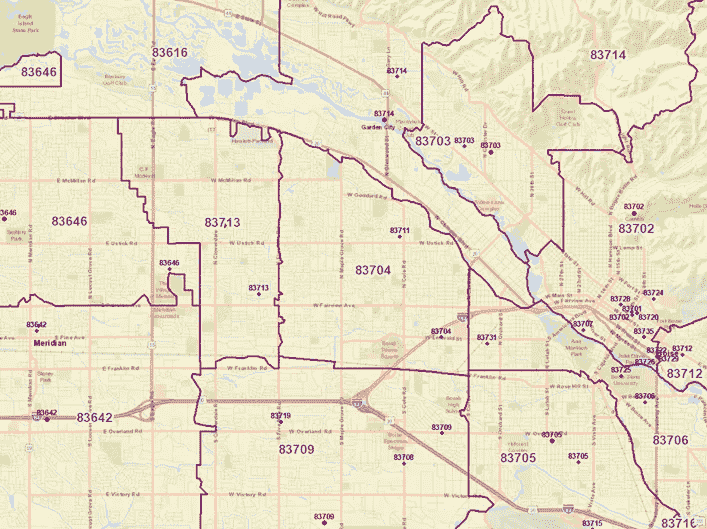

# 如何在建模和预测中使用美国邮政编码数据？

> 原文：<https://towardsdatascience.com/how-to-use-us-zip-code-data-in-modeling-and-forecasting-602312b5e606>

**简介**

美国的五位数邮政编码数据是供应链和运输模型中最流行的模型粒度之一。我们有时会听到分析师和科学家抱怨“遗漏的邮政编码”或邮政编码界限不一致。许多模型都有遗漏邮政编码的问题，这导致输出的准确性很差。在本文中，我们试图为如何在规划和预测中使用邮政编码数据提供指导。

地图 1:一个邮政编码的三种数据类型的空间表示:爱达荷州博伊西市中心所有邮政编码的边界(紫色)、质心(紫色)和邮政编码点(深蓝色)。“作者提供的图像”

正如您在地图 1 中看到的，一个区域中有多个邮政编码 ID(点和面)，并且不是所有的 ID 都与面相同。如果我们不区分显示为 pints 和 polygon 的 ZIP ID，这可能会影响模型输出。你可能会想什么是邮政编码，什么是邮政编码边界？让我们对邮政编码有一个明确的定义。

**邮政编码定义**:

邮政编码在 20 世纪 60 年代首次引入，其发展是为了帮助邮政服务改善全国范围内的邮件分发。尽管邮政编码是根据地区分类设施统计的，但地理边界**在技术上并不存在**。拉链实际上是标识递送点(即街道地址或邮局)的名称，而不是任何定义的边界区域。美国海军就是这种“无地”称呼的最好例子，它有自己的邮政编码，但没有固定的位置。因此，邮政编码边界可能**不连续、未定义或不存在**。换句话说，创建一个真正有代表性的地图相当困难，而且确实存在的邮政编码地图也不全面。更大的问题是，邮政编码会改变——但这是以后的事了。

换句话说，邮政编码区域或边界或多边形是美国邮政服务(USPS)邮政编码的近似区域表示。USPS 定期更改邮政编码，以支持更高效的邮件投递。他们将变化发布到老虎普查[网站](https://catalog.data.gov/dataset/tiger-line-shapefile-2018-2010-nation-u-s-2010-census-5-digit-zip-code-tabulation-area-zcta5-na)[【1】](https://w.amazon.com/bin/view/Main/AMZL/ZIPCode_Data_for_Planning_and_Forecasting/#_ftn1)上，但与实际存在的街区边界不同，邮政编码边界并不正式存在！是的，你没看错！ZIP 边界可以跨越道路、街区、河流或任何其他要素。这是邮政编码边界的性质，因为我们在空间上有新的发展。在美国，有时一个邮政编码边界可能会跨越一个大包裹，一所房子可能有两个邮政编码，城市和县纠正这些问题。在某些国家/地区，邮政编码边界表示为道路周围的缓冲区或街区内的几何形状。

这就是为什么我们有时会从供应链中的网络规划者或运输分析师那里听说**“遗漏的邮政编码”**实际上并不是遗漏的邮政编码，事实上它们是被识别为四种主要邮政编码类型之一的**点邮政编码**。你应该知道，在美国大约 42K 的邮政编码中，我们有大约 10K **点**的邮政编码，只有大约 32K 的邮政编码有物理边界。因此，我们可以以表格格式显示大约 42K 的邮政编码 ID，其中大约 32K 具有来自 USPS/Census/County 的边界的空间格式。别忘了每个国家都有自己的邮政编码系统。在不知道多个国家的邮政编码系统的情况下，运行一个消耗这些国家的邮政编码 ID 的模型是不可能的。例如，英国和阿联酋与我们有非常不同的邮政编码系统。让我们回顾一下邮政编码类型。

**邮政编码类型:**

邮政编码有四种主要类型:**邮政信箱、唯一、军事和标准**。还有其他类型的邮政编码，如**非唯一、唯一组织**。这些邮政编码的定义如其类型中所述。邮政信箱位于邮局本身；唯一代码指的是个人地址；美国海外军事基地有国内邮寄地址；标准代码表示所有其他的东西(即“正常”的)。因此，邮政信箱、唯一和军事邮政编码可以是位于另一个邮政编码内的点。

**问题解决了！**

“遗漏的邮政编码”位于具有空间边界的邮政编码内。不要忘记当房地产开发商公司从城市或县获取邮政编码时的新发展，但它不是寻址系统的正式组成部分。目前~10K 点邮政编码存在于美国，它位于一个邮政编码多边形内。无论何种类型，每个邮政编码 id 都有一个“结束邮政编码”,显示该邮政编码所在的位置。我们还可以通过邮政编码边界和邮政编码点之间的空间连接来定位它们。当我们使用邮政编码时，我们应该使用邮政编码。

**如何使用数据？**

如上所述，我们有两个邮政编码数据集:

1.  点邮政编码(~42K 记录)。该数据集包含邮政编码 ID、邮政编码类型和邮政编码结尾字段。邮政编码 Id 可以帮助您查找表格格式的数据和信息，例如卷。结束邮政编码用于定位邮政编码多边形内的邮政编码点，该多边形具有用于路由目的的物理边界。
2.  多边形邮政编码(~32K 记录)。该数据集具有邮政编码的空间边界，并包含所有邮政编码结束 id。运行任何需要距离邮政编码的模型或搜索时，都必须输入它。该数据集与 Tableau 为 ZIP 映射提供的数据集相同。

**注意:**邮政编码可能包括客户数据，如客户地址和姓名。对于生产中使用和映射此**点**邮政编码的任何应用程序，都需要与您的 IT 安全团队进行讨论。如果点邮政编码被映射到一个邮政编码面，它不再被归类为红色数据！

最后，不要使用任何你在互联网上找到的邮政编码数据！谷歌地图、Zillow、Redfin 等都不是邮政编码数据的真实来源。您应该从市、县或其他地方政府或联邦机构的网站下载邮政编码数据(end。gov)。Tableau 和 ESRI 在他们的服务器上有这些数据。下面是一个参考链接，你可以找到可靠的邮政编码数据。下次，当你的客户带着他们在谷歌地图上找到的不同的邮政编码边界来找你时，只要给他们看下述资源中正确的正式邮政编码边界就行了。Medium 中还有一篇精彩的论文解释了如何下载数据，见[https://Medium . com/@ sahilkashyap 64/USA-zip code-boundary-ccbdcfd 0af 8](https://medium.com/@sahilkashyap64/usa-zipcode-boundary-ccbdcfd0af8)

**参考文献**

*   [https://www . census . gov/programs-surveys/geography/guidance/geo-areas/zctas . html](https://www.census.gov/programs-surveys/geography/guidance/geo-areas/zctas.html)
*   [https://catalog . data . gov/dataset/tiger-line-shape file-2018-2010-nation-u-s-2010-census-5-digit-ZIP-code-table-area-zct a5-na](https://catalog.data.gov/dataset/tiger-line-shapefile-2018-2010-nation-u-s-2010-census-5-digit-zip-code-tabulation-area-zcta5-na)
*   https://www.unitedstatesZIPcodes.org/
*   【https://www.policymap.com/ 
*   [https://www . ESRI . com/en-us/ArcGIS/products/tapestry-segmentation/ZIP-lookup](https://www.esri.com/en-us/arcgis/products/tapestry-segmentation/zip-lookup)