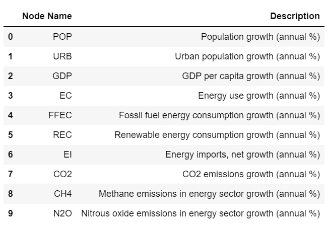
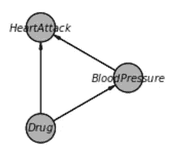
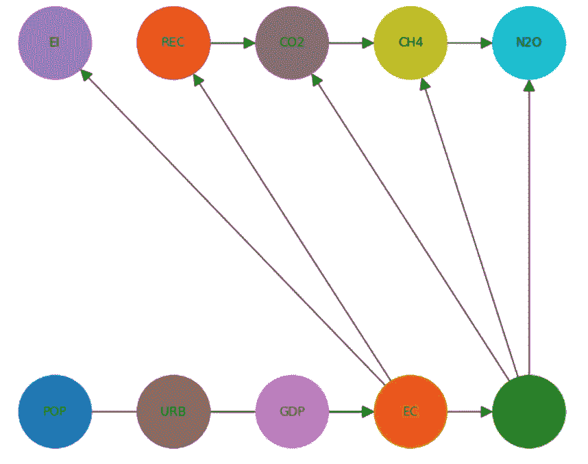
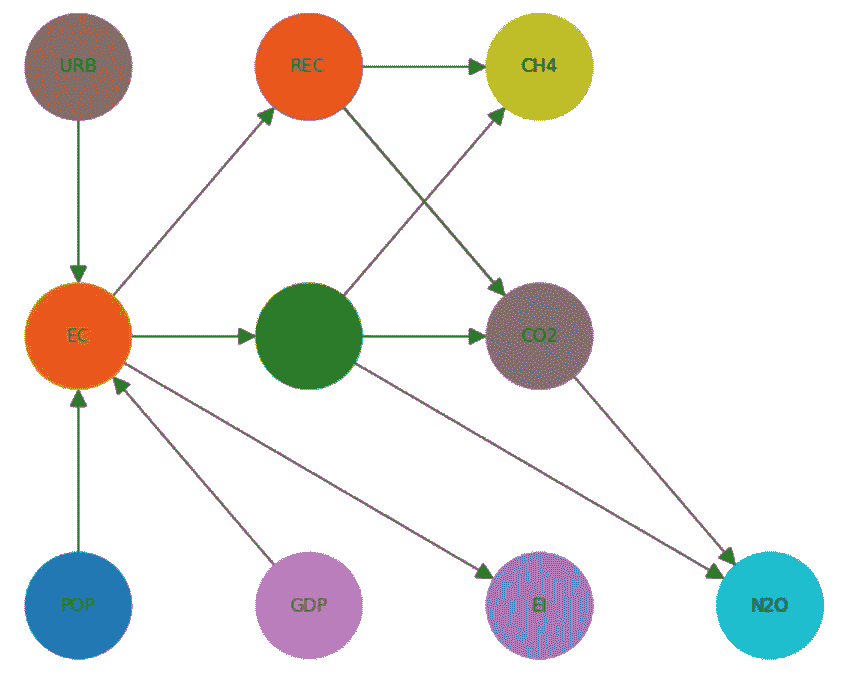
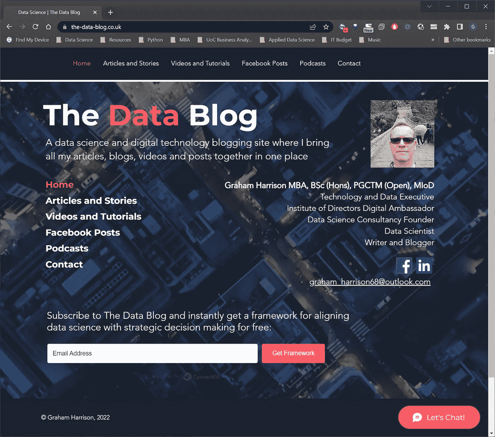

# 如何用交互式有向无环图可视化因果推理模型

> 原文：<https://towardsdatascience.com/how-to-visualise-causal-inference-models-with-interactive-directed-acyclic-graphs-8dd648a64915>

## 如何用一行 Python 代码生成交互式有向无环图来可视化和理解因果推理模型

Photo by [愚木混株 cdd20](https://unsplash.com/@cdd20?utm_source=unsplash&utm_medium=referral&utm_content=creditCopyText) on [Unsplash](https://unsplash.com/s/photos/question-mark?utm_source=unsplash&utm_medium=referral&utm_content=creditCopyText)

## 背景

因果推理是目前非常热门的话题，因果模型开始成为更传统的回归、分类和预测模型的非常有用的补充。

> 越来越多的客户希望能够可视化和理解模型预测背后的潜在原因和影响，以帮助回答“为什么？”，“如果呢？”以及“下一步是什么？”类型问题。

这个困境促使我编写了一个 Python 代码库，提供了 3 种可视化有向无环图(Dag)的可选方法，作为满足这些客户需求的解决方案的一部分。

## 你将学到什么

> 到本文结束时，您将能够用一行 Python 代码生成嵌入在 Jupyter 笔记本单元格中的完全交互式有向无环图，并且您将能够完全访问源代码和文档！

作者图片

在我们深入 DAG 观想之前，请考虑…

[通过我的推荐链接](https://grahamharrison-86487.medium.com/membership)加入 Medium(如果你使用此链接注册，我将收取一定比例的费用)。

[每当我发表一个新故事时，订阅一封免费电子邮件](https://grahamharrison-86487.medium.com/subscribe)。

[快速浏览我之前的文章](https://grahamharrison-86487.medium.com/)。

[下载我的免费战略数据驱动决策框架](https://relentless-originator-3199.ck.page/5f4857fd12)。

访问我的数据科学网站— [数据博客](https://www.the-data-blog.co.uk/)。

…如果你对因果推理感兴趣，这是本系列的其他文章-

</how-to-generate-synthetic-data-for-any-causal-inference-project-in-less-than-10-lines-of-code-158688a89349>  </a-simple-explanation-of-causal-inference-in-python-357509506f31>  

## 入门指南

我们需要的第一件事是一些测试数据，这些数据可以用来构建因果推理模型和演示 Dag。

我选取了一些意大利 1960 年到 2019 年之间二氧化碳排放的[数据。数据来源于](https://github.com/grahamharrison68/Public-Github/blob/master/Causal%20Inference/data/italy_greenhouse_gases.xlsx)[世界数据库](https://data.worldbank.org/)，该数据库根据[知识共享 4.0 国际许可](https://creativecommons.org/licenses/by/4.0/)公开提供数据集。

作者图片

数据以百分比表示增长，并以四分位数表示。例如，1960 年世界人口增长率在 0.606%和 1.994%之间。

特征说明(流行音乐、URB 音乐等。)如下-

作者图片

## 构建有向无环图

DAG 的结构可以通过使用几种程序性因果发现技术中的一种或者通过利用领域专家的专业知识来推断。

这个过程超出了本文的范围，所以现在我们假设意大利温室气体 DAG 的结构可以定义如下

在这个阶段，我们已经通过创建一个保存节点之间链接的`BayesianNetwork`定义了 DAG，但是很难想象节点是如何连接的以及因果链接是什么。

# “愚蠢”的网络图

我的第一个想法是利用直接在`pgmpy`库中的`BayesianNetwork`类中实现的“愚蠢”的图表，因为它们快速且易于使用，其外观和感觉非常类似于 Judea Pearl & Dana Mackenzie 的《为什么之书》中的示例

作者图片

到目前为止，一切都很好，但是看看当一个更复杂的网络，比如意大利温室气体的例子，用 daft 渲染时会发生什么…

作者图片

daft 图表的默认布局是“圆形”。可以更改默认值，也可以更改节点位置，但是无论您如何修改参数，结果都不适用于复杂的网络。

> 下面的代码片段是作为对我的`dag_tools`库的调用编写的。本文末尾给出了对该库以及所有源代码和文档的完整访问，因此您可以自己轻松地为任何因果推理模型创建 Dag。

# 网络 x 图

愚蠢的网络图的缺点导致我探索另一个图形库来呈现 DAG—【https://networkx.org/】()—

作者图片

对于温室气体数据，默认的“弹簧”布局将一些节点放置在彼此的顶部，使得阅读和解释非常困难。

这导致了我的`dag_tools`库的进一步改进，使节点位置能够被显式指定...

作者图片

指定节点位置意味着节点不会互相重叠，因此我们可以真正开始观想和理解因果。

然而，仍有改进的余地。

为了能够指定节点的位置，我们几乎需要在可视化发生之前理解节点是如何连接的。

这个缺点导致了我用自己的布局算法对`dag_tools`库的进一步扩展，该算法可以自动将节点放置在指定数量的列中...

作者图片

这是 DAG 的更好的可视化，不需要对节点之间的链接进行任何预先分析。

例如，在这种安排中，很容易看出 FFEC(化石燃料消耗)导致 CO2(二氧化碳排放)、CH4(甲烷排放)和 N2O(一氧化二氮排放)。

然而，这种方法有一个很大的缺点，它不是交互式的。

## 皮维斯图

我在网上看过各种与`pyvis`网络图相关的教程，这让我想知道我是否可以使用`pyvis`来使 Dag 能够被交互式地探索和定位。

这导致了将`display_pyvis_model`添加到我的`dag_tools`库中，这花了很长时间才做好，特别是因为我真的希望能够将网络图完全嵌入到 Jupyter 笔记本的单元输出中。

以下是最终结果…

作者图片

这提供了一种直观、简单的方式来理解节点之间的关系，只需拖动它们，直到箭头没有交叉或重叠。

但是仍然有一些问题-

*   `pyvis`很难控制，文档可能很复杂(使用`dag_tools.display_pyvis_model`可以解决这个问题)。
*   初始布局不一致，不可控；每次运行代码时，节点位置都会不同。
*   能够保存节点的最终位置是非常好的，但是目前在`pyvis`中没有办法做到这一点。

然而`dag_tools.display_pyvis_model`提供了一个可视化 Dag 的好方法，我已经在生产项目中成功地使用了很多次，客户真的很喜欢最终的结果。

## 源代码

完整的源代码可以在[这里](https://gist.github.com/grahamharrison68/0e8e5421d1835bd3ea77a9eac4abee34)找到，文档可以在[这里](https://raw.githack.com/grahamharrison68/Public-Github/master/Causal%20Inference/files/dag_tools.html)找到。

如果你决定下载并使用代码，如果你能考虑给我买杯咖啡就太好了-

## 结论

构建因果模型的一个重要步骤是可视化和理解有向无环图，该图表示数据中的因果关系流。

本文展示了`daft`、`networkx`和`pyvis`的优缺点，并提供了`dag_utils`库，使得任何因果模型的开发人员只需要一行 Python 代码就可以创建一个完全交互式的 DAG。

如果你喜欢这篇文章，请考虑…

[通过我的推荐链接](https://grahamharrison-86487.medium.com/membership)加入 Medium(如果您使用此链接注册，我将收取一定比例的费用)。

<https://grahamharrison-86487.medium.com/membership>  

[每当我发布新故事时，订阅一封免费电子邮件](https://grahamharrison-86487.medium.com/subscribe)。

[快速浏览我之前的文章](https://grahamharrison-86487.medium.com/)。

[下载我的免费战略数据驱动决策框架](https://relentless-originator-3199.ck.page/5f4857fd12)。

访问我的数据科学网站— [数据博客](https://www.the-data-blog.co.uk/)。

作者图片