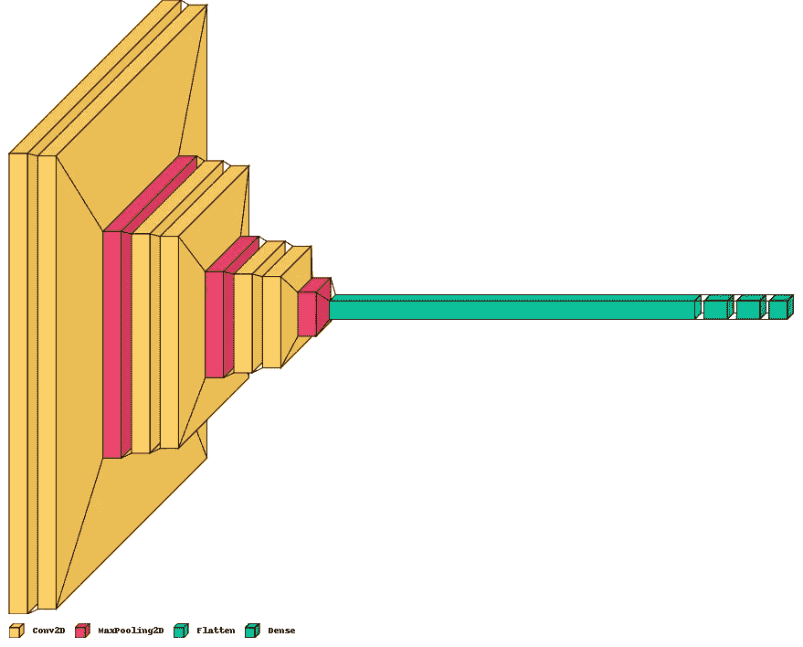
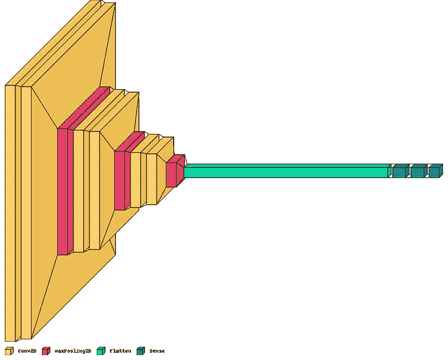
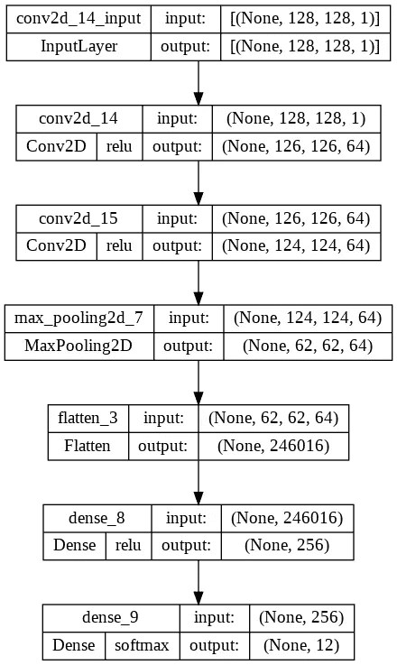

# 如何用 Python 可视化神经网络架构

> 原文：<https://towardsdatascience.com/how-to-visualize-neural-network-architectures-in-python-567cd2aa6d62>

## 使用 Jupyter 或 Google Colab 创建神经网络图示的快速指南



Image Credit —由作者使用 visualkeras 和 Jupyter Notebook 开发。

# 1.介绍

通常，在使用人工神经网络或其他变体(如卷积神经网络或递归神经网络)时，我们希望可视化并创建编译模型的图形表示。这可以解决两个目的:

1.  而定义和训练多个模型允许我们可视化我们的模型的深度，并比较不同的层以及它们是如何顺序放置的。
2.  允许更好地理解模型结构、每层中使用的激活函数、每层的形状(神经元的数量)以及需要训练的参数

python 中有几个现成的包可以创建我们的神经网络模型的可视化表示。**前三个包甚至可以在模型训练之前使用(模型只需要定义和编译)；然而，Tensor Boards 要求用户在可视化架构之前，根据准确的数据训练模型。**

1.  [安可视化器](https://github.com/RedaOps/ann-visualizer)
2.  [视觉角膜](https://github.com/paulgavrikov/visualkeras)
3.  [Keras 模型图](https://keras.io/api/utils/model_plotting_utils/)
4.  [张量板](https://www.tensorflow.org/tensorboard/graphs)

# 2.安装快速指南

```
pip install visualkeraspip install ann_visualizerpip install graphviz
```

我们不需要单独安装“张量板”和“Keras 模型图”。这将随 Tensorflow & Keras 的初始安装一起提供。

# 3.设置 Tensorflow 包

我们可能只使用下面列出的几个库。 ***大多数库可以将 TensorFlow 模型转换为图表，而无需对数据进行显式训练。你可以认为这是真理的单一来源。一些库，如 Pandas、Skimage 和 OpenCV，在读取结构化数据或图像时会派上用场。***

```
# Import necessary librariesimport pandas as pdimport numpy as np                               # Import numpyfrom skimage import data, io   # Import skimage library (data - Test images and example data.#                          io - Reading, saving, and displaying images.)from skimage.color import rgb2grayimport matplotlib.pyplot as plt                  # Import matplotlib.pyplot (Plotting framework in Python.)%matplotlib inlineimport os                                        # This module provides a portable way of using operating system dependent functionality.os.environ['TF_CPP_MIN_LOG_LEVEL'] = '3'import warnings# Suppress warningswarnings.filterwarnings('ignore')from IPython.display import displayimport cv2 as cv
from sklearn.metrics import confusion_matrixfrom sklearn.model_selection import train_test_splitfrom tensorflow.keras import utilsfrom tensorflow.keras.models import Sequential,load_modelfrom tensorflow.keras.layers import Dense, Dropout, Flatten, Conv2D, MaxPool2D, BatchNormalizationfrom tensorflow.keras.optimizers import Adamimport tensorflow as tfimport seaborn as sns
```

一些有助于从头开始探索 ANNs & CNNs 更多内容的链接。

[](/convolution-neural-network-for-image-processing-using-keras-dc3429056306)  [](/a-beginners-guide-to-artificial-neural-network-using-tensor-flow-keras-41ccd575a876)  

# 4.建立卷积神经网络模型

我们将用不同的超参数定义三个不同的 CNN 模型。理想情况下，在现实世界中，考虑到我们正在为多类别分类任务构建模型，我们的目标是实现不同的架构，以最大化准确性或任何相关指标。我们对问题类型的选择不会对如何使用可视化包产生任何影响。

我们创建了用户定义的函数，用不同数量的 CNN 层、最大池和密集层分别构建三个不同的模型。

## 4.1 -架构 1 -浅层 CNN 层+ ANN 层

```
def construct_model():model = Sequential()model.add(Conv2D(filters=64, kernel_size=(3, 3), input_shape=(128, 128, 1), activation=’relu’))model.add(Conv2D(filters=64, kernel_size=(3, 3), activation=’relu’))model.add(MaxPool2D((2, 2)))model.add(Flatten())model.add(Dense(256, activation=’relu’))model.add(Dense(12, activation=’softmax’))model.compile(loss=’categorical_crossentropy’, optimizer=’adam’, metrics=[‘accuracy’])return model
```

## 4.2 —架构 2 —深层 CNN +浅层 ANN 层

```
def sconstruct_model():smodel = Sequential()smodel.add(Conv2D(filters=64, kernel_size=(3, 3), input_shape=(128, 128, 3), activation=’relu’))smodel.add(Conv2D(filters=64, kernel_size=(3, 3), activation=’relu’))smodel.add(MaxPool2D((2, 2)))smodel.add(Conv2D(filters=128, kernel_size=(3, 3), activation=’relu’))smodel.add(Conv2D(filters=128, kernel_size=(3, 3), activation=’relu’))smodel.add(MaxPool2D((2, 2)))smodel.add(Conv2D(filters=128, kernel_size=(3, 3), activation=’relu’))smodel.add(Conv2D(filters=128, kernel_size=(3, 3), activation=’relu’))smodel.add(MaxPool2D((2, 2)))smodel.add(Flatten())smodel.add(Dense(256, activation=’relu’))smodel.add(Dense(12, activation=’softmax’))#optimizer = Adam(lr=0.001)smodel.compile(loss=’categorical_crossentropy’, optimizer=’adam’, metrics=[‘accuracy’])#model.summary()return smodel
```

## 4.3 —架构 3 —深层 CNN 和 ANN 层

```
def cconstruct_model(learningRate):smodel = Sequential()smodel.add(Conv2D(filters=32, kernel_size=(3, 3), input_shape=(128, 128, 1), activation=’relu’))smodel.add(Conv2D(filters=32, kernel_size=(3, 3), activation=’relu’))smodel.add(MaxPool2D((2, 2)))smodel.add(Conv2D(filters=64, kernel_size=(3, 3), activation=’relu’))smodel.add(Conv2D(filters=64, kernel_size=(3, 3), activation=’relu’))smodel.add(MaxPool2D((2, 2)))smodel.add(Conv2D(filters=128, kernel_size=(3, 3), activation=’relu’))smodel.add(Conv2D(filters=128, kernel_size=(3, 3), activation=’relu’))smodel.add(MaxPool2D((2, 2)))smodel.add(Flatten())smodel.add(Dense(256, activation=’relu’))smodel.add(Dense(256, activation=’relu’))smodel.add(Dense(12, activation=’softmax’))optimizer = Adam(lr=learningRate)smodel.compile(loss=’categorical_crossentropy’, optimizer=optimizer, metrics=[‘accuracy’])smodel.summary()return smodelmodel=cconstruct_model(0.001)
```

# 5.使用人工神经网络可视化工具进行可视化

一个名为 ANN Visualizer 的 Python 模块使得用几行代码可视化人工神经网络成为可能(Gheorghiu，2022)。它使用 Keras 和 Python 的 Graphviz 模块来生成一个整洁而有吸引力的神经网络图。你可以灵活地可视化整个深度学习网络，或者只是你在深度学习进展的驱动下创建的卷积神经网络(Shah，2018)。

使用下面的结构生成神经网络的 pdf 表示。但是，在此之前，我们需要对上述模型进行编译。

```
model=construct_model()
```

**ann_viz(model，view=True，filename="network.gv "，title="MyNeural Network")**

*   ***模型—*** 时序模型来自 Keras
*   ***视图—*** 调用 ann_viz()后，可视化图形
*   ***文件名—*** 文件的名称
*   ***标题—*** 表示图形的任何特定标题

```
from ann_visualizer.visualize import ann_vizann_viz(model, view=True, filename=”cconstruct_model”, title=”CNN — Model 1 — Simple Architecture”)
```


图 1:使用 ANN Visualizer 创建的 construct_model()的快照。作者使用 Jupyter 笔记本开发的图片。原始输出太大，不适合作为图像放在这里，因此这里使用了底层的快照。

# 6.使用 Visual Keras 的可视化

一个名为 Visualkeras 的 Python 工具可以更容易地查看 keras 神经网络设计(单独或作为 TensorFlow 的一部分)。大多数造型需求都可以轻松满足。卷积神经网络(CNN)从开发分层式架构中受益匪浅。大多数模型，包括简单的前馈网络，都从该模块支持的图形风格架构的生成中受益匪浅(Gavrikov，2022)。

```
model1=construct_model()model2=sconstruct_model()model3=cconstruct_model(0.009)import visualkerasfrom PIL import ImageFontvisualkeras.layered_view(model1, legend=True)visualkeras.layered_view(model2, legend=True)visualkeras.layered_view(model3, legend=True)
```



图二。展示了三种不同模型架构的图示。作者使用 Jupyter 笔记本开发的图片。

# 7.Keras 模型图

[keras.utils.plot_model](https://keras.io/api/utils/model_plotting_utils/) 提供了内置函数来绘制通过 keras 使用 Graphviz 和 pydot 包定义和编译的模型。从图形上看，它不如上面使用的包直观，但它概述了顺序模型的基本架构。

```
tf.keras.utils.plot_model(model1,to_file="model.png",show_shapes=True,show_dtype=False,show_layer_names=True,rankdir="TB",expand_nested=True,dpi=96,layer_range=None,show_layer_activations=True,)
```

需要考虑的几个超参数:

1.  ***模型:***Keras 编译的模型或模型对象的实例
2.  ***to_file:*** 图像的文件名
3.  ***show_shapes:*** 显示神经网络中各层的尺寸和形状
4.  ***显示 _ 层 _ 激活:*** 显示神经元内使用的激活功能



图 3。阐释了 tf.keras.utils.plot_model()的输出。作者使用 Jupyter 笔记本开发的图片。

# **8。张量板**

TensorBoard 是一个仪表板界面，允许用户可视化不同模型运行的日志。日志的范围可以从跟踪不同时期的任何模型验证度量，如准确性、召回率、RMSE、MAPE 和 MSE，到创建模型架构的概念图。它是一个强大的工具，可以可视化预期的模型是否与预期的设计相匹配，同时推动对如何使用操作级图来更改模型的深入了解。

为了利用这个功能，我们需要首先加载 TensorBoard，然后创建一个日志目录。

```
%load_ext tensorboardfrom datetime import datetimefrom tensorflow import keras# Define the Keras TensorBoard callback.logdir="logs/fit/" + datetime.now().strftime("%Y%m%d-%H%M%S")tensorboard_callback = keras.callbacks.TensorBoard(log_dir=logdir)
```

在训练之前，创建 Keras TensorBoard 回调并指定日志目录。通过向 model.fit()提供此回调，可以确保为 TensorBoard 可视化记录图形数据。一旦你调用 TensorBoard，它可能需要几分钟来加载。

```
model.fit(X2_train, Y2_train,batch_size=64,epochs=5,callbacks=[tensorboard_callback])
```

**注:X2_train 和 Y2_train 是未反映在上述代码中的训练数据集。您可以用自己的任何训练数据来替换它。**

TensorBoard 默认总是显示 op 级图形。(“默认”标签在左侧突出显示。)该图与代码相比是颠倒的，因为数据是从下往上流动的。但正如你所见，该图大致类似于 Keras 模型的描述，带有通向其他计算节点的附加边(Tensorflow，2022)。


图 4。显示了 TensorBoard 的输出。作者使用 Jupyter 笔记本开发的图片。

更多关于如何使用 TensorBoard 的内容可以在参考中找到。

# 9.结论

从商业角度来看，用户必须向一组利益相关者展示他们的分析，这些图表增加了讨论的复杂性。它们可能不是极端增值。然而，从学术和学习的角度来看，利用这些包来展示这些深度学习架构是有价值的。对我来说，ANN visualizer 比其他产品都突出，因为它很容易理解图表，而 TensorBoard 的图形输出需要更多的技术细节才能得到结果。

# 10.参考

Gavrikov，P. (2022，4 月 13 日)。*针对 Keras / TensorFlow 的 visualkeras】。GitHub。https://github.com/paulgavrikov/visualkeras*

t . gheorghiu(2022 年 10 月 21 日)。*安可视化器*。GitHub。[https://github.com/RedaOps/ann-visualizer](https://github.com/RedaOps/ann-visualizer)

沙阿，A. (2018 年 4 月 28 日)。*只用一行代码可视化人工神经网络*。中等。[https://towards data science . com/visualizing-artificial-neural-networks-ann-with-just-one-line-of-code-b 4233607209 e](/visualizing-artificial-neural-networks-anns-with-just-one-line-of-code-b4233607209e)

堆栈溢出。(未注明)。*机器学习——如何可视化神经网络架构？*数据科学栈交换。检索于 2022 年 10 月 29 日，来自[https://data science . stack exchange . com/questions/12851/how-do-you-visualize-neural-network-architectures](https://datascience.stackexchange.com/questions/12851/how-do-you-visualize-neural-network-architectures)

小组，k .(未注明)。 *Keras 文档:模型绘图实用程序*。keras . io . 2022 年 10 月 29 日检索，来自[https://keras . io/API/utils/model _ plotting _ utils/# modeltodot-function](https://keras.io/api/utils/model_plotting_utils/#modeltodot-function)

张量流。(2022 年 1 月 6 日)。*检查张量流图|张量板*。张量流。[https://www.tensorflow.org/tensorboard/graphs](https://www.tensorflow.org/tensorboard/graphs)

*关于作者:高级分析专家和管理顾问，帮助公司通过对组织数据的商业、技术和数学的组合找到各种问题的解决方案。一个数据科学爱好者，在这里分享、学习、贡献；你可以和我在* [*上联系*](https://www.linkedin.com/in/angel-das-9532bb12a/) *和* [*上推特*](https://twitter.com/dasangel07_andy)*；*