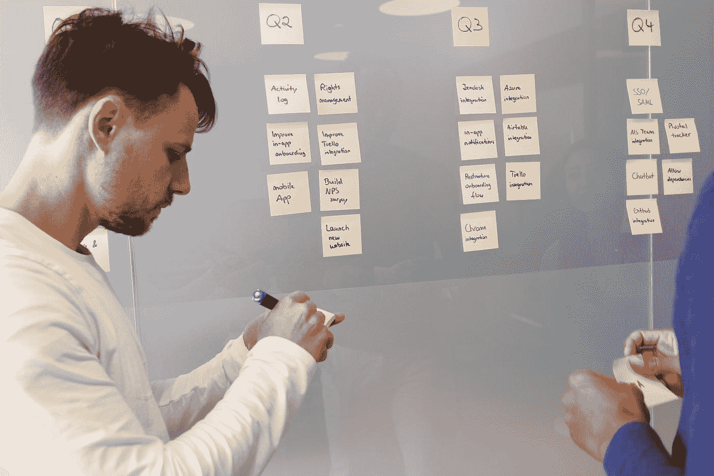

# 如何与数据科学家合作

> 原文：<https://towardsdatascience.com/how-to-work-with-a-data-scientist-211260b9ba69>

萨姆·穆卡达姆在 [Unsplash](https://unsplash.com?utm_source=medium&utm_medium=referral) 上拍摄的照片

## 给产品经理、工程师和其他队友的建议

**想象一下这个**——你是成长中的初创公司的第一位数据科学家，或者你是一位产品经理，刚刚有一位新的数据科学家加入团队，并渴望开始与他们合作。无论您的情况如何，当您的团队知道如何与他们的数据科学家有效地协作、工作和合作时，他们会做得最好。

***如何有效地与数据科学家合作？*** 没有简单的答案——这是一个非常宽泛的问题，很难准确定义，因为没有两个数据科学家、项目、团队或公司是相同的。也就是说，我想我可以分享一些在所有情况下都有用的技巧。**本文面向数据科学家以及与他们密切合作的人**—该列表包括产品经理、工程师、设计师、营销人员和操作员，但也广泛适用于对发展更多数据驱动思维感兴趣的任何人。

# 提示 1:语境是王道

布雷特·乔丹在 [Unsplash](https://unsplash.com?utm_source=medium&utm_medium=referral) 上拍摄的照片

在许多大型科技公司中，数据科学家直接**嵌入**产品团队，以确保他们拥有最大可能的背景——他们了解产品的愿景是什么，业务目标是什么，以及设计和工程试图提供什么。

这不是唯一的方法——在光谱的另一端，数据科学家更多地扮演了一个**顾问**的角色，他们只是被请来做一个特定的项目，然后带着他们所有新发现的产品知识消失，与另一个团队/项目合作。

根据公司规模和行业，一种模式可能比另一种更有意义。从我过去在脸书和 Doordash 的工作经历来看，我越来越喜欢嵌入式模型，因为它让我获得了产品领域的专业知识，并建立了更牢固的工作关系。这让我有时间了解我的团队的领域，这使我有更强的能力来识别机会，解释实验，并帮助找出产品的策略。

总结这一部分—当团队中有了新的数据科学家时，您应该尝试了解他们在团队中的角色或**背景—他们是将被直接嵌入、咨询还是介于两者之间。一旦你理解了这一点，**尽可能多地分享你自己工作的背景**，这样他们就能成功地完成自己的角色。**

# 秘诀 2:偏向长期思考

由[拍摄的照片](https://unsplash.com/@airfocus?utm_source=medium&utm_medium=referral)在[的 Unsplash](https://unsplash.com?utm_source=medium&utm_medium=referral)

数据科学家的优势之一是帮助制定长期计划。为了确保我们不会不断追逐短期问题，请考虑数据科学家在三个时间周期中的工作:

*   **每周时间段** —解释 A/B 结果或跟踪产品表现(趋势变化、指标下降、产品故障)
*   **每月时间框架** —深入了解取得最大成功所需的产品特性，或找出正确的指标进行跟踪和预测
*   **季度时间框架**—找出未来投资的最大机会，或了解产品生态系统的长期健康状况

当我们比较上面的三个时间段时，季度时间段通常是最关键的— **数据科学家的最大贡献通常是战略性的，而不是战术性的。**理想情况下，我们正在寻找一个平衡点，在这个平衡点上，我们可以花大部分时间“提前一个季度”思考我们接下来要做什么，同时确保我们做好战术决策。

将我们所有的时间都花在当前的工作流程上是短视的——这将有助于您在本地执行，但会导致未来缺乏战略理解，并导致错过关键问题或机会。

# 技巧 3:多问业务问题，少问数据问题

[廷杰伤害律师事务所](https://unsplash.com/@tingeyinjurylawfirm?utm_source=medium&utm_medium=referral)关于 [Unsplash](https://unsplash.com?utm_source=medium&utm_medium=referral) 的照片

业务问题的范围可以从战略到运营:

*   战略:我们怎样才能成为一个让车门开关司机觉得他们得到了公平报酬的地方？我们怎样才能让脸书用户更有安全感？
*   **操作:**理解实验结果，预测，理解关键指标中的意外变化，评估错误的影响

数据问题更直白:*能帮我拉一下这个指标吗？你能为我写这个查询吗？*这是我遇到的两个最常见的请求。

**询问业务问题能让每个人更好地理解，从而做出更好的决策和路线图**。问数据问题恰恰给了你想要的东西:一个数字。数据科学家喜欢更广泛的业务问题，因为它允许我们更深入地挖掘问题，并让我们感觉自己是决策制定的关键部分。

# 技巧 4:无情地划分优先级

由 [Alexander Schimmeck](https://unsplash.com/@alschim?utm_source=medium&utm_medium=referral) 在 [Unsplash](https://unsplash.com?utm_source=medium&utm_medium=referral) 上拍摄

数据科学家可以花时间做无数的事情。我们总是可以花更多的时间来尝试更准确的预测，更深入地分析实验，或者获得更多的基础知识。

这意味着我们需要分清主次。**产品团队需要决定什么是至关重要的，而不是什么是好东西——什么将改变产品的方向而不是*什么将验证或保证*。我们需要优先关注最重要的问题，而不是最有趣或最困难的问题。**

当你有疑问时，考虑一下这个问题:**我们要做的最重要的决定是什么？**如果您不知道该决策是什么，数据科学家应该能够帮助您弄清楚它是什么(*即应该调查哪些杠杆？*)。如果您确实知道决定是什么，数据科学家应该能够帮助您做出正确的决定。

# 总结想法

一个产品的用户通常比员工多很多倍——Meta 有 7 万名员工，但有数十亿用户，Doordash 有 6000 名员工和数百万消费者。数据科学是联系这些人的主要方式之一，以了解他们的经历，并确定他们希望我们下一步做什么。

如果我们作为数据科学家什么都不做，我们就必须实现这个目标。**数据是大规模用户的声音，我们的工作是弄清楚他们在告诉我们什么。**