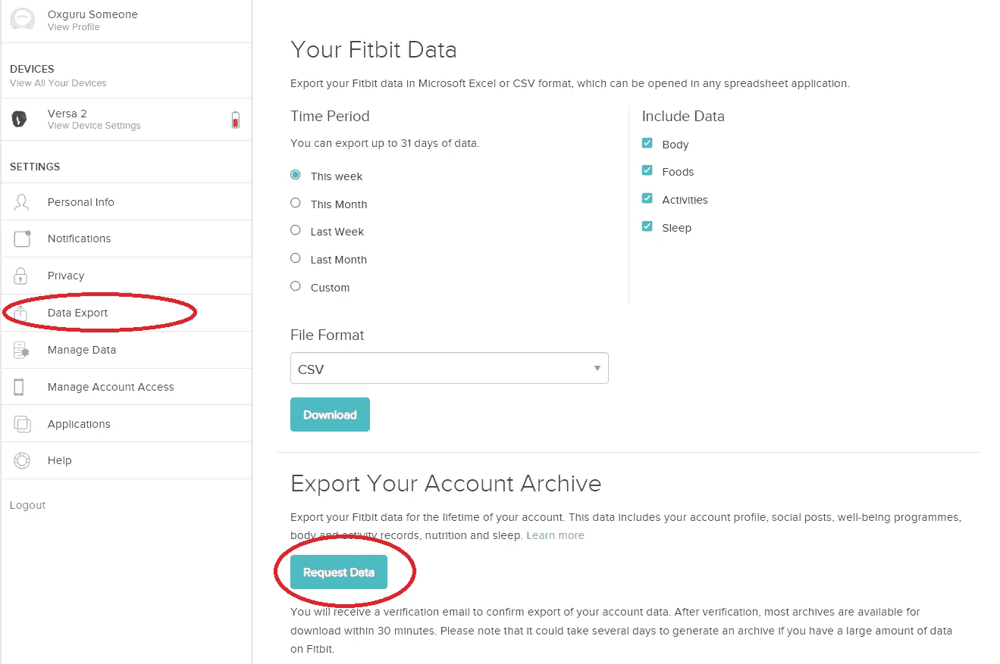
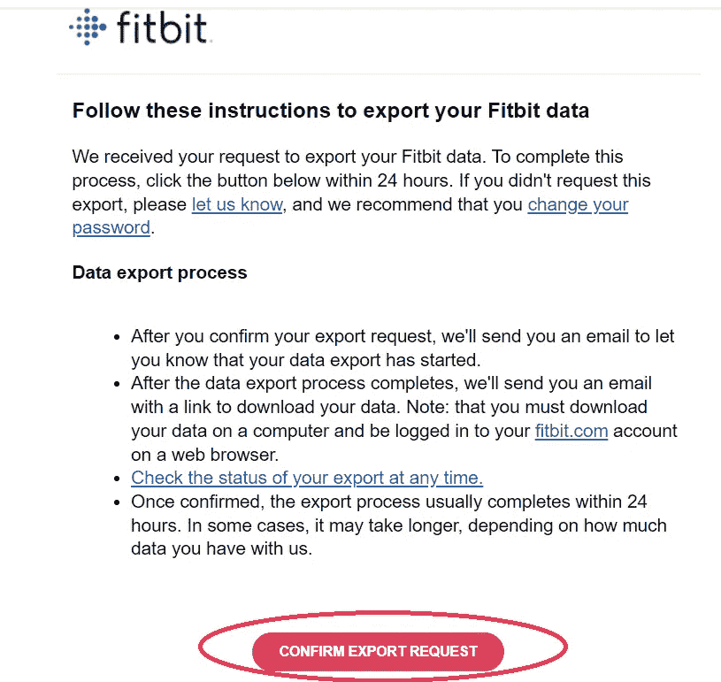
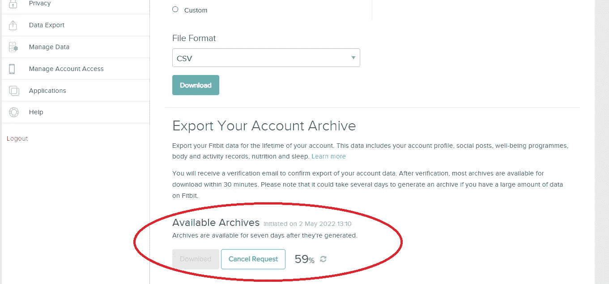
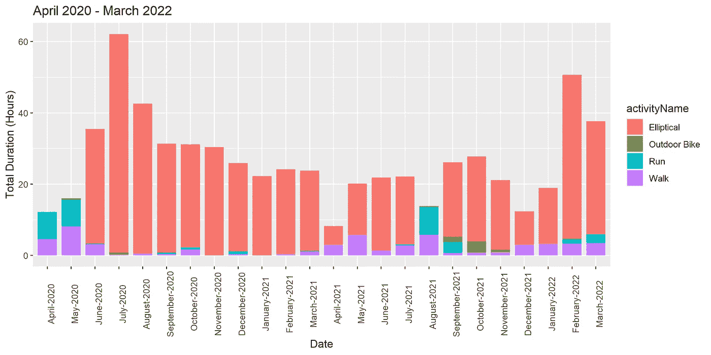
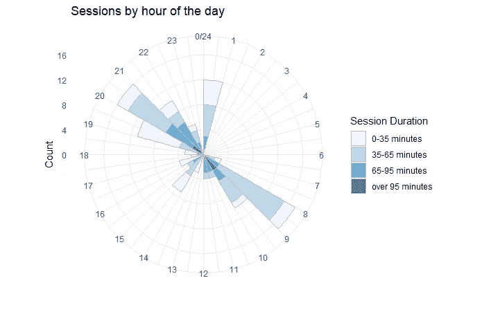
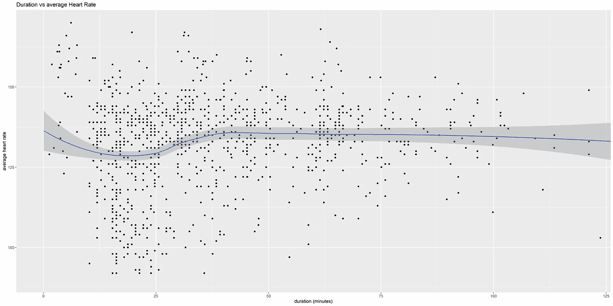
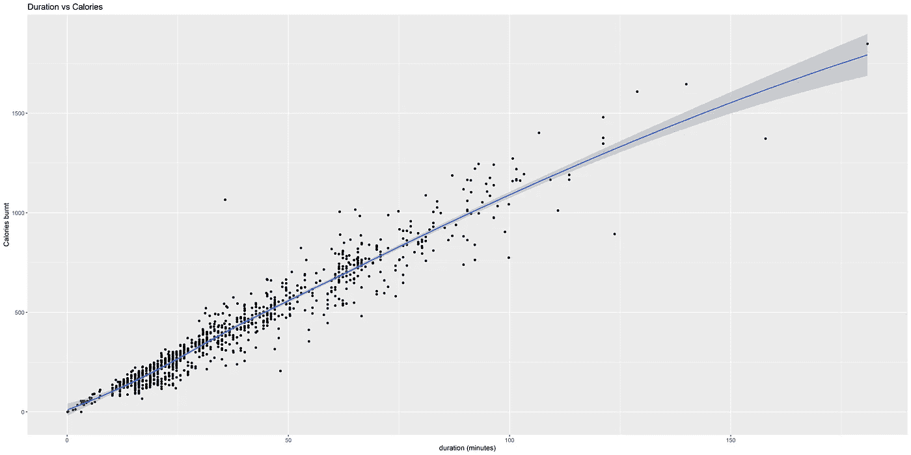

# 跟踪数据如何帮助我坚持锻炼了 2 年

> 原文：<https://towardsdatascience.com/how-tracking-data-helped-me-consistently-exercise-for-2-years-63ed82b92fc8>

## 自由复制 R 代码，开始跟踪并通过个人项目扩展您的数据科学组合，同时变得更加健康。


按活动类型分类的过去 2 年中每月每天的平均持续时间(按作者分类的图片)

用詹姆斯·克利尔的话来说，你的日常行为为你的身份提供了证据。多亏了追踪，我几乎改变了我的身份。定期锻炼现在是我生活中不可或缺的一部分。

这篇文章是写给每一个希望开始一个新的个人数据科学项目来跟踪他们的锻炼的人的。所有的代码都可以在 Github 上免费获得，你可以复制和修改。

如果你是一个有经验的程序员，即使你有不同的设备，你也可以很容易地跟上(你需要做适当的调整)。如果你是一个很少或没有编程经验的初学者，你仍然能够使用你的 Fitbit 数据实现你看到的一切。

以下是我从 2020 年 4 月 1 日到 2022 年 5 月 31 日两年旅程的总结。开始日期是疫情的开始。这与我们迎来一个女婴来到这个世界的时间不谋而合。由于国内的不确定性和重大变化，我担心这会给个人和职业带来沉重的打击。两年过去了，由于数据科学和跟踪，我对进展感到满意！


两年总结(图片由作者提供)

我总共进行了 998 次锻炼，相当于锻炼了 638 个小时。我的大部分锻炼是由椭圆训练组成的。**总的来说，这相当于两年内每天坚持锻炼 48 分钟。**

该数据也证实了(在各种活动中)跑步是消耗卡路里最省时的方法(每分钟消耗 13.7 卡路里)。**然而，总的来说，全功能训练器要好得多，因为你更有可能做得更多更久。**

# **Fitbit 分析深度剖析演练**

如果你已经拥有一台 Fitbit 设备，那么你需要做的第一件事就是下载所有的 Fitbit 数据。每个国家都有自己的司法管辖区，但通常情况下，根据法律，你有权使用你的数据，并可以要求完全访问。以下是你如何登录到你的 Fitbit 账户，并请求下载你所有的数据。

首先，去[https://accounts.fitbit.com/login](https://accounts.fitbit.com/login)用你的账户信息登录。点击右上角的设置齿轮图标(如下所示)。


登录 Fitbit 后点击设置(图片由作者提供)

进入“设置”后，点击“数据导出”并选择“请求数据”，这将下载 Fitbit 保存的所有数据(如下所示)。



点击 Fitbit 仪表盘中的“数据导出”和“请求数据”(图片由作者提供)

按照指示，它将触发 Fitbit 的自动电子邮件(如下截图)。



确认 Fitbit 电子邮件中的导出请求(图片由作者提供)

一旦您确认您确实发起了请求，数据生成过程将开始。



Fitbit 数据导出处理(图片由作者提供)

## **Fitbit 的数据结构**

从 Fitbit 下载的数据将以单个 zip 文件的形式出现。一旦你解压它，它将有 12 个不同的文件夹。您可以在每个文件夹中找到的相关自述文件中找到有关每个文件夹内容的更多信息。根据设备的用途，许多文件夹可能是空的(这完全没问题！).

出于本文的目的，我们将关注名为**“身体活动”**的文件夹中的选定文件。该文件夹包含几乎所有与身体活动相关的数据，包括以下数据:

-活动区域时间(每月一个文件，CSV 格式)

-练习类型和持续时间(每 100 节课一个 JSON 格式的文件)

-心率(每天一个 JSON 格式的文件)

-VO2 最大数据(以 JSON 格式存储)

-不同心率区间的持续时间(JSON 格式，每天一个文件)

正如您所注意到的，大多数数据都是以 JSON 格式存储的。

## **JSON Lite 库和 JSON 数据格式**

JavaScript Object Notation(缩写为 JSON)是一种用于存储结构化数据的开放标准文件格式。这种格式是人类可读的，由属性-值对和数组组成。JSON 文件格式以扩展名”存储。json”。现在设备将数据存储在 JSON 中非常普遍。这种格式与语言无关，您使用的大多数软件都可能包含现有的代码库来生成和读入(解析)JSON 文件。

这里有一个 JSON 文件的例子(run_vo2_max- *date* )，你可以在你的身体活动文件夹中找到。


JSON 格式示例(图片由作者提供)

在我们可以分析 Fitbit 数据之前，我们需要将它读入 r。我们将使用 r 免费提供的“jsonlite”库。如果您以前没有使用过这个库，请首先从 RStudio 中安装它。安装完成后，加载库。

我们将使用的另外三个库是 lubridate、dplyr 和 ggplot2。dplyr 和 ggplot2 是 tidyverse 生态系统的一部分，一旦你加载“tidyverse”，它们就会自动加载。

```
rm(list=ls())
library(jsonlite)
library(tidyverse)
library(lubridate)
```

dplyr 用于数据角力，ggplot2 用于数据可视化，lubridate 是一个方便的操作日期的库。您将很快看到帮助跟踪锻炼数据的实际例子！

## 导入数据并存储在数据帧中

现在让我们看一下实际的代码。所有这些代码都可以从 [GitHub](https://github.com/syedahmar/Fitbit-analysis) 下载。

我们将查看位于“体育活动”文件夹中的练习文件。Fitbit 自动在每个练习文件中存储 100 个会话。您可以直观地查看文件名，以确定您拥有的全部练习文件。就我而言，我总共进行了 1400 多次会话。

```
folder_path <- 'D:/Personal/My-2Year-Review/OxguruSomeone/'  
folder_name <- 'Physical Activity/'
file_name_part_start <- 'exercise-'
file_name_part_end <- seq (from = 0, to=1400, by=100)
file_extension <-'.json'
```

下面的 for 循环遍历文件总数，然后逐个加载它们。最后，你会得到一个包含所有练习的单一数据框架。

```
for (k_part in file_name_part_end){
  file_selected <- paste0(folder_path,folder_name,file_name_part_start,k_part,file_extension)
  data_loaded<-fromJSON(file_selected)
  if(k_part == file_name_part_end[1])
  {
    data_loaded<-data_loaded%>%
      select(all_of(sel_names))
    data_all <- data_loaded
    rm(data_loaded)
    }
  else
  {
    data_loaded<-data_loaded%>%
      select(all_of(sel_names))
    data_all<-rbind(data_all,data_loaded)
    rm(data_loaded)
  }
}
```

## 生成一个汇总表

我们现在可以使用数据框架来获得练习会话的高级摘要。这可能包括诸如每种锻炼类型的总次数、总持续时间和卡路里燃烧率。

```
time_start=ymd('2020-04-1')
time_end=ymd('2022-03-31')
activity_type=c('Elliptical','Run','Walk','Outdoor Bike')data_selected<-data_all%>%
  filter(activityName %in% activity_type)%>%
  mutate(startTime=mdy_hms(startTime))%>%
  filter(startTime>=time_start)%>%
  filter(startTime<=time_end)%>%
  arrange(startTime)data_summary<-data_selected%>%
  group_by(activityName)%>%
  mutate(total_duration=sum(duration)/(1000*60*60))%>%
  mutate(total_sessions=n())%>%
  mutate(longest_session=max(duration)/(1000*60))%>%
  mutate(shortest_session=min(duration)/(1000*60))%>%
  mutate(total_calories=sum(calories))%>%
  mutate(mean_heartRate=mean(averageHeartRate))%>%
  select(-averageHeartRate,-calories,-startTime)%>%
  filter(row_number()==1)
```

## 堆积条形图，每天一根

让我们绘制一个堆积条形图，显示整个两年期间每天锻炼的总持续时间。这样的图表有助于你观察你的日常锻炼。看这样的图表，你可以很容易地确定非常活跃的时期和安静的时期。

为了生成这样一个图，我首先使用了 dplyr 函数和 lubridate 来为现有的 dataframe (data_all)创建额外的列。由于一天中可能会有多次训练，我们需要合计某一天所有训练的持续时间。我们通过创建一个新的列(四舍五入到最近的日期“单位”)来实现这一点，然后对这个新创建的列使用 group_by(参见下面的相关片段)。

```
data_activity<-data_all%>%
  filter(activityName %in% activity_type)%>%
  mutate(startTime=mdy_hms(startTime))%>%
  filter(startTime>=time_start & startTime<=time_end)%>%
  mutate(startTime_round=round(startTime,unit="day"))%>%
  group_by(startTime_round,activityName)%>%
  mutate(duration_per_day=sum(duration/(1000*60)))%>%
  mutate(total_calories=sum(calories))%>%
  mutate(mean_heartRate=mean(averageHeartRate))%>%
  filter(row_number()==1)
```

这是显示每日锻炼持续时间的堆积条形图。


显示疫情第一年每天锻炼持续时间的堆积条形图(图片由作者提供)

当然，你可以得到类似的卡路里和心率图。

## 堆积条形图，每月一张

每日堆积条形图有助于了解你的每日最大产能。然而，为了更好地了解我们在更长时间范围内的能力，获得一个更加综合的衡量标准也是值得的。

下图显示了两年内每月的总持续时间。我在 2020 年 6 月得到了一个交叉训练器，接下来的一个月，我在一个月内锻炼了 60 个小时。这显然是不可持续的，于是我逐渐减少了每月的持续时间。



前两年每月锻炼的总持续时间(图片由作者提供)

除了每月的总持续时间之外，我们还可以计算日平均持续时间(如下所示)。从图中可以看出，我在 2 年的时间里，有 8 个月超过了日均 60 分钟，几乎都超过了日均 30 分钟。


前两年每月平均锻炼时间(图片由作者提供)

## 识别锻炼时间的极坐标图

为了更好地了解你更有可能锻炼的时间，你可以绘制一个直方图，计算每小时的总次数。与 60 分钟的单个会议相比，如果两个短会议(比如每个 10 分钟)被显示为高标准，这没有多大意义。为了解决这个问题，您可以很容易地使用颜色/阴影按长度对会话进行分类。

下面显示了一个 10 周期间的直方图，其中会话按持续时间进行了分类。直方图用极坐标显示，我觉得这更直观。



极坐标上的直方图可以确定我一天中最喜欢锻炼的时间！(图片由作者提供)

从图中，我可以看到我的大部分会议发生在清晨或夜间。上图涵盖了 2020 年 6 月期间，我平均每天约 2 小时。在这里，我也在午夜时分进行了相当多的治疗。这显然是不可持续的，我后来默认了更可持续的东西(如下所示)。我的大部分疗程都在早上。


极坐标上的直方图确定了一天中我锻炼较少的最喜欢的时间！(图片由作者提供)

## 相关图

这里有一些额外的情节，以帮助回答更多的问题。下图调查了每次持续时间和平均心率之间的相关性。缺乏相关性表明你可以长时间保持相同的强度，最长可达 60 分钟。



持续时间与强度(图片由作者提供)

下图调查了卡路里和持续时间之间的关系。有很强的相关性。也许并不奇怪，你运动的时间越长，燃烧的卡路里就越多。



持续时间与卡路里(图片由作者提供)

下图描绘了两年期间的最大摄氧量。最大摄氧量是衡量心血管健康的一个替代指标，可以衡量我们在剧烈运动时身体消耗氧气的情况。Fitbit 设备根据步速和心率之间的关系来估计这一指标。因为这个测量值只是在你户外跑步时估计的，所以我有很长一段时间没有数据点。然而，即使你从事不同的活动，而不是跑步，你的健康指数仍然会提高。下图清楚地证明了这一点。


一段时间内的最大摄氧量(图片由作者提供)

# 最后的想法

本文中的分析并不详尽。这里还有更多我没有呈现的数据(比如每分钟的心率和睡眠追踪数据)。

你实际上不需要知道所有你能先验承担的可能的分析类型。你可以开始追踪你自己的数据，让你自己的环境和好奇心来驱动和塑造这个项目。

2009 年(那时我才 20 出头)，我的室友出去跑步。我满怀改变生活的动力，加入了他的行列，并决定开始定期锻炼。5 分钟后，我气喘吁吁，我只是停下来，并得出结论，定期，持续的运动对我来说是不可能的。那时候，我很无知，对自己的能力没有自知之明。13 年后，随着超过 1000 次会议的跟踪，我是一个不同的人。

> 一旦你开始跟踪你的疗程，随着时间的推移，你会对自己的能力有一个敏锐的认识。你会知道你一天、一周、一个月、一年能锻炼多少。你还会知道一天中什么时候你可以锻炼，适合你的日常习惯，以及你喜欢的锻炼类型。你将能够更好地设定现实的、可实现的目标来维持或发展。

<https://ahmarshah.medium.com/membership> 