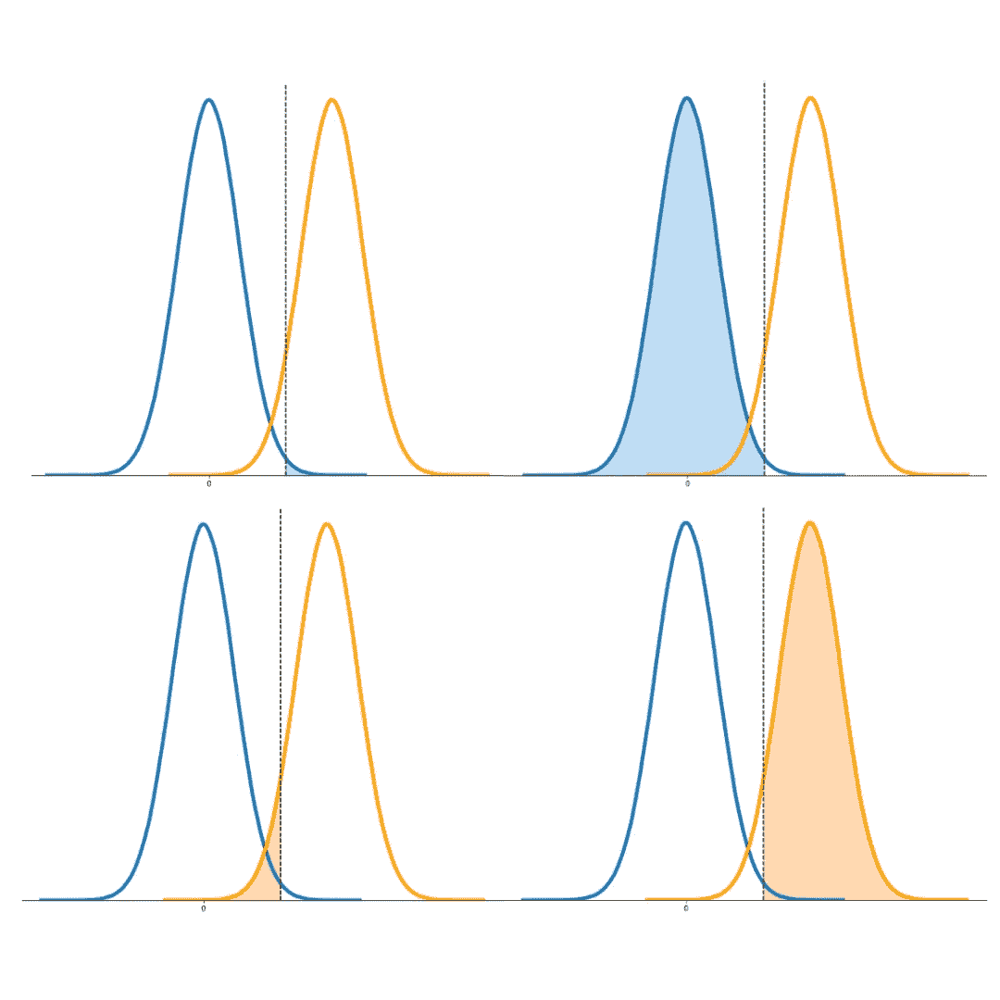
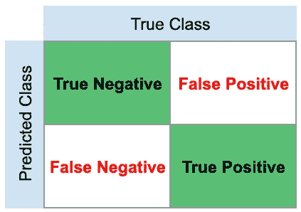
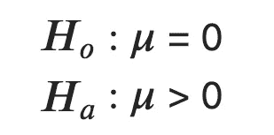
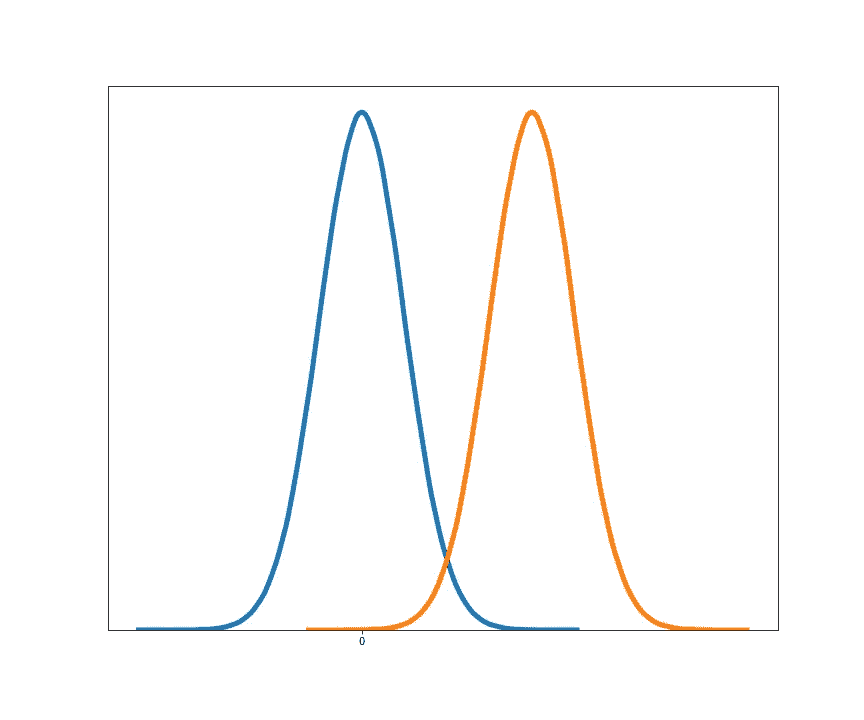
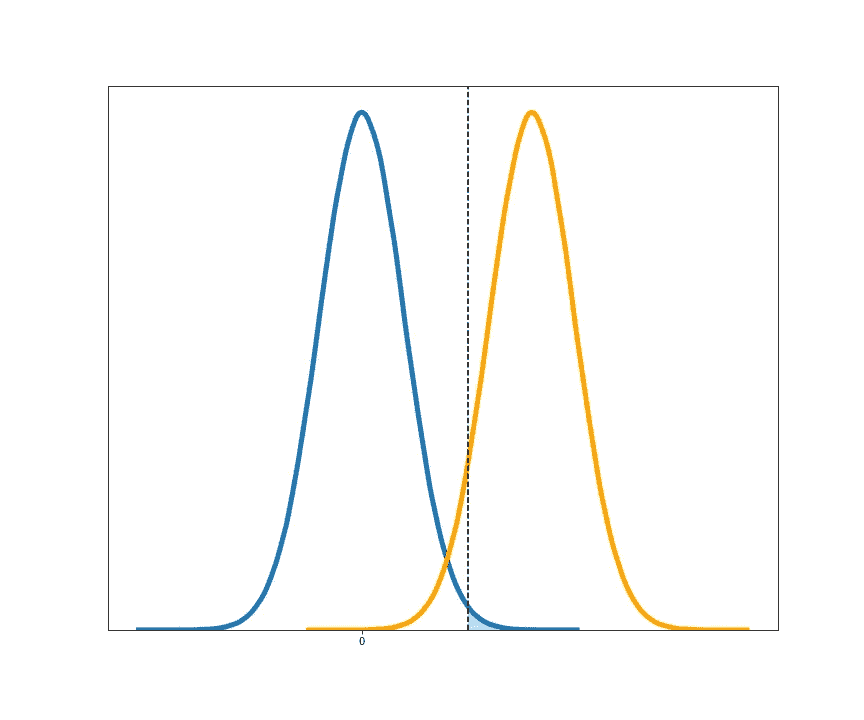
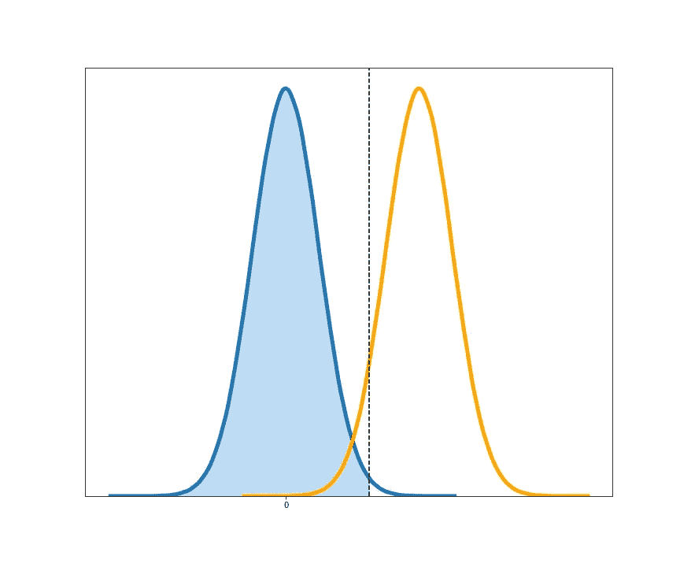
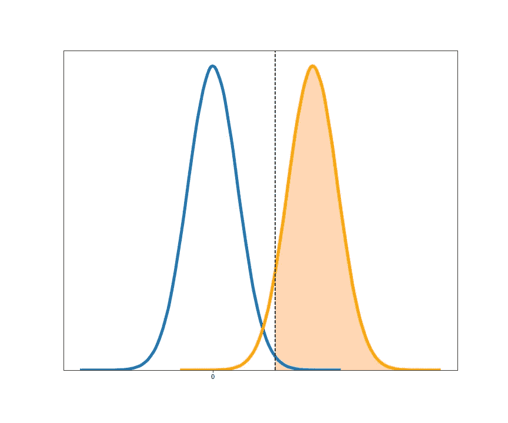
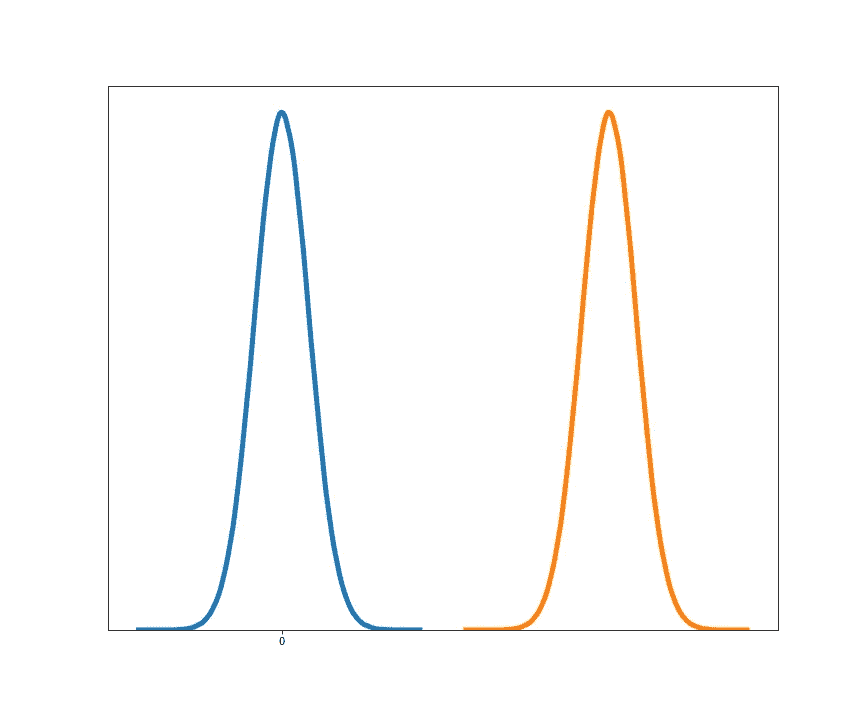

# 第一类误差、置信区间、第二类误差和功效是如何相互关联的

> 原文：<https://towardsdatascience.com/how-type-i-error-confidence-intervals-type-ii-error-and-power-are-all-related-579a16e2c0e3>

## 比较正态分布及其度量

作者图片

统计学的一个基本部分取决于正态分布，考虑到由于[中心极限定理](https://en.wikipedia.org/wiki/Central_limit_theorem)几乎所有分布都收敛于正态分布，这是有意义的。

如果你学过统计学 101 课程，你应该熟悉一个 [t 检验](https://www.scribbr.com/statistics/t-test/#:~:text=A%20t%20test%20is%20a,are%20different%20from%20one%20another.)，并且知道它比较两个正态分布。然而，你可能没有深入了解我在下面介绍的 4 个指标(尤其是它们是如何可视化的)，因为在典型的统计学 101 课程中，它们经常被跳过或忽略。我希望这篇综述能帮助你更深入地理解这些基本的统计学概念。

## 你在统计测试中比较什么？🤔

当您对数据进行 t-test(一种统计测试)时，您到底在比较什么？您正在检查数据是否来自某个正态分布。一个简单的统计测试将设置零假设等于零。常见统计检验的示例包括实施 t 检验，其中零假设是总体均值等于零，或者另一个示例是线性回归，其中零假设是斜率等于零。

理解错误的概率对于解释统计测试的结果至关重要。当比较你的结果是正确的还是不正确的时，用两个选项(即类别)形象化这个决定的一个常用方法是使用混淆矩阵。典型的混淆矩阵可能如下所示:

混乱矩阵。作者图片

如果我们在进行统计比较时更新混淆矩阵以应用于正在进行的比较，它将看起来像这样:

带有统计项的混淆矩阵。作者图片

这种视觉效果将帮助你记住 I 型和 II 型错误之间的区别。这有助于获得对不同度量的直观理解，这些度量通常用于描述统计测试的输出。就个人而言，这种网格可视化对我来说比“[你怀孕了](https://chemicalstatistician.wordpress.com/2014/05/12/applied-statistics-lesson-of-the-day-type-i-error-false-positive-and-type-2-error-false-negative/comment-page-1/)”这样的统计迷因更有帮助。

对于我使用的例子，我将在一个假设的 t 检验中展示两个正态分布。我的假设可以写成:

无效假设和替代假设。作者图片

零假设是总体均值等于 0，另一个假设是总体均值大于 0。

下面是正在比较的两种正态分布:

作者图片

平均值以 0 为中心的蓝线是代表零假设的分布，橙线是代表替代假设的分布。分布的宽度或高度的具体值对于我要表达的观点来说并不重要，因为我一般是在谈论这些视觉效果。

## 第一类错误可视化

在学习 t 检验时，你可能会看到的最常见的形象化的例子就是这个。通常，当描述如何知道是否拒绝零假设时，会显示这种可视化。要拒绝零假设，p 值必须小于显著性水平，在本例中，显著性水平是淡蓝色阴影虚线上方的区域。简而言之，p 值是在假设样本属于零假设分布的情况下，从样本中获得结果的概率。我不会花太多时间来解释 p 值，因为我假设你已经对它们有所了解，但是如果 p 值对你来说是新的，这里的[是一个可以参考的资源。](https://www.investopedia.com/terms/p/p-value.asp)

作者图片

阴影部分是 I 型错误的概率，也就是实际为真时拒绝零假设的概率(有人错误地说阴影部分是 p 值*)。🤦‍♂

**注意:如果虚线代表 p 值，这将是正确的，因为 p 值也基于曲线下的面积，但更常见的是，这些图像中的虚线代表显著性水平——这就是为什么有些人会感到困惑。在这种情况下，我们用它来表示显著性水平，而不是 p 值。*

以下所有可视化中的阴影部分代表曲线下的区域。在这种情况下，曲线下的阴影面积是正态分布曲线下总面积的 5%*(如果你曾经对计算曲线下面积的数学感兴趣，这里的***是一个有趣的阅读)。**

*虚线代表显著性水平或α(读作 alpha)。由于α通常设定为 5%，我们可以说有 5%的几率我们拒绝零假设是错误的。这也被称为第一类错误的概率。*

*为了进一步解释这个问题，让我们来比较两个国家的高度:日本🗾和澳大利亚🇦🇺.我们的无效假设可能是两国之间没有身高差异，另一种可能是澳大利亚人的平均身高更高。对一个重要结果(p 值小于α)的解释是，我们拒绝了国家之间没有身高差异的零假设，接受了澳大利亚人更高的替代假设。然而，我们的结论有 5%的可能性是不正确的。*

## *置信区间可视化*

*当你告诉别人你的统计测试的 95%置信区间时，你到底在说什么？要回答这个问题，需要进一步定义置信区间。置信区间的定义是 1-α。因此，当α设置为 5%时，置信区间也因此设置为 95%。*

*在比较统计测试的两个正态分布的上下文中，置信水平看起来是这样的:*

**

*作者图片*

*如果我们因为 p 值大于 0.05 而接受了零假设，那么对这个置信区间(alpha 为 5%)的解释是，我们有 95%的概率是正确的，我们的数据点来自零假设分布。*

*如果我们拒绝零假设，那么解释就是有 95%的几率数据来自备选假设分布。然而，上图是一个简化的例子，代表零假设被接受*的情况。如果它被拒绝，置信区间范围将不包括零，因为我们将得出存在显著差异的结论(即，替代假设是差异大于 0)。*

*继续我们关于日本人和澳大利亚人身高的例子，如果我们拒绝零假设，我们会说澳大利亚人有 95%的可能性比日本人高。*

***注意:置信区间以样本平均值为中心，因此为了真正准确，我们将绘制第三个分布，它代表样本的分布，置信区间在样本平均值的两侧有对称的阴影区域。**

## *第二类错误可视化*

*前两个例子在你的统计 101 课上已经讨论过了，但是大多数情况下，第一类错误视觉是唯一显示的(如果有任何视觉显示的话)。接下来的两张图片显示的频率要低得多，但我觉得理解它们很重要，因为 p 值和置信区间只是故事的一部分！*

*第二类错误被定义为β(读作 Beta ),或者如果你回头参考混淆矩阵，它是当假设错误时接受零假设的概率。在我们的身高例子的上下文中说，这是说日本人和澳大利亚人之间没有身高差异的概率，而实际上有一个差异。这就是在统计测试的背景下，第二类错误的概率是如何可视化的:*

**

*作者图片*

*从这个直观的例子中可以看出，第二类错误的概率大于第一类错误的概率。那是因为第一类错误和第二类错误之间存在反比关系。当我减少第一类错误的机会时，第二类错误的机会就会增加，反之亦然。您可以通过向左或向右移动虚线来直观地看到这一点。如果我们**将** alpha 降低到 1%，那么虚线将移动到**右侧**，这将增加备选假设分布中的阴影区域。如果我们**将**α增加到 10%(接受更多的 I 型错误)，这将使虚线向左**移动**，这将降低 II 型错误的概率。*

*继续我们的示例，假设当类型 I 误差设置为 5%时，类型 II 误差为 20%。假设第二类误差为 20%，那么你会说，如果你说日本人和澳大利亚人的身高没有差异，那么你有 20%的可能性是错的。*

## *权力可视化*

*统计检验的“功效”这一概念在你的统计学导论课程中可能不会讨论。这被定义为 1 — β。这是你的统计测试的可视化的力量:*

**

*作者图片*

*权力被解释为当另一个假设为真时，你正确拒绝零假设的概率。功效和类型 II 误差取决于数据中的平均值(分布的距离/位置)和标准差(分布的宽度)。如果数据点与 0 非常不同，您可以对统计测试的重要结果更有信心。这将被视为一个与零假设分布重叠较少的分布。*

*如果你的分布如此不同，以至于完全没有重叠，那就意味着假设的第二类错误的概率是 0%，功效是 100%。这是它看起来的样子:*

**

*作者图片*

*功效主要是样本大小、效应大小(即差异的大小)和显著性水平的函数。功效测试的主要应用是找到达到特定功效概率(通常设置为 80%)所需的最小样本量。前往[此链接](https://www.scribbr.com/statistics/statistical-power/)了解更多关于能力测试及其在统计中的应用。*

*为了总结这一节，我将把它带回我们的例子。如果我们的第二类误差假设是 20%，那就意味着我们的功率是 80%。我们可以说，我们有 80%的信心，我们正确地拒绝了零假设，即澳大利亚人和日本人之间没有身高差异。*

*另一种说法是，如果我们取了 100 个样本，并发现了真正的身高差异，我们只会在 100 个样本中的 80 个中发现显著差异。*

**注意:你可能会想，等一下，难道 I 型误差和 p 值不能告诉你存在高度差的概率吗？不，它不是——所以澄清一下，第一类错误是当你得到一个重要结果时，它是一个假阳性的概率。它不会告诉你多久会找到一个有意义的结果，它只告诉你你的结果不是真实的(即有意义的)概率。所以当α为 5%时，你可以有 95%的信心得到一个显著的结果。当功率为 80%时，您会在 80%的情况下在您的样本中发现显著的结果。**

## *最后的想法*

*总的来说，置信区间和功效描述了你对自己选择正确的自信程度。第一类和第二类错误描述了你选择错误的概率。希望混淆矩阵有助于解释这些指标之间的差异，以及它们之间的关系！理解这 4 个指标将有助于你对统计数据有一个很好的直观理解，这将是你学习更高级概念的基础。请让我知道你在评论中的想法，以及我是否遗漏了什么。谢谢！*

*如果您是中级新手，请考虑使用下面的“我的推荐”链接订阅:*

*  

此外，如果喜欢阅读，可以看看我最近发表的另一篇与统计相关的文章:

  

## 参考

1.  [中心极限定理](https://en.wikipedia.org/wiki/Central_limit_theorem)，维基百科
2.  R.贝文斯，[t 检验介绍|定义、公式和例子](https://www.scribbr.com/statistics/t-test/#:~:text=A%20t%20test%20is%20a,are%20different%20from%20one%20another.) (2020)，Scribbr
3.  页（page 的缩写）埃利斯，[我总是搞不清第一类和第二类错误。你能给我看一些东西来帮助我记住区别吗？](https://effectsizefaq.com/2010/05/31/i-always-get-confused-about-type-i-and-ii-errors-can-you-show-me-something-to-help-me-remember-the-difference/) (2010)，效果尺寸常见问题
4.  B.比尔斯， [P 值:它是什么，如何计算，为什么它很重要](https://www.investopedia.com/terms/p/p-value.asp) (2022)，Investopedia
5.  R.艾伦。[求曲线下面积的三种方法(以及你为什么要这么做)](https://medium.com/geek-physics/3-ways-to-find-the-area-under-a-curve-and-why-you-would-want-to-do-that-949434a727d3) (2020)，中
6.  页（page 的缩写）班达里，[统计能力及其重要性|简单介绍](https://www.scribbr.com/statistics/statistical-power/) (2022)，Scribbr*