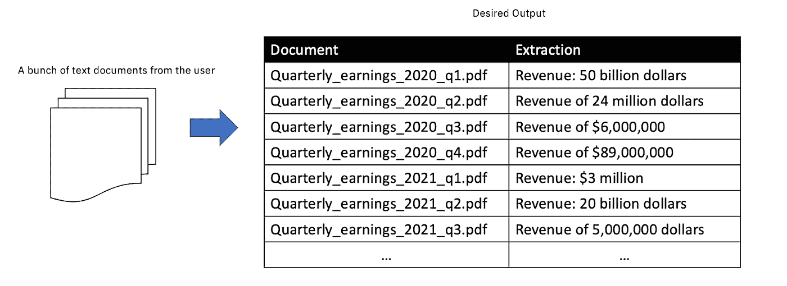
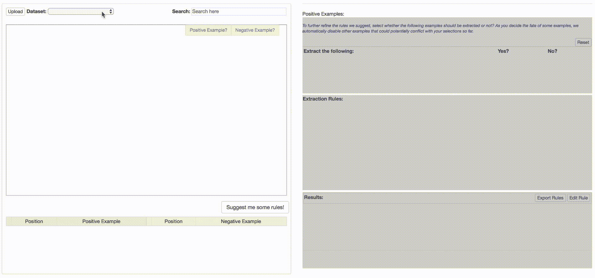
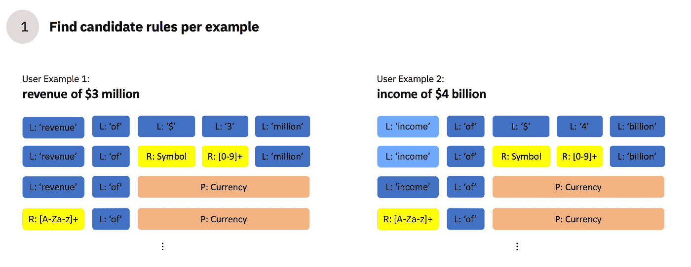
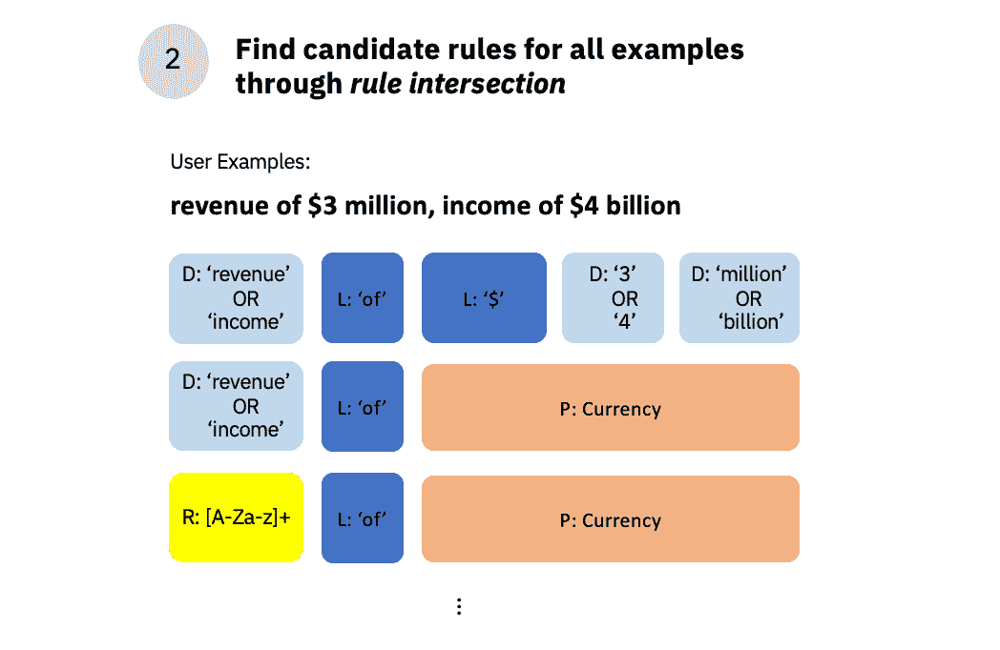
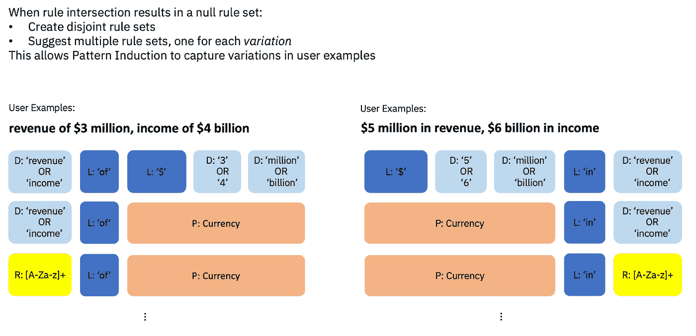
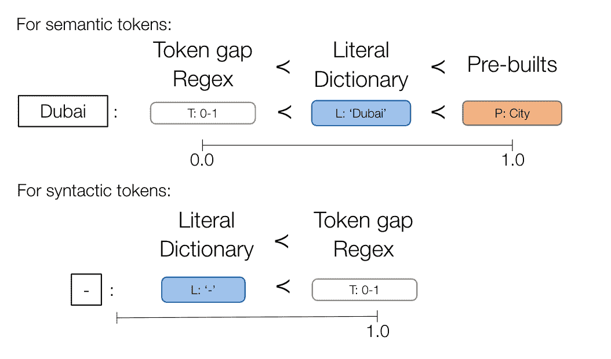
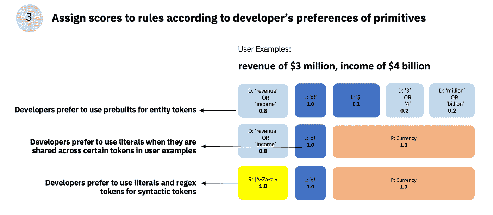
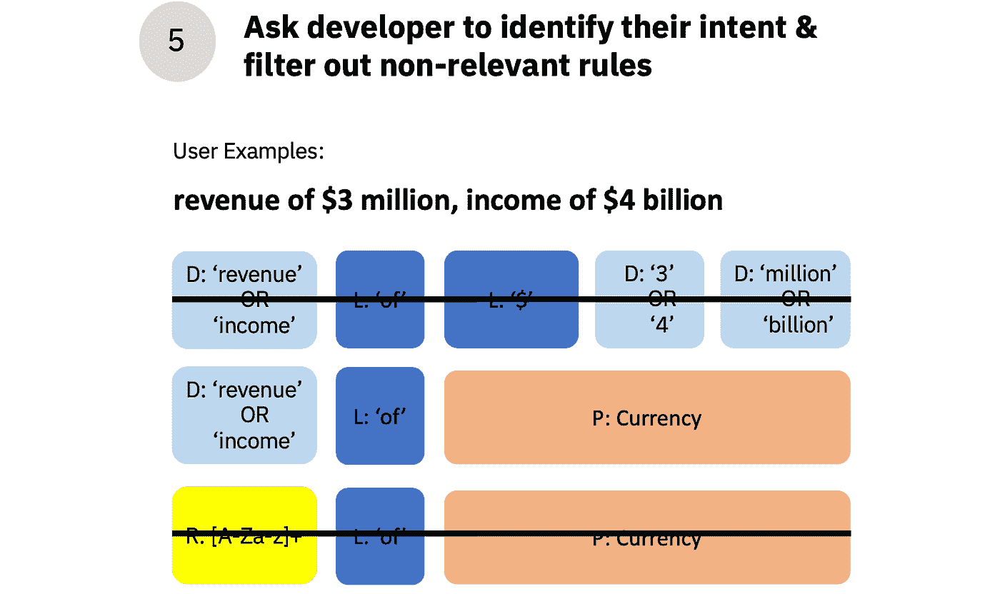

# 人在回路中的文本提取系统

> 原文：<https://towardsdatascience.com/human-in-the-loop-text-extraction-system-a5f32631142c>

## 机器如何学习从人类给出的文本亮点中提取文本

假设一位金融分析师希望分析几年来犯罪率的变化。她有一个公司财务新闻稿的数据集。她必须从数据集中提取所有的收入和收益。她想制作一个类似这样的表格，以便进一步分析。

此外，她可能还希望自动化这一过程，这样，如果她的新闻稿数据集增加，她就可以轻松地提取新的收入和收入数字。

信息提取。图片作者。

简而言之，我们的财务分析师必须执行一项*信息提取*任务。信息提取或 IE 自动从大量文档中提取数据。

在现实生活中，IE 还有其他场景，通常涉及不一定具有编码背景的人，这些背景将帮助他们快速编写代码以帮助他们执行 IE:

*   社交媒体分析:*从 Yelp 评论中提取用户评级。*
*   金融分析:*从 SEC 数据中提取关键人物及其与美国大公司的关系。*
*   医疗保健分析:*从健康表格中提取数据，以了解某些药物的副作用。*

在本文中，我们将深入讨论一种叫做 SEER 的交互式人在回路工具。SEER 帮助使用这种文本数据集的用户从中提取相关数据。

# **使用 SEER 中用户突出显示的示例提取数据**

突出显示要提取的文本示例。图片作者。

SEER 中的用户将突出显示他们希望提取的文本示例。正面的例子是他们希望提取的文本。反面例子是他们不想提取的文本。

SEER 学习一个模型后，SEER 会给出一组提示和一些*提取规则*，这些规则是将代表用户执行其余提取任务的程序。

通过对提取回答“是”或“否”来过滤规则。图片作者。

用户对提示回答“是”或“否”，然后根据用户的反馈过滤出提取规则。

用户选择提取规则以便预览提取。然后，选定的规则将突出显示文档中的其余提取，并将数据集中所有文档的提取制成表格。然后，用户可以使用突出显示的文档或表格来决定所选的提取规则是否正确地执行了所需的提取任务。

否则，可以通过突出更多正面和负面的例子来完成进一步的微调。

## **SEER 中的提取规则**

在设计 SEER 时，我们考虑了许多机器学习技术。然而，很难找到一种方法，该方法可以从用户的少量文本高亮示例中准确地学习语法文本模式，而不需要用户具有某种程度的技术知识来微调机器学习模型或编写代码来对输出中的任何错误进行后处理。然而，我们的目标用户不需要任何编码背景或机器学习专业知识，例如记者、调查人员、金融分析师等。

我们决定使用基于*规则的*模型，它本质上是执行提取的程序。在 SEER 中，我们将它们称为提取规则。SEER 将自动生成初始提取规则，如果用户需要微调规则，则用户可以突出显示其他示例以提供给 SEER 学习。他们还可以选择导出规则来直接编辑它们。

## **提取规则语言**

SEER 从用户高亮显示的文本示例中学习视觉提取规则。提取规则是一系列的*原语*。原语提取一个或多个*令牌。*记号是由空格和换行符分隔的单词。例如，以粗体显示，5.4%被标记为单独的标记。5、点、4 和百分比。有 5 种类型的基元可以形成规则:

图片作者。

5 种类型的原语，以及原语可以提取的文本的样本标记。图片作者。

*   *预置*提取实体，比如组织、整数、百分比、电话号码等等。
*   *文字*提取精确的字符串。因此 literal percent 只提取数据集中单词 percent 的实例。
*   *字典*提取出现在字典条目中的文本。
*   *正则表达式*或简称 regex 在 SEER 中通过一个预定义的正则表达式库得到支持。包含[A-Za-z]+的黄色框是捕获包含小写或大写字母的标记的正则表达式。
*   *令牌缺口*可以抽取任何令牌。包含“0 到 1”的令牌间隙意味着它将跳过提取 0 到 1 的单词，直到令牌间隙之后的下一个匹配原语。令牌间隙用在原语序列的上下文中。

以下是 SEER 可以提取的提取规则示例:

图片作者。

这个原语序列可以捕获百分比。它从一个预先构建的整数开始，跳过 0 到 2 个标记，直到下一个原始匹配出现，在这种情况下是文字百分比。这个规则可以捕获文本“5.4%”。

## **为什么学习提取规则具有挑战性**

虽然提取规则的语言相当简单，但是自动生成提取规则存在许多挑战。详情[可在这里](/why-is-automatically-generating-code-hard-88d9720ed2bd)找到。但以下是为什么它具有挑战性的总结:

*   **用户可以提供有限数量的示例&反馈:**规则学习算法被限制为从少数示例中学习，最少 2 个示例到最多平均 6 个示例。
*   **有限数量的用户输入导致有效规则的大搜索空间。**该算法必须遍历候选规则的指数级大空间。因此，我们将规则存储在一个树形结构中。然后，我们根据人类开发人员如何手工制作规则，通过学习和排列规则来有效地搜索空间。此外，我们通过用户界面利用用户反馈来进一步修剪搜索空间。
*   用户可以提供遵循稍微不同模式的例子。SEER 还必须学习捕获多个变量的规则，它通过学习多组提取规则来做到这一点。

# 【SEER 如何学习抽取规则？

鉴于这些挑战，SEER 如何学习规则？概括地说，算法如下:

1.  **生成规则:** SEER 的学习算法生成捕获正例的有效规则序列。捕捉反面例子的规则被丢弃。
2.  **归纳规则:**然后*归纳*规则。一般化意味着*交叉*特定于一个例子的规则，并创建一个尽可能多地捕捉正面例子的规则。
3.  **等级规则:**此外，SEER 为规则的原语分配分数，这些分数反映了人类开发人员在手工制作提取规则时如何选择和偏好某些原语。
4.  **选择规则:** SEER 将相似的规则分组在一起，并为每个组选择一个规则。然后向用户显示这些规则。SEER 也呈现出多样的规则，意味着大多数规则并不仅仅包含一种类型的原语。这有助于 SEER 捕捉各种用户意图。
5.  **提出规则，获得用户反馈。**

算法的细节可以在[一篇更长的论文](https://dl.acm.org/doi/10.1145/3025453.3025540)中找到。

## **1。生成规则**

作者 Yannis Katsis 的图片。

第一步包括为每个例子生成候选规则。在这个场景中，有两个积极的例子:“300 万美元的收入”和“40 亿美元的收入”。除了上图中显示的，肯定还有更多规则。

图片作者。

规则的数量可能是指数级的。对于正面示例中的每个令牌，最多有 5 个基元可以捕获它。候选规则存储在树形结构中，以便节省空间。从根节点到叶节点的路径代表一个候选规则。这种结构允许规则的任何相似前缀由相同的初始路径表示。

## **2。归纳规则**

作者 Yannis Katsis 的图片。

然后，预言家*归纳出*规则来捕捉所有积极的例子。概化是通过交集运算完成的。在上图中，我们展示了从“收入 300 万美元”和“收入 40 亿美元”生成的规则的交集产生的规则子集。

仅当第一个正例的规则和第二个正例的规则的基元序列相交时，它们才相交:

*   预构建的图元彼此相交。
*   如果文字值相等，则文字原语与文字相交。
*   如果正则表达式相同，则它们相交。
*   字典和其他字典有交集。
*   除了规则的开头或结尾，可以在任何地方插入标记间隙。

此外，文字和字典原语可以*与*相互合并:

*   文字原语相交形成字典规则。
*   字典和文字可以合并成一个组合字典。
*   字典可以互相合并，组成一个更大的字典。

假设用户还突出显示了“500 万美元的收入”和“60 亿美元的收入”。规则将*而不是* *与“收入 300 万美元”和“收入 40 亿美元”产生的规则相交*。在这种情况下，SEER 维护几组规则，每组规则对应一组交叉规则。

作者 Yannis Katsis 的图片。

这使得 SEER 能够捕捉到示例中的任何细微变化。在这种情况下，在正面示例的开头，货币金额有一个变化，例如“300 万美元”。第二个变量在正例的末尾有货币量。

## **3。等级规则**

在算法的这一点上，仍然有许多候选规则。由于我们无法将它们全部显示给用户，因此该算法会为等级规则分配分数。

给定某种类型的令牌，规则根据人类开发人员如何偏好某种类型的原语而不是其他类型来排序。有两种类型的令牌:

*   *语义记号*:具有自然意义的记号。这些通常是实体，如学校名称、组织、货币金额等。SEER 识别一个语义标记，如果它被一个预先构建的原语捕获。
*   *语法标记*:表示语法的标记，例如破折号、冒号和填充冠词，如‘a’或‘the’。

评分函数，一个用于语义标记，另一个用于语法标记。图片作者。

根据令牌的性质或种类，我们应用两个评分函数之一:

*   在第一个评分函数中，如果令牌是语义类型的，我们分配分数，使得预构建优先于文字和字典，预构建优先于令牌间隙和正则表达式。例如，如果令牌具有自然含义，例如，令牌“迪拜”指的是一个城市，那么预建的“城市”将比字面上的“迪拜”或正则表达式排名更高。
*   在第二个评分函数中，如果标记表示语法，我们分配分数，使得标记间隙或正则表达式优先于文字和字典。

作者 Yannis Katsis 的图片。

这些评分函数来自我们对人类开发人员在创建规则时如何选择原语的观察。基于这种偏好，我们将其映射到数值作为原始分数。我们进行了一项研究，表明我们的评分试探法和人类开发人员对不同原语的偏好之间有很强的一致性。你可以在这里阅读更多关于 T4 研究的内容。

## **4。** **选择规则**

一旦将分数分配给图元，并且计算出规则的分数(作为图元分数的平均值)，就选择一些规则呈现给用户。虽然只选择排名前 k 的评分规则可能更好，但我们也需要规则多样化。换句话说，选择 top-k 评分规则可能会导致一组主要包含预构建或主要包含正则表达式的规则，这是不希望的。这是因为用户可能想要一个特定的规则，例如包含文字和预置的组合的规则，或者用户可能想要一个通用的规则，例如主要包含正则表达式的规则。但是选择 top-k 评分规则可能只偏向一个方向，并且可能违背用户的*意图*。

很难真正知道用户的意图，例如，是特定的规则还是通用的规则，因为用户给出了少量的文本示例(平均 6 个正面示例)。为了捕捉用户意图的多样性，SEER 生成了一组不同的规则。它是按如下方式完成的:

1.  将*相似的*规则组合在一起。不管规则中的顺序如何，如果规则由相同的原始类型组成，则规则彼此相似。
2.  从每组中选择得分最高的规则。

图片作者。

在上面示出了生成的一组规则的情况下，每个规则具有唯一的一组原语，并且该组规则被认为是多样的。该规则集将呈现给用户。规则将按照规则得分的顺序呈现给用户。

## **5。展示规则并获得用户反馈。**

最后，用户可以通过接受或拒绝提取来过滤掉规则:

作者 Yannis Katsis 的图片。

# **结论**

在本文中，我们描述了一个名为 SEER 的人在回路的文本提取系统。SEER 学习一个基于规则的模型，并与用户进行交互，以帮助他们快速准确地完成提取任务，而无需了解代码。如果你想了解更多关于我们与 SEER 一起进行的用户研究，请点击阅读[这篇更长的论文。](https://dl.acm.org/doi/10.1145/3025453.3025540)