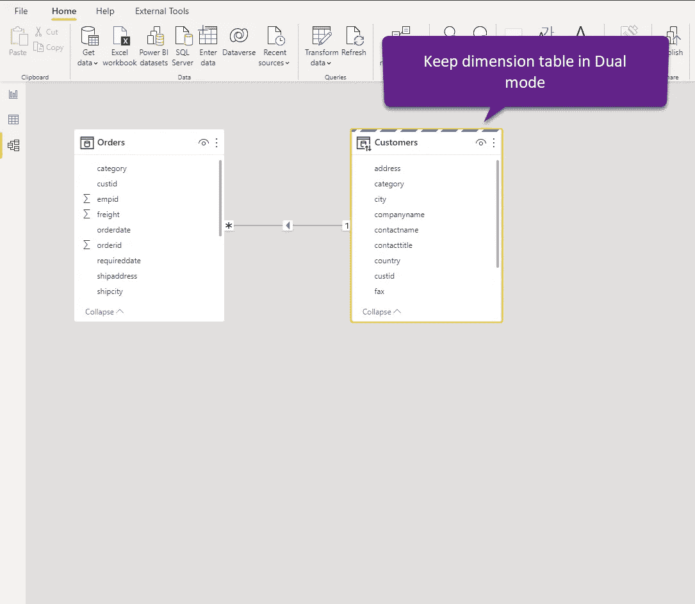
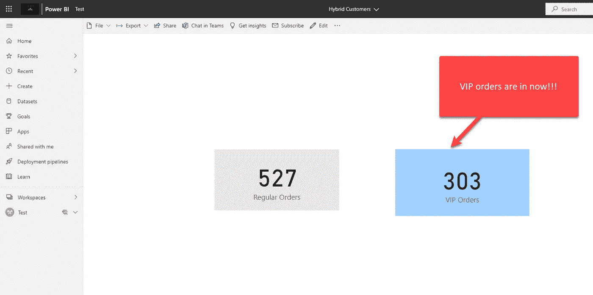
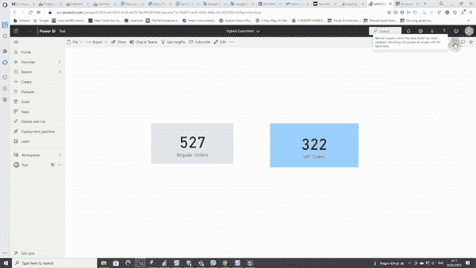

# Power BI 中的混合表:超越与时间相关的场景

> 原文：<https://towardsdatascience.com/hybrid-tables-in-power-bi-extending-beyond-time-related-scenarios-a80e080d5c01>

## 混合表是 Power BI 中最强大的特性之一！而且，这不仅仅是关于分离“热”和“冷”数据…您基本上可以在整个业务场景中利用混合表


[un splash 上 Izabel UA 拍摄的图像](https://unsplash.com/photos/ouwdw--XNzo)

如果你经常关注我的博客，你可能已经注意到我已经写了 Power BI 中的[混合表特性。从我的角度来看，混合表是最强大的特性之一，因为它们提供了一系列可能的实现。在微软的](https://medium.com/p/bfe07d480275)[官方公告](https://powerbi.microsoft.com/en-us/blog/announcing-public-preview-of-hybrid-tables-in-power-bi-premium/)中，有一个展示如何自动打开混合表功能，在 [DirectQuery 模式](https://medium.com/p/8180825812d2)下保持“热”数据(在增量刷新功能的帮助下)，同时在导入模式下保持“冷”历史数据。

通过利用这一概念，您应该可以从两个方面获得最佳效果——vert ipaq column store 数据库的超快性能，同时从 DirectQuery 分区获得最新数据。我将不再赘述，再次解释这是如何工作的，因为我假设你已经阅读了我关于这个主题的[上一篇文章。如果没有，请在继续下一步之前参考它…](https://medium.com/p/bfe07d480275)

# 扩展场景#2

在前面提到的文章中，我已经在场景#2 中向您展示了如何调整原始特性，并使用 DirectQuery 在原始数据源中保存历史数据，而不是使用 DirectQuery 对最新数据进行分区(逻辑是历史数据在报表中不会被频繁查询)，同时对“热”数据使用导入模式(假设大多数查询都针对最新数据)。

然而，我们为什么要把自己局限于仅仅分离“热”和“冷”数据呢？！能够在一个表中创建多个分区，并混合这些分区的存储模式，这为现实生活中可能的实现开辟了一个完整的范围。

想象这样一个场景:基于不同的标准，例如，他们花了多少钱，下了多少订单，等等，你可能想要区分不同“级别”的客户——其中一些对你的业务更有价值，让我们把他们视为“VIP”客户。为了简单起见，我将把一定数量的客户放在“VIP”类别中，而所有其他人将保持在“常规”类别中。

# 贵宾 vs 常客

现在，我们的想法是让“VIP”客户获得更全面的洞察力，比如说，如果您的 VIP 客户遇到订购/付款问题，您希望立即做出反应，而您让普通客户继续排队。在引入混合表之前，唯一可行的解决方案是使用导入模式，然后尽可能频繁地刷新数据。但是，数据集刷新仍然有局限性，这可能会使该解决方案不够好。另一个解决方案是只为 VIP 客户创建一个单独的事实表，同时在另一个事实表中保留“regulars ”,并利用复合模型特性将 VIPs 事实表保留在 DirectQuery 模式下，将常规事实表保留在 Import 模式下，将维度保留在 Dual 模式下。然而，这种解决方案带来了其他警告和潜在的缺点…

使用混合表，我们可以在同一个事实表中创建两个分区——“regulars”将保持导入模式，而 VIPs 分区将处于 DirectQuery 模式，从而使业务分析师能够实时洞察 VIP 数据！

让我快速向您展示它是如何做到的！

# 搭建舞台

以下是将返回所有不属于 VIP 类的客户的原始查询:

```
SELECT o.* 
    ,c.category
FROM Sales.Orders o
INNER JOIN Sales.Customers c ON c.custid = o.custid
WHERE c.category <> 'VIP'
```

我将使用该查询将数据导入 Power BI。当我进入 Power BI 桌面时，我将创建两个度量值—第一个度量值将计算老客户下的订单总数…

```
Regular Orders = CALCULATE(
                        COUNT(Orders[orderid]),
                        Orders[category] <> "VIP"
)
```

…而另一个人将计算我们贵宾的订单总数:

```
VIP Orders = CALCULATE(
                        COUNT(Orders[orderid]),
                        Orders[category] = "VIP"
)
```

请注意，唯一的区别在于 CALCULATE 函数的过滤器中使用的逻辑运算符。我还将在我的数据模型中添加 Customer 维度，使报表用户能够深入客户数据(查找电话号码、电子邮件地址等)。).此维度表应该处于双重模式，因此它可以为 DirectQuery 和导入分区提供服务:



作者图片

如果切换回您的报表，您可能会惊讶地发现没有显示 VIP 订单，即使您知道它们存在于源数据库中！别担心，我们会解决这个问题，我们只是在热身:)

这里没有 VIP 订单是完全可以理解的——不要忘记，我们对数据集使用了 SQL 查询，排除了 VIP 客户的所有订单。

让我们将此报告发布给 Power BI Service:


作者图片

有我们新公布的数据集(顺便说一句，我喜欢刷新的日期，哈哈)。让我们看看报告本身是什么样的:


作者图片

所以，我们可以确认它看起来和桌面上的一模一样(没有 VIP 订单)。现在，是时候变点魔法了:)

# 让我们变些魔术吧…

正如我在上一篇文章中解释的那样，您不能依赖 Power BI Desktop 来创建定制分区(默认情况下，数据模型中的每个表只有一个分区)。我们需要使用外部工具通过 XMLA 端点来操作 TOM(表格对象模型)。像往常一样，我将使用[表格编辑器](https://data-mozart.com/tabular-editor-3-features-to-boost-your-power-bi-development/)，您应该使用它进行 Power BI 开发，尽管这是一个特殊的例子。


作者图片

让我暂时停在这里，解释上面插图中的步骤。在表格编辑器的“文件”选项卡下，我将依次选择“打开”、“从数据库”,然后选择“混合客户数据集”。混合表工作的关键是(这更多是对我未来自我的提醒)将表格模型的兼容级别从 1550 更改为 1565。在 TOM Explorer 中单击 Model，在 Database properties 下将兼容级别设置为 1565！如果不改变它，你会得到一个错误。

然后，我将默认分区重命名为:常规订单—导入:


作者图片

您还可以看到用于创建默认分区的源查询。现在是设计混合桌解决方案的关键部分:


作者图片

让我们一步一步地解释我们刚刚做了什么:

1.  我复制了原始的默认分区(复制/粘贴)
2.  然后，我把它重新命名为:VIP 订单— DQ
3.  我修改了源查询:现在我想只检索 VIP，而不是检索非 VIP 客户
4.  我已经将这个分区的存储模式切换到了 DirectQuery

保存更改后，让我们再次查看报告并刷新它:



作者图片

是啊！我们现在可以在报告中看到我们的 VIP 订单了！但是，不仅仅是这样:我们应该能够实时看到变化！！！我将模拟这样一个查询，它将每 5 秒钟在 orders 表中插入一次 VIP 订单数据，而普通客户的订单将每 12 秒钟插入一次:

```
WHILE 1=1
BEGIN
   WAITFOR DELAY '00:00:05' -- Wait 5 seconds

  INSERT INTO sales.Orders
  (
      custid,
      empid,
      orderdate,
      requireddate,
      shippeddate,
      shipperid,
      freight,
      shipname,
      shipaddress,
      shipcity,
      shipregion,
      shippostalcode,
      shipcountry
  )
  VALUES
  (   7,      -- custid - int VIP customer
      1,         -- empid - int
      GETDATE(), -- orderdate - datetime
      GETDATE(), -- requireddate - datetime
      NULL,      -- shippeddate - datetime
      1,         -- shipperid - int
      DEFAULT,   -- freight - money
      N'',       -- shipname - nvarchar(40)
      N'',       -- shipaddress - nvarchar(60)
      N'',       -- shipcity - nvarchar(15)
      NULL,      -- shipregion - nvarchar(15)
      NULL,      -- shippostalcode - nvarchar(10)
      N''        -- shipcountry - nvarchar(15)
      )

END

WHILE 1=1
BEGIN
   WAITFOR DELAY '00:00:12' -- Wait 12 seconds

  INSERT INTO sales.Orders
  (
      custid,
      empid,
      orderdate,
      requireddate,
      shippeddate,
      shipperid,
      freight,
      shipname,
      shipaddress,
      shipcity,
      shipregion,
      shippostalcode,
      shipcountry
  )
  VALUES
  (   10,      -- custid - int Regular Customer
      1,         -- empid - int
      GETDATE(), -- orderdate - datetime
      GETDATE(), -- requireddate - datetime
      NULL,      -- shippeddate - datetime
      1,         -- shipperid - int
      DEFAULT,   -- freight - money
      N'',       -- shipname - nvarchar(40)
      N'',       -- shipaddress - nvarchar(60)
      N'',       -- shipcity - nvarchar(15)
      NULL,      -- shipregion - nvarchar(15)
      NULL,      -- shippostalcode - nvarchar(10)
      N''        -- shipcountry - nvarchar(15)
      )

END
```

看看我们的报告发生了什么:



作者图片

如您所见，我们有实时更新的 VIP 订单数据！太神奇了！

# 看幕后

我想测试的最后一件事是，如果我有一个 customer 类别的切片器，并选择只查看来自常规客户的订单，那么会发生什么情况，这些订单应该从导入模式分区提供:


作者图片

让我们打开 SQL Server Profiler(提示:在选项窗口中插入数据集名称)并捕获 Power BI 生成的查询:


作者图片

您可能会注意到，尽管报告中只需要来自导入模式的数据，但是 DirectQuery 查询仍然会生成。虽然它运行得非常快，但老实说，我的数据集非常小，所以不确定它在较大的数据集上会如何表现。

# 结论

我再重复一遍——混合表是 Power BI 中最强大的特性之一，尤其是在扩展标准数据建模功能时。

这不仅仅是将“热”和“冷”数据分别保存在同一个表中，混合表基本上为您提供了无限的可能性，可以将更重要的数据(需要实时管理和分析的部分)与不太重要的数据(或者更好的说法是不需要近实时分析的数据部分)分开。

由于混合表仍处于公开预览阶段，我预计一旦该特性普遍可用，它将会更加完善(如果只需要导入分区数据，希望不会生成 DirectQuery 查询)。

感谢阅读！

成为会员，阅读 Medium 上的每一个故事！