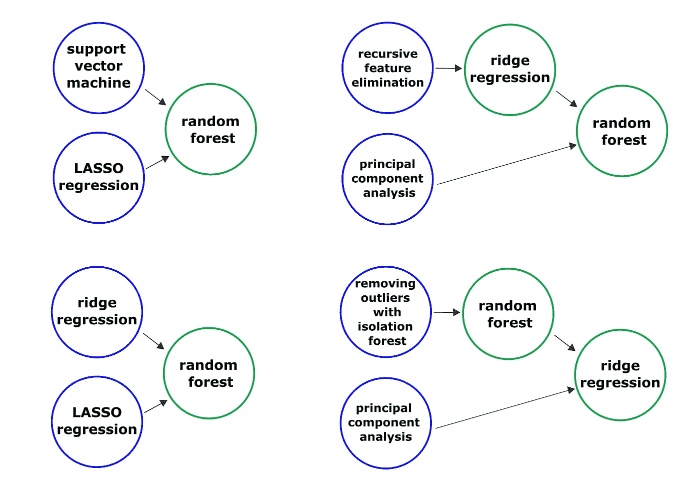
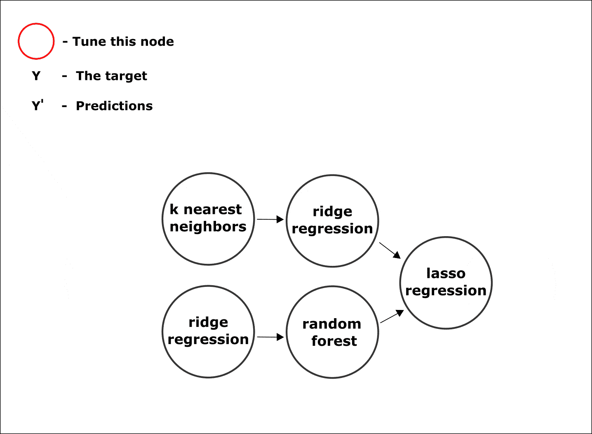
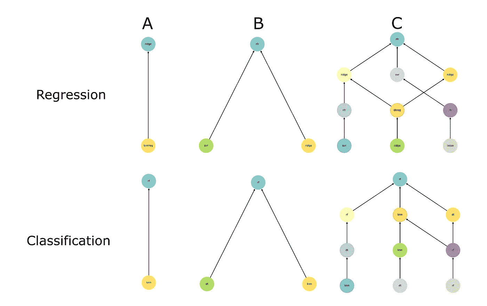
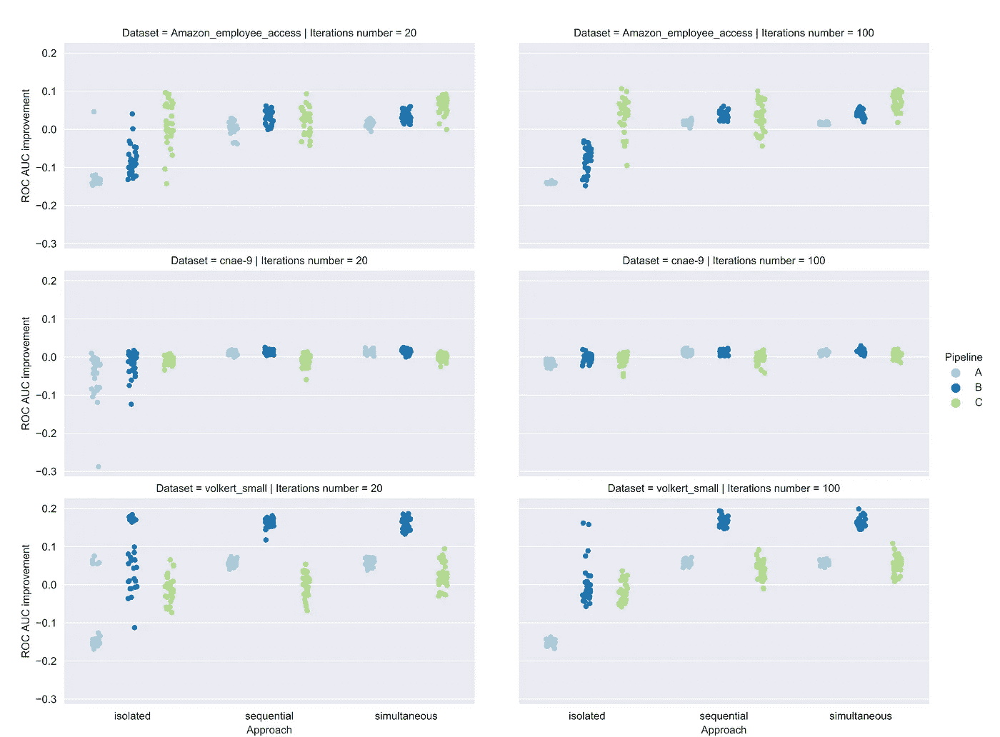
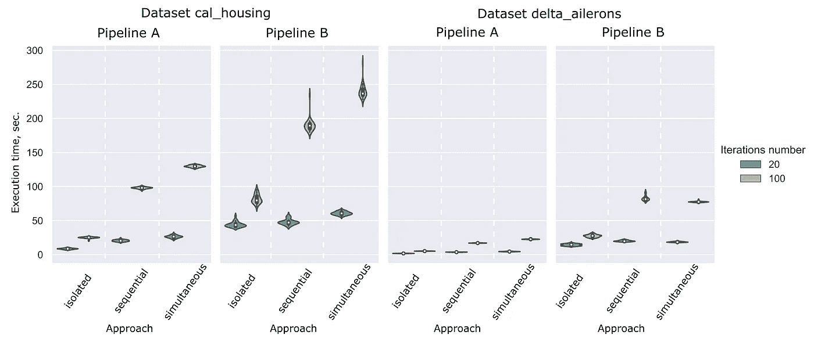

# 机器学习模型集成的超参数调整

> 原文：<https://towardsdatascience.com/hyperparameters-tuning-for-machine-learning-model-ensembles-8051782b538b>

## 一个漂亮的优化小研究

预览图像(按作者)

大家好！先说集成学习中的调优超参数(大多是 blending)。在这种集成中，来自一个机器学习模型的预测成为另一个(下一级)的预测器。下图显示了数据从左向右传输的集合的一些变体。在本文中，这样的集合也将被命名为管道或复合模型(复合管道)。

图一。具有不同结构和内容的集合示例(检查节点中操作的名称)(图片由作者提供)

使用这种复杂的复合结构可以减少预测误差。有时模型会变得更加稳健。然而，有一个缺点:高效率是以“集合消耗”为代价的(集合比单机模型需要更多的时间和计算资源)。此外，信号群越复杂，配置就越困难。让我们讨论一下如何在这样的系综中调整超参数。

D isclaimer:我们不是在讨论具体的优化技术，比如贝叶斯优化、随机搜索或者进化算法(或者其他任何算法)。这里讨论的是独立于内核中使用的算法来调整超参数的高级方法。这篇文章中的例子使用了使用 hyperopt 库的贝叶斯优化，但是如果必要的话，可以用一个更合适的(对你或我们)来代替。

## **业内如何解决这个问题**

关于用机器学习模型调优集成的材料相对较少。让我们从“ML 模型集合的[超参数调整(简单的 Python 例子)](https://www.youtube.com/watch?v=qvjTqEMq8_8)(视频)开始。然后我们继续用“[用 Python](https://machinelearningmastery.com/blending-ensemble-machine-learning-with-python/) 融合集成机器学习”来研究题目(这里顺便说一下没有超参数调优)，通过互联网查找，最后通过 kaggle 比赛获胜者和参与者的现成解决方案(例如[超参数调优/集成方法](https://www.kaggle.com/code/sigmaset/hyperparameter-tuning-ensemble-methods/notebook))。

从上面的项目中，我们可以总结出下面的经典方法。首先，第一层的所有单个模型被训练和调整，然后是集合模型。然后重复这个过程——从左到右反复运动。在“[超参数调优 Python](https://medium.com/mlearning-ai/hyperparameter-tuning-the-weighted-average-ensemble-in-python-cff2100f0832) 中的加权平均集合”中采用了相同的方法，其中只调优了集合权重。

在 kaggle 笔记本“[数据科学框架:实现 99%的准确性](https://www.kaggle.com/code/ldfreeman3/a-data-science-framework-to-achieve-99-accuracy)”中，方案是相同的:为每个模型单独调整超参数。然而，即使是冠军篮球运动员也指出，在系综中调整超参数并不是微不足道的:“我们也可以在我们的检测模型中试验更多的超参数。我真的不喜欢超参数调优(从来没有真正为它开发出一个好的策略)，并且经常尝试通过将不同的模型组合在一起来进行补偿。”[【第一名】解决方案概述&代码](https://www.kaggle.com/competitions/rsna-pneumonia-detection-challenge/discussion/70421)。

## **这个问题在科学上是如何解决的**

这里有大量的信息和方法。它出现在科学论文中，这些论文通常与算法的软件实现没有任何联系，也没有与实验库有任何联系(老实说，这是个大问题)。

值得注意的方法是“什么都不做”——使用这种方法，集合权重(如果是加权集合)根本不调整。所有第一级模型都包含在具有相同权重的集合中。然而，这种方法并不总是最佳的(参见[堆叠集成结合模糊匹配用于生物医学命名实体疾病识别](https://www.sciencedirect.com/science/article/pii/S1532046416301216))。显然，这种方法不能归类为超参数调优方法，所以让我们转到真正的方法。

让我们从经典的方法开始“首先每个模型被单独调整，然后是整体权重”。例如，在[优化回归问题的机器学习模型的总体权重和超参数](https://www.sciencedirect.com/science/article/pii/S2666827022000020)中描述了这种方法，其中批评了其最优性。事实上，即使在本文的框架内，作者也提出了一个更有前景的替代方案——同时调整模型的超参数和集合权重。

[用于软件工作量估算的集合模型的超参数调整](https://link.springer.com/article/10.1007/s12652-020-02277-4)使用完全相同的方法，只是针对叠加进行了推广，其中最终预测由模型而非权重进行组合。由于在他们的情况下搜索空间变得相当大，粒子群方法和遗传算法被用于优化。

总的来说，上述几种方法有相当多的变化，但只有两种根本不同的方法:分别调整基本模型和同时调整集合中的所有模型。

## **我们最终确定了哪些方法**

请注意，我们做了上述所有研究，以便改进我们的开源 AutoML 框架 [FEDOT](https://github.com/nccr-itmo/FEDOT) 中的超参数调优模块。这是 R & D 工作的一个典型例子:我们想要改进超参数调整，并且需要选择一个最合适的方法。在这种情况下，有必要 1)确定竞争解决方案，2)实施原型方法，3)评估和 4)选择最佳方案(根据给定的标准), 5)将选择的方法集成到项目中。当我们回顾这些方法时，我们在选定的[分支](https://github.com/nccr-itmo/FEDOT/tree/preprocessing-no-changes)中实现了三种超参数调优方法。然后我们进行实验来决定最成功的方法。我们强调成功方法的两个主要标准:调谐算法必须快速且准确地工作，即调谐超参数后的集合误差必须小于默认参数。

我们做了以下三个小可爱(名字都是作者编的):

*   孤立调谐；
*   顺序调谐；
*   同步调谐。

现在让我们分别讨论每种策略。我们将使用动画来使它更清楚。第一个将是孤立的(动画 1)。

动画 1。使用隔离方法演示超参数调整(作者制作动画)

调整超参数的节点以红色突出显示，箭头显示数据通过哪些节点传递。动画显示每次迭代中只有一个节点被优化。误差度量由来自该节点的预测来测量。这意味着在一次迭代中，数据只通过调优模型的祖先节点进行传输。该策略遵循“一次迭代，一个模型训练”的原则。

现在让我们继续分析。上述方法的优点之一是其计算效率。事实上，在每次迭代中，没有必要再次训练所有的管道模型。

尤其值得仔细看看缺点。第一个也是最重要的限制是算法的模型特异性——它只对那些输出可以与目标变量匹配并获得度量的节点有效，即只对模型有效。如果流水线结构中存在预处理操作(例如特征选择算法或主成分分析)，则不能应用这种方法。由于一些节点的输出不能直接匹配到用于误差估计的目标变量，所以这样的操作不能被调整。这个问题可以通过包含附加规则来部分解决:例如，可以忽略这种情况，或者将预处理超参数与后代模型的参数一起调整。然而，这些修改需要时间来实现，所以我们决定推迟它们，直到我们确定这种方法是最有前途的——原型没有这样的修改。第二个缺点是算法贪婪。在每一步，我们试图为一个大管道的每个子图获得局部最优的超参数配置。不能保证在每一步追求最优的过程中，我们不会错过整个管道的全局优化。

第一种方法的缺点(至少是其中的一些)可以通过第二种顺序调整来克服(动画 2)。

动画 2。使用顺序策略演示超参数调整(作者制作动画)

在这种方法中，尽管仍然只有一个操作优化了其超参数，但是现在在每次迭代中，全部数据都通过整个管道传递(红色箭头表示整个管道)。

该方法的优点:

*   可以优化任何结构的管道，包括包含预处理操作的管道；
*   在每次迭代中，匹配整个复合模型的输出。因此，模型在最终预测而不是中间预测时得到优化。

但也有不利之处。由于我们从左到右开始，结果是在超参数优化期间，先前模型被调整到后续模型(后代)的一个配置。并且已经在下一个节点处，后代配置改变为新的配置。也许这不是一个大问题，因为如果任何其他组合没有导致度量的改进，那么在后代节点上保持超参数的初始值总是可能的。

然而，通过顺序移动，我们缩小了搜索空间，因为先前优化的节点不能改变分配的超参数。因此，我们可以将自己逼入“非最优角落”，尽管我们仍然可以优化最终的系综模型，但什么也不会得到改善。我想到的关于蛋糕的比喻是，人们沿着队列走过，一次咬下一块。队伍中的最后一个人可能什么也得不到——尽管他可能会发现做蛋糕的秘密，这样我们就再也不用排队买蛋糕了……

> 同事:那么如何克服以前方法的问题呢？我:我们把所有的东西都堆起来吧！

这就是我们所做的。动画 3 显示，可以将整个管线优化为一个大“黑盒”，其中管线的超参数集等于其结构中模型参数集的并集。

动画 3。超参数同步调整算法演示(作者制作动画)

优点:

*   优化整个管道的度量值；
*   在优化过程中，搜索空间不会减少——可以同时改变根模型和前一个模型的超参数。

该方法的优点带来的缺点:

*   计算量最大的方法；
*   非常大的搜索空间，特别是对于大型系综。

因此，第三种方法对于在集合中寻找超参数的最佳组合问题似乎是最有效的——让我们检查一下！

## **实验**

因此，让我们为其集成选择最合适的方法。为此，我们设置了如下实验(表 1)。重要说明:最终指标是在延迟的样本上测量的，在优化过程中调谐器无法访问该样本。

表 1。准备实验。由于贝叶斯优化可以在不同的运行中收敛到不同的解决方案，因此每次运行都要重复 30 次，以便在指标和运行时间方面获得更可靠的结果。

下图(图 2)显示了实验中涉及的三种不同的管道。

图二。实验中优化的管道。示出了用于回归的三条流水线和用于分类任务的三条流水线。图中管道中的数据是自下而上传递的(图片由作者提供)

管道中的操作(模型)数量从两个(管道 A)到十个(管道 C)不等。模型名称解释:岭—岭回归、lasso — LASSO 回归、knnreg —回归任务的 K 近邻、svr —回归任务的支持向量机、rfr —回归任务的随机森林、dtreg —回归任务的决策树、knn —分类任务的 K 近邻、rf —分类任务的随机森林、dt —分类任务的决策树。

## **实验结果**

如上所述，将根据两个标准进行比较:执行时间和验证样本的度量。根据验证样本的指标，我们还将引入一个额外的标准:结果越稳定(通过 30 次发射)，方法就越可取。也就是说，我们不仅要看平均度量值，还要看方差。此外，我们还将检查哪种类型的管道考虑的方法工作得更好:简单的线性 A；相对简单但分支的 B 和复杂的多级 c。我们还将得出可用计算资源量(由迭代次数决定)是否影响该方法效率的结论。

重要信息。由于我们对 A、B 或 C 类管道的预测能力不感兴趣，而是对参数调整算法的效率感兴趣，因此我们将在下面讨论度量的增益(而不是绝对值)。对于对称绝对百分比误差(SMAPE ),增量将被计算为调整前的度量值和调整后的度量值之间的差值。对于分类，我们将在超参数调整之前从调整后的度量中减去。因此,“增量越大，算法越好”这句话对所有任务都适用。

免责声明:以下内容并非全面的科学研究，而是在常规开发过程中完成的。我们在原型开发期间使用了类似的基准测试。因此，如果你想在《Q1 日报》上就这样的主题写一篇科学文章，你将不得不做更多的实验:计算更多的指标，为每项任务获取 10-15 个数据集，形式化假设，进行统计测试，等等。

因此，回归任务的度量改进比较结果如图 3 所示。

图 3。通过不同方法调整超参数时 SMAPE 度量的改进，显示在三个回归数据集上。考虑了管道的三种变型(图片由作者提供)

在该图中，每个点云代表 30 次运行的样本，即，对于每种类型的管道(A、B、C)、对于每种方法(隔离、顺序、同时)、对于每个数据集(三次回归)、以及对于用于优化的分配迭代次数的两个选项(20 和 100)，30 次运行。总共运行了 1620 次用于回归的调优模块，用于分类的次数相同。

数据集“pol”上的结果非常突出。事实上，在绝大多数情况下，超参数调整会导致延迟样本的预测更差。嗯，即使在超参数调整最终导致预测误差增加的情况下，选择比其他算法危害更小的算法仍然是更好的选择。如果我们观察更多“适当的”启动，我们可以看到，平均而言，同步调优会产生更一致的高结果:值的变化更小，云的位置高于竞争对手。

另一个观察结果是，实验使用不同程度的分支或复杂性的管道。图 3 显示，一般来说，管道越复杂，其调整的搜索空间就越大，可以获得的度量增益也就越大。

图 4 显示了分类数据集的结果。

图 4。通过不同方法调整超参数时 ROC AUC 度量的改进，显示在三个分类数据集上。考虑了管道的三种变型(图片由作者提供)

一般来说，分类的结果与回归的结果相同，在度量增益和方差方面胜出，即同时进行超参数调整。

现在让我们更仔细地看看一些情况，即对于表“Amazon_employee_access”(分类)和“cal_housing”(回归)，每次运行 20 次迭代(图 5)。

图 5。在两个数据集上考虑的方法的度量改进的核密度估计(图片由作者提供)

从图中可以看出什么？—首先，可以注意到，在改进的情况下，分类指标按照隔离调优—顺序调优—同时调优的顺序逐渐“向右”滑动。这表明同步方法比顺序方法允许更好的超参数调整，顺序方法比隔离调整更可靠。还可以看出，只有第三种方法实现了度量的一致改进；对于其他算法，这是不能保证的。

现在，当解决回归问题时，考虑流水线 C 的分布:可以看出，只有在同时调谐的情况下，分布中的一个明显的高峰(模式)才会突出。在另外两种情况下，分布要么不是单峰的(孤立调谐)，要么几乎沿着整个 x 轴伸展。换句话说，只有在同步调谐的情况下才有可能实现高密度。这表明，如果我们应用第三种方法，我们可能会获得与上次发射相同的高结果。

现在，使用“violin plot”中回归表的例子来检查方法的执行时间(图 6)。在这样的图中，分布的核密度估计被绘制在相对于每个项目的中心轴的边上。因此，这种“小提琴”的扩张位置显示了调式。

图 6。解决回归问题时，超参数调整模块在某些管道中的执行时间(图片由作者提供)

让我们从显而易见的开始:分配的迭代次数越多，算法运行的时间就越长。现在请注意，正如所料，隔离调优被证明是一种非常快速的算法。

但是，请注意，在顺序调优的情况下，有机会获得显著的改进。在给定迭代期间没有用新的超参数训练并且不依赖于调整模型(例如，位于它之前的管线中)的管线中的所有操作都不能被训练，而是简单地调用已经训练的模型的预测方法。事实上，预测因子没有改变，模型的超参数也没有改变。这意味着此类操作可以被缓存并仅用于生成预测。在同时调整超参数的情况下，不可能进行这种修改。

既然我们已经进入了决赛，我建议以带有指标的汇总表的形式结束(表 2)。

表二。指标相对于基线配置的增加百分比。显示了标准偏差值。未显示回归数据集“pol”的值。以粗体显示了每种情况下最佳方法的结果。

## **结论**

在本文中，我们研究了如何在机器学习模型的集合中调整超参数。我们为我们确定的三种方法中的每一种创建了原型，以确定哪一种是最有前途的。然后我们在六个不同的数据集上进行实验。

结论是同步调优实现了更大的度量增益，同时允许以更稳定的方式实现这些增益。隔离方法是最快的(就平均执行时间而言)。平均而言，顺序优化比单独优化更有效，但不如同时优化有效。但是，使用操作缓存可以减少顺序优化的执行时间。

在我们的 FEDOT 框架中，我们最终决定实现并支持同步和顺序调优。默认的优化策略是同步策略。

有用的链接:

*   [FEDOT 框架的开源 AutoML 库](https://github.com/nccr-itmo/FEDOT)
*   [同实验科](https://github.com/nccr-itmo/FEDOT/tree/preprocessing-no-changes)
*   [NSS 实验室网站，提供关于研究小组的信息](https://itmo-nss-team.github.io/)
*   我们的新论文讨论了超参数优化的主题:[用于设计复合机器学习流水线的自动进化方法](https://www.sciencedirect.com/science/article/pii/S0167739X21003307)