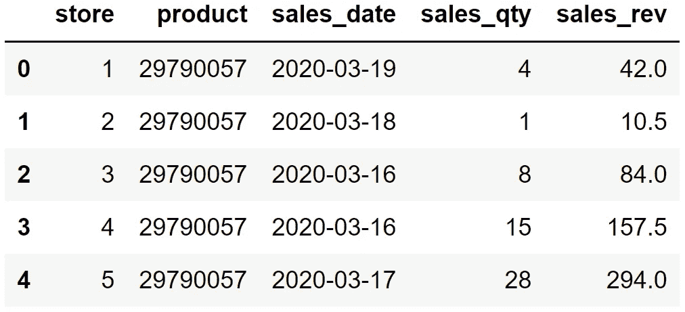
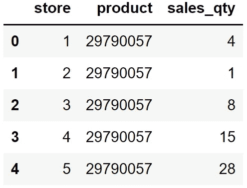
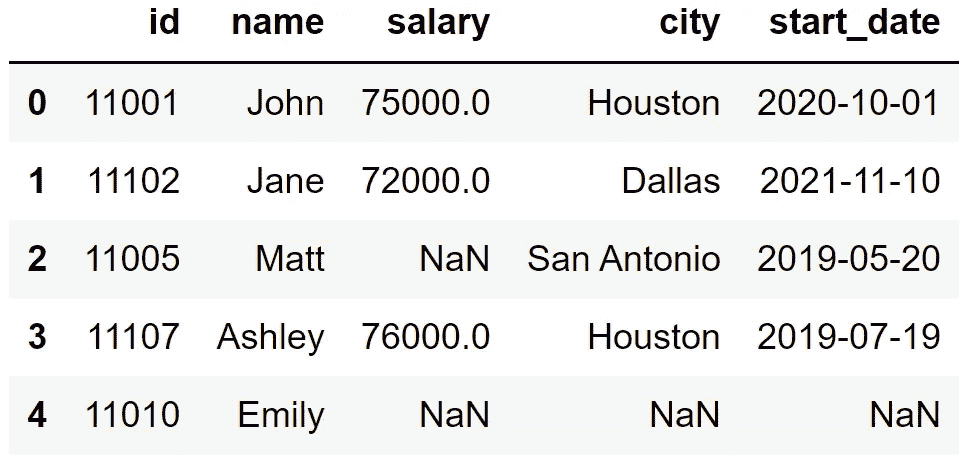
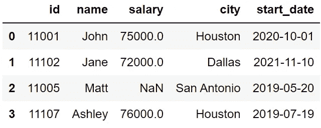
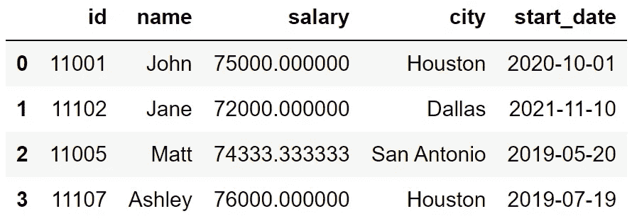

# 我使用熊猫已经 3 年了——以下是我最常用的 8 个功能

> 原文：<https://towardsdatascience.com/i-have-been-using-pandas-for-3-years-here-are-the-8-functions-i-use-the-most-4e54f4db5656>

## 实用指南


[张杰](https://unsplash.com/@jay_zhang?utm_source=unsplash&utm_medium=referral&utm_content=creditCopyText)在 [Unsplash](https://unsplash.com/s/photos/computer-keyboard?utm_source=unsplash&utm_medium=referral&utm_content=creditCopyText) 上的照片

Pandas 是数据科学生态系统中使用最频繁的库之一。它有许多功能，可以帮助我们完成几乎所有的数据分析、操作和处理任务。

我已经使用熊猫大约 3 年了，我不记得我需要其他工具来解决任何问题。因此，我强烈推荐有抱负的数据科学家学习熊猫。

虽然熊猫有很多功能，但其中有一小部分是你最需要的。在这篇文章中，我将分享我最常用的 8 个功能。

当然，我们需要一个数据集来处理。我准备了一个销售数据集样本，你可以从我的 GitHub [页面](https://github.com/SonerYldrm/datasets)下载。我们将使用名为“sample-sales-data.csv”的文件。

*   [这些函数的 R 版本](/r-versions-of-the-most-frequently-used-pandas-functions-f658cbcabaf7)
*   [这些函数的 SQL 版本](https://sonery.medium.com/sql-versions-of-the-most-frequently-used-pandas-functions-bb6399f87461)

# 1.阅读 _csv

它用于通过从 csv 文件中读取数据来创建熊猫数据帧。DataFrame 是 Pandas 的二维数据结构，由标记的行和列组成。

使用 read_csv 函数非常简单。我们只需给它 csv 文件的路径，我们就完成了。然而，这个函数有几个参数提供额外的功能。

让我们首先通过只提供路径来使用它。

```
import pandas as pddf = pd.read_csv("Data/sample-sales-data.csv")df.head()
```



df(作者图片)

head 方法显示数据帧的前 5 行。

让我们看看几个使 read_csv 函数更有用的参数。

*   给定列名，parse_dates 参数将数据类型转换为 datetime64[ns],这是适用于日期的数据类型。

```
df = pd.read_csv("Data/sample-sales-data.csv", 
                  parse_dates=["sales_date"])df.dtypes# output
store                  int64
product                int64
sales_date    datetime64[ns]
sales_qty              int64
sales_rev            float64
dtype: object
```

dtypes 方法返回每一列的数据类型。

*   usecols 参数允许读取列的子集，这在有几列而我们只需要其中的一部分时特别有用。

```
df = pd.read_csv("Data/sample-sales-data.csv", 
                 usecols=["store","product","sales_qty"])df.head()
```



df(作者图片)

*   nrows 参数用于读取文件的前 n 行。当我们有一个非常大的数据集，并且只需要探索它的一小部分时，它就派上了用场。

```
df = pd.read_csv("Data/sample-sales-data.csv", nrows=100)df.shape# output
(100, 5)
```

shape 方法返回一个显示行数和列数的元组。

# 2.值计数

value_counts 函数对于检查分类列中值的分布非常有用。它返回列中的唯一值及其出现的次数。

这里有一个例子。

```
df["store"].value_counts()# output
3    29
4    22
2    19
5    16
6     8
1     6
Name: store, dtype: int64
```

商店列中有 6 个不同的商店号，最常见的是 3，有 29 个观察值(即行)。

我们可以使用 normalize 参数来检查百分比份额的分布。

```
df["store"].value_counts(normalize=True)# output
3    0.29
4    0.22
2    0.19
5    0.16
6    0.08
1    0.06
Name: store, dtype: float64
```

29%的行属于 3 号商店。

# 3.astype

用正确的数据类型存储数据至关重要，因为:

*   有些函数只适用于特定的数据类型
*   一些函数使用合适的数据类型会更有效

例如，在 Pandas 的 dt 访问器下有许多有用的方法，但是它们只能用于 datetime 数据类型。

astype 函数转换列的数据类型。这里有一个例子。

```
df["sales_date"] = df["sales_date"].astype("datetime64[ns]")df.dtypes# output
store                  int64
product                int64
sales_date    datetime64[ns]
sales_qty              int64
sales_rev            float64
dtype: object
```

我们还可以使用字典在一次操作中改变多个列的数据类型。

```
df = df.astype({"store":"category","sales_qty":"float"})df.dtypes# output
store               category
product                int64
sales_date    datetime64[ns]
sales_qty            float64
sales_rev            float64
dtype: object
```

# 4.isna

我们经常需要处理丢失的值，这些值仅仅表示我们没有的数据。

让我们创建一个带有一些缺失值的样本数据帧。

```
import numpy as np
import pandas as pdcustomer = pd.DataFrame({
    "id": [11001, 11102, 11005, 11107, 11010],
    "name": ["John","Jane","Matt","Ashley","Emily"],
    "salary": [75000, 72000, np.nan, 76000, np.nan],
    "city": ["Houston","Dallas","San Antonio","Houston", np.nan],
    "start_date": ["2020-10-01","2021-11-10","2019-05-20",
                   "2019-07-19", np.nan]
})customer
```



客户(图片由作者提供)

例如，我们不知道 id 为 11005 的客户的工资信息。对于最后一行的客户，我们只有姓名。

当我们有一个大的数据集时，我们不能直观地检查或计算缺失值。isna 函数检查每个单元格，并为缺失值返回 True。然后，我们可以使用 sum 函数来获得每一列或每一行中缺失值的数量。

```
customer.isna().sum()# output
id            0
name          0
salary        2
city          1
start_date    1
dtype: int64 customer.isna().sum(axis=1) # for rows# output
0    0
1    0
2    1
3    0
4    3
dtype: int64
```

# 5.德罗普纳

我们基本上有两个选项来处理缺失值:drop 或 fill。

选择哪个选项取决于缺失值的数量、数据集的大小和我们的任务。例如，我们可以删除最后一行，因为我们对这个客户了解不多。

dropna 函数用于删除缺少值的行或列。以下 3 个参数定义了该功能的运行方式:

*   轴:0 代表行，1 代表列
*   如何:any 用于删除带有任何缺失值的行或列，all 用于删除带有所有缺失值的行或列
*   thresh:为一行或一列的非缺失值数量设置一个阈值，使其不被丢弃。

让我们删除任何没有至少 3 个非缺失值的行。

```
customer.dropna(axis=0, thresh=3, inplace=True)customer
```



客户(图片由作者提供)

最后一行已被删除，因为它只有 2 个非缺失值，小于我们的阈值 3。

inplace 参数用于保存更改。

# 6.菲尔娜

处理缺失值的另一个选择是用合适的值替换它们，这可以用 fillna 函数来完成。

例如，我们可以用 salary 列的平均值替换该列中缺少的值。

```
customer["salary"].fillna(customer["salary"].mean(), inplace=True)customer
```



客户(图片由作者提供)

fillna 函数提供了一种用上一个或下一个值填充缺失值的简单方法。当我们有顺序数据时，它特别有用。我们可以通过使用带有以下选项的方法参数来实现这一点:

*   bfill:使用下一个值替换丢失的值
*   ffill:使用以前的值替换丢失的值

# 7.分组依据

groupby 函数对于数据分析来说非常方便。它允许根据列中的不同值对行进行分组。然后，我们可以为每个组计算一个大范围的聚合。

例如，在我们的销售数据集中，我们可以计算每个商店的总销售量，如下所示:

```
df.groupby("store")["sales_qty"].sum()# output
store
1     140436
2      89710
3      71309
4      45068
5      69614
6      23598
Name: sales_qty, dtype: int64
```

我们还可以使用命名聚合，如下所示:

```
df.groupby("store").agg(
    total_sales = ("sales_qty","sum")
)
```


(图片由作者提供)

为了使 groupby 函数更有用，我们还可以执行其他几种聚合。

如果你想了解更多，这里有一篇我以前写的关于 groupby 函数的文章:

[](/11-examples-to-master-pandas-groupby-function-86e0de574f38)  

# 8.独一无二的

这两个功能非常相似，所以我想一起解释一下。

*   unique 返回不同的值
*   nunique 返回不同值的数量

```
df["store"].nunique()# output
6df["store"].unique()# output
array([1, 2, 3, 4, 5, 6], dtype=int64)
```

熊猫有更多的功能来简化和加快数据科学家和分析师的工作。我们只介绍了其中的 8 种，但我相信这些是你会用得最多的。

*你可以成为* [*媒介会员*](https://sonery.medium.com/membership) *解锁我的全部写作权限，外加其余媒介。如果你已经是了，别忘了订阅*[](https://sonery.medium.com/subscribe)**如果你想在我发表新文章时收到电子邮件。**

*[](https://sonery.medium.com/membership) * 

*感谢您的阅读。如果您有任何反馈，请告诉我。*