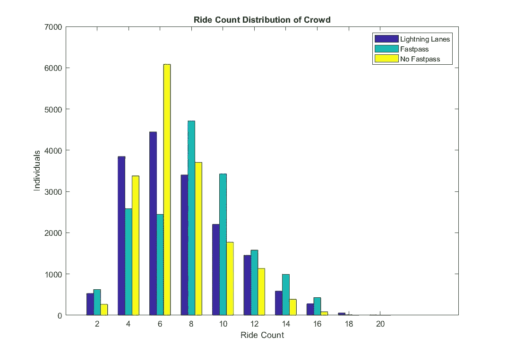
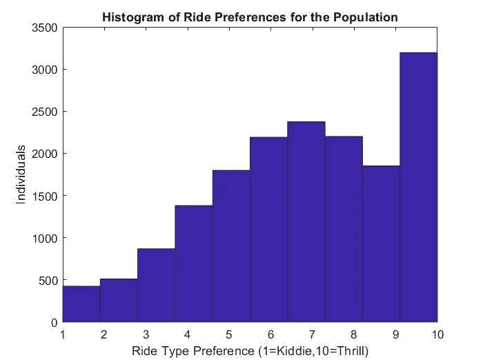
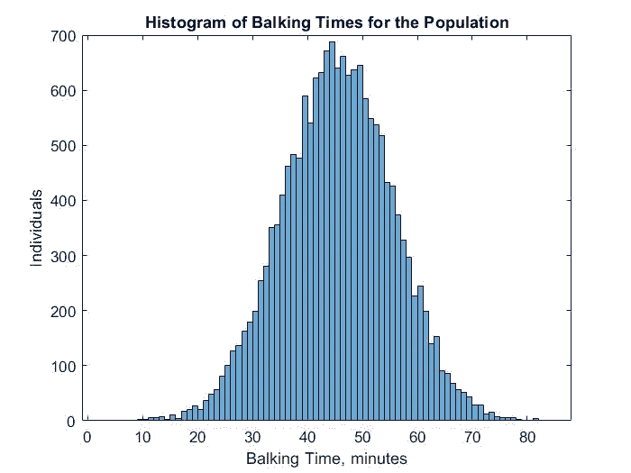
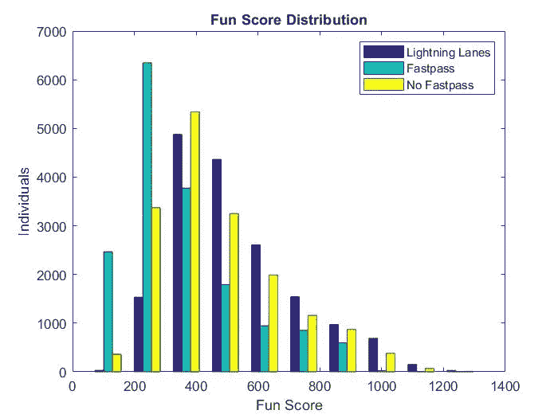
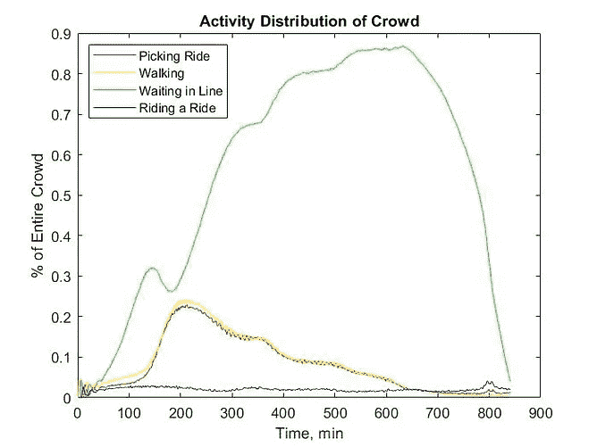
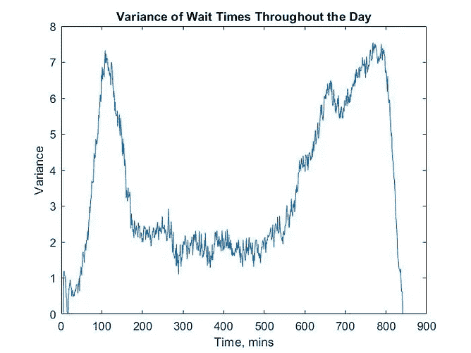
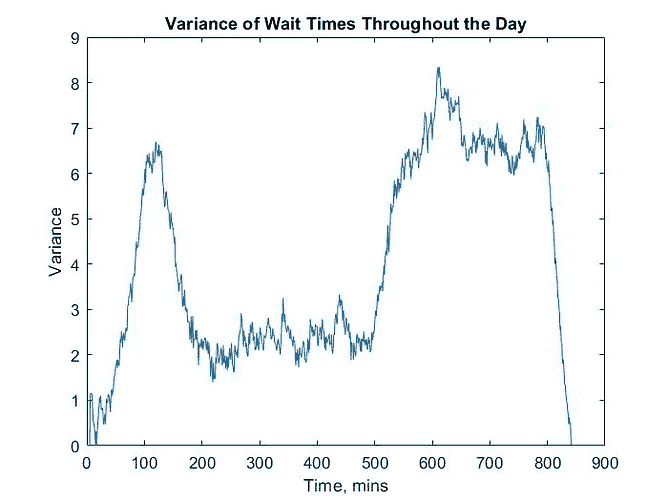

# 我用排队论模拟了迪士尼新的虚拟线路系统

> 原文：<https://towardsdatascience.com/i-used-queuing-theory-to-simulate-disneys-new-virtual-line-system-bd593213c006>

## 对新的虚拟队列和传统的快速通行系统进行逐分钟的人群模拟比较



图片由作者提供

## 简介:

2021 年 12 月 8 日，迪士尼乐园首次推出了一个新的虚拟排队系统，用预付费的移动版本取代了原来的纸质 fastpass。这项新服务被称为 Genie+，在公园里每人每天的费用是 15 美元。曾经是免费服务，所有客人都可以利用，现在是高级订阅。这种新方法能让那些付得起额外 15 美元的人过一个更美好的迪士尼日吗？迪士尼乐园是否正式将游客划分为迷你社会阶层？在这一期模拟迪斯尼乐园的节目中，我将尝试回答这些问题以及更多的问题。

## 构建模拟:

为了简化模拟，想象一个主题公园，游客进入 10 种不同的游乐设施中，从儿童游乐设施到惊险游乐设施。每个游乐设施与公园中心的距离相等，每个游乐设施的客流量相同，均为 1500 人/小时。

现在把所有 16800 个人想象成一个有着严格偏好的个体。这些人中的每一个都被随机赋予了这些品质:

*   类似于人群进出主题公园的预定到达和离开时间。这些时间分布如下所示，T = 480 分钟(上午 8 点)是公园开门的时间，T = 1320 分钟(晚上 10 点)是公园关门的时间。


图片由作者提供

*   使用与之前游乐设备分类相同的等级的游乐设备类型偏好。这种分布如下图所示，一般人享受 7 级，但大多数人享受 10 级。



图片由作者提供

*   停留时间，即乘客等待乘坐的最长时间。分布如下图所示，平均停顿时间为 45 分钟，95%的人停顿时间在 25 到 65 分钟之间。



图片由作者提供

*   不管这个人是否有快速通过的能力，1/3 的公园游客在 Genie+模拟中有这种能力。

当个人选择乘坐时，所有 10 次乘坐都根据当前等待时间、乘坐与个人刺激偏好的匹配程度以及他们是否已经乘坐过来评分。然后，这个人选择一个更好的乘车点，走向它。

当人们到达游乐设施入口时，他们要么排队，要么犹豫不决，离开去寻找另一个游乐设施。这个犹豫的时间对每个人来说都是不同的，就像在现实中一样。如果该人在时间上犹豫不决，并且具有快速通过能力，他们将获得快速通过/闪电通道返回时间，然后加入虚拟队列。当他们等待虚拟的返回时间时，他们也会选择一个新的旅程。这个决策的代码如下所示:

```
if crowd_data(j,11) > ride_data(crowd_data(j,6),5) % if person thinks wait time is goodwaittime_score = 1/(1+exp(0.05*((round(ride_data(k,1)*60/volume)) - 45))); % Waittime score is sigmoid-based, low wait times = 1, high wait times = 0thrill_score = 1/(1+exp(-0.25*(abs(ride_data(crowd_data(j,6),4) - crowd_data(j,3))-4))); % How similar the ride is to the person's interests, also sigmoid basedif crowd_data(j,crowd_data(j,6) + 11) == 0 % if the person has ridden the ride alreadyvariation_score = 1;elsevariation_score = 0;endcrowd_data(j,25) = 50*waittime_score + 33.33*thrill_score + 33.33*variation_score; % adds the score to the person's cellcrowd_data(j,5) = 3; % indicates waiting in linecrowd_data(j,7) = ride_data(crowd_data(j,6),5); % sets wait time to posted timeride_data(crowd_data(j,6),1) = ride_data(crowd_data(j,6),1) + 1; % increases ride posted wait timeride_data(crowd_data(j,6),5) = round(ride_data(crowd_data(j,6),1)*60/1500); % updates wait time
```

对于一天中的每一分钟(早上 8 点到晚上 10 点)，每个人都有一个行动要做，不管是少排队一分钟，还是少步行一分钟。全天跟踪每个人和骑行的数据。这些数据点包括:

*   犹豫率——当天每个人在等待时间犹豫的次数。
*   使用的快速通道——当天每个人使用快速通道/闪电通道的次数。
*   骑行历史——每个人每次骑行的次数。
*   当前行动——一天中的每一分钟，这个人是在搭车、走路、排队还是在骑车。
*   总等待时间——每个人排队时间的总和。
*   总乘车次数——该人乘车次数的总和。
*   总“乐趣”分数——一个人上车后产生的值，基于他们等待的时间和他们享受该类型乘坐的程度。这些是每个人一天的总结。
*   等待时间-一天中每分钟每次乘坐的当前等待时间。

使用三种不同快速通过系统的这些数据点，我将能够比较每种类型对等待时间和人群情绪的影响。

## 结果:

我认为最好按照迪士尼乐园使用的顺序来展示每个系统的结果。这意味着从 1955 年到 1999 年的“无快速通道”系统将会先行。

模拟中没有人有快速通过的能力，他们要么选择排队，要么在另一次乘坐中试试运气。该模拟产生了以下结果:

*   平均每人乘坐次数:7.732 次
*   平均等候时间:60.97 分钟
*   平均“有趣”得分:528.68

从 1999 年到 2021 年，经典的纸张快速通过系统被使用。现在，模拟中的每个人都有快速通过的能力。该模拟产生了以下结果:

*   平均每人乘坐次数:8.90 次
*   平均等候时间:52.10 分钟
*   平均“有趣”得分:350.72

最后，从 2021 年开始，新的虚拟快速通行证系统将投入使用。现在，只有那些支付 15 美元的人拥有精灵+能力(大约 1/3 的人群)。该模拟产生了以下结果:

*   平均每人乘坐总次数:8.02 次
*   总平均等候时间:57.45 分钟
*   总平均“乐趣”得分:462.10

现在分为两类，购买了 Genie+的用户和没有购买的用户:

*   精灵+会员平均乘坐次数/人:10.24 次
*   精灵+会员平均等待时间:43.30 分钟
*   精灵+会员平均“有趣”得分:465.18
*   *非*-精灵+会员平均乘车次数/人:6.90 次
*   *非*-精灵+会员平均等待时间:68.10 分钟
*   *非*-精灵+会员平均“乐趣”得分:460.54

## 分析:

在所有三个类别中，为快速通行特权付费的人之间有明显的差异。与不付费的人相比，付费购买 Genie+的人多体验了 3.34 次乘车，少等了 33.8 分钟，平均多了 4.64 个乐趣点。

虽然这看起来像是一笔 15 美元的好交易，但与最初的纸质快速通行证相比，它实际上增加了每人的总平均等待时间(+5.35 分钟)，减少了每人的平均乘车次数(-0.88 次)。然而，与最初的快速通过系统(350.72)相比，Genie+产生了更高的平均乐趣分数 462.10。为什么即使平均等待时间增加了，人们还是会玩得更开心？

这与闪电巷趣味评分分布的偏斜度有关。虽然平均乘坐次数和等待时间对 Genie+来说并不乐观，但有趣的分数分布远远偏向右侧，这意味着闪电车道允许那些为 Genie+付费的人获得大量有趣的分数。缺点是，与其他两个系统相比，拥有平均乐趣分数的人更少。



图片由作者提供

虽然这是闪电车道的一个优点，但它无法与 fastpass 之前的时代(1955 年至 1999 年)的有趣分数相比。考虑到除了在必要时排队等候之外没有其他选择，无快速通过模拟的有趣分数(528.68)令人难以置信。我想，当没有一条看不见的线在他们前面占座时，人们会更快乐。

下面的图代表每个人在一天中的每一分钟在公园里做什么(左=没有快速通行证，中=经典快速通行证，右=精灵+)。



图片由作者提供

这些显示了基于快速通行证系统类型的人群决策的差异。非快速通行系统在下午 5 点达到等待高峰，88%的人在排队，经典快速通行系统在下午 6:30 达到等待高峰，87%的人在排队，而 Genie+在下午 4:30 达到等待高峰，91%的人在排队。

这意味着当前的 Genie+系统使等待时间更快减少，公园在晚上 8:30 达到 50%的排队率(相比之下，非快速通行证系统的排队率为晚上 9:15)。

快速通道存在的主要原因之一是这些系统可以更均匀地分散整个公园的人群。通过找出一天中每分钟等待时间的变化，我可以看到所有三个系统的人群分布情况。下图显示了一天中所有 10 次乘坐等待时间的变化(左=无快速通过，中=经典快速通过，右=精灵+)。方差越小越好，这意味着所有的等待时间越相似。



图片由作者提供

非快速通过系统(左)的平均等待时间方差为 3.41，这意味着等待时间与当天的平均值相差 3.41 分钟。接近一天开始和结束时的变化峰值是由于个人在各自的时间到达和离开公园。当差异在一天当中达到最低点时，公园就达到了平衡状态。对于非快速通过系统，这个平衡期发生在上午 11 点—下午 4:30。

经典快速通过系统(中间)的平均等待时间方差为 3.44。它的平衡状态发生在上午 11 点—下午 5 点。

Genie+系统(右)的平均等待时间方差为 4.04。它的平衡状态发生在上午 11 点—下午 4:30，就像非快速通过系统一样。

在疏散人群方面，非快速通行证系统的效果最好，当天的平均方差最低(3.41)。然而，就最长的平衡周期而言，经典的快速通过系统在 6 小时的周期内效果最好。也许这个公园的人群在分散他们自己方面做得很好，不需要虚拟的队列来为他们做这件事。

## 结论:

回顾所提供的统计数据和图表，可以清楚地看到，传统的快速通过系统产生了最佳的等待时间(平均 52.10 分钟。分钟)和乘坐次数(平均 8.90 次。乘坐)，这是真正的非快速通行证系统给了人群最好的迪士尼日(平均 528.68)。好玩点)。

迪士尼有没有正式把它的客人分成迷你社会阶层？如果我们看看那些为 Genie+付费的人和那些没有付费的人之间的差异，我们会发现额外的 3.34 次平均乘坐和 33.8 分钟的排队时间为双方提供了巨大的差距。如果有一些好处，如等待时间的总体减少，这可以被认为是可以接受的，但模拟表明，它使等待时间增加了 5 分钟，实际上增加了队列长度的变化。

那么，如果 Genie+没有公园收益，那么迪士尼为什么要在他们的公园中实施这一新系统呢？答案很简单——美元。对于这种规模的公园(10 个游乐设施，每天最多 16，800 名游客)，公园收入每天将增加 84，000 美元。对于这个假想的公园来说，这意味着每年增加超过 3000 万美元的收入，这个公园的大小大约是迪斯尼乐园的 1/3。迪士尼乐园也是目前使用 Genie+的四个公园之一。难怪迪士尼在 2022 年第一季度实现了空前的营收和营业收入记录。

所以答案是肯定的，现在在迪斯尼乐园有两个截然不同的社会阶层。那些付得起每人每天 15 美元(一个 5 口之家 5 天假期 375 美元)的人，和那些付不起的人。这是不是意味着所有的快速传球都是不好的？不。经典的快速通行证系统并不掠夺家庭度假者，而是给那些更聪明地利用时间的人带来优势，而不管他们的预算或团队规模。

不幸的是，模拟显示迪士尼带着 Genie+走向了错误的方向。

如果你对这种类型的内容感兴趣，我建议你阅读我在迪士尼乐园模拟中的其他作品:

[迪士尼乐园算法:一个受监督的机器学习程序](/the-disneyland-algorithm-a-supervised-machine-learning-program-67c730cd62d5)

[预测迪士尼乐园:让你的迪士尼日更美好的策略](/predicting-disneyland-strategies-to-better-your-disney-day-e08f8b84f51)

[通过人口模拟预测迪士尼乐园的等待时间](/predicting-disneyland-wait-times-through-population-simulations-20f44c7582f6)