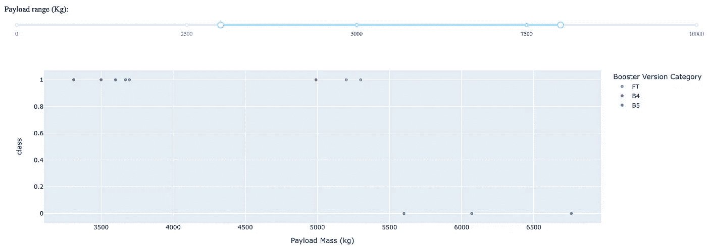
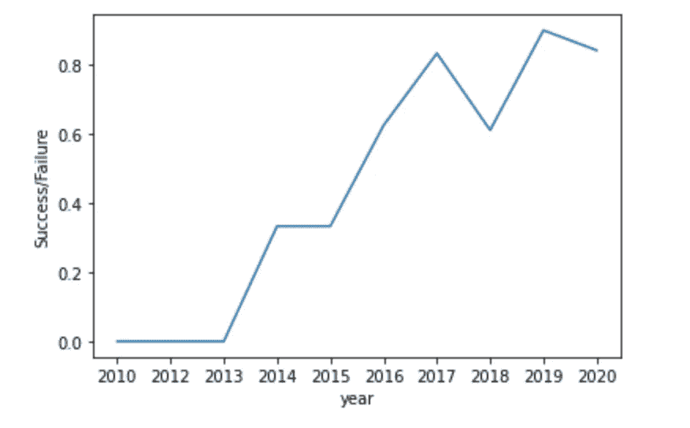
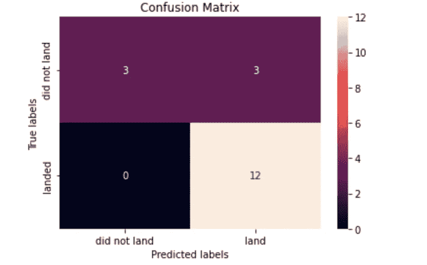

# IBM 数据科学认证评论

> 原文：<https://towardsdatascience.com/ibm-data-science-certification-review-970c2d85a039>

> Coursera 上的 IBM 数据科学认证(专业化)课程为那些希望扩展其分析技能的人提供了一个很好的数据科学介绍。本课程介绍了数据科学中的各种主题，包括如何正确显示和可视化数据，以用 Python 构建高性能的机器学习模型。这个专业不仅对以前从未见过这些主题的初学者来说很棒，而且对希望验证和建立他们当前技能的更高级用户来说也很棒。

***免责声明:我与 IBM 没有任何从属关系或财务激励。***


[斯科特·格雷厄姆](https://unsplash.com/@homajob?utm_source=medium&utm_medium=referral)在 [Unsplash](https://unsplash.com?utm_source=medium&utm_medium=referral) 上拍照

# 概观

许多人虽然在分析技能方面很有能力，但希望扩大他们对各种数据科学技术的理解。虽然完成数据科学硕士或博士学位是一项令人钦佩的事业，但申请并完成数据科学认证是另一个出色的选择，它不会迫使你在磨练数据科学技能的同时倾家荡产。

在完成运筹学理学硕士(MS)的同时，我决定参加 Coursera 上提供的 IBM 数据科学认证课程，以便在我的教育任务中使用这些技能。该课程预计需要大约 10 个月的时间，而我能够在大约 5 个月内完成(我承认我以前上过数据科学课程，并接受过关于每门课程中讨论的数学概念的更深入的教育)。我从这门课中学到的两点。

1.  对于初学者来说，这是一个很好的入门课程，尤其是对于那些害怕 Python 编码并远离它的人。
2.  **对于有经验的人来说，这是一门很好的课程，但是，对于更高级的用户来说，有些课程可能感觉太容易了，而且课程中的编码练习可能不足以提高更高级的数据科学家的编码能力。**

**总分:** 7.8/10

**主要优点:**课程的集合非常有助于以可控的速度缓慢进步和微调学生的技能。最初的几门课程主要解释数据科学领域及其内容，而后面的课程更具技术性，涉及学生使用 Python 编码语言应用各种数据科学技术。

许多编码实践仅仅给出了答案和代码。虽然从技术上讲，这不是一个编码密集型专业，但我相信，如果将认证时间延长到一年，增加一门关于编码的课程，并在编码模块中提供更少的信息，这样学生就必须实际学习并找出每种技术的正确代码，会更有好处。那些在数据科学方面更先进的人可能希望有一个更密集的编码课程，迫使他们从零开始，并教授更高级的编码方法。

# 课程 1:什么是数据科学？

在本课程的第 1 周，学生将了解数据科学包含的内容以及数据科学家的方法和实践。在第 2 周，学生将学习数据科学的一些主要领域，如大数据、数据挖掘、深度学习和机器学习。本课程的最后一周向学生讲授商业中的数据科学。这门课程最大的优点是它很好地给出了数据科学的总体情况。最大的缺点(如果有的话)是，如果学生已经具备中等的技术背景和对所提到的数据科学技术的理解，他们可能会发现本课程没有必要，而且由于信息冗余而令人厌烦。

# 课程 2:数据科学工具

本课程从概述计算机程序员(在数据科学中)常用的不同编码语言开始。这些语言包括 Python、R 和 SQL(虽然有些人在技术上不认为 SQL 是一种语言，但本课程介绍了 API)。在向学生介绍了不同的语言之后，该课程将教授他们不同的云计算服务、应用编程接口(API)、数据集和机器学习模型的类型。在课程的第 2 周，学生将接触到各种开源材料，包括 Jupyter Notebook、JupyterLab、RStudio 和 GitHub。在第 3 周，该课程帮助学生浏览 IBM 为数据科学提供的工具。课程的大部分内容涉及在 IBM 的在线编码平台[沃森工作室](https://www.ibm.com/cloud/watson-studio)中使用 Jupyter 笔记本。最后，在第 4 周，学生将学习如何在 Watson Studio 中实现和查看 Jupyter 笔记本。

# 课程 3:数据科学方法

在本课程中，学生首先学习如何发现(或给出)一个问题，并寻找解决该问题的要求。在理解了问题的要求之后，学生就被引入了收集的概念:为解决问题而收集信息。一旦收集完成，该课程进一步教学生如何评估和验证模型的有效性，这是为利益相关者创建产品时的一个重要概念。最后，本课程概述了部署模型和接收模型反馈的方法，无论是来自利益相关者还是内置的模型评估功能。

```
data_falcon9**.**loc[:,'FlightNumber'] **=** list(range(1, data_falcon9**.**shape[0]**+**1))
data_falcon9
```

上面的代码是本课程的一个片段，其中要求学生对之前在数据框中收集的 Falcon9 发射进行排序。

# 课程 4:用于数据科学、人工智能和开发的 Python

本课程首先向学生介绍 Python 编程的基础。其中一些基础知识包括通过转换或转换字符串、浮点和整数等数据类型来理解 Python 中的类型，通过应用数学运算来解释变量和求解表达式，以及在 JupyterLab 中构建程序。在第二周，学生将学习列表和元组，字典和集合。Python 编程的基础将在第 3 周介绍。这些基础包括条件和分支、循环、函数、异常处理以及对象和类。第 4 周展示了使用 *open* 读写文件，以及使用 Python 库 *Pandas* 和 *Numpy。*最后，在第 5 周，除了 REST APIs、web 抓取技术(即使用 BeautifulSoup)，并处理 HTML 文件。

# 课程 5:面向数据科学的 Python 项目

在课程的这一点上，学生将已经(主要)了解了 python 编码语言，并期望完成一个包含数据科学的 Python 项目。虽然这听起来有点吓人，但我之前提到过，课堂上已经提供了很多代码，学生只需要填写空白。虽然这有助于完成课程，但努力从头学习代码比获得代码更有利于学习(本[书](https://www.amazon.com/Range-Generalists-Triumph-Specialized-World/dp/0735214484)更深入地讨论了学习概念)。在本课程中，你需要制作一个简单的仪表板。仪表板在可视化数据集(或多个数据集)的不同参数如何交互方面非常有用。对于学生来说，学习如何制作一个 Plotly 仪表板是很重要的，因为当他们被雇佣时，利益相关者会要求他们提供许多可交付成果。 [Plotly](https://plotly.com/dash/) 是一个伟大的 Python 工具，对于数据科学家来说是一个非常有用的 API。



图片:仪表板中的示例图表(图片来自作者)

# 课程 6:使用 Python 的数据科学的数据库和 SQL

对我来说，这个课程是最有益的，因为我以前没有使用 SQL 的经验。课程 6 通过 Jupyter 笔记本教你使用 SQL 平台。学生将学习一些常见的命令，例如查询所有的列名，根据特定的标准查找特定的实例。课程的第一周向学生介绍 SQL，并让学生对数据库有更深入的了解。对于 SQL 来说，数据库是关系型的，这意味着不同的数据库有对应于其他数据帧中某些特性的条目。第 2 周揭示了关系数据库，如何创建关系数据库，并提供了使用关系数据库的练习。第 3 周将教学生如何使用字符串和范围集来解析和组合数据库中的不同数据点。最后，在第 4 周，学生将在 Jupyter 笔记本上磨练他们的技能，并使用 python 完成一个小型 SQL 练习。

```
**%sql** select landing__outcome from SPACEXTBL;
```

上面是用于在数据库中显示 SpaceX 发射的所有着陆结果的代码示例。

# 课程 7:用 Python 实现数据可视化

认证的课程 7 非常重要，因为虽然数据科学家必须能够进行适当的分析，但无法将分析直观地呈现给利益相关者可能最终会破坏项目的成功。第一周介绍数据可视化，包括如何创建简单的图(散点图和线图)。本课程中使用的两个主要 Python 库是 *Pandas* 和 *Matplotlib* 。在第 2 周，重点转向创建面积图、直方图、条形图和箱线图。我必须创建的一个图是一个线形图，用于检查一段时间内成功发布的趋势



图片:成功发布的趋势示例(图片来自作者)

此外，还提供了更多练习来理解和创建散点图和气泡图。在第三周，随着华夫饼图表和单词云的引入，课程开始变得更加专业。本周介绍另一个高级 Python 可视化库 *seaborn* 。在这一周中，学生不仅将学习如何绘制回归图，还将介绍叶子图。对于任何使用地理空间数据并希望绘制地理空间数据的人来说，leav map plot 是一种非常好的方法。


图片:树叶地图示例(图片来自作者)

第 4 周是前 3 周的高潮，让学生使用 Plotly Dash 创建一个带有视觉效果的仪表板。每当你为利益相关者做项目时，我推荐你为这个课程做书签作为参考，因为它为决策者创建最终项目提供了很好的指导。

# 课程 8:用 Python 进行机器学习

课程 8 为那些想了解更多关于用 Python 实现机器学习(ML)模型的人提供了很好的介绍。第一周介绍了机器学习的基础知识，包括监督学习和非监督学习的区别，以及一些 ML 通用算法。在第二周，学生学习如何进行和实施回归分析。本周探索的不同类型的回归模型包括线性、非线性、简单、多重和多项式回归。第三周介绍不同类型的机器学习分类模型，包括 KNN、决策树、逻辑回归和支持向量机。在最后一周，向学生介绍聚类算法。学生将探索的三种算法是基于分区的、分层的和基于密度的聚类。对于课程 9 中的每个模型，学生还将学习模型评估。例如，他们必须找到每个模型的[混淆矩阵](https://machinelearningmastery.com/confusion-matrix-machine-learning/#:~:text=A%20confusion%20matrix%20is%20a%20summary%20of%20prediction%20results%20on,key%20to%20the%20confusion%20matrix.)，以确定模型的适当性(如下例)。



图片:逻辑回归模型混淆矩阵的例子(图片来自作者)

# 课程 9:应用数据科学顶点

认证的最后一门课程是我最喜欢的课程之一，因为我可以将我在过去 8 门课程中学到的所有技能用于实际应用。在本课程中，学生将获得 SpaceX 发射的数据集。有各种各样的特征与数据集相关联，其中发射失败和成功是项目中主要的突出特征。学生将使用 SQL 进行探索性分析，查看数据集的不同属性，并收集关于 SpaceX 发射城市的不同统计数据。在找到与发射场相关的成功和失败之后，学生们将使用 python 创建一个 follow 地图，以查看发射场的地理位置以及它们附近的物理特征。一旦学生了解了发射场的位置及其成功率，他们将使用机器学习来创建不同的预测模型(KNN、SVM、逻辑回归、随机森林)。最后，学生们将为他们的发现创建一个 Plotly 仪表板，SpaceX 的工作人员可以使用它来了解每个单独发射及其相应站点的相互作用。创建控制面板后，学生有机会为利益相关者创建完整的演示文稿，这是一堂宝贵的课，尤其是对于那些在受雇为数据科学家时必须演示和辩护其工作的人来说。

# 结论

无论您计划从另一个劳动部门进入数据科学领域，还是只想学习新技能以进行更深入的分析，我都强烈建议您完成 IBM 数据科学技能发展专业化认证。对于初学者来说，专业化提供了各种数据科学技术的概述，并慢慢向更具技术性的分析方法前进。对于更高级的用户来说，该课程可以帮助他们重新建立任何已经生疏的技能，同时也可以让他们了解一些在学习该课程之前可能不知道的技术。报名参加该课程绝对让我受益匪浅，我觉得该课程提高了我的数据科学技能！

如果你喜欢今天的阅读，请关注我，并告诉我你是否还有其他想让我探讨的话题！另外，在[**LinkedIn**](https://www.linkedin.com/in/benjamin-mccloskey-169975a8/)**上加我，或者随时联系！感谢阅读！**