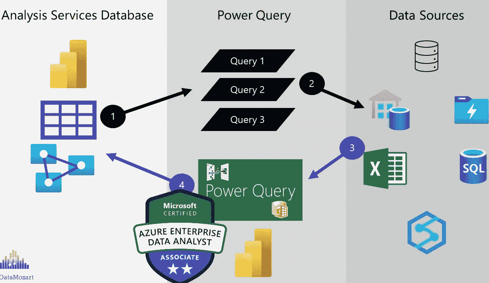
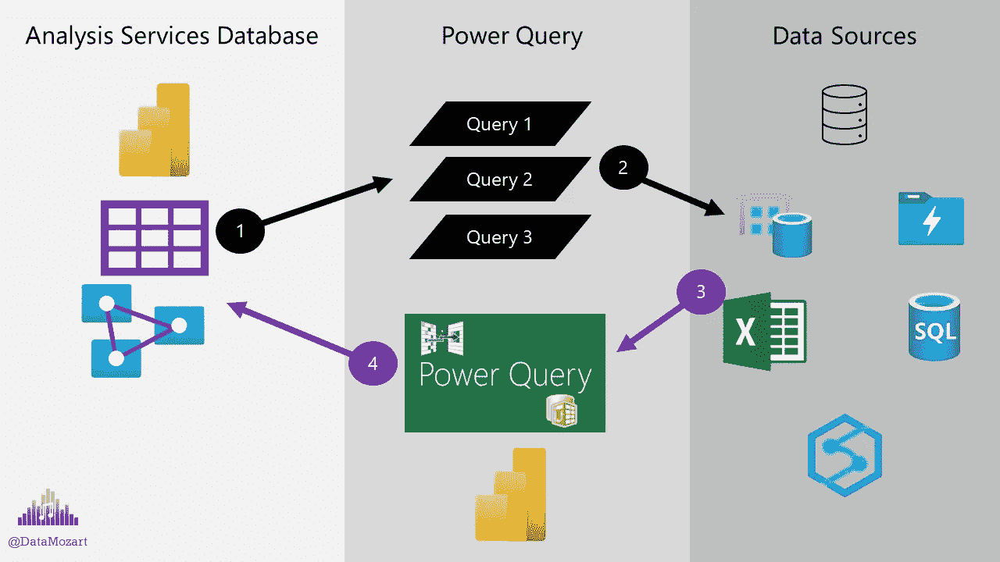
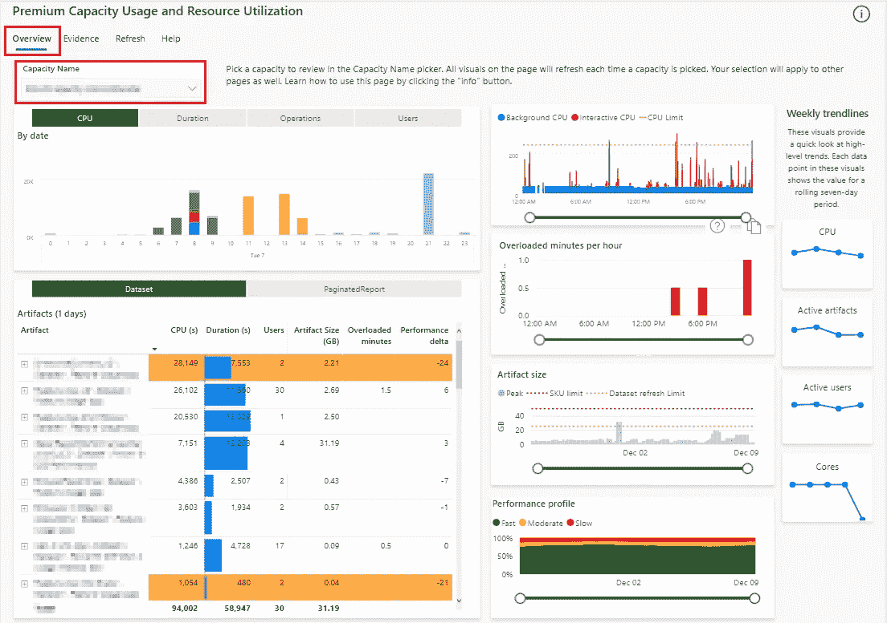
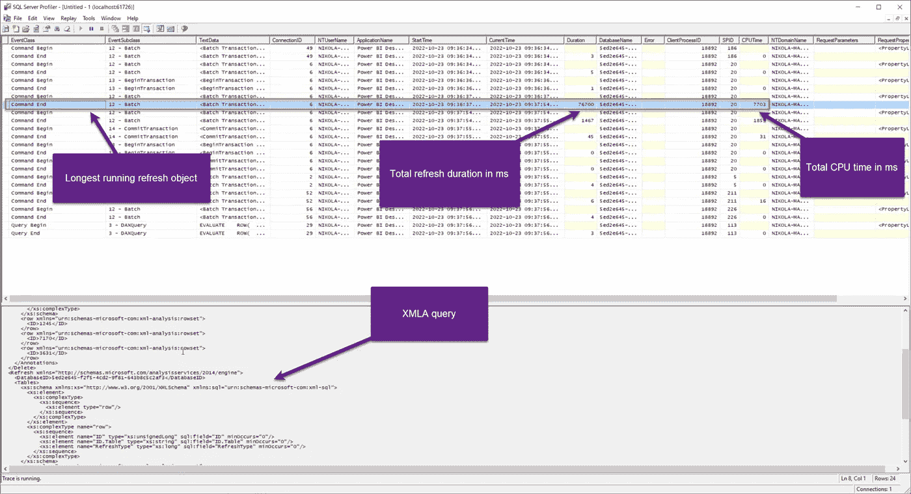
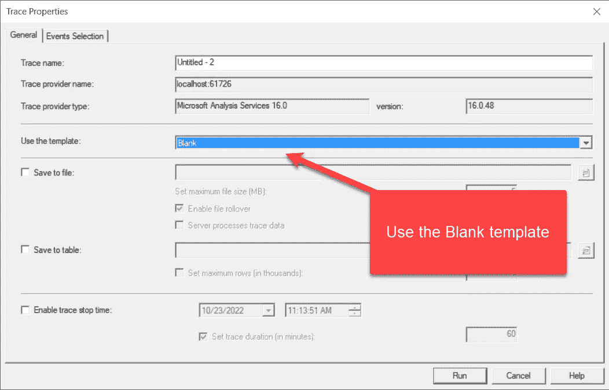
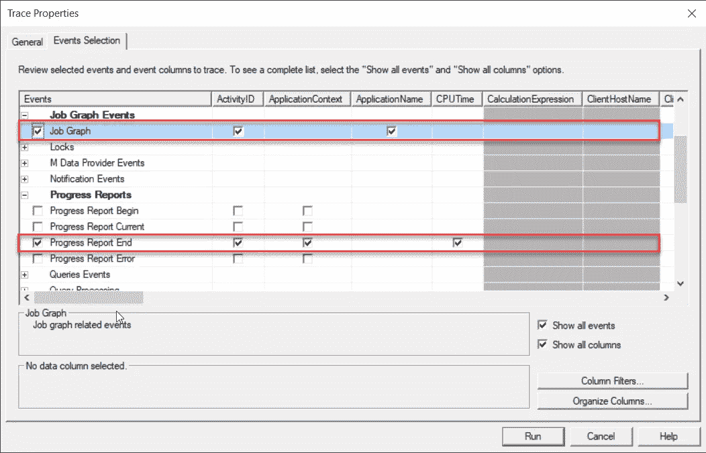
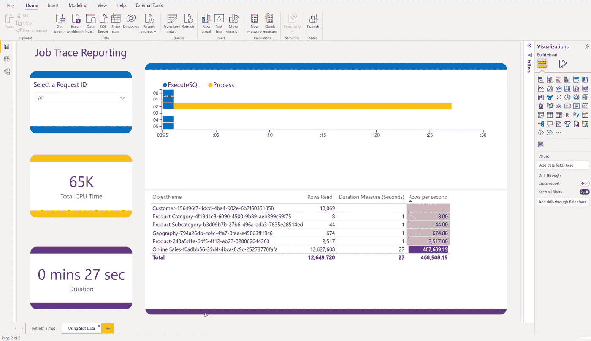

# 确定 Power BI 中的数据加载瓶颈

> 原文：<https://towardsdatascience.com/identify-data-loading-bottlenecks-in-power-bi-4a436355558c>

## 数据刷新过程缓慢？查看本文，了解数据刷新工作流中最常见的瓶颈！

作者图片

性能、性能、性能…我们一直努力使我们的(Power) BI 解决方案更加高效！我已经写了很多关于如何在多种场景下提高性能的文章——例如，通过[减少整体数据模型大小](https://data-mozart.com/how-to-reduce-your-power-bi-model-size-by-90/)，或者通过[利用查询折叠特性](https://data-mozart.com/what-is-a-query-folding-in-power-bi-and-why-should-i-care/)，或者通过[优化报告中使用的可视化](https://data-mozart.com/mastering-dp-500-exam-performance-improvements-in-queries-and-visuals/)。

还有，不要误会，当然知道如何修复问题超级重要！然而，最具挑战性的部分往往是找出问题所在！

**免责声明:** *本文将涵盖* ***识别*** *数据加载瓶颈的主题，而另一篇文章将涵盖性能改进实现技巧和技术*

与表现不佳的报告前端(暴露给用户的区域)不同，如果报告呈现缓慢，你可以打赌有人会抱怨，在数据加载和数据刷新方面，你不能依赖最终用户警告你。简单地说，他们不知道幕后发生了什么，可能的情况是，数据刷新过程需要几个小时，而报告的工作速度超级快。

# 了解数据刷新过程

在我们解释如何识别瓶颈之前，我们先来看看 Power BI 中的数据刷新流程:

作者图片

请务必记住，此工作流仅适用于导入模式，因为与 DirectQuery 一样，中间没有 PowerQuery 层，没有数据加载到为 Power BI 报告提供服务的 Analysis Services 实例中，因为 Power BI 生成的查询将直接针对数据源。

启动数据加载流程后，让我们简要解释一下工作流程的所有阶段:

1.  存储 Power BI 模型数据的 Analysis Services 实例将运行一个查询，或者在大多数实际情况下，运行多个查询来检索数据。Power Query 是物理存储在 Analysis Services 实例中的数据和物理存储在 Power BI 外部的数据(即 SQL 数据库、Excel 文件、Azure 数据湖、Azure Synapse 等)之间的逻辑层。)
2.  Power Query 会将查询转发给 Power BI 之外的各种数据源
3.  各种数据源会将数据发送回 Power Query
4.  Power Query 将对数据应用必要的转换(如果有的话),并将最终数据推回 Analysis Services 数据库

正如你可能已经注意到的，在上面的插图中，有三个不同的“灰色地带”。这三个区域中的每一个都可能是性能问题的根源。那没多大帮助，对吗？

那么，让我们看看如何确定数据刷新过程缓慢背后的主要原因。

我听到了，我听到了:我们可以使用 Power BI 服务中的刷新历史来确定数据刷新是否有问题。的确如此，但它只显示了总刷新时间，没有提供更细粒度的视图。这可能足以敲响警钟并吸引您的注意力，但它无助于关注数据刷新过程的哪一部分。

Power BI Premium 通过 Power BI Premium 容量指标应用程序提供更精细的概述:

作者图片

# 电源查询性能故障排除

如果您比较 Power BI Desktop 和 Power BI Service，您可能会发现，对于相同的数据，数据刷新过程有时会以非常不同的速度运行。根据超级查询查询运行的位置，性能可能会有很大差异。

如果您使用 Power BI Desktop 来开发报告，Power Query 查询将在您的计算机上本地运行。如果您只连接到云资源，那么 Power Query 查询将在 Power BI 服务中运行。

最后，从故障排除的角度来看这很重要， ***如果您连接到本地数据源，您的 Power Query 查询将在托管 Power BI 数据网关*的机器上运行！**为什么这很重要？嗯，因为它在数据刷新过程中引入了另一个潜在的瓶颈:安装网关的机器。

记住所有这些，超级查询性能可能取决于查询本身的复杂性和效率，但也取决于运行这些查询的机器的硬件规格(CPU 和 RAM)。

# 优秀的旧 SQL Server 事件探查器可助您一臂之力

由于 Power BI 将数据存储在 Analysis Services 表格数据库的实例中，因此我们可以利用一个很好的旧 SQL Server Profiler 来获取有关数据刷新过程中由 Analysis Services 启动的不同事件的最细粒度的信息。

由于我现在在本地机器上测试性能，一旦我获取了本地主机端口信息，我就可以使用 SQL Server Profiler 来收集数据刷新背后的各种指标。我将选择命令开始、命令结束、查询开始和查询结束事件:

作者图片

当我在 Power BI 桌面上点击“刷新”时，Profiler 将捕获一系列在后台发生的不同事件。一旦数据刷新结束，您应该能够看到如下内容:

作者图片

这里显示了许多有用的信息，比如查看运行时间最长的对象、以毫秒为单位的数据刷新总持续时间(在我们的例子中，大约花费了 76 秒)、CPU 花费的总时间，以及在后台生成的 XMLA 查询。

SQL Server Profiler 是对数据刷新过程进行故障排除的最可靠的方法，直到最近，它还是我检查数据刷新期间是否存在任何瓶颈的首选方法。

你可能想知道——为什么直到最近。有没有更好或者更方便的方法来达到同样的目的？

# 借助 Phil Seamark 的数据刷新流程可视化提升专业水平

在排除数据刷新过程的故障时，这是专业级别。我非常喜欢它，在我的 Power BI 性能调优研讨会上，我教人们如何使用它。它功能强大、健壮、超级直观，我可以向您保证，它将极大地简化故障排除工作流程。

这是怎么回事？这种方法的核心是 SQL Server Profiler，但这次我们将把 SQL Server Profiler 日志保存到一个跟踪 XML 文件中，然后使用 Power BI 可视化整个过程！

以下是 Phil Seamark 博客上原始帖子的[链接，在这里您可以找到分步指南和 PBIX 文件，您可以将它们用作自己的故障诊断任务的模板:](https://dax.tips/2021/02/15/visualise-your-power-bi-refresh/)

作者图片

在事件选择下，选择作业图表和进度报告结束:

作者图片

一旦数据刷新过程完成，并且您将 XML 跟踪日志数据导入到 Power BI 中，您应该能够看到如下内容:

按作者分类的图片:根据您的表格/查询，结果可能会有所不同

这太棒了。我可以立即看到一堆有用的信息，帮助我快速了解潜在的瓶颈在哪里。这里有一点很重要:*这个 pbix 文件不是一根魔杖，它会自动为你提供一个解决数据刷新缓慢的方法*。它将为您提供所有相关信息，但接下来要由您来寻找优化刷新性能的方法(如果有的话)。

例如，您可能会看到表 X 占用了总数据刷新过程时间的 90%以上。但是，可能发生的情况是，表 X 非常大，只需要更多的时间来刷新。所以，不一定说明那张桌子有问题。

执行 SQL 表示从发出查询到从数据源返回第一批行的时间，而 Process 显示 Analysis Services 处理数据和执行各种任务所需的时间，如[数据压缩](https://data-mozart.com/inside-vertipaq-compress-for-success/)。这两个指标**之间的差异**可能会给你一些启发——如果蓝色条很长，你可能想尝试优化数据源的性能(下一篇文章中有更多关于优化技巧和技术的内容)。

另一方面，长的黄色条可能是由安装本地网关的机器的物理限制，或者在本地网关机器上执行的复杂电源查询转换造成的。

# 结论

识别潜在瓶颈是数据刷新流程优化中最具挑战性的任务之一。在您可以卷起袖子投入到应用性能优化工具箱中的一种(或多种)技术之前，理解工作流的各个领域和“关键”点是至关重要的。

在本文中，您了解了对执行缓慢的数据刷新过程进行故障排除的不同方法。请继续关注，在下一篇文章中，我们将对此展开讨论，我将与您分享多种优化技巧和诀窍，让您的数据刷新过程更顺畅、更快速。

如果你有兴趣了解这个话题，我强烈建议你观看这个精彩的[克里斯·韦伯在 SQL Bits](https://youtu.be/MxONhJJi4go) 的演讲。

感谢阅读！