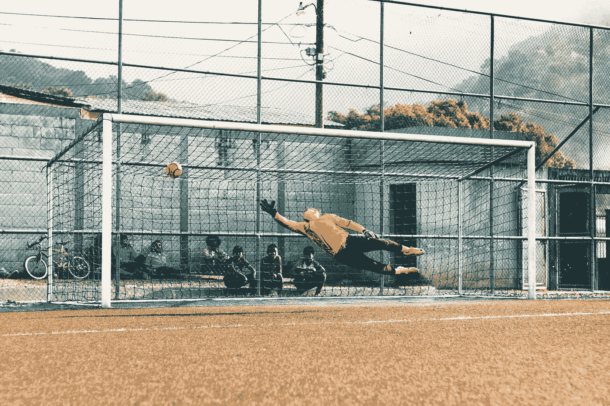

# 基于机器学习的守门员组合风格识别

> 原文：<https://towardsdatascience.com/identifying-goalkeepers-build-up-style-using-machine-learning-a39348b0cfff>

## 用于足球分析的聚类算法

Á·阿尔瓦罗·门多萨在 [Unsplash](https://unsplash.com/s/photos/goalkeeper?utm_source=unsplash&utm_medium=referral&utm_content=creditCopyText) 上拍摄的照片

# 介绍

准备阶段是一个球队控球并试图向对手射门得分的阶段。

守门员是防守队员的最后一人，但也是组织进攻的第一人。

了解守门员的构建方案是了解球队踢球风格的最重要的信息之一。

机器学习算法可以在分离守门员制定的不同构建方案中发挥作用。

在本文中，我将向您展示如何使用聚类算法将守门员的传球分成几个聚类。事不宜迟，我们开始吧！

# 履行

## 数据源

对于数据源，我们将使用来自 StatsBomb 的开放数据(经许可)。我们将从 2020 年欧锦赛开始分析守门员的组合模式。你可以在这里 通过 GitHub 库 [**阅读关于数据集的细节。**](https://github.com/statsbomb/open-data)

## 行动（或活动、袭击）计划

为了生成守门员的累积传球集群，我们必须在可视化之前准备好数据。这些步骤是:

*   加载数据，
*   准备数据，
*   使用 K-Means 算法对数据进行聚类，
*   想象每个守门员的集群。

## 加载数据

因为有来自不同比赛的大量数据，我们需要检索 2020 年欧锦赛的比赛、赛季和比赛标识符。

为了检索比赛和赛季 id，我们可以查看 competition.json 文件。下面是实现这一点的代码:

从上面可以看到，2020 欧洲杯对应的比赛和赛季 id 分别是 55 和 43。接下来，我们将使用这些 id 检索匹配 id。下面是实现这一点的代码:

获得完整的匹配 id 后，下一步是将数据组合成一个数据帧。下面是实现这一点的代码:

## 准备数据

在检索完整的匹配数据之后，我们需要准备数据，以便它可以用于建模过程。首先，我们将过滤包含守门员信息的数据。下面是实现这一点的代码:

然后，我们过滤描述守门员传球的数据。下面是实现这一点的代码:

接下来，我们选择列来简化建模和分析过程。这些列是球员和球队的名字，传球位置的起点和终点，传球的距离，以及传球的角度。下面是实现这一点的代码:

因为位置信息使用列表格式，所以我们需要提取这些值，并将它们放在单独的列中。下面是实现这一点的代码:

## 聚集数据

我们将使用一种称为 K-Means 算法的聚类算法来将过程分成几个组。

简而言之，K-Means 会初始化几个质心，每个数据都属于一个基于最近距离的质心。重复该过程，直到算法捕捉到最佳误差值。

但是在应用该算法之前，我们需要为每次传递提取位置、距离和角度等列。下面是实现这一点的代码:

然后，我们需要选择最佳的聚类数。我们可以用肘法来确定最佳聚类数。下面是查找号码的代码:

为了推断结果，我们需要查看一个聚类点，该点形成一条肘形线。还有，我们需要看看在肘形线之后误差是否没有显著减少。

正如您从上面所看到的，值 6 是集群的最佳数量。在该值之后，误差不会显著减小。因此，我们将使用它来分隔每个守门员的传球。

让我们通过使用最佳数量的集群并将标签放入数据帧来再次进行建模过程。下面是实现这一点的代码:

## 想象结果

现在我们有了集群的标签。最后一步是可视化这些集群，并为每个守门员划分它们。

为了使见解更有意义，我们只根据通过次数取前 3 个聚类。

我们将使用 mplsoccer 库来可视化图表。下面是实现这一点的代码:

我们能从这个可视化中推断出什么？我们可以看到每支球队都有不同的风格。

我们可以看到像蒂博·库尔图瓦、吉安路易吉·多纳鲁马和曼努埃尔·诺伊尔这样的守门员把球传给他们的后卫或中场。

马尔滕·斯特克伦博格、乌古坎·恰基尔和罗宾·奥尔森演奏了不同的风格。他们试图将球传给对方半场。

有了这些信息，球队将知道在哪个位置进行预测，这样球员就可以阻止对手控球。

# 结束语

干得好！您已经学习了如何使用聚类算法来生成守门员的集结模式。我希望您可以将该概念应用于不同的数据或应用程序。

如果你对我的文章感兴趣，你可以在 Medium 上关注我，看更多这样的文章。谢谢你看我的文章！