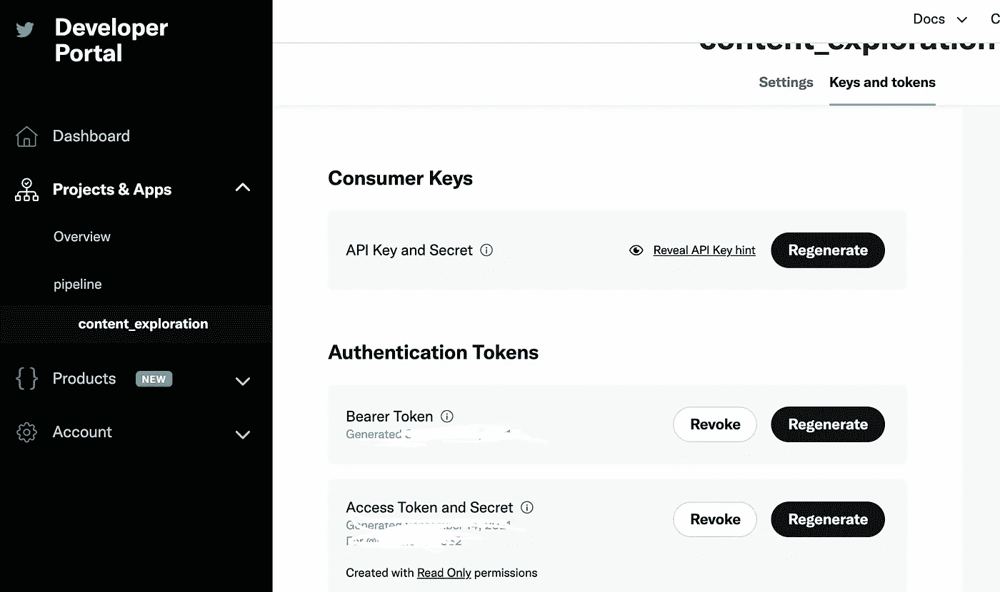
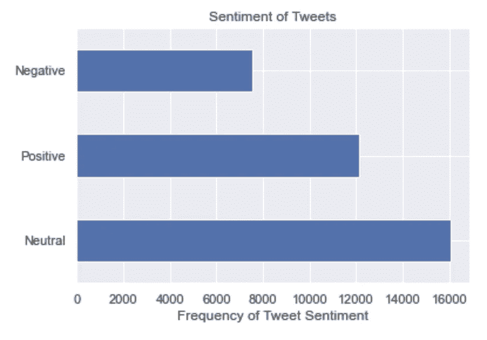

# 在 Python 中识别推文情感

> 原文：<https://towardsdatascience.com/identifying-tweet-sentiment-in-python-7c37162c186b>

## 如何使用 Tweepy 和 Textblob 识别推文情感


图片来自[埃德加·莫兰](https://unsplash.com/@ymoran)拍摄的 [Unsplash](https://unsplash.com/photos/92PmjawKUfs)

这篇文章的目的是为读者提供关于 [tweepy](https://www.tweepy.org/) 和 [textblob](https://textblob.readthedocs.io/en/dev/) 库的入门指南。本文将涵盖下面目录中列出的下列主题。

**目录** - Twitter API 凭证
-连接 Twitter API
-抓取 Twitter 数据
-清理 Tweet 数据
-情感分析
-结束语
-资源

# Twitter API 凭证

获得连接到 twitter API 所需的凭证相当简单，首先要创建一个 twitter 帐户。请注意，如果你是学生，你有更高的机会被 Twitter 接受，如果你不是学生，并且想出于非教育/研究目的这样做(例如，如果它将被应用到公司的产品中)，那么 Twitter 的准则对你的要求和细节就要高得多。

要开始这个过程，你需要创建一个 twitter 开发者账户，这可以在[这里](https://developer.twitter.com/en/portal/petition/essential/basic-info)完成。接下来，你需要向 Twitter 提供一些细节，说明你为什么想要访问开发者账户，理由可能是进行研究、建立网络、探索 API 等等。这一流程非常广泛，因为 Twitter 要求提供许多至少 100 个字符的详细信息，然后 Twitter 开发人员会审查您提交的产品&应用程序的 API 访问权限，您应该会看到关于该流程的接受/拒绝通知。

最后，一旦你的申请被批准，你就可以前往 [twitter 开发者平台](https://developer.twitter.com/en/portal/dashboard)继续你的应用程序。转到`Keys and tokens`选项卡，生成必要的 API 键来连接 twitter API。



在生成您的 API 密钥和令牌时，它应该类似于下图。(图片由作者提供)

如果您仍然有问题，Twitter 已经在他们的文档中写了一份关于如何连接 API 的详细指南:

[](https://developer.twitter.com/en/docs/twitter-api/getting-started/getting-access-to-the-twitter-api)  

# 连接到 Twitter API

在连接到 twitter API 之前，您必须首先满足必要的安装要求。本文中概述的代码是在以下库和版本上编写的:

```
Python=3.8.8
pandas=1.2.4
numpy=1.20.1
textblob=0.17.1
tweepy=4.4.0
matplotlib=3.3.4
python-dotenv=0.19.2
```

一旦满足了必要的安装要求，就可以创建一个名为`.env`的环境文件来存储上面从 twitter 仪表板生成的密钥。您可以使用 dotenv 和 os 模块来引用此环境文件。这将允许您的登录凭据保持匿名。环境文件可以具有以下格式:

```
twitter_api_key=''
twitter_secret=''
twitter_bearer=''
twitter_access_token=''
twitter_access_token_secret=''
```

请注意，当将您的工作推送到 Github 帐户时，您可能希望将`.env`添加到`.gitignore`文件中，这样环境文件就不会被推送到 git。

现在，通过下面的代码片段可以很容易地连接到 API。

# 抓取 Twitter 数据

现在已经建立了到 twitter API 的连接，让我们对 API 进行一些调用来获取一些 tweet 数据。出于本教程的目的，我们将从 GTA 的警察账户中收集推文，目的是识别与推文相关的情绪。我在下面概述了创建名为 data 的目录并存储与列表中传递的 twitter 句柄相关的最新 tweet 数据的各种函数。这些功能相互配合，以`.csv`文件的形式获取和存储数据。注意函数`get_all_tweets`是从[亚诺夫斯基](https://gist.github.com/yanofsky/5436496)重新转换而来的。由于我们使用 twitter API 的免费层，我们可以从用户那里获取的 tweet 数量有限制，yanofsky 发现了一种从超过限制的用户那里获取 tweet 的好方法。基本上，如果多伦多警察局在其整个 twitter 职业生涯中有 10，000 条推文，twitter API 将在获取 100 条推文后达到上限(这 100 条推文将是用户的最新 100 条推文)。Yanofsky 的解决方案现在允许我们从该用户那里获取近 3000 条推文。

上面代码的结果应该会产生一个 tweets_df，包含以下几列:

```
['author_name', 'tweet_id', 'tweet_created_at', 'content', 'hashtags', 'location', 'author_created_at', 'author_url', 'author_screen_name', 'tweet_favourite_count', 'tweet_favourited', 'retweet_count', 'retweeted', 'author_followers_count', 'author_friends_count']
```

# 清理推文数据

在进行情感分析之前，最好对推文进行一些初步清理。像删除停用词和标点符号这样简单的事情会对情感分析的结果产生很大的影响。下面的函数就是这样做的。

# 情感分析

textblob 库有一个不错的内置函数，可以对推文进行情感分析。由此产生的情绪是指对推文的情绪或态度。它产生的分数上限为 1，下限为-1。更接近-1 的分数可以视为一条`negative`推文，同样，更接近 1 的分数可以视为一条`positive`推文。等于 0 的分数通常是`neutral`(即既非正也非负)。

这导致了以下 GTA 中警察部门发布的正面、负面和中性推文的分布。



图片由作者提供

令人惊讶的是，积极的推文比消极的多，然而大多数是中性的。查看与每个标签相关的推文样本，我们可以尝试看看这个情感评分表现如何。

**正面推文的随机样本:**

```
tweets_df[tweets_df['tweet_sentiment'] == 'Positive'].content.sample(3).valuesSmartest idea we've heard all night! Way to be a responsible driver! ^MRT [https://t.co/htkoL5EpKJ](https://t.co/htkoL5EpKJ)"Hanukkah Sameach! May this festival of light and joy bring blessings of health, happiness and prosperity. [https://t.co/0bq0dKNFc3](https://t.co/0bq0dKNFc3)'RT @CACP_ACCP: On this National Day of Remembrance &amp; Action on Violence Against Women, we are proud to launch the Canadian Framework for Co…'
```

**负面推文的随机样本:**

```
tweets_df[tweets_df['tweet_sentiment'] == 'Negative'].content.sample(3).valuesCOLLISION:\nFGX/Parklawn, single vehicle involved, E/B express lanes approaching Lakeshore exit, 2 lanes closed.… [https://t.co/Pz5hBIC0H9](https://t.co/Pz5hBIC0H9)@Toronto_Fire @TorontoMedics FIRE: (UPDATE)\nDunn Ave &amp; Queen St W\n- roads have re-opened\n#GO1455141\n^alBollywood superstar's son walks out from jail in drugs case\nhttps://t.co/Yf9ytlkNiF [https://t.co/vsdkYzQnad](https://t.co/vsdkYzQnad)
```

**中立推特的随机样本:**

```
tweets_df[tweets_df['tweet_sentiment'] == 'Neutral'].content.sample(3).valuesRemember to follow our @DRPSCommunity account for helpful safety tips during Crime Prevention Week. #CPWeek2020 [https://t.co/vGO8saST4r](https://t.co/vGO8saST4r)The #BarriePolice is reminding the public that you DO NOT have to pay money to receive a lottery prize. If you get… [https://t.co/G5H2dsc468](https://t.co/G5H2dsc468)Road closure on Dundas St East in Whitby between Hopkins and Craydon for Police Investigation.
```

# 结束语

总的来说，本文展示了如何通过开发者门户访问 twitter API、连接到它、获取与用户句柄相关的 tweet、执行简单的文本清理以及识别与 tweet 相关的情感。基于正面、负面和中性推文的随机小样本，模型的表现似乎不会太差。很明显，这个样本太小了，无法对情感分析的性能做出任何明确的陈述，然而对于第一遍来说，它似乎并不太糟糕。

这个过程可以被复制，用于分析来自 twitter 或其他来源的任何其他主题。这篇文章关注的是从警察局发来的推文，但是从健康组织、政治家、你的朋友等发来的推文也有同样的结果。只需对代码做最少的改动。将此作为你自己探索的起点！

# 资源

*   [https://gist.github.com/yanofsky/5436496](https://gist.github.com/yanofsky/5436496)
*   [https://text blob . readthedocs . io/en/dev/quick start . html #情绪分析](https://textblob.readthedocs.io/en/dev/quickstart.html#sentiment-analysis)
*   [https://developer.twitter.com/en/portal/dashboard](https://developer.twitter.com/en/portal/dashboard)

如果你喜欢这篇文章，我写了更多你可能也会喜欢的文章

[](/word2vec-explained-49c52b4ccb71)  [](/recommendation-systems-explained-a42fc60591ed)  [](/bayesian-a-b-testing-explained-344a6df88c1a) [## 贝叶斯 A/B 测试解释

towardsdatascience.com](/bayesian-a-b-testing-explained-344a6df88c1a) [](/random-walks-with-restart-explained-77c3fe216bca)  [](/markov-chain-explained-210581d7a4a9) 