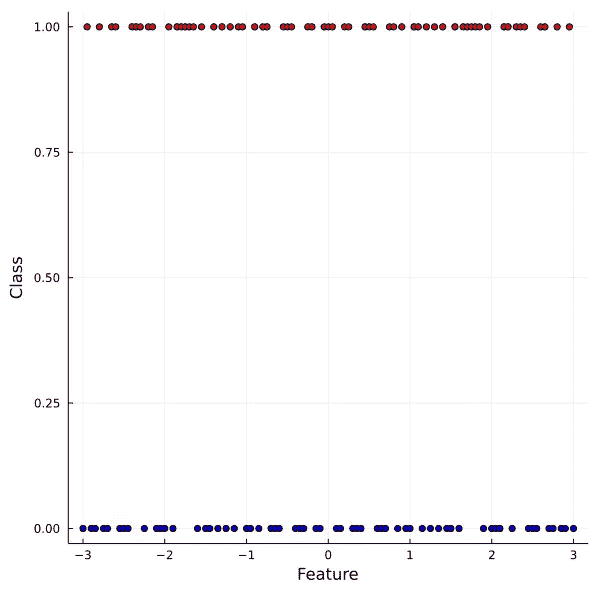
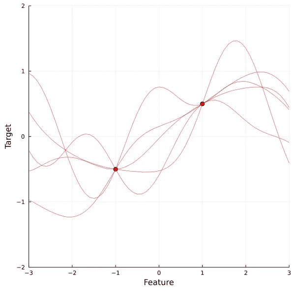
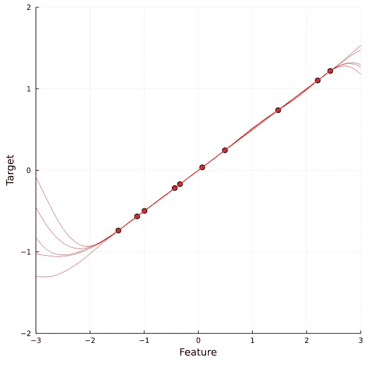
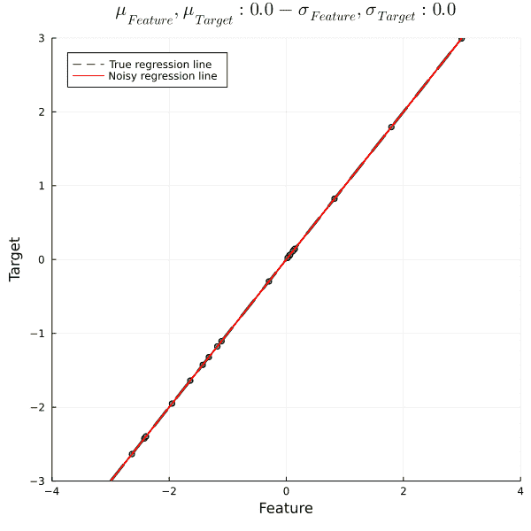
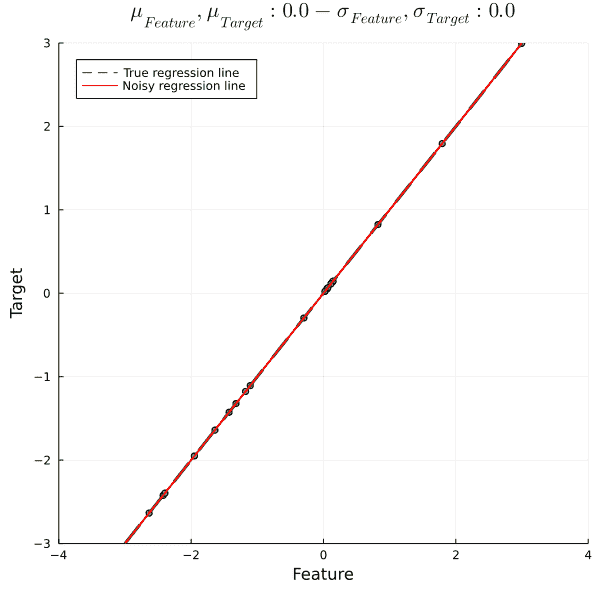
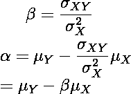
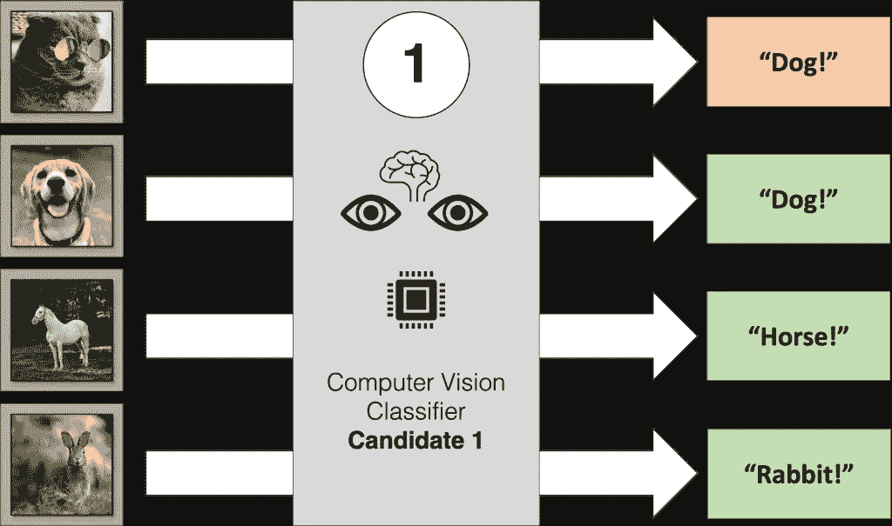

# 如果你的模型表现不佳，建立更好的数据集

> 原文：<https://towardsdatascience.com/if-your-models-are-underperforming-build-better-datasets-sarem-seitz-2611845287f0>

## 如果你的数据很差，这不是你的模型的错

Johannes Plenio 在 [Unsplash](https://unsplash.com/s/photos/lightbulb?utm_source=unsplash&utm_medium=referral&utm_content=creditCopyText) 上拍摄的照片

处理数据可能很难。你可能在你的模型或分析上花费数小时，却没有得到任何合理的结果。在这种情况下，很容易将性能问题归咎于错误的方法选择。毕竟，有这么多的算法，必须存在一个候选人，将解决问题，对不对？

然而，更多的时候，潜在的问题是数据本身。事实上，只要你有一个好的数据集，你可以用[非常简单的模型](https://www.youtube.com/watch?v=68ABAU_V8qI&ab_channel=PyData)走得很远。因此，在本文中，我们将探索四种方法来改善后者。

首先，我们将看看“只是”增加可用数据大小的并不令人惊讶的方法。虽然这确实是一个显而易见的解决方案，但我们将探讨一些有趣的注意事项。其次，我们将考虑提高数据集质量的方法，即如何构建更好的数据集。

*如何构建更好的数据集——简单概述(图片由作者提供)*

# 更广泛的数据——维度的祝福

有没有一种方法可以极大地改善数据集，以至于一个简单的 if-else 规则会胜过一个复杂的深度学习模型？答案是肯定的。考虑下面的一维二元分类问题:

*玩具分类问题——你能找到区分蓝色(0 类)和红色圆点(1 类)的规则吗？(图片由作者提供)*

问问你自己，你手头的最佳模型在这里是否能表现得相当好。不幸的是，条件类分布似乎是完全随机的。即使有最先进的模型和高端硬件，您也无法构建一个合理的预测解决方案。

如果我告诉你我没有使用任何随机值就创建了数据集，会怎么样？以下是解决方案:

*考虑第二个变量突然使问题变得微不足道(图片由作者提供)*

遗漏一个关键的第二变量将一个简单的预测问题变成了一个难题。那么，这个微不足道的例子有什么实际后果呢？

虽然你目前的功能看起来不错，但你可能还缺少其他不太明显但却至关重要的功能。例如，如果没有季节性和周末特征，预测产品销售可能会很困难。此外，正如这个玩具示例所示，**两个或更多的特征甚至可能只在相互作用时具有预测性**。

反过来，添加越来越多的功能是否总是一个好主意？当然不是。你可能知道，预测建模的一个重要部分是变量选择。仅仅为了包含更多的候选特性，肯定会使这一步变得更加繁琐。

如果这个额外的功能看起来很有前景，它可能会带来完全的不同。总是质疑你手中的数据是否足以解决你的问题。

## 为什么维度越多越好？一些理论

作为一个简单的例子，考虑三个变量，`X,Y,Z`，其中`Z`是目标变量。同样，让所有三个变量遵循一个[多元高斯分布](https://en.wikipedia.org/wiki/Multivariate_normal_distribution)。对于均值向量和协方差矩阵，我们有:

(图片由作者提供)

将[定律应用于条件高斯方差](https://en.wikipedia.org/wiki/Multivariate_normal_distribution#Conditional_distributions)两次，我们得到:

(图片由作者提供)

这意味着在两种情况下，使用更多的解释变量可以减少预测的不确定性:

1.  **相关性:**所有解释变量都与目标相关
2.  **无冗余**:解释变量之间相关性不高

此外，正如这些[讲座幻灯片](https://www.ndguillen.com/697/697Week2.pdf)显示的线性回归，你需要注意[维数灾难](https://en.wikipedia.org/wiki/Curse_of_dimensionality)。模型复杂性的显著增加需要更多的数据点或更强的正则化。否则，你可能会得到一个比以前更差的模型。

## 我应该在哪里期待丢失的列？

*   不完整的信息无处不在:如果你想得够久，你几乎总能在你的数据中找到信息缺口。不幸的是，收集更多的数据并不总是微不足道的，而且往往是不可能的。试着在太少的信息和太多的努力或成本之间找到一个平衡点。
*   **图像数据:**这里，相当于未观察列的是未观察像素。更高分辨率的图像可能是答案。但是，要注意维数灾难。

## 如何获得更多维度，以及如何获得正确的维度:

*   **与领域专家密切合作，或者自己成为一名专家**:主题专家通常能够准确指出建模给定问题所需的信息。
*   **在替代数据方面要有创造性**:在替代数据集的创造性使用方面，华尔街可以成为一个激励人心的例子。例如，众所周知，一些对冲基金使用[停车场卫星数据来预测零售公司](https://www.theatlantic.com/magazine/archive/2019/05/stock-value-satellite-images-investing/586009/)的季度销售数字。
*   **增加粒度**:正如图片示例中提到的，使用更细粒度的数据可以为您的模型添加重要信息。考虑 BERT 和大多数其他现代 NLP 算法，它们通常以单词片段而不是完整的单词作为输入。

# 更长的数据——如果你不能把这些点连接起来，你的模型又怎么可能呢？

任何处理数据的人都知道，数据点多总比少好。在大多数情况下，额外的数据存储是廉价的。因此，您应该能够从模型中排除数据，而不是一开始就没有数据。

哪个函数最能描述数据？只有两个数据点，很难说——即使是对最先进的人工智能来说。(图片由作者提供)

有了 10 个数据点，事情看起来清楚多了。在高维度中，你需要更多的观察来获得相似的效果。(图片由作者提供)

让我们看看一些理论上的考虑:

## 为什么数据越多越好—从均方误差的角度

考虑现代机器学习的核心概念，[经验风险最小化](https://en.wikipedia.org/wiki/Multivariate_normal_distribution#Conditional_distributions)。我们在实际目标和预测目标之间有一个损失函数**:**

常见的选择是平方损失

(图片由作者提供)

理想情况下，我们希望选择一个最佳候选模型，使数据生成分布的预期损失(也称为**风险**)最小化:

(图片由作者提供)

由于产生数据的分布通常是未知的，我们需要通过**经验风险**来估计实际风险:

(图片由作者提供)

利用之前的平方损失，我们获得了流行的[均方误差](https://en.wikipedia.org/wiki/Mean_squared_error)目标:

(图片由作者提供)

在一般情况下，经验风险估计量具有以下统计特性:

(图片由作者提供)

简单地说，经验风险估计值是

*   **无偏** —平均而言，针对经验风险的优化相当于针对真实风险的优化
*   **一致** —随着样本量的增加，经验风险和真实风险之间出现较大偏差的可能性降低

作为一个警告，大样本量只能保证你**能**更好地找到真正的风险最优模型。如果你的搜索算法很差，你可能仍然会比样本少但搜索策略好的结果更差。深度学习中的多重局部最优问题就是其中的一个例子。

此外，从理论上讲，如果真实风险的均值或方差不存在，任何基于经验风险的优化都是有缺陷的。如果你的数据是[重尾](https://en.wikipedia.org/wiki/Heavy-tailed_distribution)，这就可能发生。Nassim Taleb 在这个视频中对这个问题有一些有趣的看法。

## 您可能会丢失模型的一些观察值

*   **敏感数据:**存在法律或其他政策不允许访问完整数据集的情况。[联合学习](https://en.wikipedia.org/wiki/Federated_learning)可能是这种情况下的解决方案。
*   **选择退出或选择加入政策**:如果你的用户不想让他们的数据被收集，你除了接受他们的决定之外，什么也做不了。在这种情况下，你必须接受更少的数据，并充分利用这些数据。
*   **数据丢失或删除**:理想情况下，意外的数据丢失永远不会发生。因为我们并不是生活在一个完美的世界里，所以总是考虑这种最坏的情况。

## 如何获得更多的观测值或处理太少的观测值

*   **提高数据采集的采样率**:如果可能的话，尝试提高数据采集的频率——例如，如果您正在处理传感器数据。您可以随时切换到较低的采样速率，但不能反过来。
*   **降低数据的维度**:通常，你的模型越复杂，你需要的数据就越多。如果您必须使用较少的数据点，减少数据的维数可以提高模型的准确性。
*   **使用模型正则化和先验知识**:正则化通常被教授，它比仅仅使用 L1/L2 规范要深入得多。[例如，贝叶斯机器学习](https://sarem-seitz.com/blog/when-is-bayesian-machine-learning-actually-useful)是一个通过先验知识进行正则化的数学上合理的框架。这远远超出了标准的正则化技术。

# 噪音较小的数据—给我一个信号

谈到噪声，我们需要区分两种类型:

*   预测噪声:一个更好的术语应该是“随机性”。虽然您可能观察到目标变量没有失真，但您无法确定地预测它。包括更多的预测特征可以改善这种类型的噪声。
*   **扰动噪声**:又称**测量误差**。这就是我们想在本节讨论的噪声类型。我们没有观察到变量本身，而是观察到它的一些扭曲的版本。例如，考虑在地震中收集人体运动数据。

正如您可能想象的那样，应该避免有噪声的数据，或者将噪声降至最低。下面是一个简单的线性回归示例，说明在噪声环境下预测质量会发生什么变化。

我们从以下无噪声数据生成模型开始:

(图片由作者提供)

代替原始目标和特征，我们观察其噪声版本:

(图片由作者提供)

现在，我们设想两种情况:

1.  **真正的随机(零均值)噪声:**误差被平均“抵消”。当你用随机摇晃的相机拍照时，这种情况可能会发生。
2.  **系统(非零均值)噪声:**你的观察结果平均来说是失真的。相机镜头上的污点可能会导致图像数据出现这种情况。

让我们比较随机和系统测量误差对回归示例的影响:

*对于零均值高斯噪声，预测变得不太准确(图片由作者提供)*

*如果测量误差是系统性的，预测变得更糟甚至更快(图片由作者提供)*

在非零均值噪声情况下，模型失真比零均值情况下严重得多。对于真实世界的数据，后果可能或多或少有些严重。无论哪种方式，噪音的影响肯定没有在实验室条件下那么容易分析。

## 对带有高斯噪声的高斯数据的深入观察

让我们考虑另一个简单的双变量正态例子，其均值和协方差如下:

(图片由作者提供)

如果使用线性回归，对于任意多个数据点，我们得到以下参数:

(图片由作者提供)

现在，我们用独立的高斯噪声污染这两个变量:

(图片由作者提供)

这导致了一个扭曲的双变量高斯分布:

(图片由作者提供)

这允许我们在以下条件下导出回归参数

(图片由作者提供)

## 这些公式意味着什么

1.  **目标中的零均值噪声**:如果只有目标被零均值噪声破坏，如果样本量足够大，您的参数仍然是正确的。随着噪声方差的增加，您可能需要更大的样本量。
2.  **输入中的零均值噪声:**在这种情况下，输入特征的预测能力相对于噪声量有所减弱。因此，根据严重程度，降噪可以将以前无用的特征变成高度可预测的特征。
3.  **非零平均噪声**:您的参数估计值和预测值会有偏差。你应该不惜一切代价避免这种系统性的测量误差。

当然，现实世界中的噪声通常要复杂得多。噪声可能随时间变化，或者只在一个方向上污染你的变量。上面的例子应该给你一个大概的概念，为什么限制测量误差的影响很重要。

## 哪里可以期待嘈杂的数据？

*   **传感器和图像数据:**受污染的传感器或相机镜头很容易给你的数据带来不必要的噪音。此外，噪音可能暗示你的数据收集设备的技术能力或杂质。如果你目前的测量误差水平无法忍受，你可能需要一个更好的。
*   **文本数据:**社交媒体数据可能特别嘈杂——用户在 Twitter 上的提及或文本中的 URL 很容易使 NLP 工具产生偏见。

## 如何从两个角度降低噪音

*   **事前去噪**:理想情况下，你应该在测量误差进入你的数据集之前阻止它。对于计算机视觉问题，这可能就像保持相机镜头清洁一样简单。
*   **事后去噪**:如果无法避免测量误差的发生，就需要借助无数的方法对数据去噪。快速谷歌搜索应该是一个很好的起点。

# 更好的数据采样——忠实于数据生成过程

现在我们来看潜在数据集改进的最微妙的形式。如果上述问题是显而易见的，或者至少是可以预见的，那么这里的情况可能就不是这样了。错误采样的数据可能看起来很好，但仍然会导致错误的模型或错误的结论。

在理想情况下，我们可以从底层数据生成分布中抽取真正随机的样本。然而，在现实中，完美的随机抽样几乎是不可能的。这最迟会发生在你根据过去的数据预测未来的数据的时候。

在这种情况下，数据生成分布可以任意延伸到未来。然而，由于你不能收集未来的数据，你的模型将偏向于过去。一个今天能很好地预测购买者偏好的模型可能很难应对未来消费者行为的变化。

这就是臭名昭著的[分布式或域转移](https://en.wikipedia.org/wiki/Domain_adaptation)问题。无论你的模型此刻有多优秀，你都可能看到它们的性能在任何时候消失。幸运的是，这也是一个众所周知的问题，有许多[方法](https://arxiv.org/pdf/1812.11806.pdf)可以在一定程度上缓解这个问题。

不过，请记住，畴变并不是采样偏差的唯一例子。分布可能非常稳定，但是您的采样过程本身仍然可能有缺陷。

## 具有扭曲抽样分布的经验风险最小化

再次考虑经验风险估计的统计特性:

(图片由作者提供)

这些公式中一个至关重要的细节是`p(x,y)`。除非你的样本来自真实的数据生成过程，否则你的风险估计是有缺陷的。如果我们的抽样分布不同，比如说`q(x,y)`，就没有办法保证我们正在为正确的风险进行优化。这可以通过一个简单的实验来说明:

## 无定义域偏移的有偏采样过程的一个具体例子

假设你的花园里有一台摄像机，你想对在摄像机里玩耍的动物进行分类。因此，你的目标是建立和训练一些卷积神经网络分类器。

假设有四种可能的动物，**猫**，**狗**，**兔**马。为了简单起见，我们还假设每一个都同样有可能出现在你的花园里:

*可能在你的花园里玩耍的四种动物的分布。每种动物发生的可能性都是一样的。(图片由作者提供；参见末尾的附加资源)*

作为一个真正的爱好者，你在接下来的几天里为各自的动物拍了很多照片。然而，由于你主要关注的是猫，所以收集到的猫图片的数量要大得多。示例中图片的分布可能如下所示:

*基于你偏猫摄影技巧的四种动物分布图(图片由作者提供；参见末尾的其他来源)*

现在，我们在花园中动物的分布和样本中动物图像的分布之间有了分歧。由于有偏差的采样过程，猫出现在训练集中的机会要大得多。样本不是完全随机抽取的:

*问题的大“图景”——您的训练集和实际评估集的分布不匹配。(图片由作者提供；参见末尾的附加资源)*

为了进一步简化，假设你只有两个候选的计算机视觉模型。当然，在现实中，你通常有无限多的候选模型。例如，对于神经网络，每个可能的参数配置都是单独的候选。最佳模型的搜索算法通常是梯度下降法。

无论如何，假设我们的两个候选人具有以下属性:

*候选模型 1 正确分类所有图像，除了猫图像(图片由作者；末尾的附加源)*

*候选模型 2 错误地分类了来自狗和马的所有图像(图片由作者提供；文末附加来源)*

## 有偏采样过程的影响

为了从两个模型中选择最佳模型，您应用经验风险最小化。假设您想将[的零一损失](https://scikit-learn.org/stable/modules/model_evaluation.html#zero-one-loss)降至最低:

(图片由作者提供)

现在，我们可以计算给定自然分布的候选模型 1 的预期经验风险:

(图片由作者提供)

如果我们对候选人和分布都这样做，我们会得到以下结果:

(图片由作者提供)

显然，一旦我们想在“生产”中使用我们的模型，候选 1 是更好的。然而，由于我们有偏见的抽样过程，次等候选模型 2 显得更有吸引力。根据上述公式，风险估计值的方差随着样本的增加而减小。因此，更多的数据点实际上会增加选择错误模型的机会。

实际上，事情当然要复杂得多。即使有轻微偏差的数据，你仍然可能得到一个足够强大的模型。另一方面，你永远无法保证你的模型不会随着时间的推移而受到分布变化的影响。这使得抽样偏差问题成为一个永久的主题，你应该永远记住。

## 你可能会遇到有偏差的采样

*   **数据是随着时间的推移而获得的:**同样，分布发生了变化。几乎每个机器学习数据集都是如此。只要分布变化不是太不稳定，你通常可以用一种合理的方式来处理这个问题。
*   **数据被系统地更改或删除:**当用户通过 GDPR 或相关表格选择退出时，可能会出现这种情况。如果这个过程不是独立于用户特征的，那么在你的采样过程中会有一些偏差。

## 如何减轻或减少有偏采样的影响

*   **尽可能密切地监控您的模型**:如果您正在遵循 [MLOps 最佳实践](https://ml-ops.org/content/mlops-principles)，您应该已经熟悉这一点。
*   **在您的模型中包含偏差变量**:例如，将时间戳作为一个单独的变量来考虑可能会缓解域随时间推移而移动的问题。只要分配变化的模式本身保持不变，这可能是一个可行的解决方案。然而，请记住，仍然不能保证恒定畴变的假设。
*   **监控并优化抽样程序**:如果你能控制抽样过程，确保它尽可能接近理想的随机抽样。
*   **考虑在线学习**:为了快速适应变化的分布，你应该尽可能频繁地更新你的模型。事实上，网上学习是最快的方法。如果您能够负担实时更新模型的额外工作，您应该尝试一下这个想法。
*   **考虑重新加权或重新采样**:如果以上都不可行，你还可以尝试[逆概率加权](https://en.wikipedia.org/wiki/Inverse_probability_weighting)等方法。

# 结论

如果您一直读到这里，您可能已经意识到，当涉及到数据时，总是有改进的空间。虽然你不能整天优化单个数据集，但它们的质量对于有效的数据科学和机器学习来说是必不可少的。因此，如果你的模型看起来没有改进，考虑仔细看看输入。

# 图像来源

1.  马——照片由[海伦娜·洛佩斯](https://unsplash.com/@wildlittlethingsphoto?utm_source=unsplash&utm_medium=referral&utm_content=creditCopyText)在 [Unsplash](https://unsplash.com/s/photos/horse?utm_source=unsplash&utm_medium=referral&utm_content=creditCopyText) 上拍摄
2.  狗——照片由[marli ese stree land](https://unsplash.com/@marliesebrandsma?utm_source=unsplash&utm_medium=referral&utm_content=creditCopyText)在 [Unsplash](https://unsplash.com/s/photos/dog?utm_source=unsplash&utm_medium=referral&utm_content=creditCopyText) 上拍摄
3.  猫——Raoul Droog 在 [Unsplash](https://unsplash.com/s/photos/cat?utm_source=unsplash&utm_medium=referral&utm_content=creditCopyText) 上拍摄的照片
4.  兔子——照片由[加里·本迪格](https://unsplash.com/@kris_ricepees?utm_source=unsplash&utm_medium=referral&utm_content=creditCopyText)在 [Unsplash](https://unsplash.com/s/photos/rabbit?utm_source=unsplash&utm_medium=referral&utm_content=creditCopyText) 拍摄

# 参考

**【1】***格罗夫斯、罗伯特·m 等著《调查方法论》。约翰·威利的儿子们，2011 年。*

**【2】***莫赫利、梅赫亚尔、阿夫申·罗斯塔米扎德、阿米特·塔尔瓦尔卡尔。机器学习基础。麻省理工学院出版社，2018。*

***Wooldridge，Jeffrey M .计量经济学导论:现代方法。Cengage learning，2015。***

***原载于 2022 年 3 月 31 日 https://sarem-seitz.com***。****