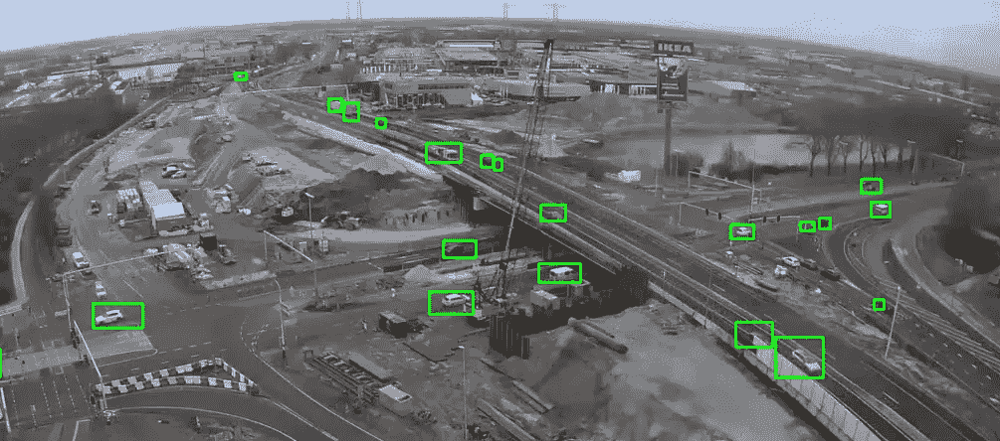
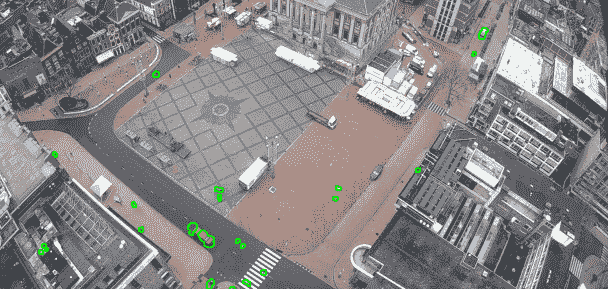

# 用 OpenCV 检测运动——适合初学者的图像分析

> 原文：<https://towardsdatascience.com/image-analysis-for-beginners-creating-a-motion-detector-with-opencv-4ca6faba4b42>

## 如何用 OpenCV 检测和分析运动物体



我们探测到了移动！(图片由作者提供)

运动检测有许多目的。一旦在野生动物摄像机或安全摄像机上看到运动，您就可以使用它开始记录，例如，另一个应用是提高性能。我们不需要分析整个图像，只需要处理移动的小部分。比如只识别上图中行驶汽车的颜色。

在本文中，我们将创建一个完全工作的运动检测器，可用于上述所有用例。在这个过程中，我们会学到很多关于用 OpenCV 处理图像的知识。在本文结束时，您将拥有一个完全可操作的运动检测器和更多关于图像处理的知识。我们来编码吧！

## 系列

本文是关于 OpenCV 图像处理系列的一部分。查看其他文章:

*   [*读取图像、视频、您的屏幕和网络摄像头*](https://mikehuls.medium.com/image-analysis-for-beginners-how-to-read-images-video-webcam-and-screen-3778e26760e2)
*   [*检测和模糊人脸*](https://mikehuls.medium.com/image-analysis-for-beginners-detect-and-blur-faces-with-a-simple-function-60ba60753487)
*   [*用模板匹配破坏猎鸭:在图像中寻找图像*](https://mikehuls.medium.com/image-analysis-for-beginners-destroying-duck-hunt-with-opencv-e19a27fd8b6)
*   *创建运动检测器(📍你在这里！)*
*   *检测没有 AI 的形状(在建；即将推出)*
*   *从图像中检测和读取文本*(正在建设中；即将推出)

# 设置

我们的客户要求我们开发一些分析城市交通的软件。他们想知道在某一天有多少自行车、汽车、公共汽车和行人访问某一特定位置。我们安装了一个摄像头来拍摄这些地点。

数据科学团队有一些非常奇特的模型来确定特定图像是自行车、公共汽车还是人的汽车，但是他们不能在整个图像上运行这个模型。我们的任务是对图像进行预处理。我们需要一些小片段来运行识别模型。

我们实际上如何检测运动？我们将把我的网络摄像头中的视频流的每一帧与前一帧进行比较，并检测所有发生变化的点。最终结果看起来会像这样:


我们的最终结果

现在，数据科学团队可以在每个绿色矩形上运行他们的模型，而不是整个屏幕。更小，因此，更快。我们来编码吧！

## 属国

我们将把 YouTube 上我的美丽城市格罗宁根的实时网络摄像头放在屏幕上并录制下来，而不是看一个真实的网络摄像头。如果你想使用另一个来源，那么看看这篇文章[](https://mikehuls.medium.com/image-analysis-for-beginners-how-to-read-images-video-webcam-and-screen-3778e26760e2)**来学习如何阅读它。
在我们的案例中，我们需要以下进口:**

```
pip install opencv-python pillow
```

# **创建运动检测器**

**让我们编写一个运动检测器！我们会一部分一部分的来。下面将提供完整的代码。**

## **第一步。阅读和准备我们的框架**

**首先，我们将实际读取图像，并将其从 OpenCV 的默认 BGR 转换为 RGB:**

**如果你读过前一篇文章，这并不新鲜；我们加载我们的图像，将它的颜色转换成 RGB(这样我们可以在以后显示它)。**

**接下来的一点更有趣。我们将图像转换为灰色，并通过模糊图像来平滑图像。转换为灰色会将所有 RGB 像素转换为 0 到 255 之间的值，其中 0 表示黑色，255 表示白色。这比处理三个值(R、G 和 B)要快得多。这是结果:**

****

**我们的原始图像和经过处理的图像(作者提供的 gif)**

## **第二步。确定运动(与前一帧相比的变化)**

**在这一部分，我们将进行实际的运动检测。我们将通过检查像素值来比较前一帧和当前帧。请记住，因为我们已经将图像转换为灰色，所以所有像素都由 0 到 255 之间的单一值表示。**

**在下面的代码中，如果没有帧，我们设置一个前一帧。然后我们用`absdiff` 的方法计算这个差值。之后，我们更新之前的框架。接下来，我们淡化了一点图像。膨胀填补了空洞，连接了区域；它通过增加尺寸和亮度使微小的差异变得更加清晰。**

**我们对稍微亮一点或暗一点的像素不感兴趣；我们使用`cv2.threshold`函数将每个像素转换为 0(白色)或 1(黑色)。这个的门槛是 20；如果当前帧和前一帧之间的阴影差大于 20，我们就把那个像素变成白色，否则我们就把它变成黑色。看起来是这样的:**

****

**跟踪变化的像素(作者提供的 gif)**

**请注意，白点比实际移动的物体要大得多。这是淡化形象的结果。在下一部分定义轮廓时，较大的区域将有助于我们。**

## **第四步。寻找区域和轮廓**

**我们希望找到自上一帧以来发生变化的*区域*，而不是每个像素。为了做到这一点，我们首先需要找到一个区域。这就是`cv.findContours`所做的；它从上面部分的每个白点中检索轮廓或外部界限。在下面的代码中，我们找到并绘制了所有的轮廓。**

**两行！还不错。看看下面的结果。请注意，我们甚至在追踪鸟类！**

****

**在移动的物体上画出我们的轮廓(作者图片)**

**虽然这看起来很漂亮，但我们向数据科学团队承诺了图像，所以让我们找到这些区域的坐标，然后就到此为止:**

**这将再次找到我们的轮廓。然后，我们将循环遍历，丢弃任何太小的区域，并从这些区域中检索坐标。这些是我们必须发送给数据科学团队的坐标。现在，我们只是用`cv2.boundingRect`在它周围放一个绿色的矩形。**

## **第五步。最后一步**

**在上一步中，我们已经在 RGB 框架上绘制了图像，因此在最后一步中，我们只展示结果:**

```
cv2.imshow('Motion detector', img_rgb)

if (cv2.waitKey(30) == 27):
    break
```

**在下面的 gif 中，你可以看到我们分析的最终结果。查看 YouTube 上的[](https://www.youtube.com/watch?v=q2Urd1GNGMM)**和 [**这段**](https://www.youtube.com/watch?v=jSIuji70_uk) 视频，了解更多演示。所有代码都可以在[这里](https://gist.github.com/mike-huls/372d968aa523484b8cca05844dfc8443)获得。****

********

****最终结果(作者 gif)****

****下面是一个快速的并排，我们比较我们的输入帧，处理帧和输出。的确非常漂亮！****

********

****所有步骤并排(作者 gif)****

# ****结论****

****在 OpenCV 系列的这一部分中，我们研究了运动检测器的工作原理。在这个过程中，我们处理图像；模糊，稀释，寻找帧之间的差异。此外，我们进行了一些非常方便的分析；寻找轮廓和边界框。最后，我们学习了在图像上绘制矩形和轮廓。****

> ****别忘了查看本系列的[其他文章](https://mikehuls.com/articles?tags=opencv)！****

****如果你有建议/澄清，请评论，以便我可以改进这篇文章。同时，看看我的其他关于各种编程相关主题的文章，比如:****

*   ****[Python 为什么慢，如何加速](https://mikehuls.medium.com/why-is-python-so-slow-and-how-to-speed-it-up-485b5a84154e)****
*   ****[Python 中的高级多任务处理:应用线程池和进程池并进行基准测试](https://mikehuls.medium.com/advanced-multi-tasking-in-python-applying-and-benchmarking-threadpools-and-processpools-90452e0f7d40)****
*   ****[编写自己的 C 扩展来加速 Python x100](https://mikehuls.medium.com/write-your-own-c-extension-to-speed-up-python-x100-626bb9d166e7)****
*   ****[cyt hon 入门:如何用 Python 执行>每秒 17 亿次计算](https://mikehuls.medium.com/getting-started-with-cython-how-to-perform-1-7-billion-calculations-per-second-in-python-b83374cfcf77)****
*   ****[用 FastAPI 用 5 行代码创建一个快速自动记录、可维护且易于使用的 Python API](https://mikehuls.medium.com/create-a-fast-auto-documented-maintainable-and-easy-to-use-python-api-in-5-lines-of-code-with-4e574c00f70e)****
*   ****[创建并发布你自己的 Python 包](https://mikehuls.medium.com/create-and-publish-your-own-python-package-ea45bee41cdc)****
*   ****[创建你的定制私有 Python 包，你可以从你的 Git 库 PIP 安装](https://mikehuls.medium.com/create-your-custom-python-package-that-you-can-pip-install-from-your-git-repository-f90465867893)****
*   ****[完全初学者的虚拟环境——什么是虚拟环境以及如何创建虚拟环境(+示例)](https://mikehuls.medium.com/virtual-environments-for-absolute-beginners-what-is-it-and-how-to-create-one-examples-a48da8982d4b)****
*   ****[通过简单升级，显著提高数据库插入速度](https://mikehuls.medium.com/dramatically-improve-your-database-inserts-with-a-simple-upgrade-6dfa672f1424)****

****编码快乐！****

****—迈克****

****页（page 的缩写）学生:比如我正在做的事情？[跟我来！](https://mikehuls.medium.com/membership)****