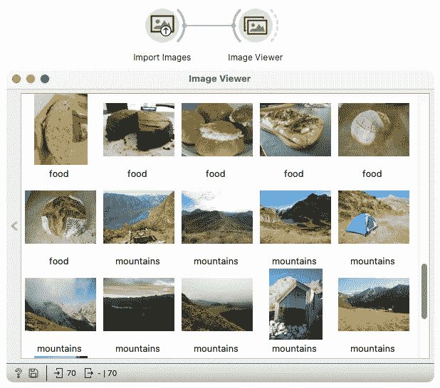
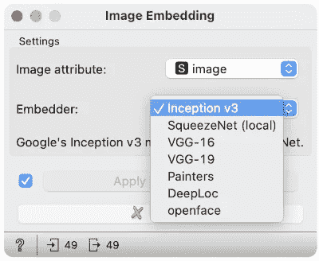
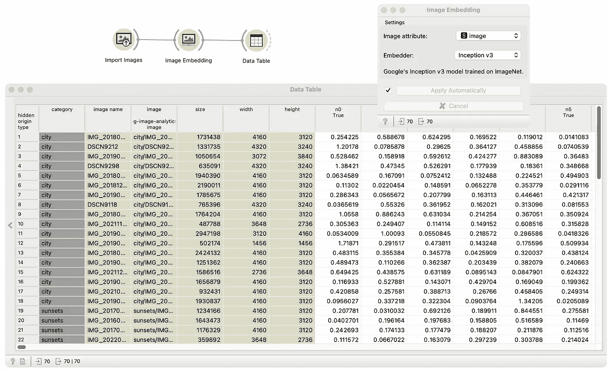
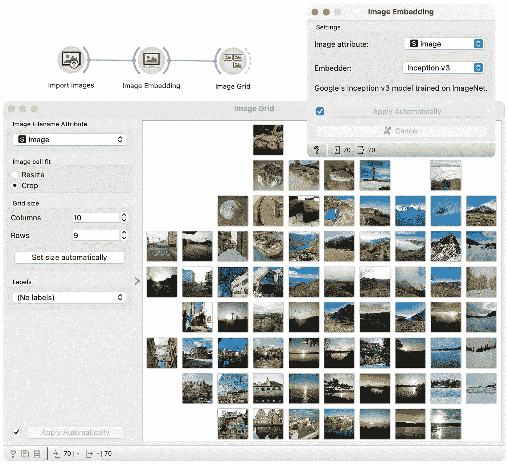

# 面向所有人的图像分析:用 Orange 嵌入图像

> 原文：<https://towardsdatascience.com/image-analytics-for-everyone-image-embeddings-with-orange-7f0b91fa2ca2>

## 什么是图像嵌入，如何在不编码的情况下用机器学习分析图像？

本文着眼于图像嵌入(图像在向量空间中的变换),并描述如何通过将图像嵌入向量空间来为分析做准备。我们在简单的分析中展示了嵌入的有用性，我们将尝试对相似的照片进行分组。分析是在 Orange 中执行的，这是一个任何人都可以使用的简单而免费的数据分析工具包。

相似图像靠得更近的网格是基于图像嵌入计算的(作者提供的图像)

## 什么是图像嵌入？

大多数用于分类、回归或聚类的机器学习算法不能直接在图像上工作。为了进行分析，我们需要将它们转换成更合适的表示形式——称为嵌入的数字向量。图像嵌入是图像的矢量表示，其中具有相似动机的图像具有相似的矢量轮廓。

嵌入器将每个图像转换成一个数字向量。绿色向量属于绿色图像；橙色向量属于橙色图像，蓝色属于蓝色，红色属于红色。(图片由作者提供)

一般来说，嵌入是人类无法理解的，因为它们是由计算机推断的数字向量(而且，推断数字的网络是从标记的图像中自动学习的)。每个数字代表图像的一个属性。举例来说，我们可以说，第一个数字告诉如何可能的房子在图像中，第二个可能说，图像包含云，最后一个给出关于太阳的存在的信息。

我们将使用预训练的神经网络，如 [Inception v3](https://arxiv.org/abs/1512.00567v3) 、 [VGG-16 或 VGG-19](https://arxiv.org/abs/1409.1556) 来获得嵌入。我们将图像馈入神经网络，并将神经网络倒数第二层的输出作为嵌入。

## 柑橘

在本文的演示中，我将使用我最喜欢的数据分析工具——Orange。Orange 是最著名的[开源](https://github.com/biolab/orange3)工具之一，用于交互式数据分析、可视化和机器学习。你可以从[的网站](http://orangedatamining.com)下载它，并通过几个简单的步骤进行安装。Orange 由放置小部件并连接它们以创建工作流的画布组成。每个小部件代表数据分析中的一个步骤。

在本文中，我们使用 Orange 的图像分析插件。为了说明 Orange 是如何工作的，下面是一个简单的工作流，它包含导入图像小部件和图像查看器，前者加载图像，后者显示加载的图像。在本文的后面，我们将展示嵌入图像和执行简单分析的工作流程。

橙色的简单工作流程(在顶部)从计算机加载图像并显示给用户。工作流程下方是图像查看器小部件的窗口(按作者分类的图像)

## 橙色图像嵌入

[图像嵌入小部件](https://orangedatamining.com/widget-catalog/image-analytics/imageembedding/)是 Orange 中图像分析的核心小部件。该小部件获得带有图像的表格，并将它们发送到服务器，以机器学习算法可以理解的格式嵌入。服务器通过预先训练的深度神经网络推送图像，并将数字向量返回给小部件。

在图像嵌入小部件中，用户可以选择他们想要使用的神经网络来将图像嵌入到向量空间中(由 Autor 生成的图像)

这个小部件提供了几个针对各种特定任务训练的深度神经网络。 [Inception v3](https://arxiv.org/abs/1512.00567) 、 [VGG16、VGG19](https://arxiv.org/abs/1409.1556) 和 [SqueezeNet](https://arxiv.org/abs/1602.07360) 经过训练，将图像按照图像上的物体进行分类。[画家](https://www.nature.com/articles/s41467-019-12397-x)神经网络被训练预测画作作者， [DeepLoc](https://pubmed.ncbi.nlm.nih.gov/29036616/) 预测酵母细胞结构， [OpenFace](https://ieeexplore.ieee.org/document/8373812) 进行人脸识别。我们忽略网络的分类层，而是考虑倒数第二层，并将其用于图像的矢量表示。

## 示例分析—识别相似图像

图像嵌入可以用来识别相似的图像。对于这个例子，我从我的照片集中收集了 70 张图片。

我用电脑文件夹中的导入图像小工具加载了它们。“导入图像”小部件将图像发送到“图像嵌入”小部件，后者为每张图像计算一个数字向量(称为嵌入)。我使用 Inception v3 神经网络，因为它通常在日常生活图像中表现最好。

我们先来看看嵌入的图像是什么样子的？

工作流使用“导入图像”小部件加载图像，使用图像嵌入将图像嵌入到矢量空间中，并在数据表的表格形状中显示嵌入内容(按作者显示图像)

在上面的数据表中，您可以看到每个图像(由一行描述)由 2048 个数字(表中白色部分的列)表示，从 n0 到 n2047，由图像嵌入小部件生成。他们用一种人类难以理解的方式描述图像。如前所述，一般来说，我们可以说每一列代表图像的一个属性。

嵌入图像后，我们可以将它们放在网格上，这样相似的图像在图像网格小部件中就可以靠得很近。它接受嵌入并使用 [t-SNE 方法](https://en.wikipedia.org/wiki/T-distributed_stochastic_neighbor_embedding)在二维画布上分发图片。照片根据它们的相似性放在画布上。

产生图像网格的工作流程，其中相似的图像靠在一起(按作者排列的图像)

我们可以观察到冬天的图像在右边，日落的图像在右下方。如果我们向中心移动，我们可以看到徒步旅行/自然的图像。城市的图片在左边，食物在左上方。

## 结论

本文解释了图像嵌入以及如何在一个简单的分析中使用它们。这篇文章之后还会有两篇文章。一个将涵盖图像的无监督学习的主题，另一个将讨论图像的监督学习。

## 文学

1.  demar，Janez，等,《橙色:Python 中的数据挖掘工具箱》。*机器学习研究杂志*，2013，14.1:2349–2353。
2.  Godec，Primo 等人通过集成深度模型和小规模机器学习，通过可视化编程实现了图像分析的民主化。*自然通讯*，2019，10.1:1–7。
3.  西蒙扬，卡伦；安德鲁·塞斯曼。用于大规模图像识别的非常深的卷积网络。 *arXiv 预印本 arXiv:1409.1556* ，2014。
4.  重新思考计算机视觉的盗梦空间架构。发表于:*IEEE 计算机视觉和模式识别会议论文集*。2016.第 2818–2826 页。

## 我的其他文章

     