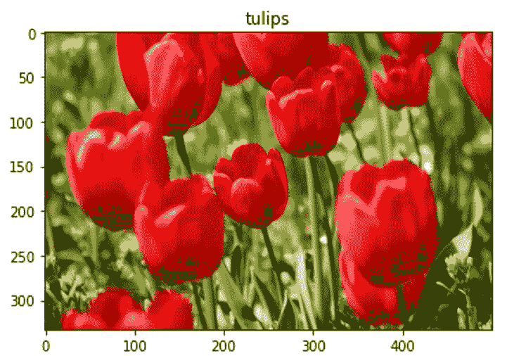
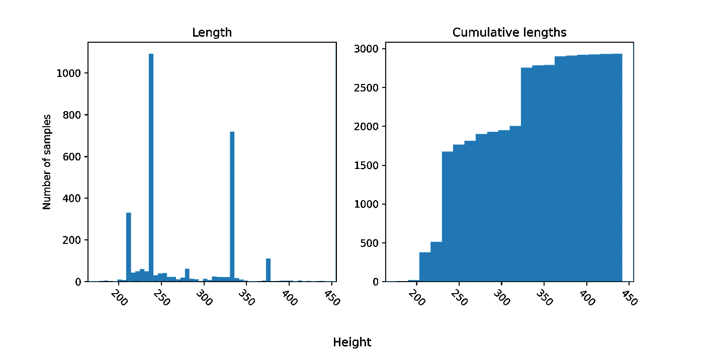
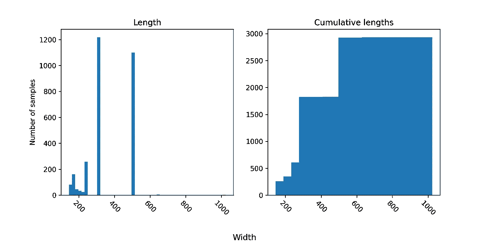

# 张量流中的图像增强

> 原文：<https://towardsdatascience.com/image-augmentations-in-tensorflow-62967f59239d>

## 随机旋转图像很简单；以下是如何做的

本着前一篇文章的精神，其中的主题是增加音频数据，今天，我们将重点放在增加图像数据。在这个领域中，研究人员和从业者都可以访问许多数据转换:从随机调整对比度到合并样本开始，可用的扩充往往覆盖所有用例。

[乐天德容](https://unsplash.com/@fatelot?utm_source=medium&utm_medium=referral)在 [Unsplash](https://unsplash.com?utm_source=medium&utm_medium=referral) 上的照片

由于 TensorFlow 的数据 API，一旦练习几次，添加这样的转换就非常方便和简单。通常，我们首先创建一个 Dataset 对象，实现或搜索增强的代码，然后通过转换操作输入每个样本。其中许多已经实施；像[相册](https://albumentations.ai)和 [tensorflow-addons](https://www.tensorflow.org/addons?hl=en) 这样的库是开始的好地方。

因此，让我们开始实施我们的图像增强管道没有进一步的麻烦。

## 设置和数据集下载

通常，我们从所有必要的导入开始。如果您没有安装其中一个软件包，请在命令行中键入*pip install<package-name>*来进行安装。除了标准库，我们还需要 TensorFlow 数据集和 TensorFlow 插件。

第一个附加库 *tensorflow-datasets* ，直接用于下载花的图像数据集。这个数据集是在许可的 Creative Commons 2.0 许可证下许可的，这使得它成为各种任务的理想候选。

顾名思义，数据集是花朵图像的集合。每张图片都属于一类:郁金香、向日葵、玫瑰、蒲公英和雏菊。以下是数据集中的一个示例:

来自 [TensorFlow flowers 数据集](https://www.tensorflow.org/datasets/catalog/tf_flowers?hl=en)的样本。

## 数据集分析

在我们对图像进行任何增强之前，我们必须检查数据集；样本没有被标准化为具有固定的高度或宽度。我们使用以下代码，该代码检查数据集，然后绘制图像大小的分布:

分析完训练数据集后，我们可以绘制分布图，生成以下两幅图像:

张量流花卉数据集中图像高度的分布。图片由作者提供。

张量流花卉数据集中图像宽度的分布。作者图片

在左边，我们看到高度分布；右边是宽度分布。我们可以从这些样本中推断出合理的尺寸来重塑所有的图像。在本例中，它的高度为 350，宽度为 500。注意:这个相对浅显的分析足以满足这篇博文的目的；我们将在不同的背景下进行更深入的研究。

有了推导出的形状信息，我们可以将所有的图像归入一个共同的形状:

既然所有样本都有相同的大小，我们就可以实施扩增步骤了。在本文中，我们将保持少量的转换。首先，我们批处理数据集，使任何支持的操作运行得更快。这个概念被称为*矢量化*，帮助我们将相同的转换应用于一批样本，而不是逐个扩充数据:

## 图像变亮和翻转

我们的第一个增强步骤包括随机改变图像的亮度水平，水平或垂直翻转。然后，通过添加种子，我们使转换可重复:

让我们看一个随机样本:

应用于 TensorFlow 花卉数据集样本的图像增强示例。

## 图像旋转

我们增强管道的第二步包括旋转图像。为此，我们使用前面提到的 tensorflow-addons 库。在图像旋转中，这个库提供了许多还不是标准 TensorFlow 的一部分的特性。我们在-45°和+45°之间的区间内随机选取旋转角度:

我们的第一个样本现在已经稍微旋转了一下；如您所见，外部值用零填充:

展示 TensorFlow flower 数据集上图像旋转的示例图像。

## 组合增强步骤

现在，让我们将前面的步骤包装成一个函数，合并所有的转换操作。请注意，只有训练数据集得到了扩充；验证和测试集保持不变:

扩增管道到此为止。但是，单靠管道不会帮你获得更好的结果；一个模型也必须接受扩充数据的训练。这就是我们现在要做的。

## 模特培训

为简单起见，我们将使用剩余网络。特别是，我们的选择是一个 ResNet50 模型，它已经在流行的 ImageNet 数据集上进行了训练。因为它已经看过海量的图像数据，已经有了*图像*的概念。这是我们通过加载预先训练的权重来利用的事实:我们跳过了“学习物体的基础知识(如边缘、形状、颜色)”部分，可以更快地处理手头的问题。

尽管不平衡并不严重，但我们的数据集仍然不平衡；这些标签并不是平均分布在各个类别中的。因此，简单的准确性度量没有太大的意义。但是 F1 的分数会。Kenneth Leung 写了一篇很好的介绍所有不同 F1 分数变体的文章。

与 Adam 优化器(与默认设置一起使用)一起，我们将实例化我们的指标和损失对象，然后编译模型:

最后，我们可以通过一个简单的调用来训练模型:

根据您计算机的能力，培训会很快进行。例如，在谷歌合作实验室，一个纪元需要大约两分钟。

这个帖子到此为止。你可以在 GitHub 上找到所有附带代码[；请随意做进一步的修改。](https://github.com/phrasenmaeher/tf-image-augmentations)

# 摘要

在这篇文章中，我们用 TensorFlow 实现了一个图像增强管道。我们从加载一个花数据集开始，然后向训练数据添加了四个随机修改:亮度调整、垂直翻转、水平翻转和旋转。最后，我们使用预先训练的残差网络，并在数据集上对其进行训练。

如果你想更进一步，你可以添加额外的增强，如模糊或对比度调整。或者你可以将它们添加到你的定制数据集中(理想情况下已经是[TF record 格式](/a-practical-guide-to-tfrecords-584536bc786c))。