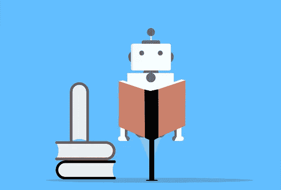
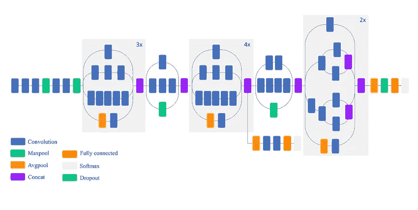
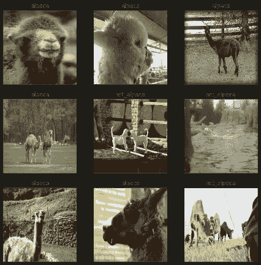

# 基于迁移学习的图像识别算法

> 原文：<https://towardsdatascience.com/image-recognition-algorithm-using-transfer-learning-cae1deb2818f>

## 从头开始训练神经网络需要大量的时间和巨大的计算能力。克服这两个障碍的一个方法是实施迁移学习。

来源:pixabay.com

没有足够的数据、时间或资源是构建高效图像分类网络的一个关键难题。在本文中，我给出了一个简单的实现，可以绕过所有这些资源不足的限制。我们将看到什么是**迁移学习**，为什么它如此有效，最后，我将一步一步地建立一个图像分类学习模型。

我将开发的模型是羊驼与非羊驼分类器，即能够识别输入图像是否包含羊驼的神经网络。我选择这个有限的任务有几个原因:

*   原来的预训练模型不知道一个“羊驼”类。我想用看不见的课探索迁移学习的潜力。
*   我没有很多羊驼和非羊驼的对比数据。我想用几个数据点来评估迁移学习能做什么。

最后，我将用我最近一次徒步旅行中亲自拍摄的一些羊驼图片来测试该算法。这些照片是在不同的光线条件下拍摄的，羊驼并不总是特写。

代码和笔记本可以在 GitHub 资源库中找到:

<https://github.com/andreoniriccardo/transfer-learning-image-classifier>  

用于第二步训练的数据集将从 [Google Open Images V6 数据集](https://storage.googleapis.com/openimages/web/index.html)中获取。

# 迁移学习

假设您想要构建一个图像分类器，但您负担不起几周的学习模型训练费用，也没有顶级的 GPU 来完成这项任务。你可以下载一个现有的模型并对其进行更多的训练，而不是从头开始开发一个神经网络。这种技术被称为迁移学习:它包括使用一个完善的神经网络(或只是它的一部分)，并使它适合于您特定的计算机视觉项目。

多年来，学术研究人员和公司开发了非常深度的卷积神经网络，在图像识别任务中实现了最先进的精度水平。这些网络有几十或几百层深，并在数百万张图像上(通常在 [ImageNet](http://www.image-net.org) 数据库上)进行了长时间的训练。开源预训练网络的例子有 [ResNet-50](https://it.mathworks.com/help/deeplearning/ref/resnet50.html;jsessionid=37e5bb644ba7f69589be2613b4d3) 、 [Inceptionv3](https://en.wikipedia.org/wiki/Inceptionv3) 、 [MobileNetV2、](https://arxiv.org/abs/1801.04381)等等。

Inception v3 网络的架构示意图。资料来源:researchgate.net。

在卷积神经网络(CNN)中，第一个卷积层检测简单的特征，如边缘或形状，中间层识别物体的部分(如人脸识别中的眼睛或嘴巴)，最后，最终的卷积层可以识别更复杂的特征，如人脸。由于这个原因，CNN 的初始层完成更一般的任务。相反，最后几层更加专门化。卷积神经网络的这一特殊特征允许采用现有的预训练网络，冻结除最后几层之外的所有层的参数(权重和偏差),并训练网络几个额外的时期。因此，我们可以利用在巨大数据集上训练的深度网络，同时，使其专门用于更具体的图像识别项目。根据卷积层对其原始任务的专门化程度，我们可以选择冻结网络中更大或更小的部分。

迁移学习在开发不同数据可用性条件下的计算机视觉算法中起着重要的作用。如果我只有一些数据来训练网络，我会冻结除输出层之外的所有预训练网络的权重:只有 softmax 层会用新实例重新训练。另一种情况是，如果我有更大的训练集可用。在这种情况下，我会冻结更少的层，并重新训练更多的层。最后，如果我可以为网络提供大量的训练集，我会使用预先训练的权重作为网络的初始化点。通过这种方式，我可以加速收敛。

# 创建张量流数据集

导入所需的库后，下一步是生成两个 [TensorFlow 数据集](https://www.tensorflow.org/api_docs/python/tf/data/Dataset)，一个用于训练，一个用于验证。20%的图像用于验证。测试集和验证集合并成 32 个批次。

请查看 Jupyter 笔记本，了解如何从 Google Open Images 下载图片。

为了生成数据集，我使用了`[**image_dataset_from_directory**](https://www.tensorflow.org/api_docs/python/tf/keras/utils/image_dataset_from_directory)`函数。我提供了包含每个类的子目录的目录的路径。我的情况是“羊驼”和“非 _ 羊驼”。设置了`**validation_split**`参数后，我必须指定哪一组用于训练，哪一组用于验证。最后，我设置了一个种子来避免两个数据集之间的重叠。

TensorFlow API 的一个很大的优点是它自动从子文件夹名称中读取类标签。通过对数据集对象应用`**claa_names**`属性，我们可以看到:

我们可以通过打印一些来看看训练图像是什么样的。羊驼实例有不同的姿势和大小，非羊驼实例主要是动物形状玩具上的动物。

一些训练例子的预览。来源:作者。

# 导入预先训练的模型

TensorFlow API 允许轻松导入预先训练的模型。对于这个应用程序，我将使用 [MobileNetV2](https://arxiv.org/abs/1801.04381) 网络，因为它的架构是基于剩余连接的，这导致了一个快速的网络，也可以在智能手机等低计算设备上使用。

首先要做的是通过调用`**tf.keras.applications.MobileNetV2**`函数导入网络:

它需要提供:

*   **输入形状**，它是通过将颜色的尺寸添加到图像形状中获得的
*   **是否包含最终图层**。在这种情况下，我不会导入最终层，因为我想为我的特定任务训练一个全新的输出层
*   是否**导入预训练的重量**。在这种情况下，我导入了在 [Imagenet](https://www.image-net.org/) 数据集上训练得到的权重

通过打印网络总结，我们可以看到它的样子:

上面的图像只描述了前 4 层，因为整个网络(156 层，不包括最后一层)不适合一个图像。你可以在我上传到 GitHub 库的 Jupyter 笔记本上看到所有图层的描述。

# 修改网络并训练模型

如上所述，我将向网络添加一个特定的输出层，该层将从头开始训练。

我现在将解释代码的每一行。

1.  MobileNetV2 是在归一化范围[-1，1]上预先训练的。出于这个原因，我复制了相同的输入规范化层
2.  预训练模型的权重被设置为不可训练
3.  定义形状的输入层(160，160，3)
4.  应用输入标准化步骤
5.  添加预训练模型
6.  应用一个[平均池层](https://www.tensorflow.org/api_docs/python/tf/keras/layers/GlobalAveragePooling2D)来减少复杂图像的尺寸
7.  添加一个下降层，以应用一些正则化(从而减少过度拟合)
8.  添加输出层，该层由具有 Sigmoid 激活功能的单个单元组成。对于二元分类问题，单个单元就足够了
9.  最后，通过指定输入和输出来组合模型

一旦定义了模型，就该编译和训练它了。我使用[亚当优化器](https://www.tensorflow.org/api_docs/python/tf/keras/optimizers/Adam)和二元交叉熵作为损失函数。作为评估标准，我使用准确性。

无数据扩充的学习曲线。来源:作者。

准确度分数有机地上升到大约 95%的平台期。训练和验证准确性是成对的，这意味着算法不会过度适应训练数据。

我想在我徒步旅行时拍摄的一批羊驼图像上测试该算法。我在测试集中添加了一些随机的非羊驼图片(比如金鱼或巧克力蛋糕)，只是为了解决最终的假阳性错误。鉴于测试图像的数量有限，我使用这个简单的片段进行测试:

没有假阳性的报道，但是，我的一些羊驼图片被贴错了标签:

错误分类的图像。来源:作者。

左边的图片实际上与训练示例非常不同:动物在背景中，并且部分被栅栏覆盖。然而，右边的图像被错误地标注了，即使动物清晰可见并处于焦点上。

我将尝试通过添加一些数据增强层来使神经网络更加健壮。

# 数据扩充

我将跳过关于什么是数据增强及其优势的解释。对于所有细节和实际应用，我建议阅读[这篇关于数据扩充](/generating-synthetic-data-to-train-an-ocr-learning-algorithm-4889f443fe92)的文章。

为了实现数据扩充，我添加了网络的一个连续部分，它由两层组成:一层随机水平翻转图像，一层执行图像的随机旋转。

在对增强模型进行 20 个时期的训练，并在验证集上达到 97%的准确性之后，上面的两张照片都被正确地标记为羊驼。

# 结论

迁移学习的可能性数不胜数。在本文中，我介绍了如何利用开源的预训练网络来轻松构建图像分类 CNN。我在验证集上达到了令人满意的准确度，但是通过一些安排，它还可以改进得更多。一些改进可能是添加更密集的层(具有 ReLu 激活功能)，执行更多的增强步骤(剪切、镜像、缩放)，以及重新训练原始 MobileNetV2 网络的更多最终层。