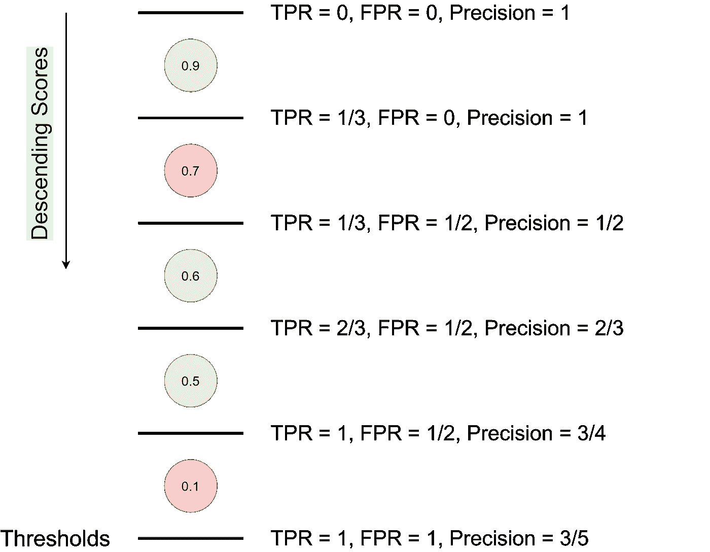
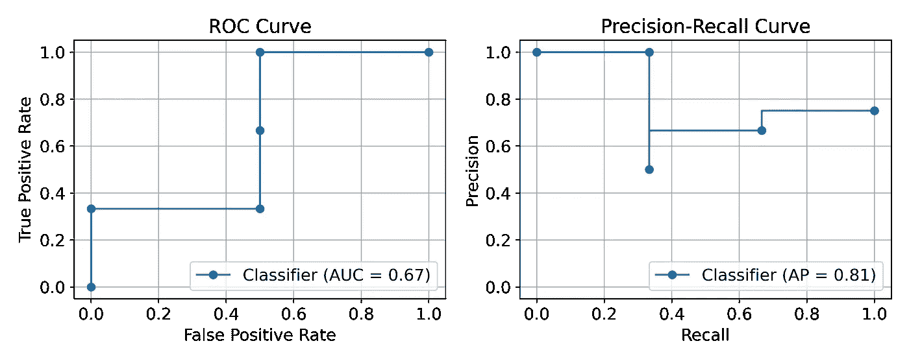

# 不平衡的数据？停止使用 ROC-AUC，改用 AUPRC

> 原文：<https://towardsdatascience.com/imbalanced-data-stop-using-roc-auc-and-use-auprc-instead-46af4910a494>

## AUPRC 在数据不平衡的情况下衡量绩效的优势——解释清楚

照片由 [Unsplash](https://unsplash.com?utm_source=medium&utm_medium=referral) 上的 [Piret Ilver](https://unsplash.com/@saltsup?utm_source=medium&utm_medium=referral) 拍摄

在 **C** urve (ROC-AUC)度量下的 **R** 接收方 **O** 操作方 **C** 特征量 **A** rea **U** 被广泛用于评估二元分类器的性能。然而，有时候，基于测量 **P** 精度- **R** ecall **C** 曲线(AUPRC)下的 **A** rea **U** 来评估您的分类器更合适。

我们将详细比较这两种方法，并附有实验结果和图表。Scikit-learn 实验也可在相应的笔记本中获得。

## 准备工作——计算曲线

我假设你熟悉精度和召回以及混淆矩阵的元素(TP，FN，FP，TN)。如果你需要的话，[维基百科的文章](https://en.wikipedia.org/wiki/Precision_and_recall)是很好的复习资料。

现在，让我们快速回顾一下 ROC 曲线和 PRC 的计算。 我们将使用下图，这大大有助于我的理解。

假设我们有一个训练好的预测概率的二元分类器。也就是说，给定一个新的例子，它输出正类的概率。接下来，我们采用一个包含 3 个肯定和 2 个否定的测试集，并计算分类器的预测概率——我们在下图中按降序排列它们。在相邻的预测之间，我们放置一个阈值，并计算相应的评估指标，TPR(相当于召回)，FPR 和精度。每个阈值代表一个二元分类器，其预测值对于阈值以上的点为正，对于阈值以下的点为负-评估测量值是针对该分类器计算的。将上述内容放到一个图形中:

图 1: 计算 ROC 曲线和 PRC，给定概率和地面真相。这些点按正类概率排序(最高概率在顶部)，绿色和红色分别代表正或负标注。归功于我的同事。

使用这些计算，我们可以绘制 ROC 曲线和 PRC:

图 2: 根据图 1 所示的数据，绘制 ROC 曲线和 PRC。

计算每条曲线下的面积现在很简单——面积如图 2 所示。请注意，AUPRC 也被称为**A**verage**P**recision(AP)，这是一个来自[信息检索](https://en.wikipedia.org/wiki/Information_retrieval)领域的术语(稍后将详细介绍)。

在 sklearn 中，这些计算对我们来说是透明的，我们可以使用`[sklearn.metrics.roc_auc_score](https://scikit-learn.org/stable/modules/generated/sklearn.metrics.roc_auc_score.html)`和`[sklearn.metrics.average_precision_score](https://scikit-learn.org/stable/modules/generated/sklearn.metrics.average_precision_score.html)`。

## ROC-AUC 和 AUPRC 的比较

让我们直接看结果，然后讨论实验。

在图 3 中，我们看到两个强模型(高 AUC ),它们的 AUC 得分略有不同，因此橙色模型略好。

图 3:两个看似相似的模型，橙色的那个(“另一个模型”)显示出一点优势。

然而，在图 4 中，情况完全不同——蓝色模型明显更强。

图 4:两个模型，其中蓝色的模型(“首选模型”)显示了很大的优势。

什么意义上的更强？考虑到 ROC 曲线告诉我们一个不同的故事，这真的有趣吗？在回答这些问题之前，让我们先描述一下我们的实验。

这里的关键是分类标签的分布:

*   20 个阳性
*   2000 张底片

这是一种严重的不平衡。根据这些数据，我们模拟了两个模型的预测。第一个模型在其前 20 个预测中找到 80%的肯定结果，第二个模型在其前 60 个预测中找到 80%的肯定结果，如图 5 所示。其余的积极因素平均分布在其余的例子中。

图 5:图 3 和图 4 中考虑的模型的前 100 个预测。

换句话说，这两种模型的区别在于它们发现积极因素的速度。让我们看看为什么这是一个重要的属性，以及为什么 ROC-AUC 未能捕捉到它。

## 解释差异

ROC 曲线的 x 轴是 FPR。鉴于不平衡的数据，FPR 的变化与召回的变化相比是缓慢的。这一因素决定了所有的差异。

为了理解这一点，在看了 100 个例子后，回到我们的不平衡数据集并考虑 FPR。我们可能看到最多 100 个阴性(假阳性)，最少 80 个，因此 FPR 在区间[0.04，0.05]内。相比之下，我们的模型在 100 个例子中已经实现了 80%的召回率，在召回率方面几乎没有改进的空间，并导致了高 AUC。

另一方面，对于 PRC，获得假阳性具有显著的影响，因为每次我们看到一个假阳性时，精确度都显著降低。因此，“其他模式”表现不佳。但是为什么这里的精度很有趣呢？

考虑一下欺诈检测、疾病识别和 YouTube 视频推荐的任务。由于正面的例子很少，它们有着相似的数据不平衡的性质。然而，如果我们模型的用户能更快地找到他们的优点，他们将会节省很多时间。也就是说，积极因素的分数是至关重要的，即使差异在概率的排序列表中高出几个点。AUPRC 抓住了这一要求，而 ROC-AUC 没有做到这一点。

## 解释差异——ROC-AUC 作为概率

ROC-AUC 有一个很好的概率解释(在[2]中提到了额外的等价解释，在[4]或[5]中提供了一个证明)。

也就是说，ROC-AUC 是“均匀随机抽取的阳性*比均匀随机抽取的阴性*得分高的概率”。**

让我们在面对如上所述的严重数据不平衡时思考一下这种解释。当我们统一抽取一个随机的*负值*时，很可能是一个不感兴趣的负值或者是一个“容易”的负值，因为这通常是不平衡数据的原因——负值更容易收集。因此，当我们一致地抽取一个随机的*正*时，给它分配一个比这个“容易”负的分数更高的分数是微不足道的。即上述概率会很高。

我们感兴趣的是积极因素与“硬”消极因素相比是如何评分的，这些消极因素出现在我们预测的顶部。ROC-AUC 没有区分这些负面因素，但 AUPRC 正是这样做的。

## 关于排序的一个注记

对不平衡数据的分类可以被看作是一种积极的检索任务(例如，web 文档检索)，在这种情况下，我们只关心来自我们的分类器(或排序器)的前 K 个预测。通常使用平均精度(AUPRC)来测量 top-K 预测，因为这是评估通用检索系统的最先进的方法[3]。因此，如果你发现你的不平衡任务类似于检索任务，强烈建议考虑 AUPRC。

## 代码实验

要重现本文的结果，请参见下面的知识库。您也可以使用参数，并检查它们如何影响结果。

 [## GitHub - 1danielr/rocauc-auprc:相应介质物品的代码

### 在 Google Colab 上运行实验。

github.com](https://github.com/1danielr/rocauc-auprc) 

## 结论

尽管 ROC-AUC 封装了许多用于评估的有用信息，但它不是一个万能的衡量标准。我们进行了实验来支持这一说法，并使用 ROC-AUC 的概率解释提供了理论依据。由此，我们得出结论，在处理数据不平衡时，AUPRC 可以为我们提供更多的信息。

总的来说，ROC 在评估通用分类时是有用的，而 AUPRC 在分类罕见事件时是更好的方法。

作为一个旁注，我们提到在高度不平衡的数据中的分类有时更适合作为一个积极的检索任务。在下一篇文章中，我们将回顾专门为这类任务定制的排名方法——如果你有兴趣，可以考虑关注我。

## 参考

1.  戴维斯、杰西和马克·戈德里奇。"[精确回忆与 ROC 曲线的关系](https://www.biostat.wisc.edu/~page/rocpr.pdf)" *ICML* 。2006.
2.  [https://stats . stack exchange . com/questions/132777/what-does-AUC-stand-for-and-what-is-it](https://stats.stackexchange.com/questions/132777/what-does-auc-stand-for-and-what-is-it)
3.  巴克利，克里斯和埃伦 m .沃尔赫斯。"评估评估措施的稳定性."ACM SIGIR 论坛。2017.
4.  [https://stats . stack exchange . com/questions/180638/how-to-derive-the-probabilical-interpretation-of-the-AUC](https://stats.stackexchange.com/questions/180638/how-to-derive-the-probabilistic-interpretation-of-the-auc)
5.  [https://stats . stack exchange . com/questions/190216/why-is-roc-AUC-equivalent-to-the-probability-that-two-random-selected-samples](https://stats.stackexchange.com/questions/190216/why-is-roc-auc-equivalent-to-the-probability-that-two-randomly-selected-samples)

感谢阅读！我很想听听你的想法和评论😃