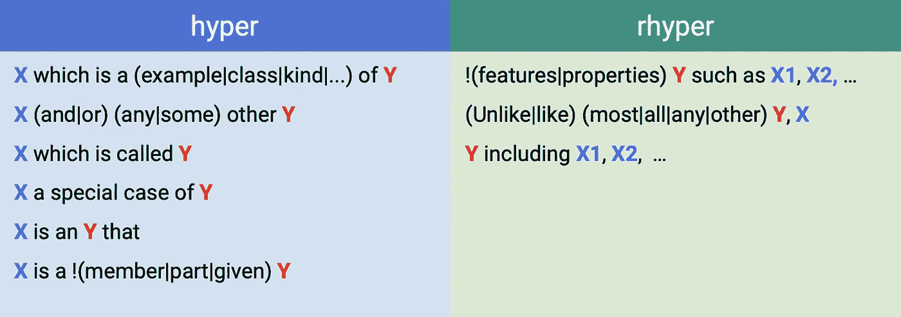

# 用 SpaCy 实现 Hearst 模式

> 原文：<https://towardsdatascience.com/implementing-hearst-patterns-with-spacy-216e585f61f8>

## 上下位关系的自动提取

> ⚠️在这篇文章中，我将主要集中在赫斯特模式，实现和上位词提取的用法。然而，我将使用命名实体识别(NER)和专利数据集；所以我建议查看我在这个周期的前一篇帖子。

</improving-the-ner-model-with-patent-texts-spacy-prodigy-and-a-bit-of-magic-44c86282ea99>  

> 模式…模式无处不在…

为什么我们在自然语言处理的上下文中关心模式？因为它们大大减少和简化了工作，基本上，它是一个简单的模型。尽管处于变形神经网络时代，模式仍然是有益的。**近 20 年来，上位词自动提取一直是一个活跃的研究领域。这是一个关键的工具，当应用于下游任务，如问题回答，查询，信息。提取等。**

# 下义关系的有用性

> **上位词**——…一个具有广泛意义的词，构成一个有更具体意义的词所属的范畴；
> 
> **下位词**——…是反义词；比适用于它的一般术语有更具体含义的词。

为了便于理解，我们举个例子:

在这里，“光盘”和“硬盘”是“存储单元”的**的下位词**。反过来，“存储单元”是“光盘”和“硬盘”的**上位词**。

这种词汇关系是自然语言处理任务的重要组成部分。这些任务的种类取决于目标，例如:

*   **分类预测**:为术语识别更广泛的类别，建立分类关系(如 WikiData GraphAPI)
*   **信息提取(IE):** 从文本中自动检索特定信息对于被搜索的实体来说是高度可靠的。
*   **数据集创建**:高级模型需要学习实例来识别实体之间的关系。

# 赫斯特图案

那么，我们如何检测和提取这样的关系呢？是时候谈谈计算语言学研究员马蒂·赫斯特的工作了。她最受欢迎的研究之一是建立一套测试模式，用于从文本中提取有意义的信息。这些图案俗称**“赫斯特图案”。**

我们可以将这种模式形式化为**“X 是 Y”**，其中 X 是上义位，Y 是下义位。这是赫斯特模型的众多模型之一。这里有一个列表，让你对这个想法有一个直觉:

图片作者|检测 hyper 的模式表。\rhyper 关系

这些表格模式按**超**和**押韵**(反向上位词)分类。通常，顺序并不重要，但有时它对训练信息抽取系统很有帮助。

你可能会说这种方法现在看起来过时了，过于简单了，我们可以使用 ML 和复杂的模型。

**但是，这并不完全正确！**

在来自 FB(Meta)研究小组的 [**这篇论文中，他们表明**](https://arxiv.org/pdf/1806.03191.pdf)

> *“…在通用基准数据集上，简单的基于模式的方法始终优于分布式方法。”*

有时候，可靠的老工具已经足够了，🛠

# 空间实现

从理论走向实践。通常，您不想提取所有可能的下位词关系，而只想提取特定领域中的实体。对特定领域中实体的识别被称为 NER。目前最简单的方法是使用[空间](https://spacy.io)。有了这个库，你可以训练一个定制的 NER 模型来识别比默认域更具体的域。

图片由作者提供|来自我之前帖子的自定义 NER 模型的结果

## 数据

例如，我将使用专利的**G06K**(数据的识别/数据的呈现)小节中的专利文本。最重要的是，我训练了一个定制的 NER 模型来识别技术术语。我在我的[上一篇文章](https://medium.com/towards-data-science/improving-the-ner-model-with-patent-texts-spacy-prodigy-and-a-bit-of-magic-44c86282ea99)中详细描述了这个数据集。

> ⚠️数据不受版权保护，可安全用于商业目的。**根据**[**USPTO**](http://www.uspto.gov/news/media/ccpubguide.jsp)**:***除了 37 CFR 1.71(d) & (e)和 1.84(s)****中反映的有限例外，专利的文本和图纸通常不受版权限制*** *。”*

## 履行

在 SpaCy 内部创建模式非常简单。由于我们使用的是 NER 模型，我们可以依靠识别来过滤我们感兴趣的领域之外的实体。

可以用 JSON 格式创建模式。这里有一个基于空间的[规则匹配文档的例子。](https://spacy.io/usage/rule-based-matching)

作者图片| JSON 格式的模式示例

你可以看到，通过指定`ENT_TYPE`，我们利用 NER 模型只匹配这个领域中的单词。

Python 上的实现非常简单。我们读取文本，初始化`matcher`，从 JSON 读取模式，并将它们添加到匹配器中。

将模式加载到空间匹配器的代码片段

简单地说，通过做`matcher(doc)`，我们提取上位词关系的列表。连同提取的模式，我们得到了一些关于匹配的信息，比如模式的名称(在我们的例子中是 hyper\rhyper)以及它是否是一个多词关系。

在文本范围内使用匹配器的代码片段

## 多词模式

我们面临的最常见的问题是多词上位词关系。

图片由作者提供|可能的 hyper 示例。与多个实体的关系

由于匹配器不能识别一个模式下的各种实体，这里我们提出一个有用的提示；)

找到匹配的模式后，我们进一步检查句子中的其他实体。如果它们在我们的领域之下，并且位于连接词之间，那么这些词也是超韵关系的一部分。

图片由作者提供|多词关系匹配的可视化说明

代码中的主要技巧是我们用'*连续词【T4]创建一个列表，并检查有多个实体匹配的句子。*

多实体模式提取的代码片段

# 结果和注释

***瞧✨*** ！我们提取了自定义域中的上位词关系。

图片作者|提取的 hyper 最终结果表。关系

您可以在此处找到完整的代码以及详细的笔记本和数据集:

<https://github.com/kinivi/patent_ner_linking/blob/main/project.ipynb>  

即使我们已经有了结果，验证它们也是很好的。在这个“专利”系列的下一篇也是最后一篇文章中，我将展示如何使用 Wiki API 在任何自定义数据集上自动验证提取的上位词关系。敬请关注😉

# 确认

特别感谢我的团队: *Marwan MASHRA 和 gatan serré。*