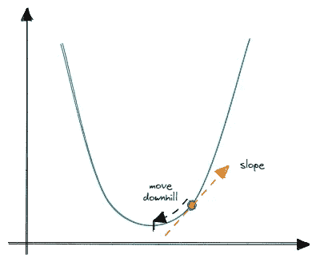
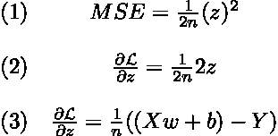
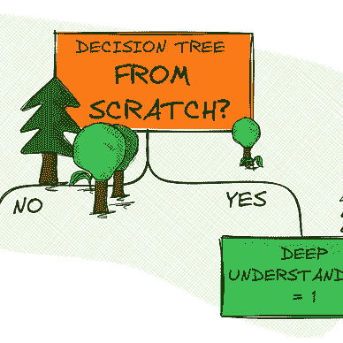
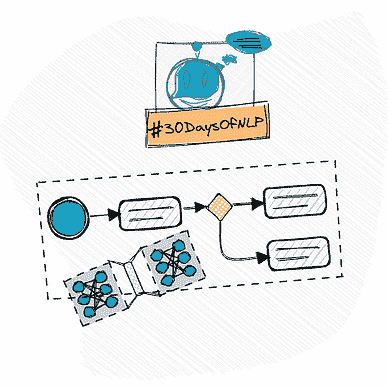

# 从零开始用梯度下降实现线性回归

> 原文：<https://towardsdatascience.com/implementing-linear-regression-with-gradient-descent-from-scratch-f6d088ec1219>

## 从头做起

# 从零开始用梯度下降实现线性回归

## 通过充分理解和推导梯度下降，建立强大的机器学习基础

Pawel Czerwinski 在 [Unsplash](https://unsplash.com?utm_source=medium&utm_medium=referral) 上的照片

在我个人在机器学习和数据科学领域的旅程中，我基本上跳过了所有的基础知识，带着一种荒谬的紧迫感奔向被认为是更奇特的东西*。*

*不用说，我也忽略了线性回归。我认为这是浪费时间，因为这是一个简单的初学者算法，没有什么需要学习的。*

> *回顾过去，我大错特错了。*

*在接下来的章节中，我们将使用 Python 和 NumPy 一步步实现*线性回归*。我们还将学习*梯度下降*，这是机器学习领域最常见的优化算法之一，通过从头开始推导它。*

*但是在直接进入实现细节之前，让我们建立一些关于线性回归和梯度下降的基本直觉。*

# *为什么是线性回归？*

*线性回归是一种简单的监督学习算法，用于预测定量反应。它已经存在了相当一段时间，与更现代的机器学习方法相比，它被认为是非常基础的。*

> *然而，线性回归可以作为一个很好的起点，因为它涵盖了机器学习中许多重要和基本的概念。*

*

[马文·兰亨克](https://medium.com/@marvinlanhenke?source=post_page-----f6d088ec1219--------------------------------)* 

## *机器学习基础*

*[View list](https://medium.com/@marvinlanhenke/list/machine-learning-fundamentals-3f7110a3669b?source=post_page-----f6d088ec1219--------------------------------)**7 stories*******

*假设线性，线性回归的目标是通过优化权重和偏差以最小化残差平方和来找到最佳估计量。*

*或者简单地说，我们试图找到最佳拟合线、平面或超平面，使预测值和真实值之间的平方距离最小化。*

**

*简单线性回归最小化 MSE 的例子[图片由作者提供]*

*更正式地说，我们试图最小化的损失函数可以表述为下面的等式*

**

*其中 *n* 描述样本数量， *Y* 等于真实值， *Y-hat* 定义我们的预测值。*

*根据特征的数量，我们可以将线性回归视为简单的线性回归或多重线性回归。*

# *导出梯度下降*

*尽管在 1847 年首次提出，梯度下降仍然是机器学习中最常见的优化算法之一。*

> *主要思想是通过在梯度的相反方向上迭代地采取小步骤来寻找可微函数的局部最小值。*

*我们可以把梯度想成包含函数在某一点的一阶偏导数的向量。不严格地说，梯度描述了一个函数的斜率，告诉我们最快增长的方向和速率。*

*因为我们想向下移动并找到函数的最小值，所以我们需要向相反的方向移动。*

**

*梯度下降的例子[图片由作者提供]*

> ***注意**:步长由一个叫做学习率的超参数控制。*

*在线性回归的情况下，这意味着我们必须通过找到其局部最小值来最小化损失函数 *(MSE)* 。因此，我们需要计算梯度，并在相反的方向上迭代地采取小的步骤。*

*为了能够计算梯度，我们有一些工作要做——我们需要*导出损失函数相对于每个参数的一阶偏导数*。*

*但首先，让我们重申并稍微修改损失函数:*

**

*n =样本；w =重量；b =偏差；x =特征*

> ***注**:我们添加了一个常数“2”只是为了在求导时方便。*

## *重量偏导数:*

*现在，我们需要对*外部函数*和*内部函数*求相对于权重的偏导数，并应用链式法则。*

*如果我们认为括号内的表达式为`z = ((Xw + b)-Y)`，那么外部函数可以描述为`z²`。*

**

*接下来，我们需要考虑内部函数，并对权重求导。*

**

*应用链式法则，我们可以计算损失函数相对于权重的偏导数。*

**

## *偏导数 w.r.t .偏差:*

*现在，我们简单地重复之前的步骤，但是这一次对内函数求导。*

**

*再次应用链式法则，我们得到如下结果:*

**

*就是这样——我们已经计算完了权重和偏差的梯度。当我们在下一节实现梯度下降时，这两个方程都会派上用场。*

# *介绍算法*

*在我们从头开始编码和实现线性回归之前，我们还有一件事要做——我们需要知道算法一般是如何工作的。*

*基本上，我们需要执行 3 个步骤:*

1.  *初始化权重和偏差*
2.  *执行 *n* 次迭代的梯度下降，这包括进行预测、计算梯度以及更新权重和偏差*
3.  *做最后的预测*

*由于第二步涉及多个动作，我们将把它分解成几个辅助函数。*

*我们将用 Python 和 Numpy 在一个类中实现该算法。下面的*骨架级*可以被视为某种蓝图，指导我们通过下一节。*

# *从头开始实施*

## *基本设置*

*首先，我们需要做一些内务处理，**设置一些参数**(学习率，迭代次数)以及权重和偏差。*

## *主算法*

*现在，我们能够实现算法的核心计算步骤。*

*我们要做的第一件事是计算样本的数量和训练数据的特征。接下来，我们调用助手函数**来初始化权重和偏差。***

*继续进行**梯度下降** —在一次迭代中，我们必须做出预测，计算权重和偏差的梯度，并相应地更新参数。*

***做出预测**非常简单，因为它只需要我们计算训练数据和权重的点积。可以在顶部添加偏置。*

*一旦我们获得了初始预测，我们需要**计算梯度**。*

*上面代码中的等式对我们来说应该很熟悉，因为我们已经做了一些工作，并在前面的部分中推导了它们。*

*我们要做的最后一件事是**用计算出的梯度更新权重和偏差**。*

*这也很简单——我们只需将学习率乘以相关的梯度，然后从当前值中减去乘积。*

## *预测并把它们放在一起*

*到目前为止，我们基本上完成了所有的艰苦工作——我们只需要实现最后一个方法来进行最终预测，并将所有代码放在一起**来完成我们的最终类**。*

# *测试回归量*

*已经完成了我们自己的梯度下降线性回归的实现，我们仍然需要测试它。*

*出于测试目的，我们将简单地使用`sklearn.datasets.make_regression()`并创建一个只有一个特征的基本数据集(这使我们更容易可视化)。*

**

*数据集的散点图[图片由作者提供]*

*现在，我们可以分割数据集，实例化并拟合我们的回归变量来进行预测。*

*运行上面的代码，我们得到大约 20.5 的均方根误差。通过绘制我们的结果，我们可以看到最佳拟合线，看起来我们的算法是可行的。*

**

*估计最佳拟合线[图片由作者提供]*

# *结论*

*在本文中，我们从零开始一步一步地实现了线性回归。我们还学习了梯度下降是如何工作的，以及如何从头开始推导它。*

*虽然与更现代、更花哨的机器学习模型相比，线性回归似乎非常基础和枯燥，但它仍然对我们有巨大的价值。*

*例如，更深入地了解梯度下降的实际工作方式，可以让我们建立一个强大的基础——为我们在机器学习领域的旅程中更复杂的算法做准备。*

*你可以在我的 GitHub 上的这里找到完整的代码。*

*

[马文·兰亨克](https://medium.com/@marvinlanhenke?source=post_page-----f6d088ec1219--------------------------------)* 

## *从零开始的 ML 算法*

*[View list](https://medium.com/@marvinlanhenke/list/ml-algorithms-from-scratch-7621d01922ad?source=post_page-----f6d088ec1219--------------------------------)**6 stories********

[马文·兰亨克](https://medium.com/@marvinlanhenke?source=post_page-----f6d088ec1219--------------------------------)* 

## *# 30 日*

*[View list](https://medium.com/@marvinlanhenke/list/30daysofnlp-3974a0c731d6?source=post_page-----f6d088ec1219--------------------------------)**30 stories*******

**喜欢这篇文章吗？成为* [*中等会员*](https://medium.com/@marvinlanhenke/membership) *继续无限学习。如果你使用下面的链接，我会收到你的一部分会员费，不需要你额外付费。**

* [## 通过我的推荐链接加入 Medium-Marvin Lanhenke

### 作为一个媒体会员，你的会员费的一部分会给你阅读的作家，你可以完全接触到每一个故事…

medium.comm](https://medium.com/@marvinlanhenke/membership)*