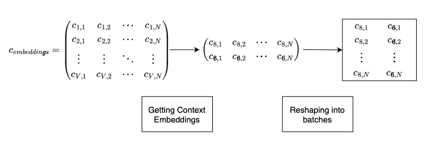

# 从头开始在 PyTorch 中实现 Word2vec

> 原文：<https://towardsdatascience.com/implementing-word2vec-in-pytorch-from-the-ground-up-c7fe5bf99889>

## 训练 Word2vec 模型的分步指南


布雷特·乔丹在 [Unsplash](https://unsplash.com?utm_source=medium&utm_medium=referral) 上的照片

# 介绍

自然语言处理(NLP)的一个重要组成部分是将单词、短语或大量文本翻译成连续数字向量的能力。有许多技术可以完成这项任务，但在本文中，我们将重点关注 2013 年发布的一项技术，名为 word2vec。

Word2vec 是 Mikolov 等人在一篇题为[向量空间中单词表示的高效估计](https://arxiv.org/pdf/1301.3781.pdf)的论文中发表的算法。这篇文章值得一读，尽管我将在 PyTorch 中从头开始构建它时提供一个概述。简单地说，word2vec 使用单个隐藏层人工神经网络来学习密集的单词嵌入。这些单词嵌入允许我们识别具有相似语义的单词。此外，单词嵌入允许我们应用代数运算。例如"*Vector(' King ')-Vector(' Man ')+Vector(' Woman ')*产生最接近单词 *Queen"* 的矢量表示的矢量(“矢量空间中单词表示的有效估计”2)。


图 1:单词嵌入示例— **演职员表:**[https://thegradient.pub/nlp-imagenet/](https://thegradient.pub/nlp-imagenet/)

图 1 是三维单词嵌入的例子。单词嵌入可以学习单词之间的语义关系。“男-女”的例子说明了“男人”和“女人”之间的关系与“国王”和“王后”之间的关系非常相似。句法关系可以通过嵌入来编码，如“动词时态”的例子所示。

# **单词嵌入概述**

在我们进入模型概述和 PyTorch 代码之前，让我们先来解释一下单词嵌入。

## 为什么我们甚至需要单词嵌入？

计算机只是抽象的计算器。他们在数学计算方面确实很有效率。任何时候我们想向计算机表达我们的思想，我们必须使用数字语言。如果我们想了解 yelp 评论的观点或一本流行书籍的主题，我们需要首先将文本转换成向量。只有这样，我们才能使用后续程序从文本中提取感兴趣的信息。

## 最简单的单词嵌入

单词嵌入正是我们如何将我们的思想翻译成计算机可以理解的语言。让我们来看一个取自[维基百科关于 python](https://en.wikipedia.org/wiki/Python_(programming_language)) 的文章的例子，该文章称***“python 一直是最受欢迎的编程语言之一。”*** 这个句子包含 11 个单词，那么我们为什么不创建一个长度为 11 的向量，其中如果单词存在，每个索引取值 1，如果不存在，取值 0？这就是俗称的[一键编码](https://en.wikipedia.org/wiki/One-hot)。

```
python       = [1,0,0,0,0,0,0,0,0,0,0]
consistently = [0,1,0,0,0,0,0,0,0,0,0]
ranks        = [0,0,1,0,0,0,0,0,0,0,0]
as           = [0,0,0,1,0,0,0,0,0,0,0]
one          = [0,0,0,0,1,0,0,0,0,0,0]
of           = [0,0,0,0,0,1,0,0,0,0,0]
the          = [0,0,0,0,0,0,1,0,0,0,0]
most         = [0,0,0,0,0,0,0,1,0,0,0]
popular      = [0,0,0,0,0,0,0,0,1,0,0]
programming  = [0,0,0,0,0,0,0,0,0,1,0]
languages    = [0,0,0,0,0,0,0,0,0,0,1]
```

这种将单词转换成向量的方法可以说是最简单的。然而，有一些缺点将为 word2vec 嵌入提供动力。首先，嵌入向量的长度随着词汇表的大小线性增加。一旦我们需要嵌入数百万个单词，这种嵌入方法在[空间复杂度](https://en.wikipedia.org/wiki/Space_complexity)方面就成了问题。第二个问题是这些向量是稀疏的。每个向量只有一个值为 1 的条目，所有剩余条目的值为 0。同样，这是对内存的极大浪费。最后，每个单词向量与所有其他单词向量[正交](https://en.wikipedia.org/wiki/Orthogonality)。因此，没有办法确定哪些单词最相似。我认为“python”和“编程”这两个词应该比“python”和“ranks”更相似。不幸的是，这些单词中的每一个的向量表示都与其他向量完全不同。

## 改进的单词嵌入

我们的目标现在更加精确了:我们能否创建固定长度的嵌入，让我们能够识别哪些单词彼此最相似？一个例子可能是:

```
python       = [0.5,0.8,-0.1]
ranks        = [-0.5,0.1,0.8]
programming  = [0.9,0.4,0.1]
```

如果我们取“python”和“ranks”的[点积](https://en.wikipedia.org/wiki/Dot_product)，我们会得到:


如果我们取“python”和“编程”的点积，我们会得到:


由于“python”和“ranks”之间的得分低于“python”和“编程”之间的得分，**我们会说“python”和“编程”更相似。**通常，我们不会使用两个嵌入之间的点积来计算相似性得分。相反，我们将使用余弦相似度，因为它消除了向量范数的影响，并返回更标准化的分数。无论如何，我们面临的一次性编码方法的两个问题都解决了——我们的嵌入向量是固定长度的，它们允许我们计算单词之间的相似度。

# **Skipgram Word2Vec 架构**

既然我们已经掌握了单词的嵌入，问题就变成了如何学习这些嵌入。这就是 Mikolov 的 word2vec 模型发挥作用的地方。如果你对[人工神经网络](https://en.wikipedia.org/wiki/Artificial_neural_network)不熟悉，下面的部分会不清楚，因为 word2vec 基本上是基于这种类型的模型。如果你对这些材料不熟悉，我强烈推荐你去看看迈克尔·尼尔森的免费在线[深度学习和神经网络](http://neuralnetworksanddeeplearning.com)课程和 3Blue1Brown 的 [YouTube](https://www.youtube.com/playlist?list=PLZHQObOWTQDNU6R1_67000Dx_ZCJB-3pi) 系列关于神经网络的课程。

## skip 程序

回想一下前面的句子，***“python 一直是最流行的编程语言之一。”*** 想象有人不知道“编程”这个词，想弄清楚它的意思。一个合理的方法是检查相邻的单词，以获得关于这个未知单词的意思的线索。他们会注意到它被“流行”和“语言”所包围。这些话可以给他们一个暗示，暗示“编程”的可能含义。这正是 skipgram 模型的工作方式。最终，我们将训练一个神经网络来预测相邻的上下文单词，给定一个输入单词。在图 2 中，绿色单词是未知的目标单词，它周围的蓝色单词是我们的神经网络将被训练来预测的上下文单词。


图 2: Skipgram 方法

在本例中，窗口大小为 2。这意味着每个目标单词将被两个上下文单词包围，模型需要预测这两个上下文单词。由于单词“rank”在左边有 2 个单词，在右边有 2 个单词，因此得到的训练数据是该目标单词的 4 个例子。

## 模型架构

用于学习这些单词嵌入的神经网络是单隐层前馈网络。网络的输入是目标单词。标签是上下文单词。单一的隐藏层将是我们选择嵌入话语的维度。对于这个例子，我们将使用 300 的嵌入大小。


图 3: Skipgram 模型架构

让我们通过一个例子来说明这个模型是如何工作的。如果我们想嵌入一个单词，第一步是找到它在词汇表中的索引。然后，该索引作为嵌入矩阵中的行索引被传递给网络。在图 3 中，输入单词是词汇向量中的第二个条目。这意味着我们现在将进入绿色嵌入矩阵的第二行。这一行的长度为 300 —嵌入维度，`N`。然后，我们将这个隐藏层的向量乘以形状为`N x V`的第二个嵌入矩阵，得到长度为`V`的向量。

注意，在第二个嵌入矩阵(紫色矩阵)中有`V`列。这些列中的每一列代表词汇表中的一个单词。将矩阵乘法概念化的另一种方法是认识到它导致目标单词(隐藏层)的向量和词汇表中的每个单词(紫色矩阵的列)之间的点积。结果是一个长度为`V`的向量，代表上下文单词预测。因为我们的上下文窗口大小是 2，我们将有 4 个长度为`V`的预测向量。然后，我们将这些预测向量与相应的地面真实向量进行比较，以计算我们通过网络反向传播以更新模型参数的损失。在这种情况下，模型参数是嵌入矩阵的元素。稍后将在 PyTorch 代码中详细讨论这个训练过程的机制。

## 负采样


照片由 [Unsplash](https://unsplash.com?utm_source=medium&utm_medium=referral) 上的 [Edge2Edge Media](https://unsplash.com/@edge2edgemedia?utm_source=medium&utm_medium=referral) 拍摄

在 Mikolov 等人题为[单词和短语的分布式表示及其组合性](https://proceedings.neurips.cc/paper/2013/file/9aa42b31882ec039965f3c4923ce901b-Paper.pdf)的论文中，作者提出了对原始 word2vec 模型的两种增强——负采样和子采样。

在图 3 中，注意每个预测向量的长度`V`。将与每个预测向量进行比较的基础真实向量也将具有长度`V`，但是基础真实向量将非常稀疏，因为向量中只有单个元素将被标记为 1——模型被训练来预测的真实上下文单词。这个真实上下文单词将被称为“正面上下文单词”。词汇表中的每隔一个单词，即`V — 1`单词，将被标记为 0，因为它们不是训练示例中的上下文单词。所有这些单词将被称为“负面上下文单词”。

Mikolov 等人提出了一种叫做*负采样*的方法，这种方法减少了真实向量的大小，从而减少了预测向量的大小。这降低了网络的计算要求并加速了训练。Mikolov 提出了一种方法，使用条件概率分布从现有的`V — 1`否定上下文单词中采样少量否定上下文单词，而不是使用所有否定上下文单词。

在提供的代码中，我实现了一个负采样过程，它不同于 Mikolov 提出的方法。它构造起来更简单，并且仍然能够产生高质量的嵌入。在 Mikolov 的论文中，选择负样本的概率是基于在目标词的上下文中看到候选词的条件概率。因此，对于词汇表中的每个单词，我们将为词汇表中的每个其他单词生成一个概率分布。这些分布表示在目标单词的上下文中看到另一个单词的条件概率。然后，负上下文单词将以与上下文单词的条件概率成反比的概率被采样。

我以稍微不同的方式实现了负采样，避免了条件分布。首先，我找到了词汇表中每个单词的出现频率。我通过求整体频率忽略了条件概率。然后，用与单词频率成比例的词汇索引来填充任意大的负采样向量。例如，如果单词“is”包括语料库的 0.01%，并且我们决定负采样向量的大小应该是 1，000，000，则负采样向量的 100 个元素(0.01% x 1，000，000)将用单词“is”的词汇索引来填充。然后，对于每个训练示例，我们从负采样向量中随机采样少量元素。如果这个小数字是 20，词汇表是 10，001 个单词，我们只是将预测向量和基础真实向量的长度减少了 9，980 个元素。这种减少大大加快了模型训练时间。

## 二次抽样

子采样是 Mikolov 等人提出的另一种方法，用于减少训练时间和提高模型性能。产生二次抽样的基本观察结果是，高频词“提供的信息价值比稀有词少”(“词和短语的分布式表示及其组成性”4)。例如，像“是”、“该”或“在”这样的词经常出现。这些词极有可能与许多其他词同时出现。这意味着这些高频词周围的上下文词几乎不传递关于高频词本身的上下文信息。因此，我们不是使用语料库中的每个词对，而是以与词对中词的频率成反比的概率对词进行采样。确切的实现细节将在下一节中解释。

# PyTorch 实现

在概述了单词嵌入、word2vec 架构、负采样和子采样之后，让我们深入研究一下代码。请注意，有些框架已经抽象出了 word2vec 的实现细节。这些选项非常强大，并为用户提供了可扩展性。例如， [gensim](https://radimrehurek.com/gensim/index.html) 提供了一个 [word2vec API](https://radimrehurek.com/gensim/models/word2vec.html) ，它包含了额外的功能，比如使用预训练模型和多词 n 元语法。然而，在本教程中，我们将创建一个 word2vec 模型，而不利用任何这些框架。

我们将在本教程中回顾的所有代码都可以在我的 [GitHub](https://github.com/JonahBreslow/Word2Vec-PyTorch/blob/main/README.md) 上找到。请注意，随着我的工作，存储库中的代码可能会发生变化。出于本教程的目的，这段代码的简化版本将在 [Google Colab 笔记本](https://gist.github.com/JonahBreslow/8b6f0e91fcbdfb449798708a53f4656e)中呈现。

## 获取数据

我们将使用 PyTorch 提供的名为 [WikiText103](https://pytorch.org/text/0.8.1/datasets.html#wikitext103) 的维基百科数据集来训练我们的 word2vec 模型。在下面的代码中，您将看到我如何导入和打印数据集的前几行。第一段文字来自维基百科关于[女武神编年史三](https://en.wikipedia.org/wiki/Valkyria_Chronicles_III)的文章。

## 设置参数和配置

现在，我们将设置参数和配置值，它们将在代码的其余部分中使用。这个片段中的一些参数与笔记本后面的代码相关，但是请耐心等待。

这里我们构造了一个 dataclass，它包含定义 word2vec 模型的参数。第一部分控制文本预处理和 skipgram 构造。我们将只考虑出现至少 50 次的单词。这由`MIN_FREQ`参数控制。`SKIPGRAM_N_WORDS`是我们在构建 skipgrams 时要考虑的窗口大小。这意味着我们将查看目标单词前后的 8 个单词。`T` 控制我们如何计算二次抽样概率。这意味着频率在第 85 个百分位数的单词被二次抽样的概率很小，正如我们在上面的二次抽样部分所描述的。`NEG_SAMPLES`是用于每个训练示例的负样本数，如上面的负样本部分所述。`NS_ARRAY_LEN`是负采样向量的长度，我们将从中对负观测值进行采样。`SPECIALS`是不符合最低频率要求的词汇的占位符字符串。`TOKENIZER`指的是我们要如何将语料库中的文本转换成记号。“basic_english”标记器按空格分割所有文本。

第二部分定义模型配置和超参数。`BATCH_SIZE`是用于训练网络的每个迷你批次中的文档数量。`EMBED_DIM`是我们将用于词汇表中每个单词的嵌入维度。`EMBED_MAX_NORM`是每个嵌入向量可以得到的最大[范数](https://en.wikipedia.org/wiki/Norm_(mathematics))。`N_EPOCHS`是我们将为其训练模型的时期数。`DEVICE`告诉 PyTorch 是使用 CPU 还是 GPU 来训练模型。`CRITERION`是使用的损失函数。损失函数选择的讨论将在我们讨论模型训练过程时继续。

## 积累词汇

为 word2vec 模型准备文本数据的下一步是构建词汇表。我们将构建一个名为`Vocab`的类，它将拥有允许我们查找单词的索引和频率的方法。我们还能够通过索引查找单词，并获得整个文本语料库中的单词总数。

不用回顾代码中的每一行，注意到`Vocab`类有`stoi, itos,`和`total_tokens` 属性以及`get_index(), get_freq(),`和`lookup_token()`方法。下面的要点将展示这些属性和方法的作用。

`stoi` 是一个字典，其中关键字是单词，值是关键字的索引和频率的元组。例如，单词“python”是第 13，898 个最常见的单词，出现了 403 次。这个单词在`stoi`字典中的条目是`{"python": (13898, 403)}`。`itos`类似于`stoi,`，但是它的关键字是索引值，因此“python”的条目将是`{13898: ("python", 403)}.`。`total_tokens`属性是整个语料库中的标记总数。在我们的例子中有 77，514，579 个单词。

`get_index()`方法将一个单词或单词列表作为输入，并返回这些单词的索引或索引列表。如果我们调用`Vocab.get_index("python")`，返回值是`13898`。`get_frequency()`方法将一个单词或单词列表作为输入，并以整数或整数列表的形式返回单词的频率。如果我们调用`Vocab.get_freq("python")`，返回的值是`403`。最后，`lookup_token()`方法接受一个整数并返回占据该索引的单词。例如，如果我们要调用`Vocab.lookup_token(13898)`，该方法将返回`"python"`。

以上要点中的最后一个函数是`yield_tokens()`和`build_vocab()`函数。`yield_tokens()`功能对文本进行预处理和标记。预处理只是删除所有不是字母或数字的字符。`build_vocab()`函数获取原始的维基百科文本，对其进行标记，然后构造一个`Vocab`对象。同样，我不会检查这个函数中的每一行。关键是这个函数构造了一个`Vocab`对象。

## 构建我们的 PyTorch 数据加载器

这个过程的下一步是用二次抽样构建 skipgrams，然后为我们的 PyTorch 模型创建数据加载器。关于为什么数据加载器对于训练大量数据的 PyTorch 模型如此重要的概述，请查看[文档](https://pytorch.org/tutorials/beginner/basics/data_tutorial.html)。

这个类可能是我们所学过的最复杂的一个类，所以让我们从最后一个方法`collate_skipgram()`开始，彻底地检查每一个方法。我们首先初始化两个列表，`batch_input`和`batch_output`。这些列表中的每一个都将填充词汇索引。最终，`batch_input`列表将具有每个目标单词的索引，而`batch_output`列表将包含每个目标单词的肯定上下文单词索引。第一步是循环遍历批中的每个文本，并将所有标记转换为相应的词汇索引:

```
for text in batch:
    text_tokens = self.vocab.get_index(self.tokenizer(text))
```

下一步检查以确保文本足够长以生成训练示例。回想一下前面的句子，***“python 一直是最流行的编程语言之一。”*** 有 11 个字。如果我们将`SKIPGRAM_N_WORDS`设置为 8，那么 11 个单词长的文档是不够的，因为我们在文档中找不到一个单词，它前面有 8 个上下文单词，后面也有 8 个上下文单词。

```
if len(text_tokens) < self.params.SKIPGRAM_N_WORDS * 2 + 1:
    continue
```

然后，我们创建一个目标单词列表和围绕该目标单词的所有上下文单词列表，确保我们始终拥有一个完整的上下文单词集:

```
for idx in range(len(text_tokens) - self.params.SKIPGRAM_N_WORDS*2):
    token_id_sequence = text_tokens[
        idx : (idx + self.params.SKIPGRAM_N_WORDS * 2 + 1)
        ]
    input_ = token_id_sequence.pop(self.params.SKIPGRAM_N_WORDS)
    outputs = token_id_sequence
```

现在，我们实现子采样。我们根据给定的频率查找目标词被丢弃的概率，然后根据该概率删除它。我们将很快看到如何计算这些丢弃概率。

```
prb = random.random() 
del_pair = self.discard_probs.get(input_) 
if input_==0 or del_pair >= prb: 
    continue
```

然后，如果前一步骤没有移除目标单词本身，我们对目标单词周围的上下文单词执行相同的子采样过程。最后，我们将结果数据分别添加到`batch_input`和`batch_output`列表中。

```
else:
    for output in outputs:
        prb = random.random()
        del_pair = self.discard_probs.get(output)
        if output==0 or del_pair >= prb:
            continue
        else:
            batch_input.append(input_)
            batch_output.append(output)
```

我们如何计算每个单词的丢弃概率？回想一下，我们对一个单词进行二次抽样的概率与该单词在语料库中的出现频率成反比。换句话说，这个词出现的频率越高，我们就越有可能从训练数据中丢弃它。我用来计算丢弃概率的公式是:


丢弃概率

这与 Mikolov 等人提出的公式略有不同，但它实现了类似的目标。小的区别是分母中的`+t`成分。如果`+t`被排除在分母之外，频率大于`t`的单词将被有效地从数据中移除，因为平方根中的值将大于 1。这是在`_create_discard_dict()`方法中实现的公式，它创建了一个 python 字典，其中的键是单词索引，值是丢弃它的概率。下一个问题是`t`从哪里来？回想一下我们的`Word2VecParams`有参数`T`。在我们的代码中，这个参数被设置为 85。这意味着我们找到第 85 个百分位数的词频，然后将`t`设置为该值。这有效地使得随机抽样频率在第 85 百分位或以上的单词的概率接近但略大于 0%。这个计算就是`SkipGram`类中的`_t()`方法所实现的。

## 创建我们的负采样阵列

定义 PyTorch 模型之前的最后一步是创建负采样数组。高级目标是创建一个长度为 5，000，000 的数组，并用与词汇表中单词的频率成比例的词汇表索引填充它。

`_create_negative_sampling()`方法完全按照上面的说明创建数组。唯一的细微差别是，如果一个单词的频率意味着它在负采样向量中应该少于 1 个条目，我们确保这个单词索引仍然存在于负采样数组的 1 个元素中，因此当我们对负上下文单词进行采样时，我们不会完全丢失这个单词。

`sample()`方法返回一个列表列表，其中外部列表中包含的列表数量等于批处理中的示例数量，内部列表中的样本数量是每个示例的负样本数量，我们已经在`Word2VecParams`数据类中将其设置为 50。

## 定义 PyTorch 模型

最后，我们可以在 PyTorch 中构建 word2vec 模型。构建 PyTorch 神经网络的惯用方法是在构造函数中定义各种网络架构层，并以一种称为`forward()`的方法通过网络向前传递数据。幸运的是，PyTorch 已经抽象出了更新模型参数的向后传递，因此我们不需要手动计算梯度。

PyTorch 模型总是从`torch.nn.Module` 类继承而来。我们将利用 PyTorch [嵌入](https://pytorch.org/docs/stable/generated/torch.nn.Embedding.html)层，它创建一个单词向量的查找表。我们在 word2vec 模型中定义的两层是`self.t_embeddings,`和`self.c_embeddings`，前者是我们感兴趣学习的目标嵌入，后者是图 2 中的次级(紫色)嵌入矩阵。这两个嵌入矩阵都是随机初始化的。

如果我们想要训练网络中的每个参数，我们可以在这一点上放弃负采样，并且`forward`方法会简单一点。但是，负采样已被证明可以提高模型精度并减少训练时间，因此值得实施。让我们深入向前传球。

让我们想象一下，我们有一个训练例子，我们通过一批。在这个例子中，`inputs`只包含与索引 1 相关的单词。正向传递的第一步是在`self.t_embeddings`表中查找这个单词的嵌入。然后，我们使用`.view()`方法对其进行整形，这样我们就有了一个单独的向量来表示通过网络的输入。在实际实现中，批量大小为 100。`.view()`方法为该批 100 个训练示例中的每个单词创建一个`(1 x N)`矩阵。图 4 将帮助读者想象出`forward()`方法的前四行是做什么的。


图 4:正向传递输入嵌入

然后，对于每个输入，我们需要获得上下文单词嵌入。对于这个例子，假设实际上下文单词与`self.c_embeddings`表的第 8 个索引相关联，而否定上下文单词与`self.c_embeddings`表的第 6 个索引相关联。在这个玩具示例中，我们只使用了 1 个阴性样本。图 5 是 PyTorch 下面两行代码的可视化效果。



图 5:向前传递上下文单词嵌入

目标嵌入向量的维数为`(1 x N)`，我们的上下文嵌入矩阵的维数为`(N x 2)`。因此，我们的矩阵乘法产生了一个维度为`(1 x 2)`的矩阵。图 6 是`forward()`方法的最后两行完成的工作。


图 6:输入-上下文矩阵乘法

另一种概念化负采样正向传递的方法是将它视为目标单词和上下文中每个单词(正上下文单词和所有负上下文单词)之间的点积。在这个例子中，我们的正面上下文单词是词汇表中的第 8 个单词，而负面上下文单词是词汇表中的第 6 个单词。得到的`(1 x 2)`向量包含两个上下文单词的[逻辑](https://en.wikipedia.org/wiki/Logit)。因为我们知道第一个上下文单词是正面上下文单词，第二个上下文单词是负面上下文单词，所以该值对于第一个元素应该是大的，而对于第二个元素应该是小的。为了实现这一点，我们将使用`torch.nn.BCEWithLogitsLoss`作为损失函数。我们将在后面的章节中重新讨论损失函数的选择。

`Model`类中的后 3 个方法是`normalize_embeddings()`、`get_similar_words()`和`get_similarity()`。没有进入每个方法的细节，`normalize_embeddings()`方法缩放每个嵌入的单词，使得它是一个单位向量(即，具有 1 的范数)。`get_similar_words()`方法将获取一个单词，并返回前 n 个最相似单词的列表。使用的相似性度量是[余弦相似性](https://en.wikipedia.org/wiki/Cosine_similarity)。换句话说，该方法将返回向量表示“最接近”感兴趣的单词的单词，这是通过两个向量之间的角度来测量的。最后，`get_similarity()`将取两个单词，并将返回两个单词向量之间的余弦相似度。

## 创建培训师

这个过程的最后一步是创建一个我称之为`Trainer`的类。`Trainer`类代码如下:

这个类将编排所有以前开发的代码来训练模型。这个类中的方法有`train()`、`_train_epoch()`、`_validate_epoch()`和`test_testwords()`。`train()`方法是我们将调用来开始模型训练的方法。它遍历所有的历元并调用`_train_epoch()`和`validate_epoch()`方法。在 epoch 训练和验证之后，它将通过调用`test_testwords()`方法打印出测试字，这样我们就可以直观地检查嵌入是否在改进。这个类中最关键的方法是`_train_epoch()`和`_validate_epoch()`方法。这些方法在功能上非常相似，但有一点小小的不同。下面我们来深究一下`_train_epoch()`的方法。

我们首先使用`self.model.train()`告诉模型它处于训练模式。这允许 PyTorch 在训练期间使某些类型的网络层如预期那样运行。这些层类型没有在这个模型中实现，但是通知 PyTorch 这个模型正在训练是一个最佳实践。下一步是循环遍历每一批，获取正面和负面上下文单词，并将它们发送到适当的设备(CPU 或 GPU)。换句话说，我们创建了`context`张量，它从我们用`SkipGrams`类构建的数据加载器中访问批量数据，并将其与我们用`NegativeSampler`类生成的负样本连接起来。接下来我们构建基础真理张量`y`。因为我们知道`context`张量中的第一个元素是正上下文单词，所有后续元素是负上下文单词，所以我们创建一个张量`y`，其中张量的第一个元素是 1，所有后续元素是 0。

现在我们已经有了输入数据、上下文数据和基本事实标签，我们可以执行向前传递了。第一步是告诉 PyTorch 将所有的渐变设置为 0。否则，每次我们通过模型传递一批数据时，都会添加梯度，这不是我们想要的行为。然后，我们用下面的代码行执行向前传递:

```
outputs = self.model(inputs, context)
```

接下来，计算损耗。我们使用`torch.nn.BCEWithLogitsLoss`目标函数，因为我们有一个二元分类问题，其中张量的第一个元素`y`是 1，后面的元素是 0。有关该损失函数的更多信息，请参考[文档](https://pytorch.org/docs/stable/generated/torch.nn.BCEWithLogitsLoss.html)。Sebastian Raschka 的博客对 PyTorch 中的二元交叉熵损失有一个非常好的概述，也可以提供进一步的见解。

```
loss = self.params.CRITERION(outputs, y)
```

PyTorch 将在损失计算过程中自动计算梯度。梯度包含对模型参数进行微小调整和减少损失所需的所有信息。这种自动计算是在以下代码行中完成的:

```
loss.backward()
```

对模型参数的小更新在下面一行中完成。注意，我们使用的是`[torch.optim.Adam](https://pytorch.org/docs/stable/generated/torch.optim.Adam.html)` [优化器](https://pytorch.org/docs/stable/generated/torch.optim.Adam.html)。 [Adam](https://machinelearningmastery.com/adam-optimization-algorithm-for-deep-learning/) 是最前沿的凸优化算法之一，是[随机梯度下降](https://en.wikipedia.org/wiki/Stochastic_gradient_descent)的后代。我不会在这篇文章中详细介绍 Adam，但请注意，它往往是一种更快的优化算法，因为它利用了自适应学习和梯度下降。

```
self.optimizer.step()
```

`_validate_epoch()`方法与`_train_epoch()`方法相同，只是它不跟踪梯度，也不使用优化器步骤更新模型参数。这都是用线`with torch.no_grad()`完成的。此外，`_validate_epoch()`方法只使用验证数据，不使用训练数据。

## 把所有的放在一起

下面是完整的 word2vec 笔记本:

我用 GPU 在 Google Colab 实例中运行了这个笔记本。如你所见，我对模型进行了 5 个时期的训练，每个时期花费 42 到 43 分钟。所以，整个笔记本在不到 4 个小时的时间内就完成了。请随意使用它，并提供任何反馈或问题！

## 结果

经过不到 4 个小时的训练后，观察上面片段中的结果。除了减少损失，观察最相似的单词是如何随着纪元的训练而提高的。经过第一个纪元的训练，与*军事*最相似的前 5 个词分别是:的*，*的*，*虽然*，*是*，*任何*。经过 5 个时代的训练，与*军事*最相似的前 5 个词分别是:*军队、部队、军官、领导、*和*士兵。*这与减少的损失一起，表明模型正在学习的嵌入准确地表示词汇中单词的语义。*

感谢您的阅读！如果你觉得这有帮助，或者你有任何问题或顾虑，请留下评论。

## 结论

最后，我们回顾了带有负采样和子采样的 word2vec 的 PyTorch 实现。这个模型允许我们将单词转换成 n 维向量空间中的连续向量。学习这些嵌入向量，使得具有相似语义的单词被紧密地分组在一起。有了足够的训练数据和足够的训练时间，word2vec 模型也可以学习文本数据中的句法模式。单词嵌入是 NLP 的基础组件，在更高级的模型中非常关键，比如基于 [Transformer](https://arxiv.org/pdf/1706.03762.pdf) 的大型语言模型。对 word2vec 有一个透彻的了解，对于进一步的 NLP 学习是一个极其有帮助的基础！

*除特别注明外，所有图片均为作者所有。*

# 参考

[1] T. Mikolov，K. Chen，G. Corrado 和 J. Dean，[向量空间中单词表示的有效估计](https://arxiv.org/pdf/1301.3781.pdf) (2013)，谷歌公司。

[2] T. Mikolov，I. Sutskever **，** K. Chen，G. Corrado 和 J. Dean，[单词和短语的分布式表示及其组合性](https://proceedings.neurips.cc/paper/2013/file/9aa42b31882ec039965f3c4923ce901b-Paper.pdf) (2013)，谷歌公司。

[3] S .拉什卡，[损失教训](https://sebastianraschka.com/blog/2022/losses-learned-part1.html) (2022)，https://sebastianraschka.com