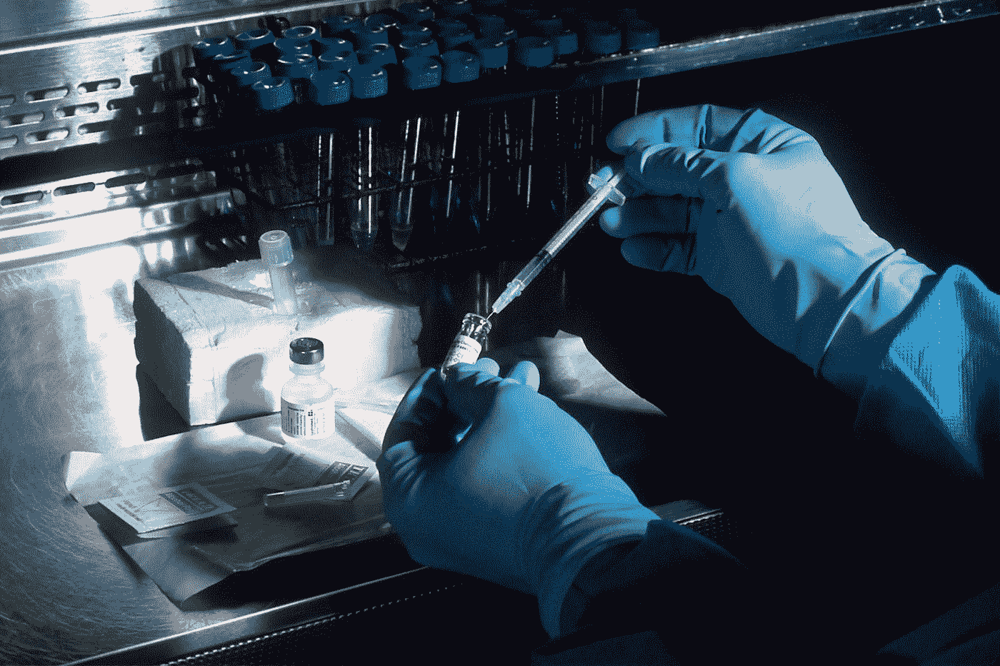

# 从新冠肺炎疫苗试验中吸取 9 个教训，提高你的 A/B 检验

> 原文：<https://towardsdatascience.com/improve-your-a-b-tests-with-9-lessons-from-the-covid-19-vaccine-trials-8e270bf157d2>

## 在线实验的实践者能从一个复杂的过程中学到什么和总结什么

[国家癌症研究所](https://unsplash.com/@nci?utm_source=medium&utm_medium=referral)在 [Unsplash](https://unsplash.com?utm_source=medium&utm_medium=referral) 上拍摄的照片

自从新冠肺炎疫苗的第一次临床试验结果出来以来，整整一年过去了。大量的随访观察数据现在正在传播，这使得关于这些试验的优缺点的一些结论成为可能。由于现代医学试验是最严格和最仔细的试验之一，它们可以作为在线试验应用的案例研究，与在线试验有更多的相似之处。

多年来，我一直在推广和实施在线 A/B 测试中的统计方法，这些方法与大多数新冠肺炎试验中使用的方法非常接近。在这里，我提供了我对这些试验给在线实验从业者带来的教训的看法。这篇文章关注的是实验的设计和相关的统计数据，并没有对我的医学或流行病学专业知识做出明确或隐含的声明。

焦点尤其集中在辉瑞和 Moderna 的试验上，一个提供了一个频繁主义者的观点，另一个则有些相反。希望它能帮助你提高自己 A/B 测试的严谨性。

*继续第一课:*

# 通过致盲防止观察者偏差

这两次审判在这一点上提供了一个很好的例子。以 Moderna 的研究方案标题[2]为例:

> *“一项 3 期、随机、分层、* ***观察者盲*** *、安慰剂对照研究，旨在评估 mRNA-1273 新型冠状病毒疫苗对 18 岁及以上成人的疗效、安全性和免疫原性”*
> 
> (强调我的)

从一开始，大多数临床试验的一个重要特性就变得显而易见，那就是消除研究中由观察者引起的偏见。观察者盲是指大多数参与实验的人员既不能获得整体结果，也不能获得部分数据。这就只剩下少数几个人——即那些确保治疗按照处方进行的人，他们是唯一能够获得关于哪个人被分配到哪个治疗的实际数据的人。这些人被排除在决策过程之外，因此知识不会影响决策过程。

DSMB(数据和安全监控委员会)是唯一可以在预先指定的时间点看到实际(非盲)结果的人。只有他们能够根据这些数据做出决策。理想情况下，DSMB 的成员不参与临床试验，并且在试验结果中的利益最小。

**如何在 A/B 测试中实施盲法原理？**盲观察者方法的一个应用示例是确保只有主要的 A/B 测试从业者可以查看完整的实际数据。其他人都可以看到一个盲版本，理想情况下只能在预先指定的时间点看到，直到实验以某种方式结束。

例如，测试结果可以用中性测试组名称表示，如“变体 A”、“变体 B”等。在数据的盲法版本中，对照组也被称为“变体”。这样做大大减少了决策链中任何人偏心或干扰测试执行的机会，只要它没有明显偏离预先约定的参数。

我们经常听到主管人员想缩短测试，而不遵守商定的监控时间表，以监控感知的有效性、缺乏有效性或无效性。虽然这种做法不会被完全抵制，但盲法至少可以防止偏向某一特定 A/B 测试变量的结果。

# 通过顺序监控，高效测试并获得可靠的结果

在这两个临床试验中，测试监测时间主要是根据评估时间(辉瑞开始后的天数)或总目标病例的百分比(Moderna)预先确定的。构建统计停止界限以确保统计误差保证成立，尽管有多个可能的数据评估。

这是 Moderna 试验协议中的内容[2]:

> *“根据 Lan-DeMets O'Brien-Fleming 近似值支出，IAs 和主要分析的主要终点的总体 I 类错误率严格控制在 2.5%(单侧)。”*

此外:

> *“在两个治疗组中，有两个计划的 ia，分别占总目标病例的 35%和 70%。IAs 的主要目的是早期发现 ve 高于 30%的可靠证据。Lan-demes O ' brien-Fleming 近似支出函数用于计算疗效界限，并相对于假设保持 IAs 和主要分析(当观察到目标病例数时)的(单侧)0.025 假阳性错误率:“其中 IAs 代表“中期分析”。*

令人耳目一新的是，即使是辉瑞-BioNtech 试验的所谓贝叶斯分析也包含在设计措施中，以防止由于中期分析而导致的错误概率膨胀[3]:

> *“最终分析使用 98.6%的成功边界作为疫苗功效大于 30%的概率，以补偿中期分析，并将总体 1 型错误率控制在 2.5%。此外，依次评估主要和次要疗效终点，以将家族性 1 型错误率控制在 2.5%。”*

这是在线 A/B 测试中贝叶斯方法的许多支持者否认是适当的或必要的，甚至吹捧它是一个巨大的好处，它不适用于贝叶斯分析。

这里的一个教训是，当延迟有益干预的分发或继续徒劳的试验存在相关成本时，**实验者可以转向对试验数据的顺序监测**，以便“尽早”做出决定(与固定样本设计相反)。根据定义，这是任何 A/B 测试的情况。

**另一个洞见是，如果要在数据收集时评估结果并采取行动**，则需要适当的统计设计，并调整由此产生的统计估计值。否则[“窥视”](https://www.analytics-toolkit.com/glossary/peeking/)发生，错误率变得膨胀，并且统计保证可能严重受损。

我支持错误开销方法和 Lan DeMets 函数族，Lan-DeMets alpha 和 beta 开销边界是在[Analytics-Toolkit.com](https://www.analytics-toolkit.com/)中实现的，因为它开始提供[顺序监控的 A/B 测试](https://www.analytics-toolkit.com/glossary/agile-a-b-test/)。

误差支出法的一个重要特征是，根据每次分析所获得的样本量，分析的时间可以有一定的灵活性，如果中期结果或其他考虑需要，分析的次数也可以调整。对于大多数在线测试来说，这几乎是必要的，因为在这些测试中，由于各种类型的冲击和季节性，每周的流量水平和事件发生率都会发生波动。

在收集测试数据时对其进行监控，即使有适当的停止界限，也会在停止测试后计算的原始估计值中引入条件和无条件偏差。因此，使用误差支出的一个不可或缺的部分是实现无条件和有条件偏倚缩减估计所需的调整，如效应大小估计、p 值和置信区间。

# 选择适当的显著性阈值

显著性阈值是统计检验必须满足的最小证据阈值，以便得出关于检验假设的结论，并在合理的不确定性水平下采取后续行动。

在一个高度监管的行业中，满足最低监管标准通常是为股东获取最大价值的方式，因此看到监管最低标准被用作事实上的标准并不奇怪。在 FDA 监测的试验中，该最小值被规定为 0.05(相当于 95%的置信水平)的双侧检验的显著性阈值。

因为结果是有方向性的，所以两个试验协议都将它们的误差保证声明为单侧α[1–4]。在 0.025 时，它们完全符合 FDA 对 0.05 双面的最低要求。

这里的一个教训是，使用单边测试没有什么特别或不寻常的。使用单尾检验和单边假设并不意味着统计检验只在真实效应是单向的情况下才有效。事实上，**有必要**根据一个片面的显著性阈值来构建误差控制，如果由此产生的推论是方向性的，例如“疫苗提供了针对感染和不良健康结果的保护”。它在样本大小和统计能力方面也更有效。

在 A/B 测试中，一个方向性声明的例子是“用户体验 A 产生了比当前更好的业务成果”。[单侧 p 值和单侧置信区间需要与这样的声明一起报告。](https://blog.analytics-toolkit.com/2017/one-tailed-two-tailed-tests-significance-ab-testing/)

回到临床研究。一方面，人们可以批评 0.025 阈值的选择过于宽松，因为假阳性的财政和健康后果太大，不能满足这一标准。另一方面，也有可能出现这样的情况:如果采用更严格的阈值，将会降低测试的功效(下一节将详细介绍)，或者需要更大的样本量，这可能会延迟对大量目标个体的益处释放，或者如果在短时间内进行测试，会使更多的个体暴露在风险中。

适当的讨论需要深入了解疫苗制造商和监管机构面临的复杂权衡，这超出了本文的范围。

我们仍然可以从中吸取教训，并将其应用到商业实验中。由于在大多数 A/B 测试场景中，人们可以计算出大多数相关成本和回报的合理估计，因此通过风险回报分析整合这些信息可以产生投资回报最佳的在线实验。这意味着无论结果如何，其样本量和显著性阈值都将实现风险和回报的最佳平衡。

# 确定所需的样本量

考虑样本大小的一种方式是作为统计功效、感兴趣的最小效应和给定显著性阈值的函数。两次试验中使用的功率水平均为 90%。然而，Moderna 试验的目标是 60%的有效率，而 BioNtech 的目标是 30%。感兴趣的最小效应的差异导致后者的样本量要求明显高于前者(约 43，548 对 30，420)。

A/B 测试的一个教训是，在其他条件相同的情况下，测试越快，就意味着越有可能错过较小幅度的有意义的实际提升。在一个典型的观察到的效应大小(更不用说实际的了)在个位数百分比的范围内，有时甚至更低的领域，检测有意义效应的能力低于 90%对于 A/B 测试程序来说是毁灭性的。这可能会导致太多的假阴性。这些都是错失的改善业务的机会，也是开发和测试工作的浪费。

这个问题是什么样的样本量或测试持续时间为一个测试是不可避免地联系在一起的选择统计显著性阈值。由于“有意义”的定义取决于样本大小/测试持续时间，因此在确定适当的测试持续时间和显著性阈值时会出现反馈循环。使用一种基于业务度量的方法来确定 ROI 最优参数是正面处理这个问题的唯一解决方案。

# 监控多个指标

两个疫苗实验都列出了许多指标(终点),包括主要疗效终点和次要疗效和安全性终点。这是一个很好的实践，因为它允许同一个实验产生一组有用的数据，而不仅仅是一个比较。

虽然通常不会对所有端点进行测试，但是**基于几个关键指标监控性能仍然是一个好的实践。**

在 A/B 测试中，这包括监控所谓的护栏指标，但也包括次要指标。某些次要 KPI 的负面结果可能会抵消主要指标的正面影响。通常，A/B 测试之后的行动将首先由主要度量标准的结果提供信息，主要度量标准本身可能是几个不同度量标准的组合。然而，当度量具有不同的预期效果窗口时，会发生什么呢？例如，就每封发送的电子邮件的销售收入而言，电子邮件活动具有良好的平均回报(短期利益)，但这会激怒其他电子邮件订户并促使他们取消订阅。根据取消认购的比例，这可能会导致长期亏损。

除了以上所述，次要指标通常可以提供对驱动主要结果的因素的进一步了解。

# 报告几个统计估计

在辉瑞-BioNtech 的 bnt162b2 和 Moderna 的 mRNA-1273 之后的报告中，共享了主要和次要终点的多个统计估计值。例如[1]:

> *“疫苗有效率为 94.1% (95% CI 为 89.3-96.8%；p<0.001)*

对于 mRNA-1273 和 bnt162 [3]:

> *“在先前有 SARS CoV-2 感染证据的参与者和没有 SARS CoV-2 感染证据的参与者中，在疫苗接受者中观察到 9 例新冠肺炎，在安慰剂接受者中观察到 169 例，对应于 94.6%的疫苗效力(95% CI，89.9 至 97.3)。”*

**一些 A/B 测试从业者只关注一个估计**——无论是效果大小(也称为百分比提升)、p 值或置信水平，还是置信区间。虽然每种方法都有其自身的优点，但从新冠肺炎疫苗试验中可以吸取的一个教训是**许多评估在平行使用时效果最好**。

关于这两个医学试验的报道，有必要说几句。Moderna 应该报告准确的 P 值，而不仅仅是“P<0.001”，因为这将传达更多的信息。尽管辉瑞承诺在其统计设计中进行 I 型误差控制，但遗憾的是，辉瑞选择忽略报告与其相关的最具信息性的测量(观察到的 p 值)。然而，可以从 CI 中推断出，它很可能接近 Moderna。

在我看来，两者都应该报告用来计算 P 值的零假设，以帮助避免可能的误解，例如，“(P = 0.0006H0: VE <= 30%)”，基于“对于主要终点的分析，该试验是为 mRNA-1273 疫苗的功效为 30%或更低的无效假设而设计的。”值得赞扬的是，这一点在统计分析部分单独陈述。

# 最大限度地提高样本的代表性

辉瑞和 Moderna 的实验都有仔细的纳入标准，旨在涵盖最有可能在实验后阶段经历治疗的人群，从而确保结果的代表性。

辉瑞在几个不同的国家招募参与者，这意味着结果应该更容易跨国传播。Moderna 的试验仅限于美国(据我所知)，这意味着可能会出现潜在的外部有效性问题。

Moderna 也有一个分层标准，确保实验将包括一定比例的疫苗所针对的关键人口统计数据(按年龄和风险状况)。当需要对结果进行分析并对特定亚人群采取行动时，这是有保证的，否则最终的样本量会导致具有高度不确定性的估计。

观察之间的时间间隔足够长，即使试验提前停止，也能让短期效应显现出来。长期的负面结果将被监测，即使试验在中期分析时被停止，以说明可能存在的问题。

**在在线 A/B 测试中，可以通过平滑与时间相关的偏差和抑制任何学习效应来提高代表性**。这是通过以避免一些与时间相关的偏差的方式来间隔分析，以及通过运行更长时间的测试来实现的。例如，可能的一周中的某一天的影响可以通过每周或更长时间的分析来避免，而运行更长时间的测试是解决这两种学习影响的主要方法。

一般来说，避开统计计划是一个好主意，因为面对过大的观察效应，统计计划可能会在几天内结束测试。

关于地理和文化的有效性问题，我建议不要在一个国家进行测试，然后将结果解释为适用于全世界，无论是积极的还是消极的。如果企业对具有不同关键特征的市场感兴趣，那么在实施变革之前，最好对每个市场进行一次实验。

# 随着时间的推移，即使是最严格的结果，其变化也可能是毁灭性的

新冠肺炎试验的这个教训与上面讨论的测试结果的外部有效性密切相关，有一个微小但重要的转折。即使我们假设一个完美的测试设计和执行，并且在进行实验的时候没有普遍性的问题，这样的问题也可能在未来的任何时候出现。

虽然我不知道疫苗试验的情况是否如此，但通过观察研究和进一步的实验研究，很明显，病毒突变、病毒繁殖率、卫生政策等变化导致了疫苗在预防疾病甚至可能预防严重疾病和致命后果方面的预期和观察效力之间的差异。简而言之，即使有非常可靠的实验，将一个环境的结果应用到另一个环境也是一件危险的事情。

**可悲的是，即使是最好的 A/B 测试的结果也存在类似的威胁。**

这种威胁源于这样一个事实，即人类行为可以而且确实会随着时间的推移而改变，有时会突然而显著地改变。在在线 A/B 测试中，这些变化的风险来自整体技术环境、竞争对手的行动、设计和 UX 范式的转变、不断变化的经济条件、不断变化的法律法规等。

# 将清晰的行动与每个可能的结果联系起来

最后，也是最重要的一点，每一个实验都应该有一套明确的行动来遵循其可能的结果。辉瑞和 Moderna 试验以及大多数大型现代临床试验都是如此。虽然可能会有关于实验执行的不同方面以及如何解释某个数据的争论，但一旦这些问题得到解决，从那里到具体行动的道路在实验获得批准之前就已经基本确定了。

在商业测试中，经常会听到一个进行得很好的实验，结果非常令人信服，却被一只河马抛弃。为了尽可能地避免这种情况，如果测试已经通过了某些检查并达到了阈值，那么应该**获得不同行动过程**的预批准，例如“实现副本更改”。

应该注意的是，这并不意味着“应该盲目地遵循数字”，而是对于要进行的实验来说，在测试开始之前，从整体上来看**，所有经过测试的变体都应该被认为是实施的良好候选。如果不是，那么他们首先就没有被测试的地方。**

# 结论

我们对医学研究领域的短暂探索到此结束。虽然不是对疫苗试验设计的详尽检查，但提出的要点有望帮助你提高 A/B 测试水平。

## 参考

[1] Baden 等人 2020，“mRNA-1273 新型冠状病毒疫苗的有效性和安全性”，《新英格兰医学杂志》384(5):403–416，doi:10.1056/nejmoa 2035389
[2]Moderna 方案 mRNA-1273-P301，“一项评估成人 mRNA-1273 新型冠状病毒疫苗的有效性、安全性和免疫原性的 3 期随机、分层、观察者盲、安慰剂对照研究 一项 1/2/3 期、安慰剂对照、随机、观察者盲、剂量发现研究，用于评估 SARS-COV-2 RNA 候选疫苗在健康个体中抗新冠肺炎病毒的安全性、耐受性、免疫原性和有效性

## 关于作者

格奥尔吉·格奥尔杰夫

Georgi 是 Web Focus 的管理所有者和 Analytics-toolkit.com 的创建者，他在在线营销、网络分析、统计和为数百个网站设计商业实验方面拥有 17 年的经验。

他是《在线 A/B 测试中的统计方法》一书和 A/B 测试统计分析白皮书的作者，也是数十个会议、研讨会和课程的讲师，包括 Google 区域培训师。

*原载于 2022 年 1 月 12 日*[*【https://blog.analytics-toolkit.com】*](https://blog.analytics-toolkit.com/2022/improve-your-a-b-tests-with-9-lessons-from-the-covid-19-vaccine-trials/)*。*