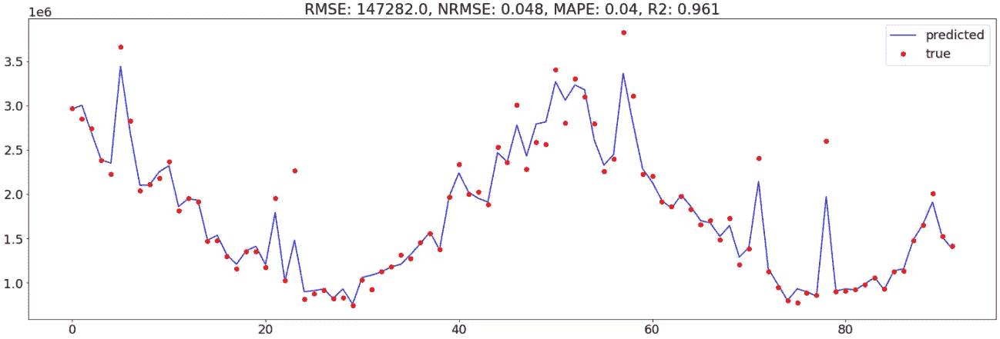
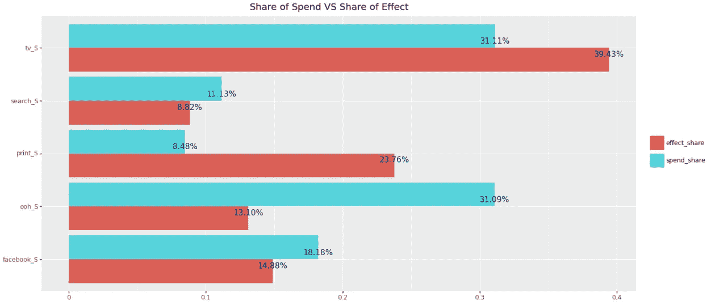
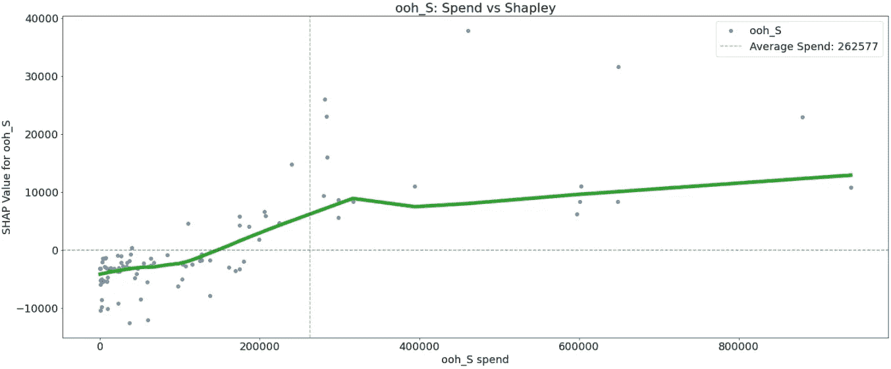
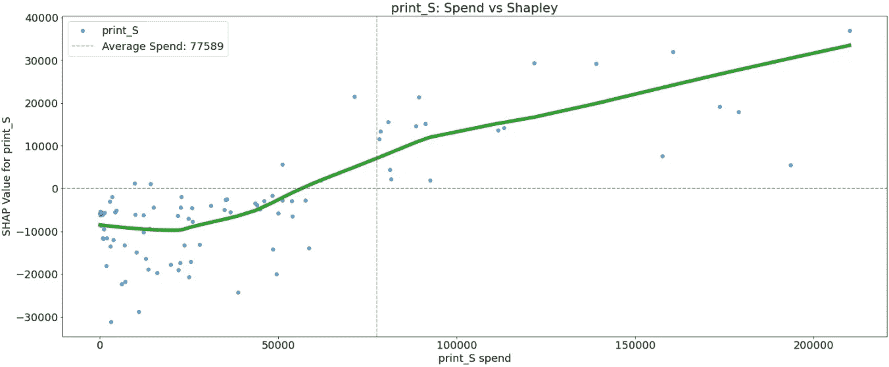

# 使用机器学习方法改进营销组合建模

> 原文：<https://towardsdatascience.com/improving-marketing-mix-modeling-using-machine-learning-approaches-25ea4cd6994b>

## 使用基于树的集合构建 MMM 模型，并使用 SHAP 解释媒体通道性能


[阿德里安·匡威](https://unsplash.com/@adrienconverse?utm_source=unsplash&utm_medium=referral&utm_content=creditCopyText)在 [Unsplash](https://unsplash.com/s/photos/blue-mixture?utm_source=unsplash&utm_medium=referral&utm_content=creditCopyText) 上的照片

T 有许多方法可以建立营销组合模型(MMM ),但通常来说，由于其简单的可解释性，它可以归结为使用线性回归。更复杂的非线性模型的可解释性是过去 5-6 年的研究主题，因为在机器学习社区中提出了[时间](https://github.com/marcotcr/lime)或 [SHAP](https://shap.readthedocs.io/en/latest/index.html) 这样的概念来解释模型的输出。然而，这些新概念在营销归因领域似乎几乎无人知晓。在本文中，我继续研究营销组合建模的实用方法，使用随机森林构建基于树的集合，并使用 SHAP 概念解释媒体渠道绩效。

在我的上一篇文章中，我使用贝叶斯编程建立了一个营销组合模型，并将结果与 Robyn 框架进行了比较。我的主要兴趣是调查这两种方法是否具有可比性，在讲故事时是否一致。由于 Robyn 生成了多个解决方案，我能够找到一个与贝叶斯解决方案一致的解决方案，即两个模型的效果份额始终高于或低于每个渠道的支出份额。百分比差异可归因于方法的差异和模型很好地拟合数据的能力。然而，这两种方法的共同点是都描述了媒体支出和回应之间的线性关系，因此无法捕捉更复杂的变量关系，如互动。

[](/modeling-marketing-mix-using-pymc3-ba18dd9e6e68) [## 使用 PyMC3 建模营销组合

### 实验先验，数据规范化，并比较贝叶斯建模与罗宾，脸书的开源 MMM…

towardsdatascience.com](/modeling-marketing-mix-using-pymc3-ba18dd9e6e68) 

我能找到的在营销组合建模中使用更复杂算法的第一个商业概念证明之一是由 [H2O.ai](https://h2o.ai/resources/white-paper/the-benefits-of-budget-allocation-with-ai-driven-marketing-mix-models/) 描述的，如梯度推进机(GBM)和 SHAP。

我总结了转向更复杂算法背后的主要动机:

*   线性回归等经典方法具有挑战性，需要时间和专业知识来识别适当的模型结构，如变量相关性、相互作用或非线性关系。在某些情况下，应该移除高度相关的特征。交互变量应该被明确地设计。不同的转换应该明确地引入像饱和和收益递减这样的非线性。
*   为了更容易的模型可解释性，牺牲了一些模型结构，这可能导致较差的模型性能。
*   更复杂的机器学习算法，如基于树的集成，在存在高度相关的变量时工作良好，可以捕捉变量之间的交互，是非线性的，并且通常更准确。

SHAP 对于模型解释背后的细节在很多[文章](https://proceedings.neurips.cc/paper/2017/file/8a20a8621978632d76c43dfd28b67767-Paper.pdf)和[书籍](https://christophm.github.io/interpretable-ml-book/shapley.html)里都有解释。我将 SHAP 背后的主要直觉总结如下:

> SHAP(SHapley Additive explaints)是一种解释任何机器学习模型输出的博弈论方法。它将最优信用分配与使用博弈论及其相关扩展的经典 Shapley 值的本地解释联系起来

*   SHAP 是一种解释个体预测的方法，并回答了问题*每个特征对这个预测有多大贡献*
*   SHAP 值是特征重要性的度量
*   SHAP 值可以是负的也可以是正的，并显示相对于所有预测平均值的预测量。绝对量值表示特定个体预测的特征强度
*   每个特征的 SHAP 值的绝对值的平均值表示该特征的全局重要性
*   在某种程度上，SHAP 特征重要性可以替代排列特征重要性。与 SHAP 相反，排列特征重要性基于模型性能的整体下降。

MMM 转向更复杂模型的最大挑战是缺乏解释单个媒体渠道影响的工具。虽然机器学习社区正在广泛使用像 SHAP 这样的模型可解释性方法，这是由数百篇论文和会议讨论提出的，但在 MMM 上下文中找到 SHAP 用法的例子仍然非常困难。这篇[精彩的文章](/explainable-ai-application-of-shapely-values-in-marketing-analytics-57b716fc9d1f)将 MMM 与 SHAP 联系起来，并解释了我们如何解读营销组合的结果。受这篇文章的启发，我写了一个几乎通用的解决方案来模拟营销组合，结合 Robyn 的趋势和季节性分解方法的思想，使用随机森林估计器(可以很容易地改变为其他算法)，并使用 [Optuna](https://optuna.org) (超参数优化框架)优化 adstock 和模型特定的参数。该解决方案允许在 MMM 中通常使用的单目标优化和 Robyn 使用的多目标优化之间切换。

# 数据

在我的第一篇文章中，我继续使用由 [Robyn](https://github.com/facebookexperimental/Robyn) 在麻省理工学院许可下提供的数据集进行一致性和基准测试，并通过应用 Prophet 来分解趋势、季节性和假日，遵循相同的数据准备步骤。

该数据集包含 208 周的收入(从 2015 年 11 月 23 日到 2019 年 11 月 11 日),包括:

*   5 个媒体消费渠道:电视、网络、印刷品、facebook、搜索
*   2 个也有曝光信息(印象，点击)的媒体渠道:facebook_I，search_clicks_P(本文未使用)
*   无支出有机媒体:时事通讯
*   控制变量:事件、节假日、竞争对手销售额(competitor_sales_B **)**

分析窗口为 2016 年 11 月 21 日至 2018 年 8 月 20 日的 92 周。

# 库存/结转效应

不考虑建模算法，广告素材在 MMM 中起着重要的作用。因此，我们必须决定我们要试验哪种 adstock，以及对于每个媒体频道，它可能具有的最小和最大值是什么(请参考我的[以前的文章](/modeling-marketing-mix-using-pymc3-ba18dd9e6e68)以了解各种 adstock 功能的概述)。优化算法将尝试定义值范围内的每个 adstock 值，以找到最小化优化标准的最佳值。

我正在使用 scikit 中实现的几何 adstock 函数，如下所示:

```
from sklearn.base import BaseEstimator, TransformerMixin
from sklearn.utils import check_array
from sklearn.utils.validation import check_is_fittedclass AdstockGeometric(BaseEstimator, TransformerMixin):
    def __init__(self, alpha=0.5):
        self.alpha = alpha

    def fit(self, X, y=None):
        X = check_array(X)
        self._check_n_features(X, reset=True)
        return self

    def transform(self, X: np.ndarray):
        check_is_fitted(self)
        X = check_array(X)
        self._check_n_features(X, reset=False)
        x_decayed = np.zeros_like(X)
        x_decayed[0] = X[0]

        for xi in range(1, len(x_decayed)):
            x_decayed[xi] = X[xi] + self.alpha* x_decayed[xi - 1]
        return x_decayed
```

# 收益递减/饱和效应

我已经提到过，线性模型无法捕捉不同水平的广告支出和结果之间的非线性关系。因此，在建模之前，对媒体信道应用了各种非线性变换，例如[幂、负指数](https://analyticsartist.wordpress.com/2015/03/08/advertising-diminishing-returns-saturation/)和[山](https://static.googleusercontent.com/media/research.google.com/en//pubs/archive/46001.pdf)。

基于树的算法能够捕捉非线性。因此，我没有明确地应用任何非线性变换，而是让模型自己学习非线性。

# **造型**

建模由几个步骤组成:

**Adstock 参数**

广告能有多长时间的效果取决于媒体渠道。因为我们正在寻找一个最佳的吸附衰变率，我们必须对参数的可能范围持现实态度。例如，众所周知，电视广告可能具有持久的效果，而印刷广告具有较短的效果。因此，我们必须灵活地为每个媒体通道定义现实的超参数。在这个例子中，我使用 Robyn 在他们的演示文件中提出的精确范围。

```
adstock_features_params = {}
adstock_features_params["tv_S_adstock"] = (0.3, 0.8)
adstock_features_params["ooh_S_adstock"] = (0.1, 0.4)
adstock_features_params["print_S_adstock"] = (0.1, 0.4)
adstock_features_params["facebook_S_adstock"] = (0.0, 0.4)
adstock_features_params["search_S_adstock"] = (0.0, 0.3)
adstock_features_params["newsletter_adstock"] = (0.1, 0.4)
```

**时间序列交叉验证**

我们希望找到能很好地概括未知数据的参数。我们必须将数据分成训练集和测试集。由于我们的数据代表了时间线上发生的支出和收入，我们必须应用时间序列交叉验证，以便训练集只包含测试集中事件之前发生的事件。

机器学习算法在对大量数据进行训练时效果最佳。随机森林算法也不例外，为了捕捉变量之间的非线性和相互作用，应该对大量数据进行训练。正如我前面提到的，我们总共只有 208 个数据点，在分析窗口中有 92 个数据点。我们需要在泛化能力和模型的学习能力之间做一些权衡。

经过一些实验，我决定通过分配 20 周的数据(大约 10%)作为测试集来使用 3 个 cv-splits。

```
from sklearn.model_selection import TimeSeriesSplit
tscv = TimeSeriesSplit(n_splits=3, test_size = 20)
```

每个连续的训练集分裂都比前一个大。

```
tscv = TimeSeriesSplit(n_splits=3, test_size = 20)
for train_index, test_index in tscv.split(data):
    print(f"train size: {len(train_index)}, test size: {len(test_index)}")#train size: 148, test size: 20
#train size: 168, test size: 20
#train size: 188, test size: 20
```

**使用 Optuna 优化超参数**

超参数优化由大量实验或试验组成。每次审判大致可以分为三步。

*   使用一组 adstock 参数在媒体频道上应用 adstock 变换

```
for **feature** in **adstock_features**:
  adstock_param = f"{feature}_adstock"
  min_, max_ = adstock_features_params[adstock_param]
  **adstock_alpha** = trial.suggest_uniform(f"adstock_alpha_{feature}", min_, max_)
  adstock_alphas[feature] = adstock_alpha

  #adstock transformation
  x_feature = data[feature].values.reshape(-1, 1)
  temp_adstock = **AdstockGeometric**(alpha = adstock_alpha).fit_transform(x_feature)
  data_temp[feature] = temp_adstock
```

*   为 [**随机森林**](https://scikit-learn.org/stable/modules/generated/sklearn.ensemble.RandomForestRegressor.html) 定义一组建模参数。

```
#Random Forest parameters
n_estimators = trial.suggest_int("n_estimators", 5, 100)
min_samples_leaf = trial.suggest_int('min_samples_leaf', 1, 20)
min_samples_split = trial.suggest_int('min_samples_split', 2, 20)
max_depth = trial.suggest_int("max_depth", 4,7)
ccp_alpha = trial.suggest_uniform("ccp_alpha", 0, 0.3)
bootstrap = trial.suggest_categorical("bootstrap", [False, True])
criterion = trial.suggest_categorical("criterion",["squared_error"])
```

*   交叉验证并测量所有测试集的平均误差

```
for train_index, test_index in **tscv.split**(data_temp):
 **x_train** = data_temp.iloc[train_index][**features**]
 **y_train** =  data_temp[target].values[train_index]

 **x_test** = data_temp.iloc[test_index][features]
 **y_test** = data_temp[target].values[test_index]

 #apply Random Forest
 **params** = {"n_estimators": n_estimators, 
           "min_samples_leaf":min_samples_leaf, 
           "min_samples_split" : min_samples_split,
           "max_depth" : max_depth, 
           "ccp_alpha" : ccp_alpha, 
           "bootstrap" : bootstrap, 
           "criterion" : criterion
           }

 #train a model      
 rf = **RandomForestRegressor**(random_state=0, **params)
 rf.**fit**(x_train, y_train)

 #predict test set
 prediction = rf.**predict**(x_test)

 #RMSE error metric       
 rmse = **mean_squared_error**(y_true = y_test, y_pred = prediction, squared = False)

 #collect errors for each fold
 scores.**append**(rmse)#finally return the average of the cv error
**return np.mean(scores)**
```

每次试验都将 adstock、模型参数和误差度量作为用户属性返回。这允许在最佳试验中容易地检索参数。

```
trial.set_user_attr("scores", scores)
trial.set_user_attr("params", params)
trial.set_user_attr("adstock_alphas", adstock_alphas)
```

开始优化的主要函数是 *optuna_optimize。*它返回包含所有试验的 Optuna [研究](https://optuna.readthedocs.io/en/stable/reference/generated/optuna.study.Study.html)对象，包括最佳试验(具有最小的平均 RMSE 误差)

```
tscv = TimeSeriesSplit(n_splits=3, test_size = 20)adstock_features_params = {}
adstock_features_params["tv_S_adstock"] = (0.3, 0.8)
adstock_features_params["ooh_S_adstock"] = (0.1, 0.4)
adstock_features_params["print_S_adstock"] = (0.1, 0.4)
adstock_features_params["facebook_S_adstock"] = (0.0, 0.4)
adstock_features_params["search_S_adstock"] = (0.0, 0.3)
adstock_features_params["newsletter_adstock"] = (0.1, 0.4)OPTUNA_TRIALS = 2000#experiment is an optuna study object
experiment = **optuna_optimize**(**trials** = OPTUNA_TRIALS, 
                             **data** = data, 
                             **target** = target, 
                             **features** = features, 
                             **adstock_features** = media_channels + organic_channels, 
                             adstock_features_params = adstock_features_params, 
                             **media_features**=media_channels, 
                             **tscv** = tscv, 
                             is_multiobjective=False)
```

最佳试验各折的 RMSE 分数:

```
experiment.best_trial.user_attrs["scores"]#[162390.01010327024, 114089.35799374945, 79415.8649240292]
```

对应于最佳试验的 Adstock 参数:

```
experiment.best_trial.user_attrs["adstock_alphas"]#{'tv_S': 0.5343389820427953,
# 'ooh_S': 0.21179063584028718,
# 'print_S': 0.27877433150946473,
# 'facebook_S': 0.3447366707231967,
# 'search_S': 0.11609804659096469,
# 'newsletter': 0.2559060243894163}
```

对应于最佳试验的模型参数:

```
experiment.best_trial.user_attrs["params"]#{'n_estimators': 17,
# 'min_samples_leaf': 2,
# 'min_samples_split': 4,
# 'max_depth': 7,
# 'ccp_alpha': 0.19951653203058856,
# 'bootstrap': True,
# 'criterion': 'squared_error'}
```

**最终型号**

我通过提供分析的开始和结束时段，使用优化的参数构建最终模型。该模型首先基于截至分析期结束时的所有数据。仅检索分析期间的预测值和 SHAP 值。

```
**best_params** = experiment.best_trial.user_attrs["params"]
**adstock_params** = experiment.best_trial.user_attrs["adstock_alphas"]
result = **model_refit**(data = data, 
                     target = target,
                     features = features, 
                     media_channels = media_channels, 
                     organic_channels = organic_channels, 
                     model_params = best_params, 
                     adstock_params = adstock_params, 
                     **start_index** = START_ANALYSIS_INDEX, 
                     **end_index** = END_ANALYSIS_INDEX)
```

# 结果

要检查的第一个图是模型与 92 周分析期数据的拟合程度:



作者图片

与[贝叶斯方法](/modeling-marketing-mix-using-pymc3-ba18dd9e6e68)相比，MAPE 提高了 40%，NRMSE 提高了 17%。

接下来，让我们绘制支出份额与效果份额的对比图:



作者图片

使用分析间隔内每个媒体通道的 SHAP 值的绝对和来计算效果份额，并通过所有媒体通道的 SHAP 值的总和来归一化。

效果份额与[上一篇](/modeling-marketing-mix-using-pymc3-ba18dd9e6e68)的效果份额几乎一致。我观察到在*搜索*频道的效果份额之间只有一个不一致。

**收益递减/饱和效应**

我没有应用任何非线性转换来明确地模拟收益递减。所以让我们来看看随机森林是否能捕捉到任何非线性。

这是通过散点图实现的，散点图显示了单个媒体渠道对模型所做预测的影响，其中 x 轴是媒体支出，y 轴是该媒体渠道的 SHAP 值，它表示知道特定支出会在多大程度上改变该特定预测的模型输出。水平线对应于 SHAP 值 0。垂直线对应于渠道中的平均花费。绿线是一条较低的平滑曲线。



纵观所有媒体渠道，我们可以看到，更高的支出与收入的增加相关联。但是这种关系并不总是线性的。

以 *print_S* 为例，我们可以观察到支出达到 25K 时收入略有下降。然后它开始增加到大约 90K，在那里收入的增加减慢。

以 facebook_S 为例，我们可以观察到花费高达 9 万英镑和超过 25 万英镑的收入几乎没有变化。9 万到 25 万之间的花费可能是最理想的花费。

一些媒体渠道如 *facebook_S，print_S，和 search_S* 对于同样的花费，SHAP 值之间有很大的差异。这可以通过与其他媒体渠道的互动来解释，应该进一步调查。

# 多目标优化

这个解决方案可以管理多目标优化。这个想法来自 Robyn，他引入了第二个优化指标 RSSD(分解均方根距离)

> *距离说明了花费份额和渠道的系数分解份额之间的关系。如果距离太远，其结果可能太不现实——例如，花费最小的媒体活动获得最大的效果*

在多目标优化的情况下，所谓的 Pareto 前沿，即所有最优解的集合，将由 Optuna 确定。该过程将与单个优化情况相同:对于属于 Pareto 前沿的每个模型，我们检索其参数，构建最终模型并可视化结果。
在下图中，所有带红色的点都属于最优集合。


作者图片

# 结论

在这篇文章中，我继续探索通过使用更复杂的算法来改进营销组合模型的方法，这些算法能够捕捉非线性和可变的交互。结果，通过省略非线性变换步骤，简化了整个流水线，当使用线性回归时，总是应用非线性变换步骤。使用 SHAP 值可以进一步分析效应份额和反应曲线。我的第二个目标是在不同的方法之间达到一致的结果。我使用贝叶斯建模的[上一篇文章](/modeling-marketing-mix-using-pymc3-ba18dd9e6e68)的结果与本文的结果之间的比较显示，每个媒体频道的分解效果具有高度的一致性。

完整的代码可以从我的 [Github repo](https://github.com/slavakx/medium_posts) 下载

感谢阅读！