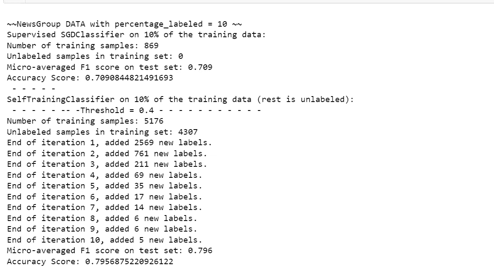
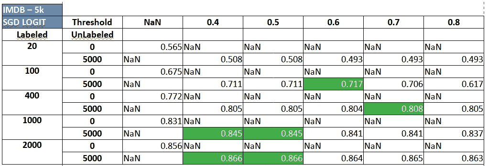
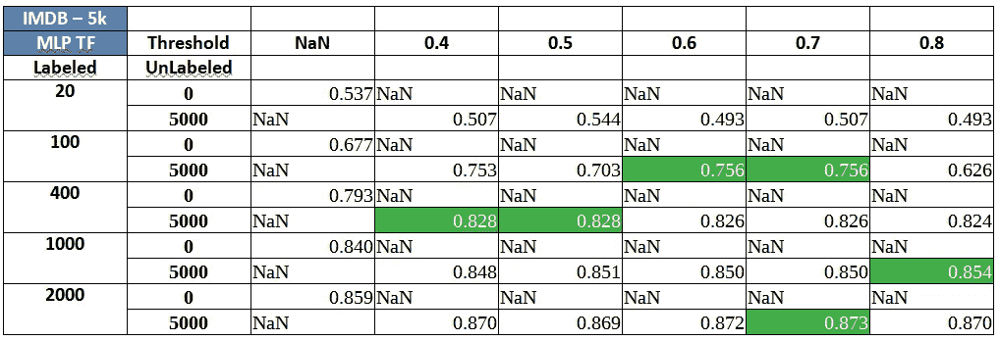

# 使用半监督包装器方法提高模型性能

> 原文：<https://towardsdatascience.com/improving-model-performance-using-semi-supervised-wrapper-methods-31d8712ca20>

## 使用 Python 实施和验证自我培训的实践指南

桑德·韦特林在 [Unsplash](https://unsplash.com?utm_source=medium&utm_medium=referral) 拍摄的照片

半监督学习是机器学习领域中一个活跃的研究领域。它通常用于通过利用大量未标记的数据(即输入或特征可用但基础事实或实际输出值未知的观察值)来提高监督学习问题的概化能力(即基于提供的输入和基础事实或每个观察值的实际输出值来训练模型)。在标记数据的可用性有限的情况下，这通常是一种有效的策略。

半监督学习可以通过各种技术来执行。其中一个技巧就是自我训练。你可以参考[第一部分](https://medium.com/@naveen.rathani/improve-your-models-performance-with-unlabeled-data-d6e78a57fadb)了解它的详细工作原理。简而言之，它充当一个包装器，可以集成在任何预测算法之上(能够通过预测函数生成输出分数)。原始监督模型预测未标记的观察值，并且反馈该模型的最有把握的预测，用于重新训练监督模型。这个迭代过程有望改进监督模型。

首先，我们将设置几个实验来创建和比较基线模型，这些模型将在常规 ML 算法的基础上使用自我训练。

**实验设置**

虽然半监督学习对于所有形式的数据都是可能的，但文本和非结构化数据是最耗时和最昂贵的标记。一些例子包括根据意图对电子邮件进行分类，预测电子邮件对话中的滥用或不当行为，在没有许多标签的情况下对长文档进行分类。预期的唯一标签数量越多，使用有限的标签数据就越困难。因此，我们选取了以下 2 个数据集(从分类角度看，以复杂性递增的顺序排列):

[IMDB 评论](https://ai.stanford.edu/~amaas/data/sentiment/)数据:由斯坦福主持，这是一个电影评论的情感(二元-正面和负面)分类数据集。请参考[此处](https://ai.stanford.edu/~amaas/data/sentiment/)了解更多详情。

20Newsgroup 数据集:这是一个多类分类数据集，其中每个观察都是一篇新闻文章，并标有一个新闻主题(政治、体育、宗教等)。这些数据也可以通过开源库 [scikit-learn](http://scikit-learn.org/stable/modules/generated/sklearn.datasets.fetch_20newsgroups.html) 获得。关于这个数据集的更多细节可以在[这里](http://qwone.com/~jason/20Newsgroups/)阅读。

使用这两个数据集在不同的标记观察量下进行多个实验，以获得通用的性能估计。在这篇文章的最后，我们提供了一个对比来分析和回答以下问题:

1.  自我训练对两种算法都有效且一致吗？
2.  自我训练对二元和多类分类问题都适用吗？
3.  随着我们添加更多的标签数据，自我训练会继续增值吗？
4.  添加更大量的未标记数据会继续提高模型性能吗？

这两个数据集都可以从上面提供的各自来源下载，或者从 [Google Drive](https://drive.google.com/drive/folders/1MHAkH5hyTVCe9Q7ujdmzVfZtEmD6AzIa) 下载。所有代码都可以从 [GitHub](https://github.com/abhinivesh-s/Semi-Supervised-Text) 中引用。一切都是用 Python 3.7 在 Google Colab 和 Google Colab Pro 上实现的。

为了评估每个算法在两个数据集上的表现，我们获取了多个标记数据样本(从少量到大量的标记数据)并相应地应用自我训练。

**理解输入**

新闻组训练数据集提供了 20 个类别的 11，314 个观察结果。我们由此创建了一个 25%的带标签的测试数据集(大约 2800 条观察结果)，并将剩余的随机分为带标签的(大约 4200 条观察结果被认为带有新闻组标签)和不带标签的(大约 4300 条观察结果被认为不带新闻组标签)。在每个实验中，考虑该标记数据的一部分(从标记训练量的 20%开始，直到 100%)，以查看训练中标记观察量的增加是否导致表现饱和(对于自我训练)。

对于 IMDB 数据集，考虑两个训练批次:(1)使用 2000 个未标记的观察值和(2)5000 个未标记的观察值。使用的标记观察值为 20、100、400、1000、2000。同样，假设仍然是增加标记观察的数量，将减少监督学习者和半监督学习者之间的性能差距。

**实现自我训练和伪标签的概念**

每个监督算法都在 IMDB 电影评论情感数据集和 20 个新闻组数据集上运行。对于这两个数据集，我们正在为分类问题建模(前一种情况下为二元分类，后一种情况下为多类)。每个算法都在 5 个不同级别的标记数据上进行性能测试，从非常低(每类大约 20 个标记样本)到高(每类 1000 多个标记样本)。

在本文中，我们将对几个算法进行自我训练——逻辑回归(通过 [sklearn 使用对数损失目标实现 sgd 分类器](http://scikit-learn.org/stable/modules/generated/sklearn.linear_model.SGDClassifier.html))和香草神经网络(通过 [sklearn 实现多层感知器模块](https://scikit-learn.org/stable/modules/generated/sklearn.neural_network.MLPClassifier.html))。

我们已经讨论过自我训练是一种包装方法。这可直接从 sklearn 获得，用于 sklearn 的 model.fit()方法，并作为 [sklearn.semi_supervised 模块](http://scikit-learn.org/stable/modules/generated/sklearn.semi_supervised.SelfTrainingClassifier.html)的一部分。对于非 sklearn 方法，我们首先创建包装器，然后将其传递给 pytorch 或 Tensorflow 模型。稍后会详细介绍。

让我们从读取数据集开始:

读取新闻组数据集

读取 IMDB 数据集

让我们也创建一个简单的管道来调用监督 sgd 分类器和使用 sgd 作为基本算法的自我训练分类器。

**Tf-Idf — logit 分类**

上面的代码很容易理解，但是让我们快速分解一下:

*   首先，我们导入所需的库，并使用几个超参数来建立逻辑回归(正则化 alpha，正则化类型为 ridge，损失函数在本例中为 log loss)。
*   接下来，我们提供计数向量器参数，其中 n_grams 由最少 1 个单词和最多 2 个标记组成。不考虑出现在少于 5 个文档或超过 80%的语料库中的 Ngrams。tf-idf 转换器获取计数矢量器的输出，并创建每个文档单词的文本的 tf-idf 矩阵作为模型的特征。你可以分别在这里和这里阅读更多关于计数矢量器和 tf-idf 矢量器[的信息。](https://scikit-learn.org/stable/modules/generated/sklearn.feature_extraction.text.CountVectorizer.html)
*   然后，我们定义一个空数据帧(在本例中为 df_sgd_ng ),它存储所有性能指标以及所使用的已标记和未标记卷的信息。
*   接下来，在 n_list 中，我们定义了 5 个级别来定义按标记传递的训练数据的百分比(从 10%到 50%，增量为 10%)。类似地，我们定义了两个要迭代的参数列表(kbest 和 threshold)。通常，训练算法提供每个观察的概率估计。估计值高于阈值的观察值被该迭代中的自训练视为伪标签传递给训练方法。如果阈值不可用，则可以使用 kbest 来建议应该考虑将基于其值的前 N 个观察值作为伪标签传递。
*   接下来是通常的训练测试分割。在此之后，使用屏蔽向量，通过首先将 50%的数据保持为未标记的来构建训练数据，并且在剩余的 50%的数据中，使用 n_list，标记的量被认为是递增的(即，在每次后续运行中递增地添加总标记数据的 1/5，直到使用了所有的标记数据)。同样标记的训练数据每次也独立地用于常规的监督学习。

为了训练分类器，构建了一个简单的管道:从(1)计数矢量器开始创建标记，然后是(2) TfIdf 变换器，使用 term_freq*Inverse_doc_freq 计算将标记转换为有意义的特征。随后是(3)将分类器拟合到 TfIdf 值矩阵。

Python 3.8 上的基本监督管道。作者图片

其他一切保持不变，创建并调用自训练的管道，而不是直接拟合分类器，它被包装到 SelfTrainingClassifier()中，如下所示:

Python 3.8 上的基本半监督管道。作者图片

最后，对于每种类型的分类器，通过对*eval _ and _ print _ metrics _ df()*的函数调用，在测试数据集上评估结果

Python 3.8 上的模型评估模块。作者图片

下图显示了在运行监督分类后再运行自训练分类时控制台输出的样子:

在 Python 3.8 上运行的 SGD 监督和半监督管道的控制台输出。作者图片

**Tf-Idf — MLP 分类**

MLP 分类器(即普通的前馈神经网络)的自训练以完全相同的方式进行，唯一的区别在于分类器的超参数及其调用。

注意:scikit-learn 实现的 MLP 是一个非 GPU 实现，因此具有非常密集的层或深度网络的大型数据集的训练将非常慢。上面是一个更简单的设置(2 个隐藏层，100 和 50 个神经元，max_iter=25)来测试自我训练的可推广性。在[第三部分](https://medium.com/@abhiniveshsreepada96/experiences-with-sota-semi-supervised-learning-nlp-algorithms-on-different-public-datasets-a368132ed6f)，我们将利用 Tensorflow 和 Pytorch 在 Google Colab Pro 上使用 GPU 支持来实现所有基于 ann、CNN、rnn 和 transformers 的自我训练。

对于 MLP，第一个控制台输出如下所示:

Python 3.8 上运行的 MLP 监督和半监督管道的控制台输出。作者图片

上面的控制台输出表明，在首先运行监督分类器时，模型适合 10%的训练数据(如标签所示)。这种分类器在测试数据上的性能是 0.65 微 F1 和 0.649 准确度。在用除了现有标记体积之外的 4，307 个未标记样本开始自训练时，如果未标记观测值的伪标记对于任何一个类的输出概率至少与阈值一样高(在这种情况下为 0.4)，则它们将被推送用于训练的下一次迭代【仅 。在第一次迭代中，为分类器的第二次训练，将 3，708 个伪标签添加到 869 个标记的观察值中。在随后的预测中，添加另外 497 个伪标签，依此类推，直到不能再添加伪标签。

为了使比较指标一致，我们在这里创建了一个简单的实用程序。这需要训练和测试数据集以及拟合的分类器(根据我们在评估步骤中是使用监督学习还是半监督学习而变化)，以及在半监督学习的情况下，我们是使用阈值还是 kbest(当不可能像朴素贝叶斯或 SVM 那样直接输出概率时)。此函数创建了一个性能字典(微平均 F1 和准确度)，包括不同级别的标记和未标记音量，以及阈值或 kbest(如果使用)信息。这个字典被附加到整体性能数据帧中(就像早期 Github gists 中显示的 *df_mlp_ng* 和 *df_sgd_ng* )。

最后，让我们看看完整长度的比较输出，并认识到当在不同阈值下用自我训练考虑不同量的标记观察时，我们迄今为止已经发现了什么。

用新闻组数据集进行自我训练前后逻辑回归的准确性。作者图片

逻辑回归的上表可以解释如下:

我们从 5 种大小的标记数据集开始(869、1695 等等，直到 4178)。使用标记数据的每次迭代，我们首先训练监督分类器模型，并记录测试数据上的模型性能(阈值列= NaN 的精度数)。在同一次迭代中，我们继续添加 4，307 个未标记数据的样本。生成的伪标签被选择性地传递到监督分类器中，但是只有当它们超过预先确定的概率阈值时。在我们的实验中，我们使用 5 个等间距的阈值(0.4 到 0.8，步长为 0.1)。基于自训练的各个阈值的精度反映在每个标记体积迭代中。在大多数情况下，可以看出，使用未标记的数据会导致性能提高(但是，一般来说，随着标记量的增加，自训练以及一般来说其他半监督方法的提高也会饱和)。

下表提供了使用 MLP 的比较:

用新闻组数据集进行人工神经网络前后自训练的准确性。作者图片

下面为 IMDB 情感分类数据集生成了类似的表格。代码继续保存在同一个笔记本中，可以在这里访问[。](https://github.com/navrat/semi_sup_learning_text_clf/blob/main/Semi_Supervised_self_training_LOGIT_and_MLP.ipynb)

使用半监督逻辑回归的 IMDB 评论情感分类:

自我训练前后逻辑回归的准确性(具有 2，000 个未标记观察值的 IMDB 数据)。作者图片

自我训练前后逻辑回归的准确性(具有 5，000 个未标记观察值的 IMDB 数据)。作者图片

使用半监督 MLP/神经网络的 IMDB 评论情感分类；

MLP 自我训练前后的准确性(具有 2000 个未标记观察值的 IMDB 数据)。作者图片

MLP 自我训练前后的准确性(具有 5000 个未标记观察值的 IMDB 数据)。作者图片

应该清楚地观察到的两个关键且一致的见解是:

1.  自我训练，几乎总是，似乎提供了一个小而多样的，但在不同数量的标记数据明确的推动。
2.  添加更多未标记的数据(2，000 对 5，000 个未标记的观察值)似乎可以持续提供增量性能改进。

跨上述数据集和算法的许多结果也强调了一些稍微奇怪的东西。虽然在涉及自我训练的大多数情况下有性能提升，但是有时在中低置信度伪标签(概率大约为 0.4 到 0.6)处添加标签以及高置信度标签会导致总体上更好的分类器。对于中高阈值，这是有意义的，因为使用非常高的阈值基本上意味着使用接近监督学习的东西，但低阈值的成功违背了正常的启发式和我们的直觉。在这种情况下，这可以归因于三个原因- (1)概率没有很好地校准，以及(2)数据集在未标记数据中具有更简单的线索，即使在较低的置信水平下，这些线索也会在初始伪标记集中被拾取(3)基础估计器本身不够强，并且需要在很大程度上被调整。自我训练应该在稍微调整的分类器之上应用。

所以，你有它！您的第一套自我训练管道可以利用未标记的数据和起始代码来生成一个简单的比较研究，了解有多少已标记的数据和伪标签的阈值可以显著提高模型性能。在这个练习中还有很多工作要做——(1)在将概率传递给自我训练之前校准概率，(2)使用不同折叠的标记和未标记数据集进行更鲁棒的比较。这有望成为自我训练的良好开端。

这篇文章中使用的所有代码都可以从 [GitHub](https://github.com/navrat/semi_sup_learning_text_clf/blob/main/Semi_Supervised_self_training_LOGIT_and_MLP.ipynb) 获得。

**利用 GANs 和回译潜入 SOTA**

近年来，研究人员已经开始利用数据增强，通过使用 [GANs](https://developers.google.com/machine-learning/gan) 和[反向翻译](https://huggingface.co/docs/transformers/model_doc/marian)来改善半监督学习。我们希望更好地理解这些，并通过使用 CNN、RNNs 和 [BERT](https://huggingface.co/blog/bert-101) ，将这些算法与神经网络和变压器上采用的自我训练进行比较。最近用于半监督学习的 SOTA 技术是[mixt](https://arxiv.org/abs/2004.12239)和[用于一致性训练的无监督数据扩充](https://arxiv.org/abs/1904.12848)，这也将是[第 3 部分](https://medium.com/@abhiniveshsreepada96/experiences-with-sota-semi-supervised-learning-nlp-algorithms-on-different-public-datasets-a368132ed6f)中涉及的主题。

感谢阅读，下期再见！

包括本文在内的 3 部分系列由 Abhinivesh Sreepada 和 Naveen Rathani 共同完成，Abhinivesh Sreepada 是一位热情的 NLP 数据科学家，拥有印度科学研究所(IISC)的硕士学位，nave en rat Hani 是一位经验丰富的机器学习专家和数据科学爱好者。

参考资料:

[1][https://sci kit-learn . org/stable/modules/generated/sk learn . linear _ model。SGDClassifier.html](https://scikit-learn.org/stable/modules/generated/sklearn.linear_model.SGDClassifier.html)

[2][https://sci kit-learn . org/stable/modules/generated/sk learn . semi _ supervised。self training classifier . html # sk learn . semi _ supervised。自我训练分类器](https://scikit-learn.org/stable/modules/generated/sklearn.semi_supervised.SelfTrainingClassifier.html#sklearn.semi_supervised.SelfTrainingClassifier)

[3][https://sci kit-learn . org/stable/auto _ examples/semi _ supervised/plot _ self _ training _ varying _ threshold . html](https://scikit-learn.org/stable/auto_examples/semi_supervised/plot_self_training_varying_threshold.html)

[https://ai.stanford.edu/~amaas/data/sentiment/](https://ai.stanford.edu/~amaas/data/sentiment/)

[5][http://KDD . ics . UCI . edu/databases/20 news groups/20 news groups . html](http://kdd.ics.uci.edu/databases/20newsgroups/20newsgroups.html)