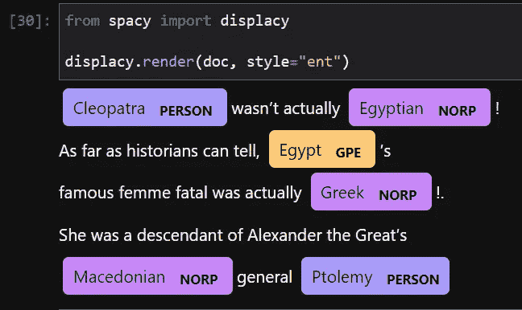
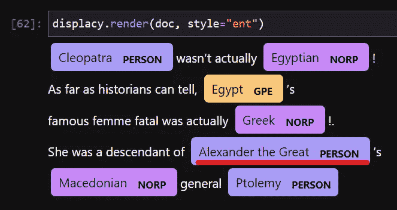

# NLP 初学者的深入空间教程

> 原文：<https://towardsdatascience.com/in-depth-spacy-tutorial-for-beginners-in-nlp-2ba4d961328f>

## 学习 Scikit-学习自然语言处理


**照片由** [**安妮荣凯**](https://www.pexels.com/photo/red-blue-and-white-fluid-abstract-painting-2317710/)

## 介绍

不，我们今天不会用数十亿个参数来构建语言模型。我们将从小处着手，学习 spaCy 的 NLP 基础知识。我们将仔细研究这个库是如何工作的，以及如何使用它来轻松解决初级/中级 NLP 问题。

帖子已经很长了，我就截到这里，直接跳到文章的正文。

[](https://ibexorigin.medium.com/membership) [## 通过我的推荐链接加入 Medium-BEXGBoost

### 获得独家访问我的所有⚡premium⚡内容和所有媒体没有限制。支持我的工作，给我买一个…

ibexorigin.medium.com](https://ibexorigin.medium.com/membership) 

获得由强大的 AI-Alpha 信号选择和总结的最佳和最新的 ML 和 AI 论文:

[](https://alphasignal.ai/?referrer=Bex) [## 阿尔法信号|机器学习的极品。艾总结的。

### 留在循环中，不用花无数时间浏览下一个突破；我们的算法识别…

alphasignal.ai](https://alphasignal.ai/?referrer=Bex) 

## spaCy 是什么？

spaCy 就像自然语言处理的 Sklearn。它是一个具有大量功能的行业标准，能够以一流的速度、准确性和性能解决许多 NLP 任务。

其核心是管道，你可以把它想象成已经在数百万文本实例上训练过的特定于语言的模型。

它也是 spaCy 生态系统的领导者，该生态系统包括几十个库和工具，如 Prodigy、Forte、displaCy、explacy、ADAM、Coreferee 等。

spaCy 还可以与来自 TensorFlow、PyTorch 和其他框架的定制模型握手。

现在，spaCy 支持 66 种语言作为独立的管道，新的语言正在慢慢增加。

## 空间基础

在了解 spaCy 如何工作之前，让我们安装它:

```
pip install -U spacy
```

spaCy 有三条英语管道，对于复杂的任务有不同的大小和功能。在本教程中，我们将只需要安装小型和中型管道，但为了完整起见，我也包括了大型管道:

导入 spaCy 后，我们需要加载刚刚安装的一个管道。现在，我们将加载小的并存储到`nlp`:

在 spaCy 生态系统中命名任何加载的语言模型`nlp`是一个惯例。现在可以在任何文本上调用该对象来启动信息提取:

```
# Create the Doc object
doc = nlp(txt)
```

`doc`对象也是一个约定，现在它已经填充了关于给定文本的句子和单词的额外信息。

一般来说，`doc`对象只是一个迭代器:

您可以使用切片或索引符号来提取单个令牌:

```
>>> type(token)spacy.tokens.token.Token>>> len(doc)31
```

> 记号化就是把句子拆分成单词和标点符号。单个标记可以是一个单词、一个标点符号或一个名词块等。

如果您提取了多个令牌，那么您就有了一个 span 对象:

```
>>> span = doc[:5]
>>> type(span)spacy.tokens.span.Span>>> span.text'The tallest living man is'
```

spaCy 也是为了提高内存效率而构建的。这就是为什么`token`和`span`对象都只是`doc`对象的视图。没有重复。

预训练的英语管道和许多其他管道具有特定于语言的规则，用于标记化和提取它们的词汇属性。这里有 6 个这样的属性:

一些有趣的属性是`lemma_`，它返回去掉了任何后缀、前缀、时态或任何其他语法属性的基本单词，还有`like_num`，它既能识别文字数字，也能识别字母数字。

你将把大部分时间花在这四个物体上——`nlp`、`doc`、`token`和`span`。让我们仔细看看它们是如何关联的。

## 架构和核心数据结构

让我们从`nlp`开始，它是一个隐藏的语言对象:

语言对象在数百万个文本实例和标签上进行预训练，并以其二进制权重加载到 spaCy 中。这些权重允许您在新数据集上执行各种任务，而不必担心繁琐的细节。

正如我前面提到的，spaCy 拥有 22 种语言的完整训练管道，其中一些你可以在下面看到:

对于其他+40 语言，spaCy 只提供基本的标记化规则，其他功能正在慢慢与社区的努力集成。

也可以直接从`lang`子模块加载语言模型:

在处理一个文本后，单词和标点符号被存储在`nlp`的词汇对象中:

```
>>> type(nlp.vocab)spacy.vocab.Vocab
```

这个`Vocab`在文档之间共享，这意味着它存储所有文档中的所有新单词。相比之下，`doc`对象的词汇表只包含来自`txt`的单词:

```
>>> type(doc.vocab)spacy.vocab.Vocab
```

在内部，spaCy 以散列方式通信以节省内存，并有一个名为`StringStore`的双向查找表。您可以获取字符串的哈希值，或者如果有哈希值，则获取字符串:

```
>>> type(nlp.vocab.strings)spacy.strings.StringStore>>> nlp.vocab.strings["google"]1988622737398120358>>> nlp.vocab.strings[1988622737398120358]'google'
```

当令牌进入`Vocab`时，它们会丢失所有特定于上下文的信息。所以，当你从词汇库中查找单词时，你是在查找`lexeme` s:

```
>>> lexeme = nlp.vocab["google"]
>>> type(lexeme)spacy.lexeme.Lexeme
```

词汇不包含特定语境的信息，如词性标记、形态依赖等。但是它们仍然提供了这个词的许多词汇属性:

```
>>> print(lexeme.text, lexeme.orth, lexeme.is_digit)google 1988622737398120358 False
```

> `orth`属性是针对词素的散列。

所以，如果你正在通过`doc`对象看一个单词，它就是一个令牌。如果是来自`Vocab`，那就是一个词位。

现在，我们再来谈谈`doc`这个物体。

在文本上调用`nlp`对象生成文档及其特殊属性。

您可以通过从`tokens`模块导入`Doc`类来手动创建文档:

`Doc`需要三个参数——来自`nlp`的词汇表、一个单词列表和另一个指定单词后面是否有空格的列表(包括最后一个)。`doc`所有 tokes 都有这个信息。

```
>>> len(doc)4>>> doc.text'I love Barcelona!'
```

Spans 也是它们自己的一个类，公开了一系列属性，尽管它们只是`doc`对象的一个视图:

要手动创建 span 对象，请将 doc 对象和标记的开始/结束索引传递给`Span`类:

## 命名实体识别(NER)

自然语言处理中最常见的任务之一是预测命名实体，如人、地点、国家、品牌等。

在太空中表演 NER 简单得可笑。处理完一个文本后，只需提取`doc`对象的`ents`属性:

克利奥帕特拉被认为是一个人，而埃及是一个地缘政治实体(GPE)。要了解其他标签的含义，您可以使用`explain`功能:

除了打印文本，您还可以使用 spaCy 的可视实体标记器，可通过`displacy`获得:



作者图片

图像显示亚历山大大帝没有被识别为一个人，因为它不是一个普通的名字。不过没关系，我们可以手动给亚历山大贴上一个人的标签。

首先，通过给它一个标签(PERSON)来提取全名作为 span:

然后，用跨度更新`ents`列表:

```
doc.ents = list(doc.ents) + [alexander]
```

现在，`displacy`也对其进行标记:



作者图片

您也可以用`set_ents`函数设置新实体:

```
# Leaves the rest of ents untouched
doc.set_ents([alexander], default="unmodified")
```

## 预测词性(POS)标签和句法依赖性

spaCy 还为文档的语法分析提供了丰富的工具选择。标记的词汇和语法属性作为属性给出。

例如，让我们来看看每个标记的词性标签及其句法依赖性:

输出包含一些令人困惑的标签，但我们可以推断出其中的一些，如动词、副词、形容词等。让我们看看其他几个人的解释:

上表中的最后一列表示单词关系，如“第一个”、“第一个脚印”、“保持在那里”等。

spaCy 包含许多更强大的语言分析特性。作为最后一个例子，下面是你如何提取名词块:

从 spaCy 用户指南的本页了解更多关于语言特性的信息。

## 基于自定义规则的令牌化

到目前为止，spaCy 已经完全控制了标记化规则。但是一种语言可能有许多文化特有的特质和不符合 spaCy 规则的边缘情况。例如，在更早的例子中，我们看到“亚历山大大帝”作为一个实体被遗漏了。

如果我们再次处理相同的文本，spaCy 将实体视为三个令牌。我们需要告诉它，像亚历山大大帝或破碎的布兰这样的有头衔的名字应该被认为是一个记号，而不是三个，因为把它们分开没有意义。

让我们看看如何通过创建自定义令牌化规则来实现这一点。

我们将从创建一个模式作为字典开始:

在 spaCy 中，您可以组合使用大量的关键字来解析几乎任何类型的令牌模式。例如，上面的模式是一个三标记模式，第一个和最后一个标记是一个字母数字文本，中间的一个是一个停用词(如 *the、and、or 等)。)*。换句话说，我们是在匹配“亚历山大大帝”而没有明确告诉 spaCy。

现在，我们将用这种模式创建一个`Matcher`对象:

处理完文本后，我们在`doc`对象上调用这个 matcher 对象，它返回一个匹配列表。每个匹配是一个包含三个元素的元组——匹配 ID、开始和结束:

你可以随意调整图案。例如，您可以在 reGex 关键字中使用像`OP`这样的量词，或者使用 reGex 本身:

你可以从[这里](https://spacy.io/usage/rule-based-matching)了解更多关于定制的基于规则的匹配。

## 词向量和语义相似度

NLP 的另一个日常用例是预测语义相似度。相似性得分可用于推荐系统、抄袭、重复内容等。

spaCy 使用单词向量(如下所述)计算语义相似度，单词向量在中型模型中可用:

所有的`doc`、`token`和`span`对象都有这个`similarity`方法:

这三个类也可以相互比较，就像 span 的一个标记:

```
>>> doc1[0:2].similarity(doc[3])0.8700238466262817
```

使用单词向量来计算相似度，单词向量是单词的多维数学表示。例如，下面是文档中第一个标记的向量:

## 关于管道的一切

在引擎盖下，语言模型不是一个管道，而是一个集合:

当用`nlp`处理一个文本时，它首先被标记化，并从上面的列表传递给每个管道，管道又修改并返回带有新信息的 Doc 对象。以下是空间文档中对此的说明:


图片来自空间文档

但是，spaCy 没有为您在现实世界中可能遇到的任何 NLP 问题提供定制管道。例如，您可能希望在将文本传递给其他管道之前执行预处理步骤，或者编写回调来提取管道之间不同类型的信息。

对于这种情况，您应该学习如何编写定制的管道函数并将它们添加到`nlp`对象中，这样当您对文本调用`nlp`时，它们就会自动运行。

以下是如何做到这一点的基本概述:

你需要通用的`Language`类，并在你的函数上修饰它的`component`方法。自定义函数必须接受并返回 doc 对象的单个参数。上面，我们定义了一个简单的管道，打印出 doc 对象的长度。

让我们将它添加到`nlp`对象中:

如您所见，自定义管道被添加到末尾。现在，我们将在一个示例文本上调用`nlp`:

```
>>> doc = nlp("Bird dies, but you remember the flight.")There are 9 tokens in this text.
```

按预期工作。

现在，让我们做一个更严肃的例子。我们将回到“亚历山大大帝”的例子，并编写一个管道来添加征服者的名字作为一个实体。我们希望所有这些都自动发生，而不需要找到管道外的实体。

以下是完整的代码:

我们定义模式，创建匹配器对象，将匹配添加到实体中，并返回文档。让我们来测试一下:

它正在按预期工作。

到目前为止，我们一直在末尾添加自定义管道，但是我们可以控制这种行为。`add_pipe`函数有参数来精确地指定您想要插入函数的位置:

## 结论

今天，你已经朝着掌握自然语言处理的 Scikit-learn 迈出了大胆的步伐。有了这篇文章的知识，你现在可以自由地浏览 spaCy 的用户指南，它和 Scikit-learn 的一样大，信息丰富。

感谢您的阅读！

[](https://ibexorigin.medium.com/membership) [## 通过我的推荐链接加入 Medium。

### 作为一个媒体会员，你的会员费的一部分会给你阅读的作家，你可以完全接触到每一个故事…

ibexorigin.medium.com](https://ibexorigin.medium.com/membership) [](https://ibexorigin.medium.com/subscribe) [## 每当 Bex T .发布时收到电子邮件。

### 每当 Bex T .发布时收到电子邮件。注册后，如果您还没有中型帐户，您将创建一个…

ibexorigin.medium.com](https://ibexorigin.medium.com/subscribe) 

**我的更多故事…**

[](https://ibexorigin.medium.com/in-depth-guide-to-building-custom-sklearn-transformers-for-any-data-preprocessing-scenario-33450f8b35ff) [## 为任何数据预处理场景构建定制 Sklearn 转换器的深入指南

### 在 Sklearn 做好每一件事，大家都会开心

ibexorigin.medium.com](https://ibexorigin.medium.com/in-depth-guide-to-building-custom-sklearn-transformers-for-any-data-preprocessing-scenario-33450f8b35ff) [](/advanced-missing-data-imputation-methods-with-sklearn-d9875cbcc6eb) [## Sklearn 高级缺失数据插补方法的深入教程

### 学会利用强大的基于模型的插补技术。

towardsdatascience.com](/advanced-missing-data-imputation-methods-with-sklearn-d9875cbcc6eb) [](/10-minute-effortless-sql-tutorial-for-die-hard-pandas-lovers-a64c36733fd0) [## 10 分钟轻松的 SQL 教程，适合铁杆熊猫爱好者

### 曾几何时，情况正好相反

towardsdatascience.com](/10-minute-effortless-sql-tutorial-for-die-hard-pandas-lovers-a64c36733fd0) [](/how-to-create-slick-math-animations-like-3blue1brown-in-python-457f74701f68) [## 如何用 Python 创建像 3Blue1Brown 这样流畅的数学动画

### 学习将你对数学和编程的热爱结合起来的最佳方式

towardsdatascience.com](/how-to-create-slick-math-animations-like-3blue1brown-in-python-457f74701f68) [](/matplotlib-vs-plotly-lets-decide-once-and-for-all-dc3eca9aa011) [## Matplotlib vs. Plotly:让我们决定一劳永逸

### 从 7 个关键方面进行深入快速的比较

towardsdatascience.com](/matplotlib-vs-plotly-lets-decide-once-and-for-all-dc3eca9aa011)