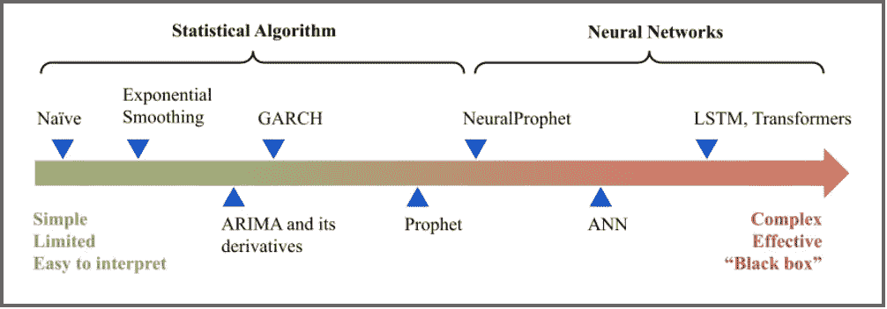
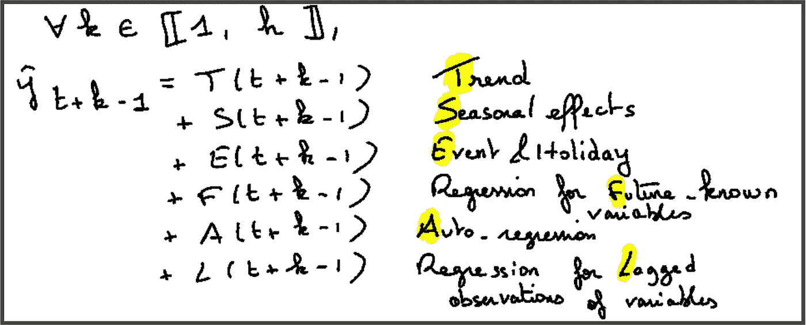
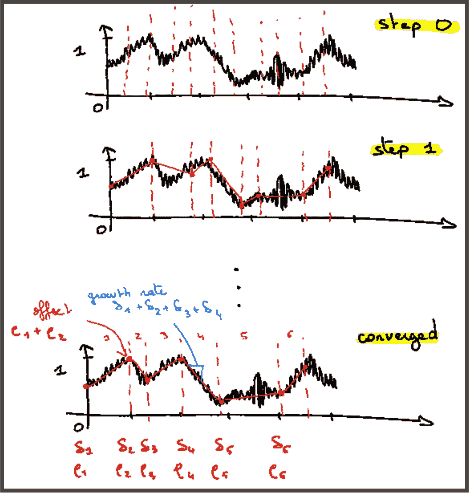
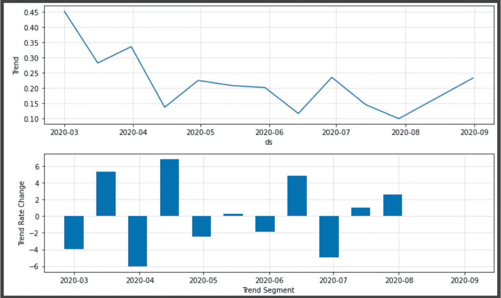
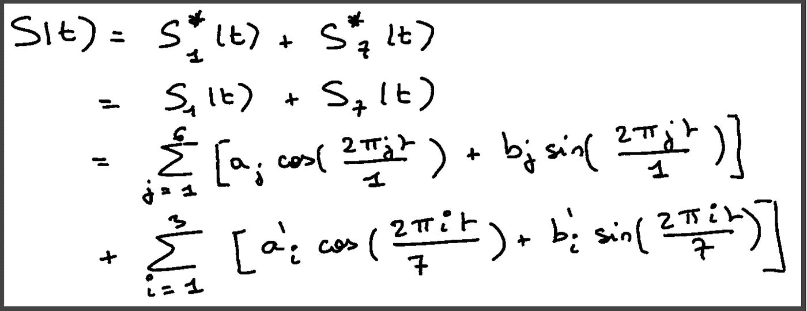
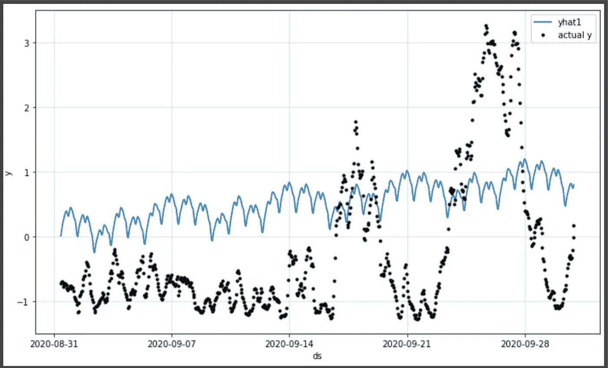
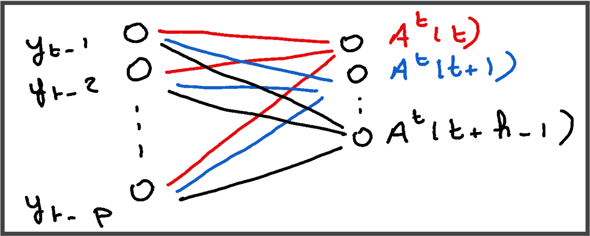
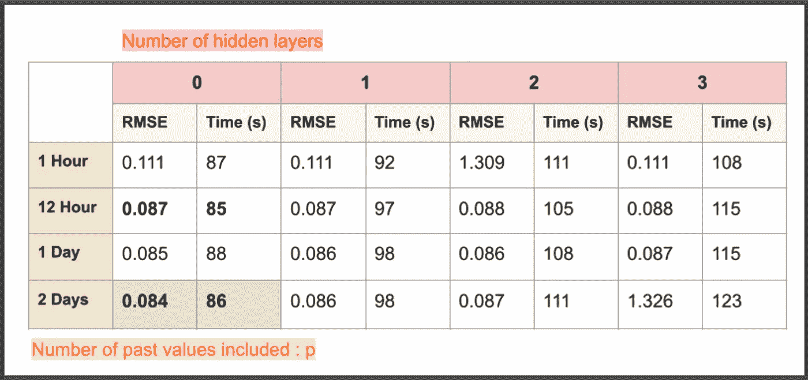
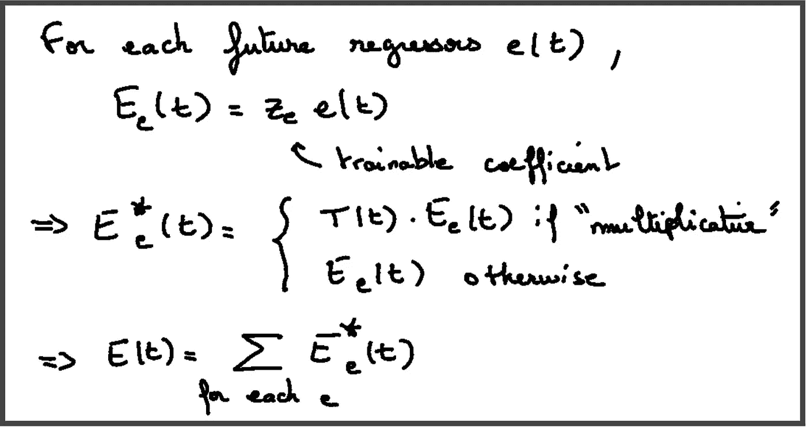
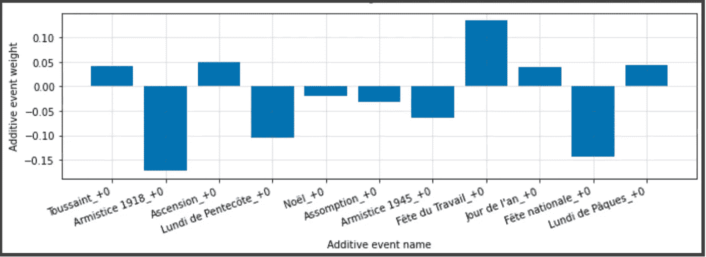

# 通过一个完整的例子深入理解 NeuralProphet

> 原文：<https://towardsdatascience.com/in-depth-understanding-of-neuralprophet-through-a-complete-example-2474f675bc96>

# 通过一个完整的例子深入理解 NeuralProphet

## 利用气象数据探索脸书算法

NeuralProphet 是由脸书创造的 Prophet 算法的一种进化，是一种**时间序列预测算法**。在这篇文章中，我将基于我在研究过程中遇到的一个**具体而完整的问题**来详述这个算法。

*照片由* [*克里斯利维拉尼*](https://unsplash.com/@chrisliverani?utm_source=unsplash&utm_medium=referral&utm_content=creditCopyText) *上* [*下*](https://unsplash.com/s/photos/statistic?utm_source=unsplash&utm_medium=referral&utm_content=creditCopyText)

# 语境

大多数时间序列问题需要**容易理解的**预测。同时，需要一个有效的预测。这两个愿望导致了一个权衡:**可解释性与性能**。

由于更复杂的模型，效率的显著提高通常是**。然而，复杂性很少等同于可解释性。**

**简而言之，**存在两类**模型:**

*   ****统计**算法(ARIMA，GARCH …)，这些算法在理论上是可以用数学方法解释的**
*   ****神经网络**模型，这些模型非常复杂，但已经证明了它们的性能**

**最初，脸书和 Prophet 的意愿是**提供一个简单可行、可调整和可解释的工具来预测时间序列**。然而，一个问题依然存在:**性能不佳**。为了解决这个问题，NeuralProphet 应运而生。**

**简而言之， **NeuralProphet =神经网络+预言家****

**因此，其目的是通过在 Prophet(一种统计算法)中包含神经网络来结合前面两个类别。**目的:提高效率，同时限制可解释性的损失。****

**这个介绍部分可以通过下图**大致**描绘出来:**

****

***关于时间序列算法复杂性和性能的简化示例。为普及和解释目的而制作，并可能进行调整。(作者自制)***

# **问题**

**作为解释的基础，我将概述我在学习期间与 12 个人一起贡献了 18 个月的一个项目。这个问题是我感兴趣的枝节问题，不是项目的主要焦点。**

**法国电网必须稳定地输送大量电能以满足各种需求。这种供需平衡至关重要，因为:**

*   **如果产量**低于**需求水平，那么电网**可能会出现不正常情况**，例如电力故障或电压下降。**
*   **如果产量高于需求水平，那么未售出的能源就被浪费了，因为电能的储存是具有挑战性的(低效且繁重)**

**幸运的是，这种平衡一直得到保持，这主要归功于**发电厂**有资格作为可调度的发电，因为**的电力是按需微调的**。风力涡轮机等所谓的“T4”间歇性能源就不是这样了，它依赖于一个随机因素:风。**

**目标是**在风能生产更多的时候优化风能生产**，反之，当风能生产下降的时候**补偿其间歇性**。**

**专家们目前正在通过接收大量数据([每秒 40 000 比特](https://www.rte-france.com/en/uninterrupted-flow-current/balancing-supply-and-demand))并相应地采取行动来完成这项任务。超越自己的控制来运行它不是很吸引人吗？**

**智能电网旨在智能管理电力网络。在能源领域，人工智能显然是一个**有前途的解决方案**,这篇文章提供了在这种背景下使用神经营养体的选择。**

**为了监控风电场，我们选择了**负载系数**，它是发电量除以装机容量的比率(在给定的时间段内)。因此，监控这一负载系数大体上相当于调节有效风力涡轮机的数量，从而调节它们向电网提供的能量。**

**在学校环境中，已经在互联网上挖掘了 300 多个业余气象站的温度和风速(用于其他目的)。**假设负载系数的预测将受益于这些数据。****

**正如 RTE 所强调的，天气会显著影响功耗。考虑到温度**是值得的**，负载系数与功耗相关。此外，由于可用的风能主要取决于风速，这也可能是有益的。**

# **数据洞察**

**在 2019 年 3 月 1 日至 2019 年 9 月 30 日(约 7 个月)期间，对于 300 个气象站**中的每一个气象站，以每小时的时间步长提取温度和风速。这两个特征将在后面作为**观察变量**提及。****

**与此同时，通过从 **RTE 网站**获取风力和装机容量，可以获得现有的负载系数。负载系数将被称为“**目标**”。**

**培训将在**前 6 个月(训练组)**进行，测试组是上个月的**。数据已经标准化。****

**之后，**只保留了 57 个气象站**，以保证模型的运行速度，并去除其中的等效站(附近的)。**

**下图可能总结了问题和可用的数据:**

****

***50 个气象站目标图(作者制作)***

**[目标的互动剧情在这里可以看到。](https://plotly.com/~ValouC/1/)**

**选择的评估指标是 RMSE。我们的基线模型是一个简单的算法，它在测试集上的 **RMSE 为 0.109** 。**

# **模型:神经原植物**

**NeuralProphet 模型预测未来若干时间步 ***h*** 。 ***h*** 称为“**视界**”。**

> **“神经营养模型的一个核心概念是它的模块化可组合性”。**

**设定 h 的目标值后，根据以下关系预测到 **h** 的每个时间步长:**

****

***神经营养模型(作者制作)***

**因此，例如，提前一步的预测相当于用 h = 1 写出过去的关系，即:**

****

***一个只有 1 个地平线的例子，即向未来迈进一步(作者制作)***

****6 个特定模块**放在一起构成了神经营养体。训练要求每个模块修改其正确的预测，以最小化整体损失。**

**文章的其余部分基于上面提出的问题，集中在每个模块的解释和动机上。**

# **1.1 趋势**

**概括地说，趋势与信号的**总体变化有关(而不是信号内的小波动)。****

**NeuralProphet 学会检测趋势发生明显变化的日期。这些点叫做**变点**。在这两者之间，趋势应该是线性的。**

**该问题类似于线性多元回归，其中**线性回归在 2 个变化点之间进行估计。****

**这些点沿时间轴统一初始化**。然后，每个线性回归的成本**被添加到模型的总损失**中。梯度下降使损失最小化，并随后改善回归。特别地，线性回归优化的参数是**斜率**，称为生长值。****

****此外，执行 **L1 调整**以删除不必要的变化点。额外的变化点也可以手动添加。****

****在测试阶段，趋势是最后一次线性回归的**外推。** 10%的数据(可参数化)留在最后，以确保一致的最终趋势。****

********

*****通过梯度下降法估计参数的趋势计算公式(作者制作)*****

****截距不是一个可训练的参数，而是取决于增长率以**确保连续性**。****

****从视觉上看，这相当于:****

********

*****每条红色竖线是一个变化点，每一步定义了算法的改进(作者做)*****

****关于我们的负载系数示例，我们有以下结果:****

********

*****默认参数趋势结果— 11 个变点(作者制作)*****

****在解释了下一个模块:季节性之后，将绘制预测图。****

# ****1.2 季节性****

****时间序列的季节性是由它的性质决定的信号的**周期性运动**。****

****例如，很明显**的温度**遵循**的每日季节性**，因为一种模式每天都在重复:晚上比白天冷。气温也遵循年度季节性:冬天比夏天冷，等等。****

****为了对这种季节性进行建模，NeuralProphet 假设目标是一个**周期性的连续函数。因此，它可以表示为傅立叶级数。******

********

*****假设某些假设(作者做出的)写成傅立叶级数的 p 周期函数*****

******此公式的两个备注**:****

*   ****总和前面的常数项(即**偏移量**)对于神经原素来说可能是**不必要的**，因为趋势隐含地考虑了它。****
*   ****无穷多个 a 项和 b 项的计算**不可行**。因此，**仅估算前 k 项**(带有 k 个参数)。****

********

*****论文关系(作者自制)*****

****该模型的目标是找到最适合目标的 **2*k 参数。默认情况下，**有 3 个周期被激活**:p = 1 的日周期、p = 7 的周周期和 p = 365，25 的年周期。对于每个周期，我们分别有:k = 6，k = 3 和 k = 6。(**如果目标覆盖至少 2 倍于**周期，则激活一个周期)。******

**与趋势相同，通过添加**与建模的季节性和实际目标之间的差异相关的成本**来计算参数。**

**如果指定了参数“乘法”,则季节性与趋势是可相乘的。**

****

***(作者制作)***

**由于只有 6 个月的数据可用，年度期间未激活(强制激活的选项)。但是，**其他时段可以根据数据类型手动添加**(如果是每月，p = 30)。**

**对于我们的问题，我们让两个默认季节性。事实上，我们假设**日季节性**存在(与昼夜节律相关的负荷因子的相关性？).还假设了**周季节性**(与工作相关的负荷系数相关性？).**

**取 p = 1 & 7，并考虑附加季节性(相对于乘法)，我们有:**

****

***在我们的例子中与 p = 1 和 p = 7 的关系(由作者提出)***

**拟合数据后，我们得到这些图。**

****

***负荷系数的周、日季节性(作者自制)***

**通过结合趋势和季节性，执行以下预测。**

****

***由 NeuralProphet 作出的仅激活趋势和季节性的预测(由作者作出)***

**毫无疑问，预测**表现不佳**，RMSE 为 1.32。即使是天真的算法也能获得**更好的结果**(RMSE 为 0.109)。**

**之后，其他模块将包含在整体模型中，希望有更好的预测**(剧透:是)**。**

# **1.3 自动回归**

****自回归(AR)过程**可能是最常用的时间序列过程，用于捕捉序列中随机变量随时间的相关性。**

**将 p(先前值的数量)包括在内，AR 过程定义为:**

****

***AR 过程与 c 截距的关系以及最后一项 a 白噪声过程(作者提出)***

**这种白噪声是一种**随机过程**，必须符合三个标准，即:**

****

***白噪声过程必须验证这三个标准***

**白噪声的分布没有规定，但是例如，具有零均值和恒定标准偏差的独立同分布正态分布是可行的。这种白噪声是世界分解的**核心概念，是时间序列理论的一个关键定理。****

**然而，AR 过程仅预测 **1 次进入未来**。给定目标的 p 个过去值，预测时间 t。因此，如果我们有 h > 1，我们需要 **h 个不同的模型**。有了 NeuralProphet 选择的 AR-Net 模型，这个问题就迎刃而解了。**

**使用时间 t 作为预测原点(即预测的第一步)，**前一个 p 值预测下一个 h 值**。**

****预测起点**是有意义的，因为对于给定的预测时间步长，存在不同的预测起点。**

**例如，如果 h = 3(即，我们希望预测未来的 3 个时间步长)，在 t = 5000 的预测将来自 3 个不同的起点:在 t = 4998、4999 和 5000。该研究论文在一封新的信 A 中包含了这一概念:**

****

**预测原点示例(由作者制作)**

****

***AR-Net 关系(作者自制)***

**在这一阶段，仍然存在几个问题。**

****如何权衡 p？****

**根据研究论文:**

> **应该根据过去观测中相关背景的大致长度来选择该参数。实际上，很难准确确定，通常设定为最内部周期的两倍或预测范围的两倍”。**

****AR-Net 应该使用哪种神经网络架构？****

**默认情况下，神经网络利用**最简单的现有架构** e:没有中间层，没有激活函数，只有 p 个输入连接到 h 个输出，例如:**

****

***具有 p 个输入和 h 个输出的最简单神经网络架构的图示(由作者制作)***

**提醒一下，NeuralProphet 是简单的**，以上面定义的方式，可以通过**分析权重的值来解释这个架构。******

****作为可解释性损失的回报，有可能**添加隐藏层**以使模型复杂化。隐藏层的数量，以及神经元的数量，是**可参数化的**。为了减少这种损失，AR-Net 使用了 L1 正则化，这导致了权重的稀疏性。然而，我觉得深入探讨这一点并不有趣，因为除了使用的正则化函数的形式之外，它主要涉及深度学习的**基础。[我让读者在这里查看原始的 AR-Net 研究论文。](https://arxiv.org/abs/1911.12436)******

****这是在不同中间层数目和 p 值的测试集上，h = 1 的 NeuralProphet 的结果。****

********

*****不同超参数的结果(默认隐藏层的维度为 p + h)。结果可能会有所不同，仅供讨论之用(由作者制作)*****

****在我们的问题中，隐藏层数**似乎不影响 RMSE** 。在训练时间较短的情况下,“密集”架构无法反映输入信号的复杂性。如果超参数以适当的方式和更多的训练时间进行调整，**情况应该不是这样。******

****用 **p = 2 天** (2*24 = 48 分)，并且隐藏层数= 0，我们有如下预测:****

********

*****趋势、季节性和 AR 过程的结果(作者制作)*****

******结果:**测试集上的 RMSE 为 0.0844，比 0.109 的原数据集好 21%。****

****我们还可以通过绘制模型的组件来测量主要影响预测的滞后**。******

********

*****不同滞后的 AR 相关性*****

******滞后 1 & 2 负责约 60%的预测**。奇怪的是，在预报起点前 24 小时的**负荷系数的值似乎是一个影响因素。******

****现在，让我们继续详细介绍剩余的模块。****

# ****1.4 滞后回归变量****

****在这个阶段，**介绍了神经营养体的主要概念:趋势、季节性和 AR-Net。******

****滞后回归变量就是我们之前定义的“观察变量”:温度和风速。在我们的整体模型**中包含这样的信息可能也是相关的，希望得到更好的结果。******

****观察变量通过…一个 **AR-Net 被附加到 NeuralProphet 模型中！！******

****除了输入是观察变量的 **p 个先前值(而不是目标的 p 个先前值)。******

****提醒一下，观察到的变量是温度和风速。具体来说，我们有多达 114 个变量(57 个站点 x 每个站点 2 个变量)。因此，神经营养细胞产生了 114 个不同的阵列。****

****默认情况下，历元数自动设置为 125，批处理大小设置为 32。之前用“lr 范围测试”来估计学习率。****

****理论上，**如果 RMSE 低于 0.0844** (没有滞后回归的值)，我们观察到的变量**会积极影响**预测。****

****不幸的是，在用不同的配置(滞后回归量的数量、调整超参数……)进行多次尝试后，RMSE 仍然在 0.0844 以上，最低为 0.095****

******结论:**这些观察到的变量(风速和温度)**似乎**没有隐含的相关信息来帮助负荷系数的预测。几个原因可能是:****

*   ****一个更现实的解决方案**是着眼于地区或部门层面，而不是预测整个国家的单一负载系数值******
*   ****底层模型**不够复杂**无法捕捉观察变量和目标之间的关系****
*   ****每个滞后回归变量都与一个唯一的 AR-Net 相关联。**参数不共享**。因此，没有充分考虑观察变量之间的相关性。****
*   ******以此类推……******

# ****1.5 未来回归变量****

******未来变量**是未来已知的变量。在每个时间步 t，**这些变量的值是已知的。******

****例如，未来可能有用的回归变量是法国风力发电厂的**装机容量。实际上，负载系数取决于该安装容量，并且该变量是可以通过跟踪例如**正在进行的建筑工地**而预先知道的数据。******

**从技术上来说，如果我们想要预测 t = 5000 时的目标，则 t 时的未来回归量的值由可训练系数“d”加权。**

**然后和季节性一样，模 F(t)可以是**“乘法”**。**

****

**(作者自制)**

**然而，**我手头没有未来的回归变量**，因此它的影响在我们的问题中无法衡量。**

# **1.6 活动和假期**

**这最后一个模块处理可能影响目标的**偶然事件。如果事件发生，则事件是在时间 t 等于 1 的二进制时间序列。(否则为 0)。除此之外，它遵循与前一模块 F(t)** 相同的**流程。****

****

**(作者自制)**

**NeuralProphet 提供了一个内置命令**自动添加国家的节假日。****

**对于每个事件，可以添加一个上下窗口**，也就是说，例如，如果我们将圣诞节视为下窗口为-2，上窗口为+ 1 的事件，则除了 12 月 23 日、24 日、25 日和 26 日之外，该事件每次都等于 0，值为 1(圣诞节前为-2，圣诞节后为+1)。****

**此外，如前所述，可训练系数**允许量化最终预测中每个事件的重要性。****

**最近，在 2021 年 12 月，法国可能会发生电力短缺的风险，这种事件在预测负载系数时可能是有用的。**

**让我们看看法国假期对目标预测的影响。**

****

**AR 砝码(作者自制)**

**对于每个事件，我们都有它的参数值。NeuralProphet 在一行代码中毫不费力地提供了这些视觉效果**。因此，结果是**方便解释**。****

**然而，在我们的例子中，与没有这个事件相比，使用相同的 RMSE，多次尝试仍然**不成功**。**

# **结论**

**模块化的可组合性已经被证明与可解释性的目的非常相关。的确，用 NeuralProphet 向非科学观众解释这个结果变得非常简单明了。**

**下一步是**获得更多业务洞察**以潜在地添加相关滞后回归量、未来回归量、事件或调整 AR-Net 的超参数(p、隐藏层等)。**

**NeuralProphet 有一个活跃的社区，即将推出令人兴奋的扩展。**

**我希望你喜欢这篇文章的技术方面和提出的问题。**

****如果你喜欢它，不要犹豫，请鼓掌并关注我的未来文章:)****

# **来源**

*   **[https://arxiv.org/abs/1911.12436](https://arxiv.org/abs/1911.12436)**